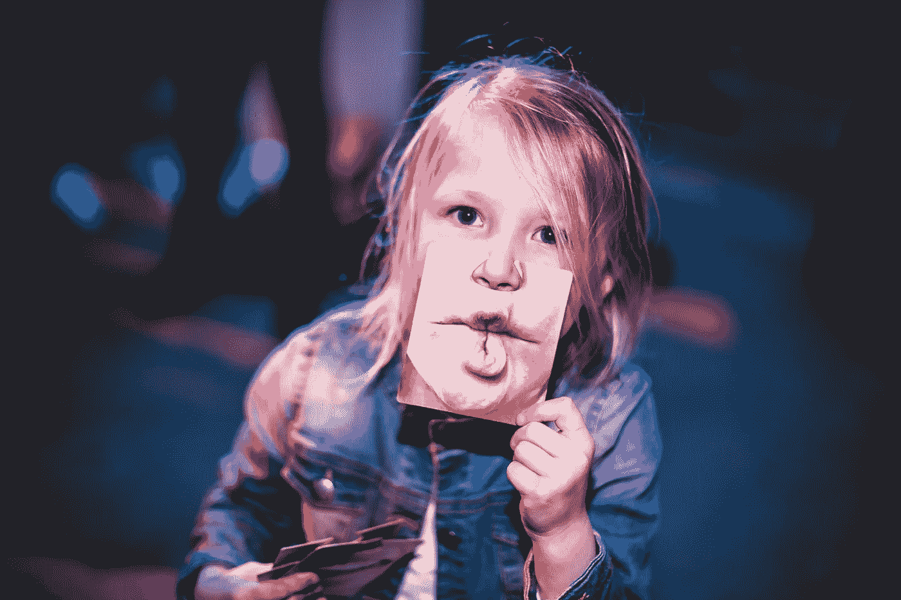
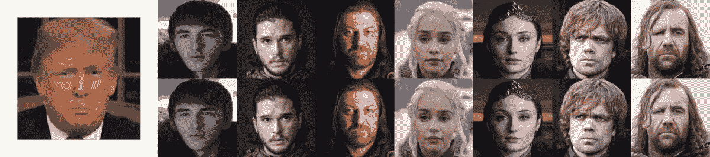
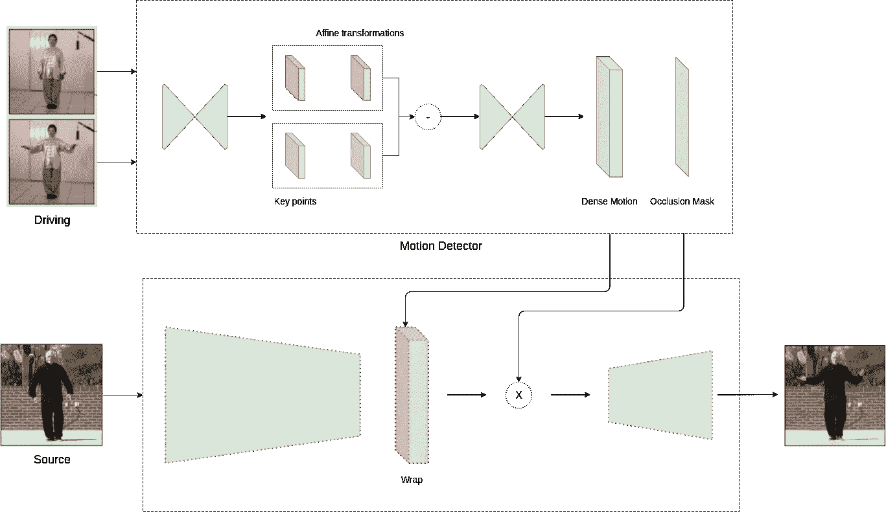
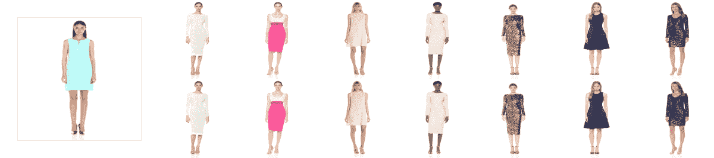
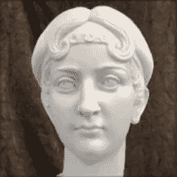

# 如何在 5 分钟内制作一个 DeepFake 视频

> 原文：<https://towardsdatascience.com/how-to-produce-a-deepfake-video-in-5-minutes-513984fd24b6?source=collection_archive---------1----------------------->

## 每个人都可以不用写一行代码就能制作 DeepFakes。



克里斯蒂安·格滕巴赫在 [Unsplash](https://unsplash.com/s/photos/fake?utm_source=unsplash&utm_medium=referral&utm_content=creditCopyText) 上拍摄的照片

你跳舞吗？你有没有最喜欢的舞者或表演者，你希望看到自己模仿他们的动作？现在你可以了！

想象一下你有一张全身照。只是一个静止的图像。然后你所需要的就是你最喜欢的舞者表演一些动作的独舞视频。现在没那么难了，因为[抖音](https://www.tiktok.com/)正在接管世界…

图像动画使用视频序列来驱动图片中对象的运动。在这个故事中，我们看到图像动画技术现在是多么的简单易用，以及你是如何制作出你能想到的任何东西。为此，我将相关出版物的[源代码](https://github.com/AliaksandrSiarohin/first-order-model)转换成一个简单的脚本，创建了一个任何人都可以用来生成 DeepFakes 的瘦包装器。有了源图像和正确的驾驶视频，一切皆有可能。

> [学习率](https://www.dimpo.me/newsletter?utm_source=article&utm_medium=medium&utm_campaign=deep_fakes&utm_term=deep_fakes)是我每周给那些对 AI 和 MLOps 世界好奇的人发的简讯。你会在每周五收到我关于最新人工智能新闻、研究、回购和书籍的更新和想法。在这里订阅！

# 它是如何工作的

在这篇文章中，我们谈论一个新的出版物(2019)，部分[神经信息处理系统进展 32 (NIPS 2019)](http://papers.nips.cc/book/advances-in-neural-information-processing-systems-32-2019) ，称为“[图像动画的一阶运动模型](http://papers.nips.cc/paper/8935-first-order-motion-model-for-image-animation)”【1】。在这篇论文中，作者 Aliaksandr Siarohin、Stéphane Lathuilière、Sergey Tulyakov、Elisa Ricci 和 Nicu Sebe 提出了一种在给定驾驶视频的情况下对源图像进行动画制作的新方法，而无需关于要动画制作的对象的任何附加信息或注释。

在引擎盖下，他们使用一个经过训练的神经网络来重建视频，给定一个源帧(静止图像)和视频中运动的潜在表示，这是在训练过程中学习的。在测试时，该模型将一幅新的源图像和一段驾驶视频(例如一系列帧)作为输入，并根据这些帧中描述的运动预测源图像中的对象如何移动。

**该模型追踪动画中所有有趣的东西:头部运动、说话、眼球追踪甚至身体动作。**例如，让我们看看下面的 GIF:特朗普总统驾驶《权力的游戏》的演员像他一样说话和移动。



# 方法和途径

在创建我们自己的序列之前，让我们进一步探索这种方法。首先，训练数据集是大量视频的集合。在训练期间，作者从同一视频中提取帧对，并将它们馈送给模型。该模型试图通过某种方式学习这些对中的关键点以及如何表示它们之间的运动来重建视频。



图 1 —框架架构(A. Siarohin 等人，NeurIPS 2019)

为此，该框架包括两个模型:运动估计器和视频生成器。最初，**运动估计器试图学习视频中运动的潜在表示。**这被编码为特定于运动的关键点位移(其中关键点可以是眼睛或嘴的位置)和局部仿射变换。这种组合可以模拟更大的变换族，而不是仅使用关键点位移。模型的输出是双重的:一个密集的运动场和一个遮挡掩模。该遮罩定义了驾驶视频的哪些部分可以通过扭曲源图像来重建，以及哪些部分应该由上下文来推断，因为它们不存在于源图像中(例如，头部的后面)。例如，看看下面的时尚 GIF。每个模型的背面在源图片中不存在，因此，应该由模型来推断。



接下来，视频生成器将运动检测器的输出和源图像作为输入，并根据驱动视频将其动画化；**它以类似于驾驶视频的方式扭曲源图像，并保留被遮挡的部分。图 1 描述了框架架构。**

# 代码示例

本文的源代码在 [GitHub](https://github.com/AliaksandrSiarohin/first-order-model) 上。我所做的是创建一个简单的外壳脚本，一个薄的包装器，它利用源代码，每个人都可以很容易地使用它进行快速实验。

要使用它，首先，您需要安装模块。运行`pip install deep-animator`在您的环境中安装库。那么，我们需要四样东西:

*   模型权重；当然，我们不希望从零开始训练模型。因此，我们需要权重来加载预训练的模型。
*   我们模型的 YAML 配置文件。
*   源图像；例如，这可以是一幅肖像。
*   一段驾驶视频；最好先下载一个面部清晰可见的视频。

为了快速获得一些结果并测试算法的性能，您可以使用[这个](https://drive.google.com/file/d/1ACSKOfQUHbSEWmPu4Ndss7bkrPVK5WBR/view)源图像和[这个](https://drive.google.com/file/d/103PEtO2QO45XwCNLYIzMcW3aRdbOhS1D/view)驾驶视频。型号重量可在[这里](https://drive.google.com/file/d/1zqa0la8FKchq62gRJMMvDGVhinf3nBEx/view)找到。下面给出了一个简单的 YAML 配置文件。打开一个文本编辑器，复制并粘贴以下行，并将其保存为`conf.yml`。

```
model_params:
  common_params:
    num_kp: 10
    num_channels: 3
    estimate_jacobian: True
  kp_detector_params:
     temperature: 0.1
     block_expansion: 32
     max_features: 1024
     scale_factor: 0.25
     num_blocks: 5
  generator_params:
    block_expansion: 64
    max_features: 512
    num_down_blocks: 2
    num_bottleneck_blocks: 6
    estimate_occlusion_map: True
    dense_motion_params:
      block_expansion: 64
      max_features: 1024
      num_blocks: 5
      scale_factor: 0.25
  discriminator_params:
    scales: [1]
    block_expansion: 32
    max_features: 512
    num_blocks: 4
```

现在，我们已经准备好做一个模仿莱昂纳多·迪卡普里奥的雕像了！要获得结果，只需运行以下命令。

```
deep_animate <path_to_the_source_image> <path_to_the_driving_video> <path_to_yaml_conf> <path_to_model_weights>
```

例如，如果您已经将所有东西都下载到了同一个文件夹中，`cd`到那个文件夹并运行:

```
deep_animate 00.png 00.mp4 conf.yml deep_animator_model.pth.tar
```

在我的 CPU 上，大约需要五分钟才能得到生成的视频。除非`--dest`选项另有规定，否则该文件将保存在同一文件夹中。此外，您可以通过`--device cuda`选项使用 GPU 加速。终于，我们准备好看到结果了。相当牛逼！



# 结论

在这个故事中，我们介绍了 A. Siarohin 等人所做的工作，以及如何使用它来不费吹灰之力获得巨大的成果。最后，我们用一个薄薄的包装纸`deep-animator`制作了一个雕像。

虽然对这种技术有一些担忧，但它可以有各种各样的应用，也显示了如今制作假新闻是多么容易，提高了人们对它的认识。

> [学习率](https://www.dimpo.me/newsletter)是我每周给那些对 AI 和 MLOps 世界好奇的人发的简讯。你会在每周五收到我关于最新人工智能新闻、研究、回购和书籍的更新和想法。在这里订阅！

# 关于作者

我叫[迪米特里斯·波罗普洛斯](https://www.dimpo.me/?utm_source=article&utm_medium=medium&utm_campaign=deep_fakes&utm_term=deep_fakes)，我是一名为[阿里克托](https://www.arrikto.com/)工作的机器学习工程师。我曾为欧洲委员会、欧盟统计局、国际货币基金组织、欧洲央行、经合组织和宜家等主要客户设计和实施过人工智能和软件解决方案。

如果你有兴趣阅读更多关于机器学习、深度学习、数据科学和数据运算的帖子，请关注我的 [Medium](https://towardsdatascience.com/medium.com/@dpoulopoulos/follow) 、 [LinkedIn](https://www.linkedin.com/in/dpoulopoulos/) 或 Twitter 上的 [@james2pl](https://twitter.com/james2pl) 。

所表达的观点仅代表我个人，并不代表我的雇主的观点或意见。此外，请访问我的网站上的[资源](https://www.dimpo.me/resources/?utm_source=article&utm_medium=medium&utm_campaign=deep_fakes&utm_term=deep_fakes)页面，这里有很多好书和顶级课程，开始构建您自己的数据科学课程吧！

# 参考

[1] A. Siarohin，S. Lathuilière，S. Tulyakov，E. Ricci 和 N. Sebe，“图像动画的一阶运动模型”，神经信息处理系统会议(NeurIPS)，2019 年 12 月。