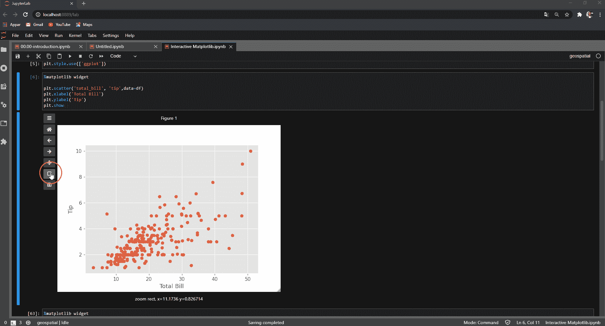
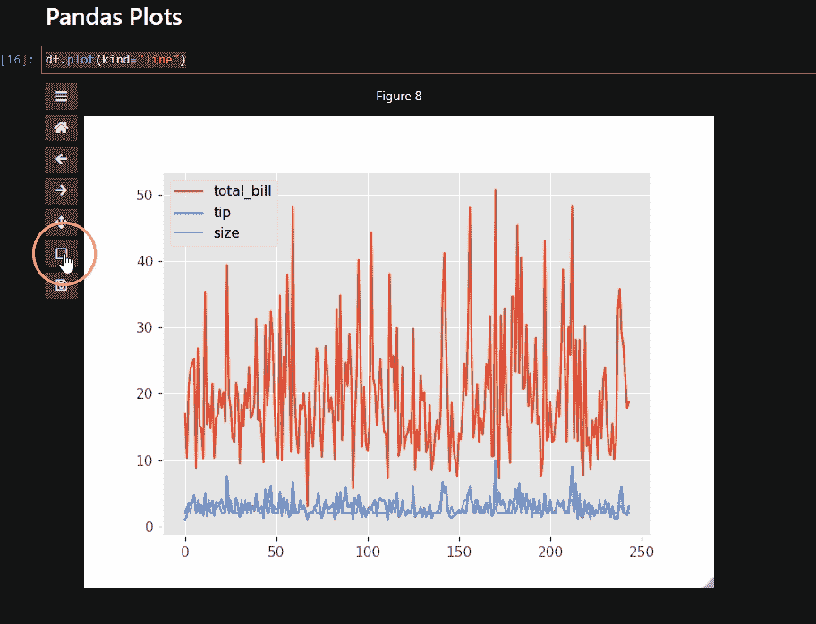
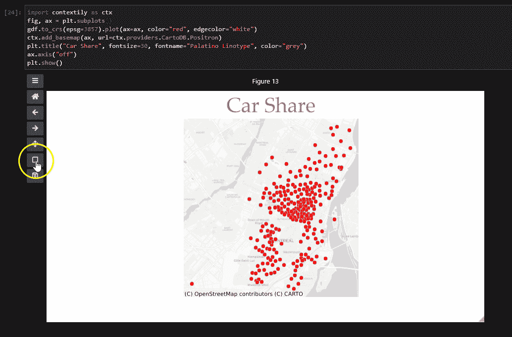

# 如何在 Jupyter 环境下生成交互式 Matplotlib 图

> 原文：<https://towardsdatascience.com/how-to-produce-interactive-matplotlib-plots-in-jupyter-environment-1e4329d71651?source=collection_archive---------0----------------------->

## 使用所有使用 Matplotlib 的 Python 库创建交互式绘图/地图


用 Canva 创建的图像

Matplotlib 是非常强大的可视化库，是许多其他 python 库的默认后端，包括 Pandas、Geopandas 和 Seaborn 等等。

今天，有不同的选项来启用 Matplotlib 绘图的交互性。然而，新的本地 Matplotlib/Jupyter 交互小部件为所有使用 Matplotlib 的第三方包提供了更广泛的用途和好处。

这项技术建立在 Matplotlib 和 Widgets 之上，允许您在没有第三方库的情况下进行交互式绘图。唯一的要求是安装 Ipympl，所有的交互性扩展都可以在您的 Jupiter 笔记本环境中获得。

在本教程中，我将介绍一些使用 ipympl 的 Matplotlib 交互式数据可视化的用例及示例。我们将首先介绍 ipympl 的基础知识，它的画布和一些例子。

> 利用 Jupyter interactive widgets 框架， [IPYMPL](https://github.com/matplotlib/ipympl) 在 Jupyter 笔记本和 JupyterLab 中启用 matplotlib 的交互特性。

## Jupyter 实验室的 IPYMPL

要启用交互式可视化后端，您只需使用 Jupyter magic 命令:

```
%matplotlib widget
```

现在，让我们设想一个 matplotlib 图。我们首先用 Pandas 读取数据，并用 Matplotlib 创建散点图。

```
url =df = pd.read_csv(
“[https://raw.githubusercontent.com/plotly/datasets/master/tips.csv](https://raw.githubusercontent.com/plotly/datasets/master/tips.csv)”
)# Matplotlib Scatter Plot
plt.scatter(‘total_bill’, ‘tip’,data=df)
plt.xlabel(‘Total Bill’)
plt.ylabel(‘Tip’)
plt.show()
```

没有额外的代码，只使用简单的 matplotlib 代码，输出是一个交互式的绘图，您可以放大/缩小，平移并重置为原始视图。下面的 GIF 图像显示了 ipympl 可能的交互性。



使用 Ipympl 的 Maptlotlib 交互式绘图

此外，您还可以定制用户界面的可见性、画布页脚和画布大小。

```
fig.canvas.toolbar_visible = **False**
fig.canvas.header_visible = **False** fig.canvas.resizable = **True**
```

这些命令改变 Ipympl 和 Matplotlib 图的用户界面。按钮将从用户界面上消失，但您仍然可以使用这些功能。要恢复到通常的 matplotlib 图，可以内联调用 matplotlib:

```
%matplotlib inline
```

让我们转向与熊猫互动的情节。

## 互动熊猫情节

熊猫图建立在 Matplotlib 之上；因此，我们也可以使用 Ipympl 创建交互式熊猫情节。让我们用熊猫做一个简单的线图。

```
df.plot(kind=”line”)
```

瞧，我们有一个与熊猫互动的情节。这个线图很密集，有了这个交互功能，我们可以放大到特定的地方，与图进行交互。见下图 GIF。



互动熊猫情节与 Ipympl

请注意，熊猫已经有一些交互式后端选项，包括 Plotly 和 Bokeh。然而，这并没有扩展到构建在 Pandas 之上的其他库。Geopandas 就是这样一个库，多亏了 Ipympl，它获得了第一批交互式地图。

## 带有 Geopandas 的交互式地图

如果您在 Pandas 中使用过地理空间数据，那么您应该已经知道 Geopandas，它在地理空间数据科学领域得到了广泛的应用。带有 Geopandas 的交互式地图改变了游戏规则。虽然 pandas 有其他后端选项来使其情节互动，但这在 Geopandas 上是不可能的。

由于 Geopandas 也构建在 Maptlotlib 之上，因此 Ipympl 的交互式后端也扩展到了它。我们现在可以在 Geopandas 中拥有交互式地图，而无需使用任何其他第三方地理可视化库。

让我们看一个由 Ipympl 支持的 Geopandas 交互式地图的例子。我将首先使用 Pandas 读取数据，因为我们使用 CSV 文件并将其转换为 Geopandas 地理数据框架。

```
carshare = “[https://raw.githubusercontent.com/plotly/datasets/master/carshare.csv](https://raw.githubusercontent.com/plotly/datasets/master/carshare.csv)"
df_carshare = pd.read_csv(carshare)gdf = gpd.GeoDataFrame(df_carshare, geometry=gpd.points_from_xy(df_carshare.centroid_lon, df_carshare.centroid_lat), crs=”EPSG:4326")
```

我们现在可以使用 Geopandas 绘制任何地理空间数据。我们可以直接打电话。plot()以可视化地图。然而，在这个例子中，我还添加了一个用于上下文目的的底图。

```
import contextily as ctx
fig, ax = plt.subplots()
gdf.to_crs(epsg=3857).plot(ax=ax, color=”red”, edgecolor=”white”)
ctx.add_basemap(ax, url=ctx.providers.CartoDB.Positron) 
plt.title(“Car Share”, fontsize=30, fontname=”Palatino Linotype”, color=”grey”)
ax.axis(“off”)
plt.show()
```

我们有一个互动地图，上面有 Geopandas。我们可以放大缩小和平移地图。太棒了。



使用 Ipympl 的交互式 Geopandas 地图

我每天都使用 Geoapndas，所以这是一个没有太多障碍的巨大补充。您仍然可以使用 Geopandas 并拥有交互式地图，而无需使用其他第三方包。

# 结论

在本教程中，我们介绍了一种使用 Ipympl 通过 Maptlotlib 启用交互式绘图的简单方便的方法。我们已经看到了如何使用 Matplotlib、Pandas 和 Geopandas 创建交互式绘图。

要使用 Ipympl 的交互功能，您可以使用 Conda/ pip 安装它:

```
conda install -c conda-forge ipympl
pip install ipympl
```

如果使用的是 jupyterLab，还需要安装 node js 和 Jupyter Lab 扩展管理器。

```
conda install -c conda-forge nodejsjupyter labextension install @jupyter-widgets/jupyterlab-manager
jupyter lab build
```