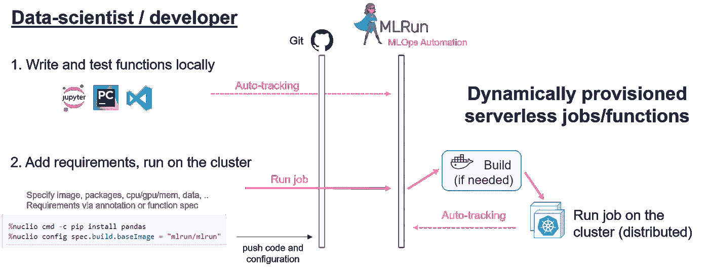
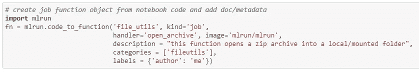
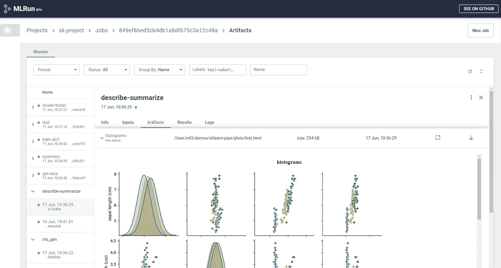
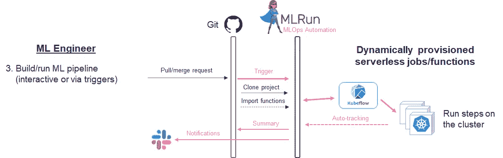
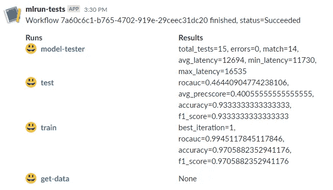

# 如何利用 MLOps 自动化更快地将 ML 产品化

> 原文：<https://towardsdatascience.com/how-to-productize-ml-faster-with-mlops-automation-d3f25caf38c4?source=collection_archive---------25----------------------->

来源 [shutterstock](https://www.shutterstock.com/image-photo/concept-devops-illustrates-software-delivery-automation-1418438333)

在我们最近在两周一次的 [MLOps Live 网络研讨会系列](http://www.iguazio.com/mlops#live)中进行的一项调查中，数百名与会者证实了数据科学团队正在努力应对的头号挑战——将机器学习引入生产。这一点得到了 Gartner research 的证实，该公司一直认为将人工智能产品化是当今人工智能实践中最大的挑战之一。许多人工智能项目，根据研究超过 80% [，陷入实验室，产生部分成功，或者消耗远多于最初计划的资源和时间。找到更快、更简单的方法将机器学习项目产品化是必不可少的，这样它们才能对业务产生影响。](https://venturebeat.com/2019/07/19/why-do-87-of-data-science-projects-never-make-it-into-production/)

抛开政治和组织方面的挑战不谈，主要障碍是数据科学团队通常在孤岛中工作，与工程和 DevOps 团队分离，并使用手动开发流程(也称为“jumbo”[Jupyter](https://jupyter.org/)playgrounds)，然后需要手动转换为生产就绪的 ML 管道。这需要 ML 工程师、数据工程师、DevOps 和开发人员的独立团队投入额外的时间和资源，通常远远超过最初的预期。每当数据准备或模型训练逻辑发生变化时，整个循环都会重复。

人工智能服务和应用开始成为任何业务的重要组成部分。伴随着这种趋势而来的是责任，这进一步增加了复杂性。需要添加数据、代码和实验跟踪，监控模型以检测概念漂移，通过使用 AutoML 技术和集成提高模型准确性，等等。

目前占主导地位的以研究为导向的数据科学方法在这种环境下不再流行。数据科学必须采用具有微服务、[持续集成](https://en.wikipedia.org/wiki/Continuous_integration) (CI)、[持续部署](https://en.wikipedia.org/wiki/Continuous_deployment) (CD)、代码版本化(Git)和配置/元数据版本化(GitOps)的敏捷软件开发实践。

当我与数据科学团队领导交谈时，他们都同意这种方法，但在实施方面存在困难。毕竟，数据科学家不是软件开发人员或 ML 工程师，反之亦然，这是有原因的。我们需要自动化流程的方法，并弥合软件和数据科学实践之间的差距。这就是一些新的开源工具可以派上用场的地方，我将演示这一点。

在这篇文章中，我将建议并展示如何加速 ML 的可操作性并减少摩擦。

# 各个击破

你有没有尝试过将数据科学笔记本或一个 [Kaggle](https://www.kaggle.com/) 项目转化为可以在生产中运行的东西？祝你好运。典型的项目包括 XXL 笔记本，从数据收集、数据准备、特征分析、制图、培训、验证等开始。

您通常会发现相同的模板和助手函数在多个笔记本中重复，代码没有在函数中组织，异常很少被处理，等等。如果您尝试对笔记本进行版本控制，很难发现版本之间的差异，更不用说尝试查看和评论拉取请求了。

我们需要采取的第一步是将我们的项目分解成功能(例如数据探索、培训等。)和定义良好并记录在案的 API。如果这些函数是共享的，我们应该把它们放在一个单独的 Python 或 notebook 文件中。当我们定义 API 时，调试、跟踪和理解代码变得更加容易，我们可以测试单个的功能，或者将它们作为更大流程的一部分。将单个功能或步骤重构为微服务要比重构整个项目笔记本简单得多。稍后我将展示如何实现自动化。

# 从实验到生产，没有任何麻烦

既然我们已经将数据科学代码和工作流分解为一组独立的功能，我们需要找到一种方法来运行这些功能，同时考虑生产或规模，并满足以下要求:

*   使其可部署(用所需的包、Kubernetes 运行时规范等构建 docker 映像。)
*   增加健壮性和故障处理
*   使用参数、结果、数据和元数据跟踪执行情况
*   针对性能进行优化，支持针对要求苛刻的工作负载或更大的数据集进行扩展
*   实施:支持日志记录、监控、强化安全等。

这通常是开发人员、数据和 ML 工程师团队重构代码并为生产做好准备的地方，这意味着添加更多的资源并显著延迟该过程。在团队各自为政的组织中，这是极其困难的，并且会导致许多数据科学计划中途被放弃。

另一种方法是跨团队协作，通过自动化从代码到产品的迁移以及我们跟踪执行和数据的方式，最大限度地减少人工工作。

我们希望利用我们的数据科学功能，自动构建和部署它们，根据实际使用情况扩展它们，并以最少的工作量监控它们的所有输入和输出。这在今天已经用“无服务器”技术实现了，我们只需要让它适应独特的数据科学问题和开发实践。

一个名为 [MLRun](https://github.com/mlrun/mlrun) (由我的公司 [Iguazio](https://www.iguazio.com/) 发起)的新开源框架与其他工具结合使用，如 [Nuclio](https://nuclio.io/) (无服务器引擎)和 [Kubeflow pipelines](https://github.com/kubeflow/pipelines) (管道编排)，以自动化 [MLOps](https://en.wikipedia.org/wiki/MLOps) 流程，并将 CI/CD + Git 实践引入数据科学。这项技术的早期采用者报告说，他们将整体交付时间从几个月缩短到几周，显著减少了计算资源和劳动力，现在他们终于可以完全了解所有的实验和数据。

[MLRun](https://github.com/mlrun/mlrun) 提供 SDK 和 Kubernetes 服务。SDK 可以在任何地方使用(在你的代码 IDE、Jupyter 笔记本、像 [Google Colab](https://colab.research.google.com/) 或 AWS [Sagemaker](https://aws.amazon.com/sagemaker/) 这样的托管笔记本服务、生产容器等等。).它可以自动跟踪你所有的功能活动，输入和输出。它处理各种函数之间的参数和数据传递，它可以使用一个命令将您的本地代码转换为分布式函数或完整的 ML 管道。([详见 mlrun 文档](https://mlrun.readthedocs.io/en/latest/))

[MLRun](https://github.com/mlrun/mlrun) 服务记录来自所有客户端的跟踪信息，基于所提供的代码+元数据自动提供“无服务器”功能，通过编排 Kubeflow 管道端到端管理工作流，并提供基于 web 的 UI，用于端到端管理正在运行的作业/实验、功能和工件。

从代码到可重用微服务(图片由作者提供)

您可以查看这个笔记本来了解一个函数是如何在 Jupyter 中编写和记录的，以及如何通过一个命令将它转换成一个无服务器的函数(微服务)对象，该对象可以发布到 Git 或在可重用函数市场中编目。

功能代码(图片由作者提供)

该笔记本还演示了如何从存储库/市场加载功能，并使用以下三种方式之一来执行任务:1 .作为本地可执行文件，2。作为一个自动扩展的容器化微服务，3。作为内存模块。执行及其元数据、输入和输出被自动跟踪。

MLRun 实验跟踪(图片由作者提供)

在其他示例中，您可以看到如何使用受支持的分布式运行时引擎之一(Nuclio、Dask、Spark、Horovod over MPI)横向扩展计算、管理模型、管理完整的项目以及提供按需资源或 GPU 分配(在我的 GPU 即服务博客中有详细介绍)。

这些功能是原子的(代码+所有的运行时定义)，版本化的，文档化的，这使得它们高度可重用。开发人员可以对功能进行扩展/增强，或者直接使用它们。这可以大大加快开发时间，并且您可以查看和重用一系列适用于不同数据科学阶段和算法的有用的预烤函数。

查看我的视频，它展示了我们如何自动将笔记本代码转换为可扩展的、自动跟踪的微服务:

# 自动化 ML 管道

我们的数据科学管道需要的不仅仅是一个功能。我们需要接收和准备数据，选择主要特性，训练我们的模型，验证它，部署它，等等。我们需要组装一个管道(工作流)——我们为此使用 Kubeflow 管道——并让 MLRun 组合、执行和跟踪我们的管道。

从 ML 函数构建自动化工作流(图片由作者提供)

你可以[看到这个例子](https://github.com/mlrun/demo-github-actions)，它展示了一个由笔记本和市场功能组成的完整的 ML 管道。管道接收数据，通过 AutoML、验证、模型部署和生产测试运行功能分析培训。可以通过命令行或 SDK 手动触发管道，也可以通过 Git 事件(如 pull 请求注释)触发管道。基于 Git 的 MLOps 自动化将在我的下一篇博客文章中详细讨论。

如果我们想要跟踪我们的管道结果，我们可以使用 MLRun UI，或者简单地将结果摘要作为注释推送到我们的 slack 通道或 Git pull 请求中。

获取时差通知(作者图片)

# 摘要

通过采用敏捷、CI/CD 和无服务器实践，数据科学和 MLOps 任务可以以节省大量时间和资源的方式实现自动化。MLRun 项目是一个新项目，但它是第一个旨在加快生产率和生产时间的整体 MLOps 自动化解决方案。MLRun 开发团队欢迎想要试用它的新用户和新贡献者，如果您不喜欢安装和开发，您可以通过 [Iguazio](https://www.iguazio.com/) 将其作为管理服务使用。

如果您想讨论这个博客或其他与 MLOps 相关的挑战和最佳实践，我邀请您到[加入 MLOps Live Slack 社区](https://join.slack.com/t/mlopslive/shared_invite/zt-er5oclrl-BK_xTJYAt5M0pRNFaKDpWw)，与我和其他 MLOps 粉丝/专家聊天。