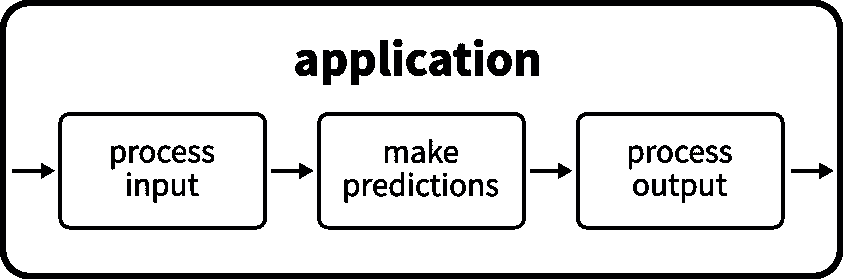

# 如何正确地发布和部署您的机器学习模型

> 原文：<https://towardsdatascience.com/how-to-properly-ship-and-deploy-your-machine-learning-model-8a8664b763c4?source=collection_archive---------4----------------------->

## FastAPI、Docker 和 GitHub 操作实用指南


汤姆·菲斯克在[像素](https://www.pexels.com)上拍摄的照片

作为一名数据科学家，训练你的机器学习模型只是为客户提供解决方案的一部分。除了生成和清理数据、选择和调整算法之外，您还需要交付和部署您的结果，以便它可以在生产中使用。这本身就是一个很大的领域，有着不断发展的工具和标准。在这篇文章中，我的目标是提供一个实用的指南，告诉你如何使用当前可用的最先进的工具和最佳实践来完成这项工作。我们将构建一个系统，它可以作为您部署任务的起点，而不考虑实际的机器学习问题本身！我的目标是介绍最佳实践和展示高级特性，而不是一个仅仅触及所用工具表面的最小化应用程序，这样你就不必学习艰难的方法。从你自己的错误中学习固然很好，但是提前思考并且不犯那些错误要好得多。

为了创建我们的部署就绪应用程序，我们将使用两个工具作为我们的主要构建块: [Docker](https://www.docker.com/) 和 [FastAPI](https://fastapi.tiangolo.com/) 。Docker 可能不需要介绍，它是一个容器化工具，允许您在任何环境中轻松打包和运行您的应用程序。它与 FastAPI 配合得特别好，FastAPI 在过去的几个月里获得了令人难以置信的流行。它使得围绕您的模型构建 web 框架和根据您客户的需求进行定制变得容易。

[](/you-should-start-using-fastapi-now-7efb280fec02) [## 您应该现在就开始使用 FastAPI

### 如果您还没有尝试过 FastAPI，现在是时候了

towardsdatascience.com](/you-should-start-using-fastapi-now-7efb280fec02) 

我们的玩具问题将是一个简单的回归，我们将根据犯罪率、财产税率等 13 个特征来预测房地产价格。为此，我们将使用[波士顿房价数据集](https://scikit-learn.org/stable/datasets/index.html#boston-dataset)作为我们的训练数据。关于模型选择，我们将使用来自牛逼的 [scikit-learn](https://scikit-learn.org/stable/index.html) 包的[随机森林回归器](https://scikit-learn.org/stable/modules/generated/sklearn.ensemble.RandomForestRegressor.html)。当然，您并不局限于 scikit-learn，您可以使用 TensorFlow、PyTorch 或任何您喜欢的工具。为了简单起见，我选择了这个，因为它几乎不需要额外的工作，比如大量的数据预处理，而且它的依赖性相对较轻，易于安装。

在这篇文章中，我将展示如何

*   打包您的模型并构建一个 API 来与之通信，
*   设计一个方便简单的用户界面，
*   用`virtualenv`设置合适的开发环境，
*   使用 FastAPI，
*   通过包装你的机器学习模型为将来的代码变化做准备，
*   使用依赖注入使测试更容易，
*   验证用户输入，
*   用模拟测试 API，
*   用 Docker 和 Docker compose 打包，
*   最后是如何使用 GitHub 动作来自动化测试。

要遵循这个指南，你根本不需要有使用 Docker 或 FastAPI 的经验！熟悉 scikit-learn 和 NumPy 将是有益的，但我们不会非常集中地关注这些部分。我们将要构建的应用程序可以在[https://github.com/cosmic-cortex/fastAPI-ML-quickstart](https://github.com/cosmic-cortex/fastAPI-ML-quickstart)找到，随时可以使用。在我们直接进入开发之前，让我们评估需求并设计应用程序的架构！

# 如何设计一个小型的机器学习 app

部署期间的一个主要考虑因素是客户的需求。在我们的例子中，我们假设他们不需要理解算法是如何工作的，也不想重新训练算法。他们只想发送数据，然后马上得到答案。


与机器学习模型通信

用技术术语来说，我们将构建一个应用程序，它以 HTTP 请求的形式接收数据，并以 HTTP 响应的形式发回预测。除了接口简单之外，作为微服务很容易集成到更大的应用中，这是一个巨大的优势。



来自高层的应用程序

我们的应用程序将通过 API 进行通信，该 API 将被打包在 Docker 容器中。在这个简单的例子中，在应用程序本身中，我们需要做三件事:处理输入、进行预测、处理输出并将其返回给用户。使用 FastAPI，输入将是一个 JSON，如下所示:

```
{"data":[[0.00632,18,2.31,0,0.538,6.575,65.2,4.09,1,296,15.3,396.9,4.98]]}
```

这将由 FastAPI 在内部转换成适当的 Python 对象。(稍后将详细介绍这一点，因为这是 FastAPI 中最简洁的特性之一。)我们需要为 scikit-learn 模型处理它，这意味着将它转换成一个 NumPy 数组。它可以用来计算我们的预测，我们将再次把它转换成 FastAPI 使用的格式。最后，用户将收到一个类似输入的 JSON:

```
{"data": [25.813999999999993]}
```

马上投入开发吧！我们的首要工作是建立适当的开发环境。

# 设置开发环境

如果您曾广泛使用 Python，那么您可能使用过虚拟环境。如果没有，要点如下。Python 虚拟环境是 Python 的独立安装，您可以在其中安装项目所需的特定包。当您有许多项目具有可能冲突的依赖关系时(比如一个项目要求 NumPy ≥ 1.13，而另一个项目要求 NumPy ≤ 1.10)，您最好使用虚拟环境来避免完全混乱。要创建虚拟环境，请使用

```
virtualenv /path/to/venv --python=/path/to/python3
```

在这里可以找到全局 Python3 解释器的路径

```
which python3
```

如果你在 Linux 下。(如果不显式提供解释器，就会回退到别名为`python`的 Python 解释器，有些情况下可以是 Python 2.7。不要使用 Python 2.7:)虚拟环境可以用

```
source /path/to/venv/bin/activate
```

在这之后，如果你用 *pip* 安装包，它将只在虚拟环境活动时可见。在您克隆了包含我们将要构建的应用程序的库之后，您可以使用

```
pip install -r requirements.txt
```

在根文件夹中时执行命令。尽管您不需要将您的依赖项收集到一个单独的需求文件中，但是强烈建议您这样做。这使得维护你的应用程序更加容易，而且当你把应用程序打包成 Docker 镜像时，你可以使用同一个文件。

# 构建应用程序的框架

粗略地说，每个 FastAPI 应用程序都由一个主文件组成，该主文件负责启动应用程序/定义端点和端点使用的附加模块。(可以在主文件之外的其他地方定义端点，但是在最简单的情况下，这种结构是更可取的。)

```
.
├── api
│   ├── __init__.py
│   ├── main.py
│   └── ml
│       ├── __init__.py
│       ├── model.joblib
│       └── model.py
└── requirements.txt
```

当 FastAPI 应用程序的结构清晰后，我们先构建`main.py`的框架，然后实现`ml`模块！

我们基本上需要导入两个类:为我们的 API 提供所有功能的`FastAPI`类和来自 awesome Pydantic 库的`BaseModel`,它充当 HTTP 请求和响应的模型。

在实例化一个`FastAPI`对象后，我们可以通过使用它的适当方法来修饰描述端点逻辑的函数，从而向它注册端点。例如，这里我们有

这意味着我们的应用程序期望一个对`/predict`端点的`POST`请求，该请求包含一个由`PredictRequest`对象描述的 JSON 有效负载，并将返回一个由`PredictResponse`描述的 JSON 有效负载的响应。这些都是由函数前的`@app.post`装饰器指定的，它将这个函数注册到名为`app`的`FastAPI`实例，并将请求路由到这个函数的`/predict` URL。`predict`的`input`参数的类型注释描述了请求数据的适当格式。

在这个例子中，`PredictRequest`对象有一个名为`data`的属性，它必须是一个 floats 列表的列表。(由于数据通常是成批传递的，所以外部列表中的每个列表都是一个数据点。)Pydantic 非常重视类型检查:如果类型不匹配，它会无情地抛出一个异常。这种用 Pydantic 进行的类型检查是 FastAPI 的一个极其强大的特性，使我们的生活变得更加容易。如果请求的格式不正确，您会立即收到一个 422 不可处理的实体状态代码作为响应。而你要为此做几乎为零的工作！如果您已经使用请求和响应模型指定了模式，FastAPI 和 Pydantic 会为您执行验证。

您可以立即使用此应用程序

```
uvicorn api.main:app
```

并且通过检查由 FastAPI 生成的自动文档来试用端点，默认情况下可以在[http://localhost:8000/docs](http://localhost:8000/docs)找到该文档。或者，您可以使用`curl`来发布请求，例如

```
curl -X POST “[http://localhost:8000/predict](http://localhost:8000/predict)" -H “accept: application/json” -H “Content-Type: application/json” -d “{\”data\”:[[0]]}”
```

会管用的。目前，这个简单的框架将总是返回一个伪响应

```
{"data":[0]}
```

但是，一旦我们的模型到位，这种情况很快就会改变。既然框架已经建立并运行，我们就可以开始实现机器学习模型了！

# 创建机器学习算法

正如我提到的，我们将使用 [Boston 数据集](https://scikit-learn.org/stable/datasets/index.html#boston-dataset)训练一个简单的[随机森林回归器](https://scikit-learn.org/stable/modules/generated/sklearn.ensemble.RandomForestRegressor.html)，两者都可以在 scikit-learn 中找到。尽管直接使用 scikit-learn 对象很有吸引力，但我更喜欢为我们的模型构建一个抽象接口，它将由 API 端点使用，而不是由 scikit-learn 对象本身使用。其背后的原因是该接口在整个代码库中是可重用的，如果您希望替换您的底层模型(比如使用 PyTorch 模型而不是 scikit-learn 的随机森林回归器)，您只需要更改该类的实现，而不是更改实际使用该模型的所有函数和端点。

我们需要四个基本方法:一个用于训练模型，一个用于计算预测，两个用于保存和加载模型。当界面清晰时，我们就可以开始具体的实现了，这非常简单。

除了模型接口本身，我们还将在`api.ml.model`模块中定义模型对象。这个特定的实例将在整个应用程序中使用。这被称为单例，是最重要的 OOP 模式之一。虽然在这里使用是安全的，但是在大型应用程序中必须小心使用单例变量，因为它们基本上是全局变量。通过调用`get_model()`函数，可以在应用程序的其余部分访问这个模型对象。这有两个原因。首先，这个函数在代码中到处都是可重用的，因此如果以后我们决定添加额外的逻辑来获取模型(如检查等)，在一个地方修改代码就足够了。第二，稍后将会解释，如果我们在端点中使用[依赖注入](https://fastapi.tiangolo.com/tutorial/dependencies/)，那么为应用程序编写单元测试会更好。(如果你现在不明白这一点也不要担心，后面会解释的。)

为了准备我们的应用程序，在执行这个脚本时，一个模型被训练并保存到磁盘上。这将在以后用于预测。

# 构建 API 端点 I:处理 JSON 输入

在应用程序框架和机器学习算法到位后，我们就可以实施端点背后的逻辑了。让我们切换回`main.py`模块！预测是一个相对简单的过程，只需要几行代码就可以实现。

在函数体中，有三件事情正在进行:

1.  输入(是`PredictRequest`的一个实例)被转换成一个 NumPy 数组。
2.  计算预测，产生一个 NumPy 数组。
3.  结果被转换成一个`PredictResponse`对象并返回。

FastAPI 将返回值转换为正确的响应。有一个重要的变化可能已经引起了您的注意:我们向我们的`predict`函数传递了一个额外的参数:

```
model: Model = Depends(get_model)
```

其中`get_model`函数是返回模型的函数，在`api.ml.model`模块中定义。这种技术被称为依赖注入。虽然`model`是函数的一个参数，但是每次调用`predict`函数，都会执行`get_model`并传递返回值。为什么这很有用，这一点可能并不明显，但是这对于编写正确的单元测试非常重要。想想看:我们的端点依赖于一个 scikit-learn 对象，它背后有数千行代码。例如，它可以在软件包的新版本中进行磨合。(就像最近发生在 pip 上的一样:[https://github.com/pypa/pip/issues/7217](https://github.com/pypa/pip/issues/7217)，影响了相当一部分用户。)一般来说，不管它们有多重要，外部依赖都会带来潜在的错误。当我们想要对我们的应用程序进行单元测试时，我们不希望结果依赖于一些可能超出我们控制的对象的正确性。因此，这些通常在单元测试中被嘲笑。mock 是一个伪对象，实现了与原始对象相同的接口，具有 100%可预测的行为。有了依赖注入，通过覆盖依赖，这些模拟可以很容易地注入到代码中。如果您没有马上明白这一点，请不要担心，在测试部分会有更详细的解释。

# 永远不要相信用户的输入

既然端点本身已经实现，让我们考虑一些可能的用例。如果你尝试

```
curl -X POST “[http://localhost:8000/predict](http://localhost:8000/predict)" -H “accept: application/json” -H “Content-Type: application/json” -d “{\”data\”:[[0]]}”
```

使用当前的实现，您将得到一个内部服务器错误，应用程序将崩溃。这是因为由于模型是使用 13 个特征训练的，所以它需要 13 个特征来进行预测。虽然 uvicorn 很聪明，会在这种情况下重启你的应用程序，但是内部服务器错误听起来很糟糕，你肯定不想在生产中遇到这种情况。为了解决这个问题，我们将在 Pydantic 请求模型中添加额外的验证。默认情况下，它们只检查 JSON 有效负载是否有一个“data”键，其值是一个 floats 列表的列表。在我们的[定制验证器](https://pydantic-docs.helpmanual.io/usage/validators/)(除了默认验证之外还运行)中，我们检查数据的维度是否正确，也就是说，每个子列表都准确地包含了`n_features`元素。(也就是 13。)

当传递了错误的数据并且验证失败时，应用程序不会崩溃，而是返回 422 不可处理的实体错误代码。虽然这对最终用户来说不一定是更好的结果，但对你和你的 devops 团队来说肯定是更愉快的。一般来说，当您构建处理数据的应用程序时，您不应该相信用户输入。事情可能会意外出错，也可能会受到恶意攻击，比如 SQL 注入，这是黑客工具包中一个流行而危险的工具。

最终的模块会是这样的:[https://github . com/cosmic-cortex/fastAPI-ML-quick start/blob/master/API/main . py](https://github.com/cosmic-cortex/fastAPI-ML-quickstart/blob/master/api/main.py)

下一节将添加`predict_csv`端点。

# 构建 API 端点 II:处理。csv 文件

如果您想接收另一种格式的数据，如 csv 文件，您可以这样做。你应该使用`[File](https://fastapi.tiangolo.com/tutorial/request-files/)` [和](https://fastapi.tiangolo.com/tutorial/request-files/) `[UploadFile](https://fastapi.tiangolo.com/tutorial/request-files/)`来代替使用 Pydantic 模型作为输入。

注意，这一次，Pydantic 没有为我们执行验证，因此我们必须手动执行。有两件事需要验证。

1.  该文件包含表格形式的数据。
2.  该数据正好包含 13 个特征。

我们在函数体内手动完成这两项工作。当出现问题时，我们会抛出一个异常，由 FastAPI 在一个适当的 HTTP 响应中返回。

# 测试 API

现在我们已经准备好了一切，是时候测试我们的应用程序了！使用未经测试的代码就像打地鼠游戏:你修复了一个 bug，另一个 bug 马上就会出现。就个人而言，我是测试的大力支持者，我认为你也应该是一个。尽管测试需要最初的时间投入，但它将在开发的后期得到指数回报。

为了测试 API，我们将使用`pytest`，这是 Python 中单元测试的标准工具。我们将把测试模块放在`api`旁边，因此文件结构将如下所示:

```
.
├── api
│   ├── __init__.py
│   ├── main.py
│   ├── ml
│   │   ├── __init__.py
│   │   ├── model.joblib
│   │   └── model.py
│   └── tests
│       ├── api
│       │   ├── __init__.py
│       │   └── test_api.py
│       ├── conftest.py
│       ├── __init__.py
│       └── mocks.py
└── requirements.txt
```

我们要构建的第一件事是一个模拟的`Model`对象，这样我们的端点测试就不依赖于 scikit-learn。正如我所提到的，这是不可取的，因为我们希望将代码中的错误和外部代码中的错误分离开来。

这个类相对简单，完全模仿我们的`api.ml.model.Model`类的接口，但是基本上它不执行任何有意义的计算，并且返回随机数据。(尽管随机数据将在形状上匹配预期的输出。)

接下来，我们将根据`pytest`需求添加位于`conftest.py`模块中的测试配置。在我们的情况下，我们应该做两件事。

1.  覆盖端点中使用的依赖注入，以使用一个`MockModel`对象来代替真实模型。
2.  定义测试中使用的 fixtures，它们本身就是依赖注入。(我们很快会看到一个例子。)

首先，我们从我们的`main`模块导入实际的`app`对象。要覆盖对`get_model()`的依赖，我们只需提供一个新函数，并用新函数在`app.dependency_overrides`字典中设置适当的键。这段代码不会在部署期间执行，因此我们的依赖关系不会被意外覆盖，它是特定于测试的。接下来，我们准备一个 Starlette `TestClient`，它[“允许你对你的 ASGI 应用程序做出请求”](https://www.starlette.io/testclient/)，一个非常方便的测试工具。这个定义意味着使用`TestClient`实例，我们可以向端点发送请求并接收响应，这正是我们想要测试的。

首先，我们用有效数据测试用户输入。为了看到它在多批量(从 1 到 9)下工作良好，我们添加了数据点的数量作为`n_instances`参数。在测试函数中遍历所有可能的大小被认为是不好的做法，因为如果它对某个特定的大小失败了，您会想知道它失败的确切位置。因此，我们可以使用`@pytest.mark.parametrize`装饰器，它为参数的每个值自动生成一个新的测试函数。在测试函数中，我们简单地生成一些假数据，并使用`TestClient`将其发送到应用程序。我们要检查两件事:1)响应代码是 200，这是 HTTP-okay 的说法 2)响应包含的预测与输入数据集的大小一样多。

然而，测试端点的正确输入数据是不够的。如果是这样，更重要的是确保我们的应用程序在出现不正确的数据时表现正常。这在下面介绍。

为了完整起见，我已经为`predict_csv`端点添加了测试，这些测试与之前的测试相似，所以我不再详述。

一旦测试准备好了，您就可以通过在 bash 中从项目的根目录执行`pytest`来运行它们。输出将如下所示:


毕竟测试模块应该是这样的:[https://github . com/cosmic-cortex/fastAPI-ML-quick start/tree/master/API/tests](https://github.com/cosmic-cortex/fastAPI-ML-quickstart/tree/master/api/tests)。

# 打包您的应用程序

当应用程序经过适当的测试并在您的本地机器上正确运行时，就该将它打包成可移植的格式了。如果没有这一点，在另一台机器上设置它将是一个缓慢而痛苦的过程。为此，我们将使用 Docker。


Docker 架构。来源:[https://docs.docker.com/engine/docker-overview/](https://docs.docker.com/engine/docker-overview/)

Docker 将应用打包成*镜像*，镜像是自包含的应用，甚至是操作系统。它们由 Docker 容器运行，Docker 容器是隔离的执行环境。它们在原理上非常类似于虚拟机。尽管它们不像虚拟机那样提供严格的隔离，但当您第一次使用 Docker 时，这是一个很好的模型。

Docker 映像由`Dockerfile`定义，它基本上是 Docker 如何构建映像的一组指令。映像通常不是独立的，它们是从其他基础映像构建的。这些图像在 https://hub.docker.com 有它们自己的存储库，你可以在那里推送你的图像和拉取其他图像。打个比方，这些图像就像 git 存储库。使用基本映像就像分叉一个存储库，并将一些提交推到您自己的分叉上。

我们将使用包含 19.10 版本 Ubuntu 的`ubuntu:19.10`映像来打包我们的应用程序。(这是 Ubuntu docker 官方图片。)选择基础映像会显著影响后面的大部分工作流程。对于 Python 应用程序，基于 Alpine Linux 的映像也是一个很好的选择，Python 甚至有一些基于 Alpine 的官方映像。然而，将 NumPy 和某些机器学习库安装到基于 Alpine 的映像可能会很困难，所以我们将坚持使用 Ubuntu。

这是我们的 Dockerfile，包含在项目的根文件夹中。我们将一行一行地走一遍。

第一行描述了基本图像，如前所述是`ubuntu:19.10`。在构建时，这个映像从中央存储库中取出。完成后，Docker 将把`./api`文件夹复制到图像中。(每个映像都有自己的文件系统。)然后我们准备安装 Python3 以及 FastAPI 等所需的包。在图像内执行`RUN`后的命令。在这之后，我们正确地设置`PYTHONPATH`变量和工作目录。

为了服务于我们的应用程序，我们将向主机映像公开容器的端口 8000。出于安全原因，默认情况下不会这样做，您必须手动这样做。最后，我们告诉 Docker 在容器运行时要做什么:我们要启动`uvicorn`并为应用程序提供服务。`ENTRYPOINT`指定每次执行容器时将运行的命令，而`CMD`指定其参数。

图像本身可以用

```
docker build --file Dockerfile --tag fastapi-ml-quickstart .
```

命令。构建可能需要一段时间，但完成后，您可以使用

```
docker run -p 8000:8000 fastapi-ml-quickstart
```

在 run 命令中，您需要指定 Docker 将容器的 TCP 端口 8000 映射到主机中的同一个端口。如果您在浏览器中打开 [http://localhost:8000](http://localhost:8000) ，您可以看到应用程序正在运行，并且您可以正确地连接到它。

## 组合容器

在这个简单的例子中，我们的应用程序不依赖于其他服务，比如 Redis 或 PostgreSQL。在这种情况下，`docker-compose`可以用来组合容器。与`Dockerfile`类似，docker-compose 需要一个名为`docker-compose.yaml`的 YAML 配置文件来描述要启动哪些服务。

在这之后，只需执行

```
docker-compose up
```

从项目根目录。Docker compose 将在图像不可用时自动构建图像。我发现即使你只有一个容器，每次用这个手动调用`docker build`和`docker run`也要简单得多。

# 与 GitHub 动作的持续集成

维护良好的代码的支柱之一是持续集成。即使我们有测试，实际上也没有强迫程序员在提交变更之前使用它们。我们可以通过在某些触发条件下自动执行测试来解决这个问题，比如对特定分支的 push 和 pull 请求。这样，向共享代码库的主线推送更改可以比通常更快地完成。与旧的学校开发工作流程相比，当合并每周进行一次，并需要团队的大部分人员来监督时，通过适当的持续集成设置，代码交付可以由一个人完成，甚至每天几次。

在这个项目中，我们将使用 GitHub Actions，它允许您根据预定义的触发器自动执行操作。它要求您在 GitHub 托管的存储库的`.github/workflows`子目录中定义您的动作脚本。以下是该项目的 [YAML 配置文件](https://github.com/cosmic-cortex/fastAPI-ML-quickstart/blob/master/.github/workflows/ci.yaml)。

如您所见，配置文件有两个主要部分:第二部分定义将要发生什么，第一部分定义何时发生。在这个例子中，我们希望脚本在对`master`分支的每个 push 和 pull 请求上执行。

动作本身是根据*工作*定义的，并给出了每个步骤。这个名为`build`的特定作业在 Ubuntu 实例中运行，如`runs-on`参数所示。首先它[检查存储库](https://github.com/actions/checkout)，然后它使用`docker-compose.test.yaml`文件启动 Docker compose，这是专门为测试目的而制作的。

与我们之前使用的相比，这个 Docker compose 只有一行不同:它覆盖了`fastapi-ml-quickstart`容器的入口点，启动了`pytest`而不是`uvicorn`。完成后，容器退出，Docker 编写被中止，从`fastapi-ml-quickstart`容器返回退出代码。这些事情都不是`docker-compose`的默认行为，所以你要特别指示它这么做:

```
docker-compose -f docker-compose.test.yaml up --abort-on-container-exit --exit-code-from fastapi-ml-quickstart
```

就个人而言，我是 GitHub Actions 的忠实粉丝。它是非常通用的，你甚至可以用它将更新推送到产品中，在 PyPI 中发布，以及许多其他任务。它明显的缺点是只对 GitHub 用户开放。然而，也有替代者，例如 Jenkins、CircleCI、Travis CI、GitLab CI 等等。

# 包扎

在本指南中，我的目标是为机器学习应用程序构建一个小应用程序，并遵循最佳实践和使用现代工具对其进行适当的打包。但是，总有进步的空间！如果你有任何想法，欢迎在[https://github.com/cosmic-cortex/fastAPI-ML-quickstart](https://github.com/cosmic-cortex/fastAPI-ML-quickstart)提出来！我希望你觉得这个指南有用。现在去开始构建令人敬畏的人工智能应用程序:)

[***如果你喜欢把机器学习概念拆开，理解是什么让它们运转，我们有很多共同点。看看我的博客，我经常在那里发表这样的技术文章！***](https://www.tivadardanka.com/blog)