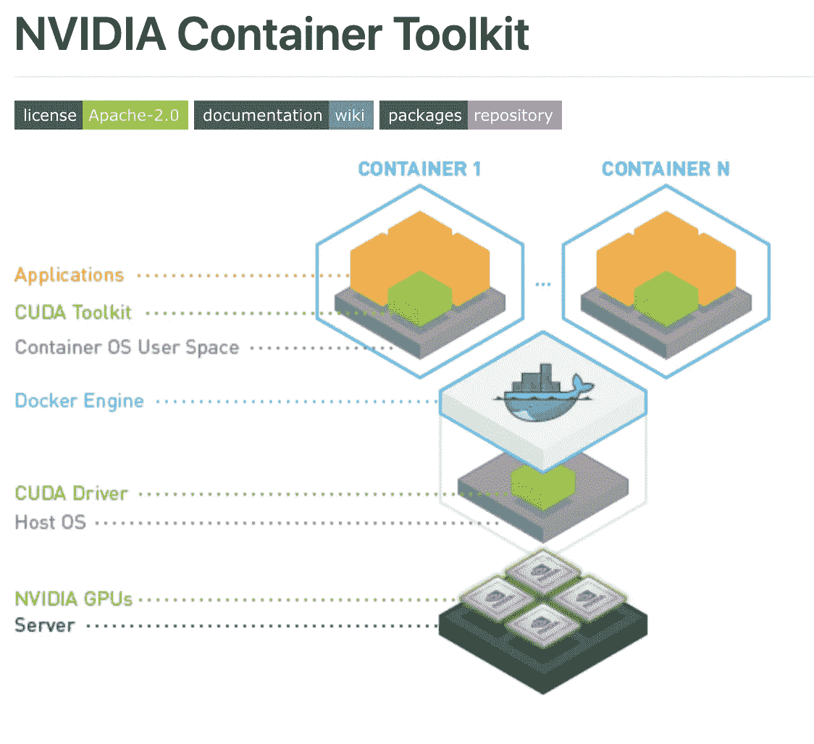
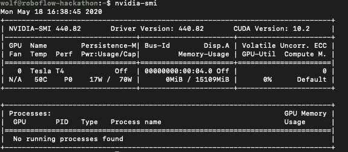
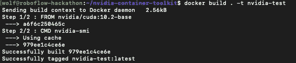
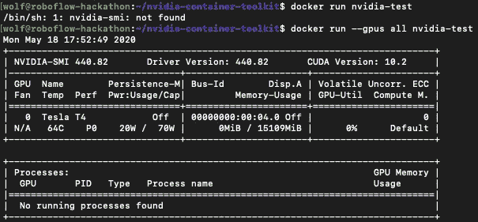

# 如何在 Docker 容器中正确使用 GPU

> 原文：<https://towardsdatascience.com/how-to-properly-use-the-gpu-within-a-docker-container-4c699c78c6d1?source=collection_archive---------1----------------------->

## 注意:我们也在博客上发布了[如何在 Docker](https://blog.roboflow.ai/use-the-gpu-in-docker/) 中使用 GPU。在这篇文章中，我们将介绍在 Docker 容器中访问机器的 GPU 所需的步骤。

在你的机器上配置 GPU 可能非常困难。配置步骤会根据您机器的操作系统和 NVIDIA GPU 的种类而有所不同。更困难的是，当 Docker 启动一个容器时，它几乎是从零开始的。某些东西，比如 CPU 驱动程序是为你预先配置的，但是**当你运行 docker 容器**时，GPU 并没有被配置。幸运的是，您已经找到了这里解释的解决方案。它叫做 **NVIDIA 容器工具包**！



Nvidia 容器工具包([引文](https://github.com/NVIDIA/nvidia-docker))

# Docker 中的潜在错误

当您试图在 Docker 中运行需要 GPU 的容器时，您可能会收到以下任何错误。

错误:Docker 找不到 Nvidia 驱动程序

```
docker: Error response from daemon: Container command 'nvidia-smi' not found or does not exist..
```

错误:tensorflow 无法访问 Docker 中的 GPU

```
I tensorflow/stream_executor/cuda/cuda_diagnostics.cc:150] kernel reported version is: 352.93
I tensorflow/core/common_runtime/gpu/gpu_init.cc:81] No GPU devices available on machine.
```

错误:pytorch 无法访问 Docker 中的 GPU

```
RuntimeError: cuda runtime error (100) : no CUDA-capable device is detected at /pytorch/aten/src/THC/THCGeneral.cpp:50
```

错误:keras 无法访问 Docker 中的 GPU

```
The TensorFlow library wasn't compiled to use FMA instructions, but these are available on your machine and could speed up CPU computations.
```

您可能会收到许多其他错误，表明您的 Docker 容器无法访问机器的 GPU。在任何情况下，如果您有任何类似上面的错误，您已经在这里找到了正确的位置。

# 首先，确保你的基本机器有 GPU 驱动程序

您必须首先在您的基本计算机上安装 NVIDIA GPU 驱动程序，然后才能在 Docker 中使用 GPU。如前所述，由于操作系统、NVIDIA GPU 和 NVIDIA GPU 驱动程序的分布过多，这可能很困难。您将运行的确切命令会因这些参数而异。这里有一些资源，你可能会发现在你的基本机器上配置 GPU 有用。

*   [NVIDIA 官方工具包文档](https://docs.nvidia.com/cuda/cuda-installation-guide-linux/index.html)
*   [在 Ubuntu 指南上安装 NVIDIA 驱动程序](https://linuxconfig.org/how-to-install-the-nvidia-drivers-on-ubuntu-18-04-bionic-beaver-linux)
*   [从命令行安装 NVIDIA 驱动程序](https://www.cyberciti.biz/faq/ubuntu-linux-install-nvidia-driver-latest-proprietary-driver/)

一旦你完成了这些步骤，通过运行 **nvidia-smi** 命令并查看如下输出，你就会知道你成功了。



我已经成功地在我的谷歌云实例上安装了 GPU 驱动程序

现在，我们可以保证我们已经成功地保证 NVIDIA GPU 驱动程序安装在基础机器上，我们可以移动到 Docker 容器的更深一层。

# 接下来，向 Docker 公开 GPU 驱动程序

为了让 Docker 识别 GPU，我们需要让它知道 GPU 驱动程序。我们在图像创建过程中这样做。Docker 映像创建是一系列命令，用于配置 Docker 容器将要运行的环境。

**强力方法—** 强力方法包括您在基本机器上用来配置 GPU 的相同命令。当 docker 构建映像时，这些命令将会运行并在您的映像上安装 GPU 驱动程序，一切都会好的。在你的 docker 文件中，暴力方法看起来会像这样(代码归功于[栈溢出](https://stackoverflow.com/questions/25185405/using-gpu-from-a-docker-container)):

```
FROM ubuntu:14.04
MAINTAINER Regan <[http://stackoverflow.com/questions/25185405/using-gpu-from-a-docker-container](http://stackoverflow.com/questions/25185405/using-gpu-from-a-docker-container)>RUN apt-get update && apt-get install -y build-essential
RUN apt-get --purge remove -y nvidia*ADD ./Downloads/nvidia_installers /tmp/nvidia                             > Get the install files you used to install CUDA and the NVIDIA drivers on your host
RUN /tmp/nvidia/NVIDIA-Linux-x86_64-331.62.run -s -N --no-kernel-module   > Install the driver.
RUN rm -rf /tmp/selfgz7                                                   > For some reason the driver installer left temp files when used during a docker build (i don't have any explanation why) and the CUDA installer will fail if there still there so we delete them.
RUN /tmp/nvidia/cuda-linux64-rel-6.0.37-18176142.run -noprompt            > CUDA driver installer.
RUN /tmp/nvidia/cuda-samples-linux-6.0.37-18176142.run -noprompt -cudaprefix=/usr/local/cuda-6.0   > CUDA samples comment if you don't want them.
RUN export LD_LIBRARY_PATH=$LD_LIBRARY_PATH:/usr/local/cuda/lib64         > Add CUDA library into your PATH
RUN touch /etc/ld.so.conf.d/cuda.conf                                     > Update the ld.so.conf.d directory
RUN rm -rf /temp/*  > Delete installer files.
```

**强力方法的缺点—** 首先，每次你重新构建 docker 镜像时，你都必须重新安装镜像，这会减慢开发速度。第二，如果您决定将 docker 映像从当前机器中取出，放到一台具有不同 GPU、操作系统的新机器上，或者您想要新的驱动程序，那么您将不得不每次都为每台机器重新编码这一步骤。这违背了建立码头工人形象的目的。第三，您可能不记得在您的本地机器上安装驱动程序的命令，并且在 Docker 中重新配置 GPU。

**最佳方法—** 最佳方法是使用 NVIDIA 容器工具包。NVIDIA 容器工具包是一个 docker 映像，它支持自动识别您的基本计算机上的 GPU 驱动程序，并在运行时将这些相同的驱动程序传递给您的 Docker 容器。因此，如果你能够在你的基本机器上运行 **nvidia-smi** ，你也将能够在你的 Docker 容器中运行它(并且你的所有程序将能够引用 GPU)。为了使用 NVIDIA Container Toolkit，您只需将 NVIDIA Container Toolkit 映像放在 Dockerfile 的顶部，就像这样— **nano Dockerfile** :

```
FROM nvidia/cuda:10.2-base
CMD nvidia-smi
```

**这是你需要向 Docker** 公开 GPU 驱动的所有代码。在该 docker 文件中，我们已经导入了 10.2 驱动程序的 NVIDIA 容器工具包映像，然后我们指定了一个在运行容器来检查驱动程序时要运行的命令。现在我们用 **docker build 构建图像。-t 英伟达-测试**:



构建 docker 映像，并将其命名为“nvidia-test”

现在，我们通过使用命令**docker run-GPU all NVIDIA-test 从映像运行容器。**请记住，我们需要**—GPU all**，否则 GPU 不会暴露给运行的容器。



成功！我们的 docker 容器看到了 GPU 驱动程序

从这个基础状态开始，您可以相应地开发您的应用程序。在我的情况下，我使用英伟达容器工具包来支持实验性深度学习框架。完整构建的 docker 文件的布局可能如下所示(其中/app/包含所有 python 文件):

```
FROM nvidia/cuda:10.2-base
CMD nvidia-smi#set up environment
RUN apt-get update && apt-get install --no-install-recommends --no-install-suggests -y curl
RUN apt-get install unzip
RUN apt-get -y install python3
RUN apt-get -y install python3-pipCOPY app/requirements_verbose.txt /app/requirements_verbose.txtRUN pip3 install -r /app/requirements_verbose.txt#copies the applicaiton from local path to container path
COPY app/ /app/
WORKDIR /appENV NUM_EPOCHS=10
ENV MODEL_TYPE='EfficientDet'
ENV DATASET_LINK='HIDDEN'
ENV TRAIN_TIME_SEC=100CMD ["python3", "train_and_eval.py"] 
```

上述 Docker 容器使用基础机器 GPU 基于规范训练和评估深度学习模型。相当酷！

# **在 Dockerfile** 中需要不同的基础图像

假设您一直依赖 docker 文件中的不同基础映像。然后，你可以[安装 NVIDIA 容器运行时](https://docs.docker.com/config/containers/resource_constraints/#gpu)。

```
apt-get install nvidia-container-runtime
docker run -it --rm --gpus all ubuntu nvidia-smi
```

现在你可以用 nvidia 容器运行时运行其他基础镜像(这里我们运行 ubuntu 基础)。

# **NVIDIA 容器工具包的威力**

现在，您已经编写了映像以通过基础机器的 GPU 驱动程序，您将能够从当前机器中提取映像，并将其部署到在您想要的任何实例上运行的容器中。

# 更新:需要 Docker 上的 CuDNN 和 NVCC cuda 工具包吗？

只有当你需要从其他 NVIDIA Docker 基础映像中获得`cuDNN`或`nvcc --version`时，`nvidia/cuda:10.2-base`才会获得`nvidia-smi.`，即:`nvidia/cuda:10.2-devel-ubuntu18.0.`(获得 nvcc cuda 工具包)和`nvidia/cuda:10.2-cudnn7-devel-ubuntu18.04.`(获得 cuDNN)。

# 结论

恭喜你！现在，您知道如何使用 NVIDIA 容器工具包将 GPU 驱动程序暴露给正在运行的 Docker 容器。

想使用你的新 Docker 功能做一些很棒的事情吗？你可能会喜欢我们关于[训练一个最先进的物体检测模型](https://blog.roboflow.ai/training-efficientdet-object-detection-model-with-a-custom-dataset/)、[训练一个最先进的图像分类模型](https://models.roboflow.ai/classification/resnet-32)的其他帖子，或者只是通过查看一些[免费的计算机视觉数据](https://public.roboflow.ai/)！