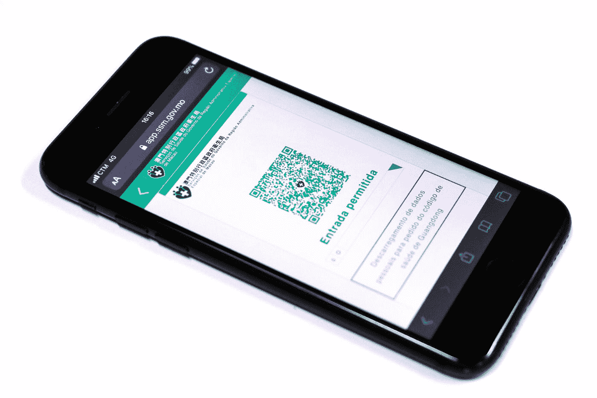

# 如何保护您的数据免受未经授权的访问

> 原文：<https://towardsdatascience.com/how-to-protect-your-data-from-unauthorized-access-bd74105d2ce4?source=collection_archive---------38----------------------->

[澳门图片社](https://unsplash.com/@macauphotoagency?utm_source=medium&utm_medium=referral)在 [Unsplash](https://unsplash.com?utm_source=medium&utm_medium=referral) 上拍摄的照片

数据保护是当今世界各地组织主要关注的问题之一。信息安全(InfoSec)主要是禁止未经授权访问信息，它使数据保护成为可能。

到 2020 年，安全信息和事件管理(SIEM)等安全服务和其他托管服务预计将占网络安全预算的近[50](https://www.gartner.com/en/newsroom/press-releases/2018-08-15-gartner-forecasts-worldwide-information-security-spending-to-exceed-124-billion-in-2019)。这意味着企业越来越重视网络安全，并实施更好、更强大的安全实践来防止攻击者或恶意内部人员的未授权访问。

您的数据是否足够安全，可以防止未经授权的访问？在本文中，让我们看看您可以做些什么来提高安全性。

# 防止未经授权的数据访问:帮助您提高网络安全的 9 个技巧

但首先，要学会收集相关数据，对其进行分析，并将其转化为可操作的情报资源。

您可以决定聘请第三方分析师来监控、利用和保护您的数据，或者让您的团队参加专业的[分析课程](https://taxandbusinessonline.villanova.edu/master-of-science-in-analytics/)来提高他们的知识。

这样，他们不仅可以依赖分析和数据安全工具，还可以保护和利用数据来做出有益的业务决策。

想要确保您的洞察力数据是 100%安全的吗？以下是我们帮助您防止未经授权的数据访问的建议:

## 1.保持所有安全补丁的最新状态

对于任何组织来说，防止未经授权的数据访问的第一步是更新所有的安全补丁。

原因如下:

[安全补丁解决软件、操作系统、驱动程序等中的漏洞](https://www.cypressdatadefense.com/blog/web-application-vulnerabilities/)。，攻击者可能会利用它来访问您的设备和数据。Windows、Linux、Android、iOS 等操作系统的安全补丁是必不可少的，因为操作系统漏洞会带来严重后果。此外，随着新补丁的推出，不断更新驱动程序和软件应用程序。

WannaCry 病毒导致 150 个国家超过 40 万台计算机系统瘫痪，是近年来最严重的攻击之一。它攻击了 Windows 的 SMB V1(服务器消息块)协议中的漏洞，并通过使用 EternalBlue exploit 启动。

有趣的是，早在攻击发起之前，这些漏洞的安全补丁就已经存在了。但是有成千上万的用户没有更新他们的安全补丁，因此成为攻击的受害者。

通过使用更新的安全补丁，用户可以防止对系统攻击进行未经授权的访问。

请务必为您的操作系统和其他软件下载最新的安全补丁和更新，以保护其免受网络攻击。您还可以启用自动更新，以便每当发布安全修补程序或更新时，系统都会自动安装它。

通过保持准备和更新，您可以保护您的数据免受那些试图获得未经授权的访问。

## 2.快速检测和响应入侵

当然，您需要保持警惕，并做好准备防止黑客未经授权访问数据。

但是如果您无法检测到入侵呢？

前进的方向是什么？

您越早检测到入侵，就能越早做出响应。预防无疑是重要的，但是监控用户活动、登录尝试、日志和其他活动也可以让您了解系统的安全性。

有几种方法可以快速检测和响应入侵:

## 入侵检测系统/入侵防御系统

IDS 使用已知的入侵迹象或行为试探法来评估网络流量中的可疑活动。

入侵检测是监控和分析您的网络或系统中的活动的过程，以发现入侵事件的可能迹象，如即将发生的威胁、违规或对您的安全策略的威胁。

另一方面，IPS 通过主动监控系统的传入流量来识别恶意请求，对 IDS 起到了补充作用。IPs 通过阻止未授权或违规的 IPS、禁止恶意数据以及提醒安全人员注意潜在的安全威胁来防止入侵攻击。

## 安全事故事件经理

安全事故事件管理器(SIEM)是一种安全管理方法，使安全专业人员能够深入了解 IT 环境中的活动。SIEM 软件收集和分析公司技术基础设施生成的日志数据，从应用程序、主机系统、网络到安全设备。

然后，该软件会对事件和事故进行检测和分类，并对其进行分析。SIEM 主要有两个目标:

*   跟踪记录并提供有关安全相关事件和事故的报告，例如失败和成功的登录尝试、恶意软件活动或任何其他可疑活动。
*   如果检测到任何表明存在安全威胁的可疑活动，请通知安全人员。
*   实施用户和事件行为分析(UEBA)
*   为了防止未经授权的数据访问，您需要掌控您的分析游戏。

如果与用户的“正常”行为模式存在偏差，用户和事件行为分析有助于检测任何异常行为或实例。例如，如果用户每天定期下载 10MB 大小的文件，但突然下载千兆字节的文件，系统会检测到这种异常并立即向管理员发出警报。

用户和事件行为分析使用算法、统计分析和机器学习来确定与既定模式的偏差，显示哪些异常正在发生以及它们如何可能导致潜在威胁。通过这种方式，您可以得到关于未经授权的数据访问的警告。

此类分析侧重于您系统内的用户和实体，尤其是内部威胁，如可能滥用其权限实施有针对性的攻击或欺诈企图的员工。

## 3.实现最小特权原则(最小化数据访问)

最低特权是将帐户、用户和计算进程的访问权限限制为仅执行合法的日常活动所需的特定资源的做法。2019 年全球数据风险报告称，平均而言，一名员工可以访问 1700 万个文件。

实现最低特权可以帮助您保护数据免受未经授权的访问。最小特权原则(POLP)强制实施最低级别的用户权限，允许用户访问仅履行其角色所需的特定资源。它降低了被未经授权的用户、应用程序或系统利用的风险，而不会影响组织的整体工作效率。

虽然最小特权有助于仅为完成手头工作所需的特定资源提供权限，但它也[实施更好的安全实践](https://www.cypressdatadefense.com/blog/application-security-best-practices/)并降低您的组织成为网络攻击受害者的可能性。

## 4.使用多因素身份验证

对于公司来说，除了多因素身份认证之外，还必须通过实施强大的密码策略来使用强身份认证。这对于防止未经授权的数据访问大有帮助。

顾名思义，多因素身份认证要求用户提供多条信息，并在被授权访问系统之前由系统进行验证。这使得攻击者很难侵入用户的帐户，因为这比简单地破解密码需要更多的努力。

多因素身份验证可能使用通过带外通信渠道发送的一次性密码，例如自动电话呼叫或 SMS 文本消息发送给用户的授权设备、用户设置的安全问题或生物特征身份验证。虽然这使得身份验证有点麻烦，但它确保了更好的安全性，并迫使攻击者不仅要破解密码，还要破坏第二个因素。这使得攻击者破解身份验证变得更加困难。

想要一个专业的提示，以防止未经授权的访问您的数据？

利用密码。

虽然肯定应该使用多因素身份验证，但是您也可以使用通行短语来代替密码。密码短语是一系列随机单词或一个句子，单词之间也可以包含空格，如“十群大象经常在坦桑尼亚打保龄球！!"

密码短语不一定要语法正确；它可以是任意单词的组合，也可以包含符号。记住复杂的密码比记住复杂的密码更容易。仍然必须小心生成强有力的密码短语。只使用日常词汇的简单密码仍然很容易被破解。

## 5.实施 IP 白名单

另一种防止未经授权的数据访问的方法是通过 IP 白名单。

IP 白名单有助于限制和控制仅受信任用户的访问。它允许您创建可信和授权的 IP 地址列表，用户可以从这些地址访问您的网络。通常，公司通过一组定义好的 IP 地址使用互联网，因此他们可以添加一个允许访问的所有可信 IP 地址的列表。

通过将 IP 地址列入白名单，您可以仅向特定 IP 地址范围内的受信任用户授予访问特定网络资源(如 URL、应用程序、电子邮件等)的权限。

如果有人使用不受信任的 IP 地址试图访问您的网络，他们将被拒绝访问。IP 白名单还使组织能够保护对网络的远程访问，包括允许员工使用自己设备的自带设备(BYOD)。

## 6.加密系统内部的网络流量

通过加密网络流量，您可以确保它不会被窥探网络流量的攻击者截获。

然而，服务器间通信和数据中心内部的网络流量通常不加密。如果攻击者获得了对这种网络的访问权，他们就可以拦截多机集群中服务器之间传输的数据。

为了防止攻击者通过未经授权的访问窥探数据，组织越来越多地监控自己的网络流量以检测入侵。公司可能会在其监控系统中长时间存储网络流量的副本。

如果所有网络存储受隐私保护的数据，那么使用加密是至关重要的。这适用于授权用户从数据中心外部建立的访问系统的连接，以及多服务器系统中节点之间的网络链接。

您可以在用户和系统之间使用 VPN 层，或者实施 SSL/TLS 来加密网络流量。在系统内部，可以使用 IPsec、SSL/TLS 或其他 VPN 技术来保护通信。

## 7.加密静态数据

静态数据加密可确保数据安全存储，而不是以纯文本形式存储。当数据被写入磁盘时，它通过一组只有系统的授权管理员知道的秘密密钥被加密。

对这些密钥的访问受到限制和控制，以确保只有特权用户才能访问和使用加密数据。这种技术保护数据免受攻击者的攻击，攻击者可能试图获得对系统的远程访问，并保护数据不被破坏。

这是保护您的数据免受任何人未经授权访问的有效方法。静态加密需要对所有可能存储数据的地方进行适当的审计，比如缓存服务器或临时存储设备。

## 8.确保防恶意软件保护/应用程序白名单

恶意软件是最常见的网络攻击形式之一。事实上，[每 13 个网络请求中就有 1 个](http://images.mktgassets.symantec.com/Web/Symantec/%7B3a70beb8-c55d-4516-98ed-1d0818a42661%7D_ISTR23_Main-FINAL-APR10.pdf?aid=elq_)会导致恶意软件。这是一个困扰众多计算机系统的严重问题，并且因出现在用户不知道的不显眼位置而臭名昭著。

恶意软件是设计用来在未经用户同意或授权访问的情况下攻击或渗透计算机的软件。特洛伊木马、计算机病毒、蠕虫、恶意软件和间谍软件是一些最常见的恶意软件攻击类型。它们可以出现在电子邮件和网站上，或者隐藏在附件、视频和照片中。

这种恶意软件很容易给黑客提供未经授权的数据访问。

反恶意软件保护非常重要，因为它为您的设备建立了安全基础。运行良好的防病毒程序，避免点击可疑的电子邮件或下载不明来源的附件，并定期扫描间谍软件。

或者，更强的控制是利用应用程序白名单。它可以非常有效地防止未经授权的数据访问。

这样，您就可以识别允许在您的计算机系统上运行的已知和可信的应用程序，并拒绝所有其他应用程序。即使有人获得未经授权的访问，如果该应用程序尚未被批准为白名单应用程序，他们也无法在您的系统上运行恶意软件。

## 9.跟踪和管理您的风险

风险可能是对项目的绩效、预算或时间表有潜在影响的任何事情。如果这些风险变得很大，它们就会成为必须解决的漏洞，以避免网络安全攻击。

组织以有效和及时的方式识别、分类、优先化和减轻风险是至关重要的。通过在风险升级之前跟踪它们，您可以防止它们成为问题。此外，您应该制定一个应对计划来立即应对风险。

# 最后的想法

数据保护不是一个线性过程或一次性活动。您需要不断投入资源、时间和精力来确保安全，防止未经授权的数据访问。

网络犯罪分子每天都在变得越来越先进，他们使用最新的技术来锁定组织并获得未经授权的数据访问。

随着[数据泄露事件的增加](https://www.cypressdatadefense.com/blog/business-data-breach/)，您需要提高警惕。您必须在企业中集成强大的安全措施，每位员工都必须将网络安全放在首位。

如果您想对您现有的安全实践进行快速安全审计，请告诉我们，我们将帮助您确保您受到良好保护，免受未经授权的数据访问和其他网络威胁。

**关于作者:**

Steve Kosten 是 [Cypress Data Defense](https://www.cypressdatadefense.com/) 的首席安全顾问，也是“Java/JEE 中的 SANS DEV541 安全编码:开发可防御应用程序”课程的讲师。