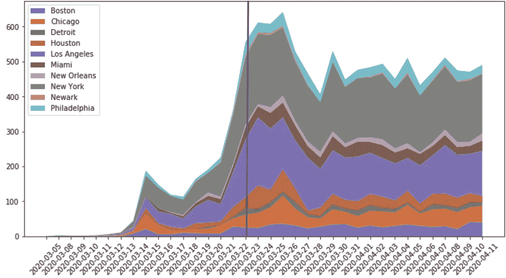
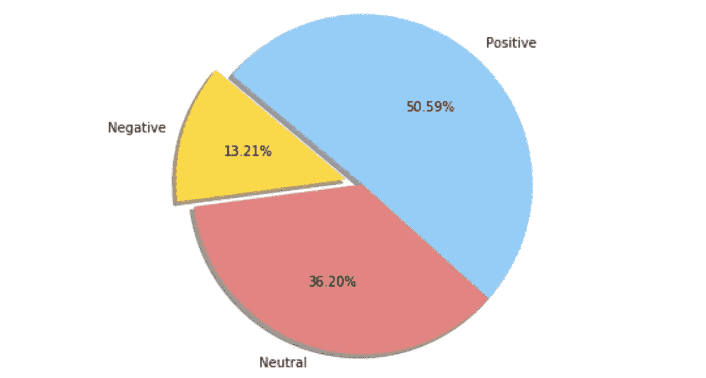
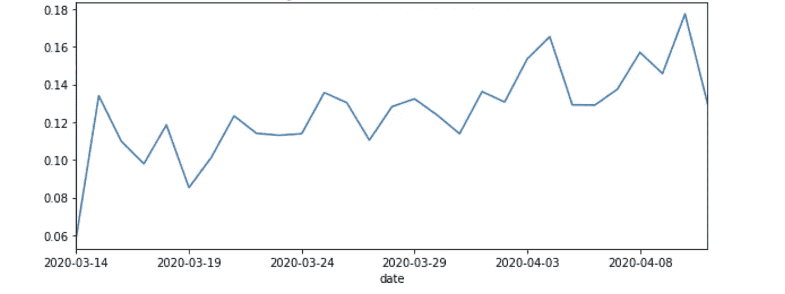
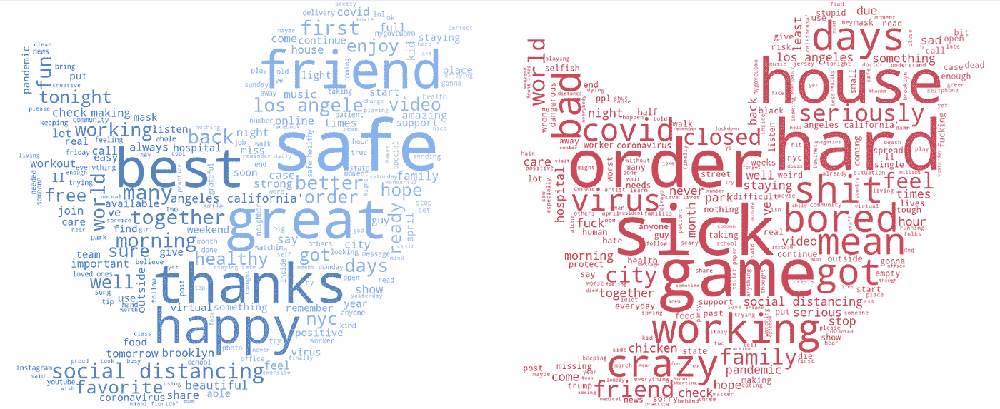
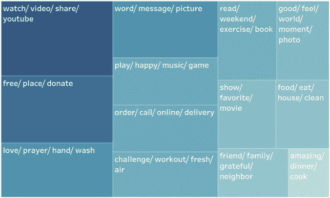
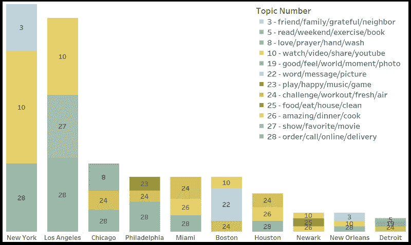
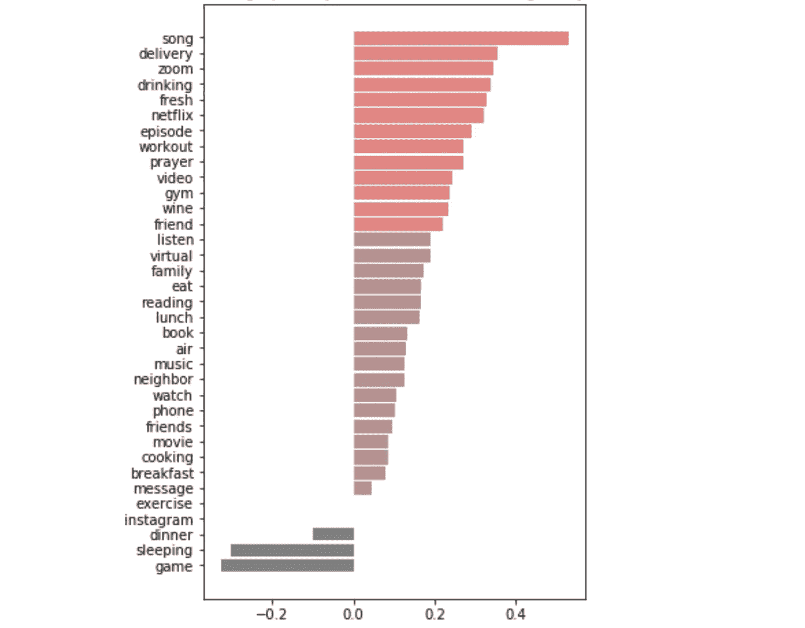

# 新冠肺炎期间如何保护自己的心理健康？

> 原文：<https://towardsdatascience.com/how-to-protect-your-mental-health-during-the-covid-19-3840e4015435?source=collection_archive---------53----------------------->

该项目获得了加州大学戴维斯分校 MSBA 新冠肺炎挑战赛的二等奖和最有价值的数据集。这是由[、](http://www.linkedin.com/in/jennnh)、【黄毅军】戴、[凯拉邹](http://linkedin.com/in/kaixin-zou)、[王浩男](http://linkedin.com/in/haonan-hedy-wang)合作完成的。python 编码的分步指导已经在 Github 分享:[https://github.com/jennnh/4G_COVID-19_Challenge](https://github.com/jennnh/4G_COVID-19_Challenge)

# 概观

新冠肺炎疫情给人们的身体健康和福祉带来了极大的威胁。然而，许多精神疾病在不被注意的情况下被同时唤醒。在美国，每个人都面临着这场 COVID 危机中的精神健康问题，这是由工作机会消失、企业倒闭以及与朋友和家人分离引起的。更糟糕的是，前国会议员 Patrick J Kennedy 说，随着资源转移到新冠肺炎救援，自杀热线电话增加了 800%。

在这种情况下，这个项目旨在对隔离期间释放人们情绪紧张的活动提出详细的建议。具体来说，我们的团队首先在不同地区和日期的 Twitter 上收集标签为 *#StayHome* 的推文作为数据源。第二，我们利用情绪分析和词云来理解和可视化人们的情绪。第三，我们使用主题建模找到了 13 个与活动相关的主题，并将它们与其他专栏进行交叉分析，以确定导致人们积极和消极情绪的因素。最后，我们向人们提出了建议，告诉他们应该参加什么活动，应该避免什么活动来保持快乐。

# 网页抓取

首先，我们需要通过网络抓取从 Twitter 上抓取数据。我们没有使用 Twitter 的免费 API，因为它只提供过去 7 天内的推文，但我们从一个月前就需要推文了。因此，我们使用了一个名为“ [GetOldTweets3](https://pypi.org/project/GetOldTweets3/) ”的包，它为我们的分析提供了足够多的 Tweets。

我们想选择一些有代表性的城市进行分析。为此，我们根据约翰·霍普斯金大学 2020 年 4 月 13 日的数据，选择了 10 个既有大量人口，又有大量确诊病例的城市进行刮痧。这 10 个城市是纽约市(纽约州)、波士顿(马萨诸塞州)、芝加哥(伊利诺伊州)、底特律(密歇根州)、洛杉矶(加利福尼亚州)、休斯顿(得克萨斯州)、纽瓦克(新泽西州)、迈阿密(佛罗里达州)、费城(宾夕法尼亚州)和新奥尔良(路易斯安那州)。

之后，我们搜集了这些城市附近发布的推文。对于每条推文，我们都收集了用户的姓名、文本、推文的日期和时间、转发次数、收藏夹数和标签。刮完数据后，我们还做了一个基于每个城市新增用户比例的分层抽样。新用户由用户是否第一次发布关于#StayHome 的帖子来定义。

# 探索性数据分析

拿到数据集后，我们开始做一些探索性的分析。我们收集的数据集包含 2020 年 3 月 5 日至 2020 年 4 月 11 日的推文，其中包括 11631 条推文和 6741 个独立用户。下图显示了不同城市的推文数量随时间的分布情况。



不同城市的推文数量

根据图表，在大多数城市，三月下旬左右推特数量会突然增加。这是大多数城市宣布避难所到位的时候。比如蓝线之后灰色区域大大增加，纽约刚刚宣布了命令。这意味着避难所到位的公告增加了人们对新冠肺炎的认识和关注，因此人们开始非常重视“呆在家里”，并在推特上更多地谈论它。几天后，推文的数量减少了，这表明人们开始不那么关注这个问题，他们习惯了呆在家里。

# 自然语言处理分析

## 文本预处理

在 EDA 之后，我们进行了文本预处理以提高 NLP 模型的性能，包括:

*   让一切都变成小写。
*   文本去收缩。例如，将“不会”替换为“不会”，将“有”替换为“有”，将“有”替换为“会”。
*   移除奇怪的符号、网址、表情符号和#标签
*   使用 NLTK 词干的单词词条化。词汇化是将一个词的不同屈折形式组合在一起的过程，这样它们就可以作为一个项目进行分析。例如，在词汇化之后，“哭”就是“哭”。

文本预处理前后的评论比较如下:

**在**之前

```
A sunny day haiku #quarantinepoetry for an old friend down in Texas summerdaenen THANK YOU!!! VENMO @randsomnotes for a poem of your very own! #quarantinelife #stayhome #summer @New York, New York [https://www.instagram.com/p/B-29p1rp1la/?igshid=12yeaszfhp7o2](https://www.instagram.com/p/B-29p1rp1la/?igshid=12yeaszfhp7o2%27)
```

**在**之后

```
A sunny day haiku  for an old friend down in Texas summerdaenen THANK YOU!!! VENMO @randsomnotes for a poem of your very own!    @New York, New York
```

## 情感分析

我们使用“Textblob”软件包为每条推文分配一个名为“极性”的情感分数，以衡量评论的积极或消极程度。之后，我们将情绪分为积极情绪和消极情绪，阈值为 0。极性分数大于 0 的推文是正面的，极性小于 0 的是负面的，极性等于 0 的是中性的。不同情绪的推文比例如下:



根据图表，一半的推文是正面的，只有一小部分推文是负面的。这意味着没有多少人因为新冠肺炎而呆在家里做坏事。

我们还绘制了一个线形图来观察情绪如何随着时间的推移而变化，图表显示，人们在适应这种情况后开始感觉好一点了。



一段时间内推特的平均情绪

## 世界云

为了了解负面推文和正面推文中最常见的词是什么，我们在这两个情绪类别中分别创建了两个词云。



左:正世界云/右:负世界云

在删除这两个词云中的常用词后，我们可以看到积极的推文通常包含积极的词，如“安全”、“朋友”或“快乐”。还有像“视频”、“音乐”这样暗示积极活动的词。相反，在否定词云中，我们可以推断推文主要是在表达对生病的担忧，或者是抱怨在家待久了无聊。另外,“游戏”这个词也出人意料地出现在负面词汇 cloud 中。

## **主题建模**

自然语言处理分析的第三部分是主题建模。首先，我们进一步预处理文本以提高主题建模的性能，包括:

*   标记化:将每个句子标记成一个单词列表
*   删除标点符号。
*   使用 NLTK 库删除停用词。停用词是非常常见的词，如“如果”、“但是”、“我们”、“他”和“他们”。我们还在这个语料库的基础上增加了多个新的常用词。

在预处理之后，我们通过 Mallet 使用潜在的 Dirichlet 分配(LdaMallet)从所有 Tweets 中提取主题。首先，我们尝试了不同数量的主题，并使用一致性值来选择最佳数量的主题。在确定选择 30 个话题后，我们得到了每个话题的关键词，并筛选出了 13 个与人们的活动相关的话题进行进一步分析。

随后，我们结合情感分析和话题建模的结果，分析哪些话题有助于人们的积极情绪，哪些会导致消极情绪。更具体地说，我们计算了每个主题的平均极性，并将结果可视化在下面的树形图中。



显示 13 个活动相关主题的平均情绪的树形图

面积和颜色由每个话题的极性决定，也就是说面积越大越暗，话题越积极。因此，左上方的活动是最积极的活动，如观看视频、捐赠以及通过文字和消息进行交流。另一方面，右下角的活动是最不积极的，比如做饭和打扫房子。

除了话题的情绪，我们还分析了不同城市最受欢迎的活动。因此，我们根据与话题相关的推文数量，列出了每个城市排名前三的活动。



不同城市的前 3 项活动

根据图表，我们得到了几个有趣的发现:

*   在许多城市，观看视频、锻炼和送货是受欢迎的活动。
*   纽约人更喜欢与朋友和家人呆在一起，而洛杉矶人最喜欢看表演和电影。
*   通过文字、信息和图片进行交流在波士顿非常流行。
*   芝加哥人特别喜欢祈祷。

除了话题，我们还想了解更多影响人们感受的具体词汇，所以我们从这些话题中挑选了一系列高频词，并计算了包含每个词的所有推文的平均极性。条形图根据单词的极性对其进行排序。浅红色的单词是最积极的，然后是暗红色和灰色的。



包含关键词的所有推文的平均极性

与主题建模结果一致，观看视频、虚拟连接和去健身房与极其积极的情绪相关。此外，像唱歌、收快递、喝酒和祈祷这样的活动也是非常积极的。值得注意的是，“游戏”一词在条形图中排名最后，这与我们认为玩游戏有助于人们感觉更好的知识不一致。

# 推荐

基于对话题和单字的分析，我们给感到精神不适的人以下建议:

你可以花更多的时间在这些活动上:听歌、唱歌、看电影或电视剧、锻炼、阅读，以及虚拟地与你的家人和朋友联系，即使你在物理上是遥远的。

此外，根据我们的分析，这些活动对你的情绪非常有益:

*   帮助他人，无论是分享免费食物还是捐款帮助。
*   祈祷确实有助于释放你的情绪不适。
*   网上订餐比做饭对你的情绪有更积极的影响，所以当你想享受美食时，可以考虑点外卖
*   不要整天玩游戏。没有你想的那么积极。