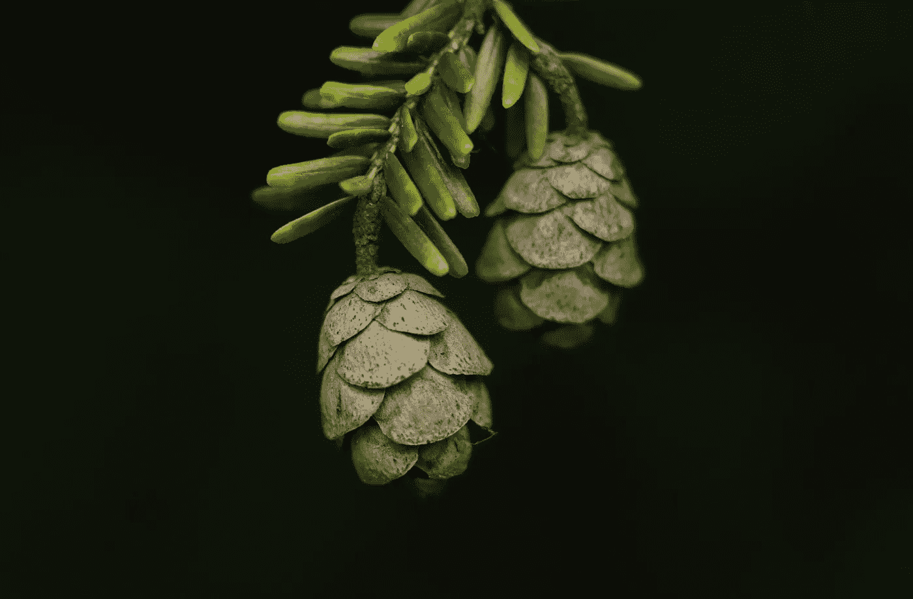
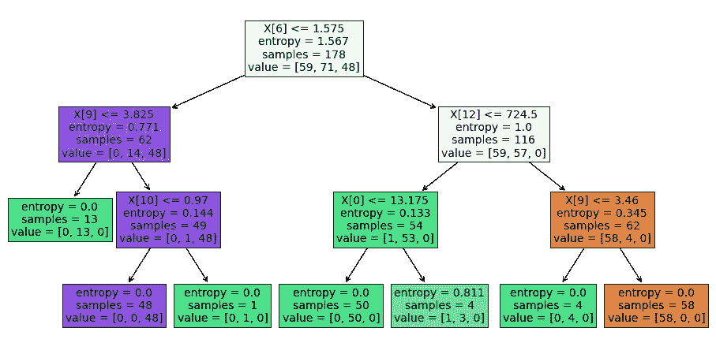
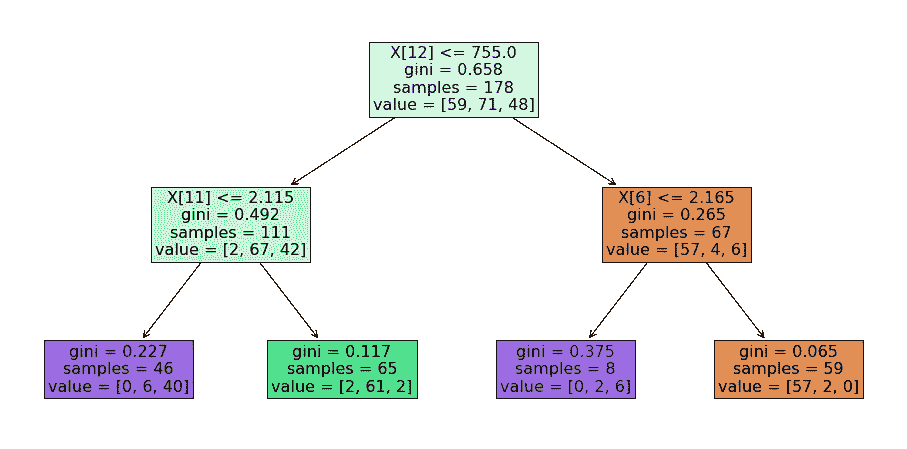
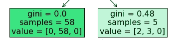
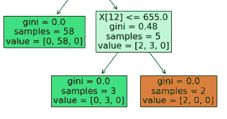
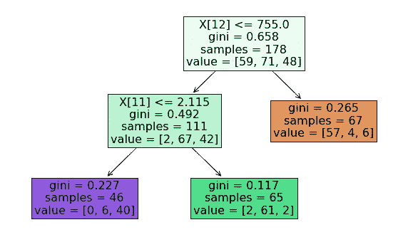
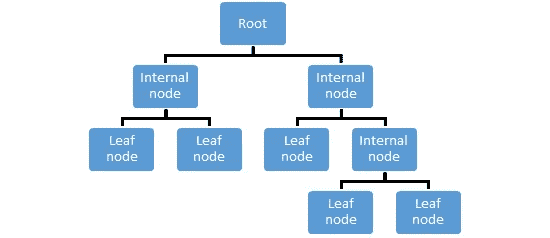
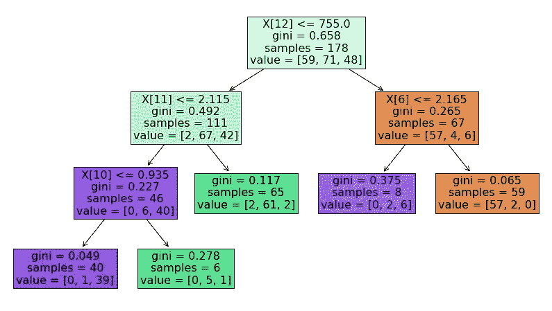

# 如何修剪决策树以充分利用它们

> 原文：<https://towardsdatascience.com/how-to-prune-decision-trees-to-make-the-most-out-of-them-3733bd425072?source=collection_archive---------25----------------------->

## 用可视化来解释。



加里·本迪格在 [Unsplash](https://unsplash.com/s/photos/tree-pruning?utm_source=unsplash&utm_medium=referral&utm_content=creditCopyText) 上的照片

决策树是受监督的机器学习算法，通过迭代地将数据集划分为更小的部分来工作。划分过程是构建决策树的最关键部分。

分区不是随机的。目的是在每次分区时尽可能提高模型的预测性，以便模型不断获得有关数据集的信息。

例如，下面是一个深度为 3 的决策树。



深度为 3 的决策树(图片由作者提供)

第一个分区基于特征 6 (X[6])，并且能够将属于第一类(59)的所有数据实例放在树的右侧。

这清楚地表明，最大化信息增益的分区被优先考虑。信息增益可以用熵或基尼系数来量化。一般来说，信息增益与纯度的增加(或杂质的减少)成正比。

节点的纯度与该节点中不同类的分布成反比。

考虑这样一种情况，您选择一个数据实例并随机标记它。**基尼系数**衡量你的随机标签出错的频率。如果所有数据点都有相同的标签，那么标签总是正确的，基尼系数将为零。另一方面，如果数据点平均分布在多个标签中，随机标签通常是不正确的。因此，基尼系数随着随机性的增加而增加。

熵是不确定性或随机性的另一种度量。一个变量的随机性越大，熵就越大。


熵 vs 随机性(图片由作者提供)

选择产生更纯节点的分区。因此，当选择一个特征来划分数据集时，决策树算法试图实现:

*   更多的预测
*   杂质少
*   低熵

决策树需要仔细调整，以充分利用它们。太深的树可能会导致过度拟合。Scikit-learn 提供了几个超参数来控制树的生长。

我们将看到这些超参数是如何使用 scikit-learn 的 tree 模块的 plot_tree 函数实现的。

我将使用 scikit-learn 的 datasets 模块下的 wine 数据集。让我们首先导入库并加载数据集。

```
import numpy as np
import pandas as pdfrom sklearn import tree
from sklearn.datasets import load_wineimport matplotlib.pyplot as plt
%matplotlib inlineX, y = load_wine(return_X_y=True)
```

数据集包括属于 3 个不同类别的 178 个观察值。有 13 个特征描述了观察结果。

```
X.shape
(178,13)np.unique(y, return_counts=True)
(array([0, 1, 2]), array([59, 71, 48]))
```

我们现在可以开始用不同的超参数值构建决策树。最明显的一个是 max_depth，它在指定的深度级别停止树的生长。

```
clf = tree.DecisionTreeClassifier(criterion='gini', max_depth=2)\
.fit(X, y)plt.figure(figsize=(16,8))
tree.plot_tree(clf, filled=True, fontsize=16)
```



深度为 2 的决策树(图片由作者提供)

基于 Gini 杂质选择分区，并且树的深度是 2。Max_depth 提供了一种简单的方法来控制树的增长，这在更复杂的情况下可能是不够的。

min_samples_split 指定节点中要进一步分割的最小样本数。

```
clf = tree.DecisionTreeClassifier(criterion='gini', min_samples_split=10).fit(X, y)plt.figure(figsize=(20,8))
tree.plot_tree(clf, filled=True, fontsize=16)
```



min_samples_split=10(图片由作者提供)

我只放了一部分可视化，我们可以看到当前超参数的效果。右边的节点没有进一步分割，因为其中只有 5 个样本。如果没有 min_samples_split=10，它将被进一步拆分如下。



(图片由作者提供)

控制树生长的另一个超参数是 min _ infinity _ decrease，它设置杂质减少的阈值以考虑分区。这是一个比最大深度更好的方法，因为它考虑了分区的质量。

```
clf = tree.DecisionTreeClassifier(criterion='gini', min_impurity_decrease=0.1).fit(X, y)plt.figure(figsize=(10, 6))
tree.plot_tree(clf, filled=True, fontsize=16)
```



min _ 杂质 _ 减少=0.1(图片由作者提供)

所有隔板都实现了超过 0.1 的杂质减少。在设置这个值时，我们还应该考虑标准，因为基尼系数杂质和熵具有不同的值。

max_leaf_nodes 也可以用来控制树的生长。它限制了决策树可以拥有的叶节点的数量。叶节点是决策树末端的节点。



决策树的结构(图片由作者提供)

该树以最佳优先的方式不断增长，直到达到最大数量的叶节点。基于杂质的减少来选择最佳分区。

```
clf = tree.DecisionTreeClassifier(criterion='gini', max_leaf_nodes=5).fit(X, y)plt.figure(figsize=(14, 8))
tree.plot_tree(clf, filled=True, fontsize=16)
```



max_leaf_nodes=5(图片由作者提供)

我们已经介绍了 5 种不同的超参数，它们可以用来控制树木的生长。

*   标准
*   最大深度
*   最小 _ 样本 _ 分割
*   最小 _ 杂质 _ 减少
*   Max_leaf_nodes

我们对它们逐一进行了调整，以查看各自的效果。然而，在现实生活中，这些超参数需要一起调整，以创建一个稳健和准确的模型。

如果我们过多地种植一棵树，我们很可能会有一个过度适应的模型。当一棵树与训练集拟合得太好时，就会发生过度拟合。在训练集和测试集上具有非常不同的精确度是过度拟合的强烈指示。在这种情况下，我们应该控制树的生长以获得一个通用的模型。

感谢您的阅读。如果您有任何反馈，请告诉我。