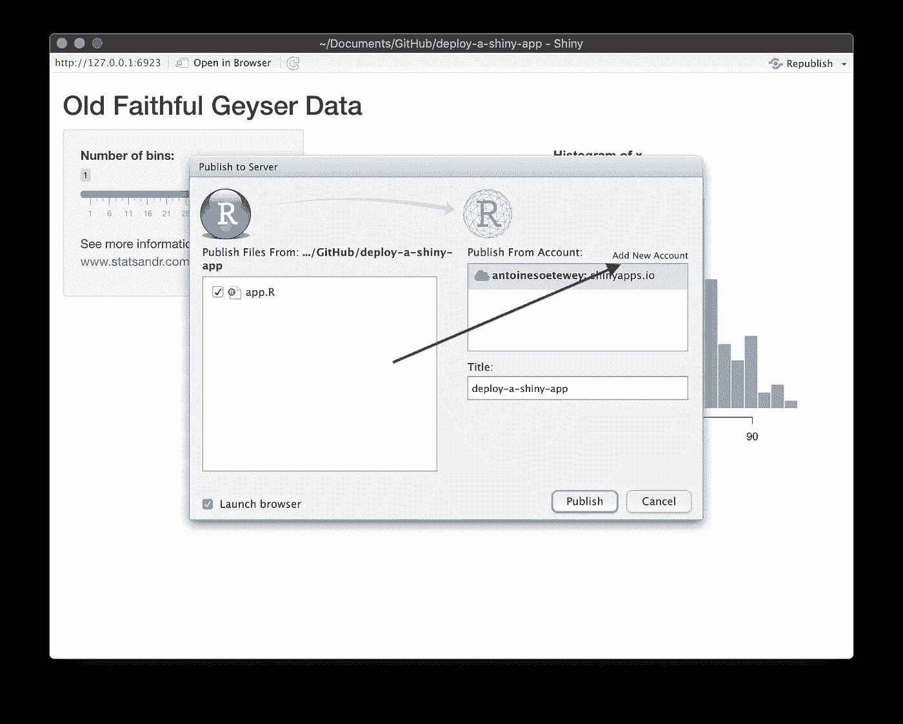

# 如何发布闪亮的应用程序:以 shinyapps.io 为例

> 原文：<https://towardsdatascience.com/how-to-publish-a-shiny-app-example-with-shinyapps-io-ec6c6604d8?source=collection_archive---------20----------------------->

## 查看如何使用 shinyapps.io 在线部署和发布闪亮应用的分步指南(带截图)

# 介绍

病毒导致许多人创建了交互式应用程序和仪表盘。一位读者最近问我如何发布她刚刚创建的[闪亮应用](https://www.statsandr.com/tags/shiny/)。类似于之前的一篇文章，我向[展示了如何在 GitHub](https://www.statsandr.com/blog/how-to-upload-r-code-on-github-example-with-an-r-script-on-mac-os/) 上上传 R 代码，我认为这对一些人来说是有用的，看看我是如何发布我闪亮的应用程序的，这样他们也可以这样做。

在完成在线部署闪亮应用程序所需的不同步骤之前，您可以在这里查看我的应用程序的最终结果。

*注 1:截图都是在 MacOS 上拍的，没有在 Windows 上测试过。请在评论中告诉我它在其他操作系统上是否相似。*

*注 2:有其他方法可以发布你的应用程序(比如用 Docker)，但下面显示的方法(在我看来)很简单，而且效果很好。*

# 先决条件

我个人使用 [shinyapps.io](https://www.shinyapps.io/) 平台来部署我的[闪亮应用](https://www.statsandr.com/tags/shiny/)。因此，为了遵循这个指南，你首先需要创建一个帐户(如果你还没有)。

他们提供免费计划，但你被限制在 5 个活动应用程序和每月 25 个活动小时的使用。

供你参考，如果你让你的应用程序面向广泛的受众，预计会很快超过每月活跃时间的上限。要增加每月限额(或发布 5 个以上的应用程序)，您需要将您的计划升级为付费计划。

# 逐步指南

下面是图片中要遵循的步骤。

第一步:打开 RStudio 并创建一个新的闪亮应用程序:

第二步:给它一个名字(没有空格)，选择保存它的位置，然后点击创建按钮:

第三步:以同样的方式，当你打开一个新的 [R Markdown](https://www.statsandr.com/blog/getting-started-in-r-markdown/) 文档时，一个基本的闪亮应用程序的代码就创建好了。单击运行应用程序按钮运行应用程序，查看结果:

步骤 4:基本应用程序打开，发布它:

第五步:如果这是你的第一个闪亮的应用程序，“从账户发布”框应该是空的。点击“添加新帐户”链接您刚刚创建的 shinyapps.io 帐户:

第六步:点击第一个备选项(ShinyApps.io):

第七步:点击你的 ShinyApps 账户链接:

第 8 步:单击仪表板按钮登录您的帐户:

第九步:点击你的名字，然后点击代币

步骤 10:如果这是你的第一个应用程序，应该还没有创建令牌。通过单击“添加令牌”按钮创建一个。然后点击显示按钮:

第 11 步:点击显示秘密按钮:

第 12 步:现在代码完成了(不再隐藏任何东西)。点击复制到剪贴板按钮:

步骤 13:复制代码并点击 OK 按钮:

步骤 14:返回 RStudio，将代码粘贴到控制台中并运行它:

您的计算机现在已被授权将应用程序部署到您的 shinyapps.io 帐户。

第 15 步:返回到可以发布应用程序的窗口，选择一个标题(不带空格)并点击发布按钮:

步骤 16:几秒钟后(取决于你的应用程序的重量)，闪亮的应用程序应该出现在你的互联网浏览器中:

第 17 步:你现在可以编辑应用程序(或者用你的另一个应用程序替换整个代码)，点击运行应用程序按钮再次运行应用程序。对于这个示例，我只是在侧面板中添加了一个链接以获取更多信息:

步骤 18:检查修改是否被考虑(链接如预期出现在侧面板中)并重新发布你的应用程序:

第 19 步:点击发布按钮:

第 20 步:你的应用程序是活的！您现在可以共享它，每个拥有该链接的人都可以使用它:

# 附加注释

# 您的应用程序的设置

如果您需要更改您的 Shiny 应用程序的设置，请转到您的 shinyapps.io 仪表板，然后单击您刚刚创建的应用程序来访问设置:

查看位于窗口顶部的选项卡中的不同设置，并查看 URL 字段旁边的应用程序链接:

# 发布数据集

通常情况下，你的闪亮应用程序使用一个默认情况下没有加载到 R 中的数据集(例如，它使用一个保存在本地计算机上的数据集)。

要使应用程序处理您的数据，您还需要在发布应用程序时发布数据(选中与您的数据对应的复选框):

将数据集与应用程序一起发布

如果您希望拥有更大的灵活性，在应用程序中使用外部数据集的另一种方法是在线托管它:

*   如果你有一个网站，你可以很容易地通过你的网站发布
*   如果你没有网站，你可以通过 GitHub 托管数据集(如果你没有账户，现在是创建一个的好时机！)

最后一步是通过新的 URL 导入数据(将数据导入到应用程序的代码中)。

感谢阅读。我希望这篇教程能帮助你发布你的第一个闪亮的应用。

和往常一样，如果您有与本文主题相关的问题或建议，请将其添加为评论，以便其他读者可以从讨论中受益。

# 相关文章

*   [如何在 GitHub 上上传 R 代码:MacOS 上的 R 脚本示例](https://www.statsandr.com/blog/how-to-upload-r-code-on-github-example-with-an-r-script-on-mac-os/)
*   [新型新冠肺炎冠状病毒前 50 名资源](https://www.statsandr.com/blog/top-r-resources-on-covid-19-coronavirus/)
*   [R 中的相关图:如何突出显示数据集中最相关的变量](https://www.statsandr.com/blog/correlogram-in-r-how-to-highlight-the-most-correlated-variables-in-a-dataset/)
*   一个闪亮的手工线性回归应用程序
*   [如何在 blogdown 中嵌入闪亮的 app？](https://www.statsandr.com/blog/how-to-embed-a-shiny-app-in-blogdown/)

*原载于 2020 年 5 月 29 日 https://statsandr.com***。**