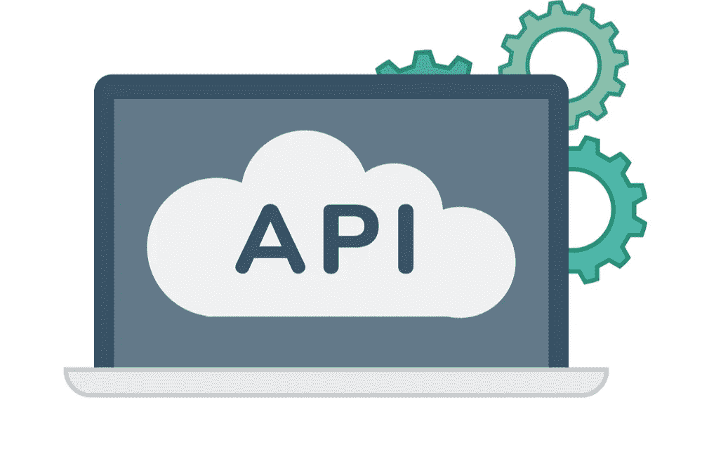
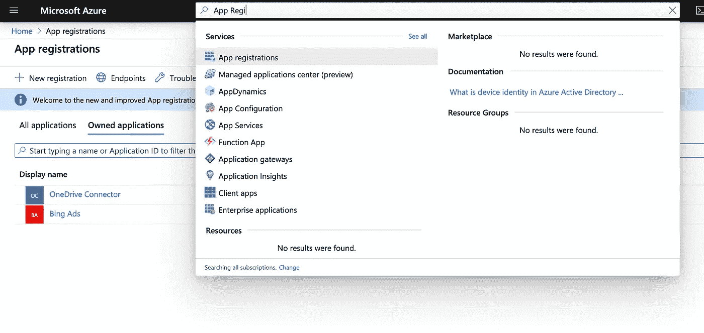
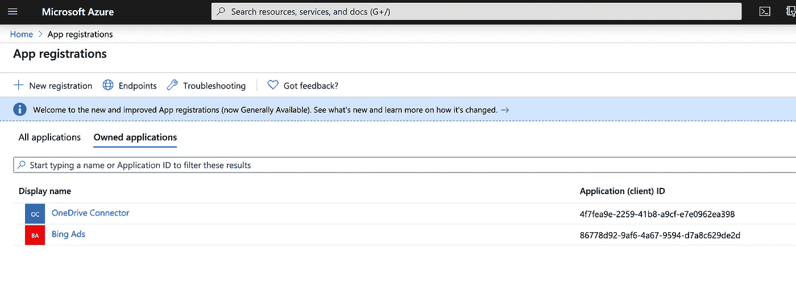
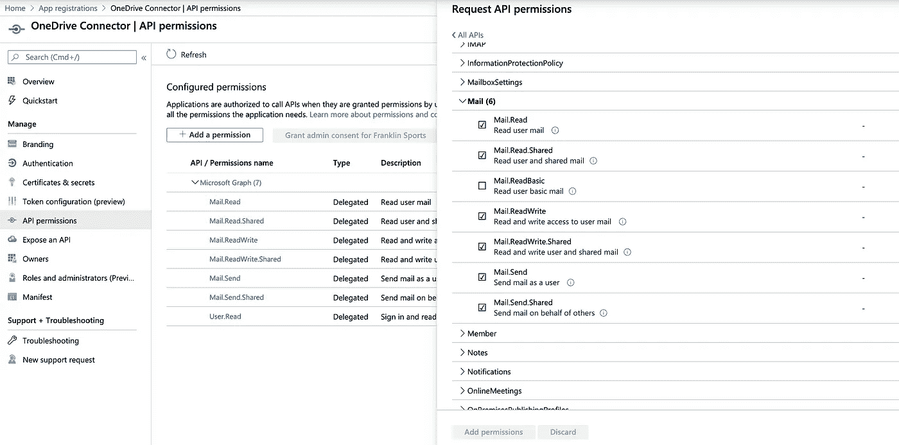
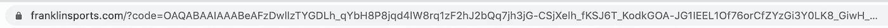
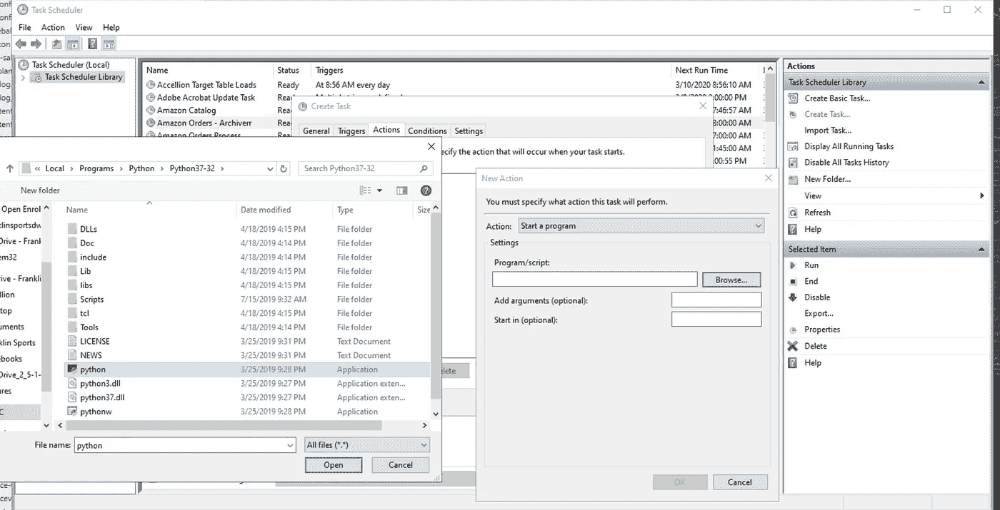

# 如何使用 Python 请求从 API 中提取数据

> 原文：<https://towardsdatascience.com/how-to-pull-data-from-an-api-using-python-requests-edcc8d6441b1?source=collection_archive---------0----------------------->

## 技术应用编程接口指南



从 API 中自动检索数据至关重要。

我被反复要求做的事情是从 API 中自动提取数据。尽管我拥有“数据科学家”的头衔，但我在一个小团队中，所以我不仅负责构建模型，还负责提取数据、清理数据，以及将数据推送到任何需要的地方。你们中的许多人可能都在同一条船上。

当我第一次开始学习如何发出 HTTP 请求、取回 JSON 字符串、解析它，然后将它推入数据库时，我很难找到清晰、简洁的文章来解释如何实际完成这项非常重要的任务。如果你曾经为了解决一个技术问题而陷入谷歌黑洞，你可能会发现非常技术化的人喜欢使用技术语言来解释如何执行给定的任务。问题是，如果你像我一样是自学的，你不仅要学习如何完成要求你做的任务，还要学习一门新的技术语言。这可能会令人非常沮丧。

如果你想避免学习技术术语，直接切入正题，那你来对地方了。在本文中，我将向您展示如何从 API 中提取数据，然后自动执行每 24 小时重新提取数据的任务。对于这个例子，我将利用 Microsoft Graph API 并演示如何从电子邮件中提取文本。我将避免使用预先准备好的 API 包，而是使用 Python Requests 包来处理 HTTP 请求——这样，您就可以将您在这里学到的知识应用到您需要使用的几乎任何其他 RESTful API 上。

如果你在本教程中遇到 API 请求的问题，这里有一个提示:使用[邮递员](https://www.postman.com/)。Postman 是一个非常棒的应用程序，它允许你通过一个干净的界面来设置和调用 API。它的美妙之处在于，一旦您让 API 调用工作，您就可以用 Python 导出代码，然后将其直接粘贴到您的脚本中。太神奇了。

*注意:本教程旨在提供一种简单易懂的访问 API 的方法，仅此而已。它可能无法满足您的具体情况或数据需求，但应该有望让您走上正确的道路。我发现下面的方法是最容易理解的快速获取数据的方法。如果你有让事情变得更简单的建议，请在评论中提出来。

## API 文档

没有办法浏览 API 文档。要使用 Outlook，您需要[到这里](https://docs.microsoft.com/en-us/graph/api/resources/mail-api-overview?view=graph-rest-1.0)。如果您成功地完成了本教程，并希望使用 API 做更多的事情，请使用该链接作为参考。

## **授权**

大多数 API，包括 Microsoft Graph，在给你一个允许你调用 API 的访问令牌之前都需要授权。对于不熟悉从 API 中提取数据的人来说，这通常是最困难的部分(对我来说就是这样)。

**注册你的应用**

按照这里的说明[注册你的应用(这些很简单，使用 Azure GUI ),你需要一个学校、工作单位或个人的微软账户来注册。如果你使用工作邮件，你需要 Azure 实例的管理员权限。如果你是为了工作而这样做，请联系你的 IT 部门，他们可能会为你注册该应用程序。选择“web”作为你的应用类型，并为你的重定向 URI 使用受信任的 URL(只有你有权访问底层 web 数据的 URL)。我使用了 franklinsports.com，因为只有我的团队可以访问那个网站的数据。如果您正在构建一个应用程序，您将重定向到您的应用程序，在那里您的应用程序可以获取代码并授权给用户。](https://docs.microsoft.com/en-us/graph/auth-register-app-v2)

**启用 Microsft 图形权限**

应用注册后，请转到应用注册门户:



点按显示您的应用名称的位置:



在接下来的页面中，单击“查看 API 权限”。

最后，选择 Microsoft Graph，然后选中“委托权限”消息下的所有复选框(注意，在本例中，我将只从单个登录用户处获取电子邮件，要获取某个组织的电子邮件数据，您需要应用程序权限，请遵循此处的流程)。



好了—您已经准备好开始进行 API 调用了。

**授权步骤 1:获取访问代码**

您将需要一个访问代码来获得访问令牌，这将允许您调用 MS Graph API。为此，请在您的浏览器中输入以下 URL，用您的应用程序页面上显示的信息交换相应的凭据。

放在 URL 中:

将代码片段输出的 URL 粘贴到您的浏览器中。点击回车键，你将被要求授权你的微软账户进行授权访问。使用您用来注册应用程序的 Microsoft 帐户。

如果授权不起作用，则您选择的重定向 URL 或应用程序注册有问题。我以前在这一部分遇到过麻烦——所以如果你第一次尝试没有成功，不要担心。如果授权成功，您将被重定向到您在应用程序注册中使用的 URL。追加到 URL 的参数将包含您将在下一步中使用的代码，它应该是这样的:



获取完整的代码，并将其保存在 python 脚本中。

授权步骤 2:使用您的访问代码获取一个刷新令牌。

在继续之前，确保您已经安装了最新版本的 [Python 请求](https://requests.readthedocs.io/en/master/)包。最简单的方法是使用 pip:

在这一步中，您将使用步骤 1 中生成的代码，并向 MS Graph OAuth 授权端点发送一个 **POST** 请求，以获取一个刷新令牌。(*注意:出于安全考虑，我建议将 client_secret 存储在不同于用于调用 API 的脚本中。您可以将这个秘密存储在一个变量中，然后导入它(或者使用 pickle，您将在下面看到)。

将代码片段中的######与您自己的应用程序信息和您在步骤 1 中收到的代码交换，然后运行它。(*注意:重定向 URI 必须是 url 编码的，这意味着它看起来像这样:“https % 3A % 2F % 2 ffranklinsports . com”)

您应该会收到类似如下的 JSON 响应:

{ ' access _ token ':' # # # # # # # # # # # # # # # # # #，' refresh _ token ':' # # # # # # # # # # # # # # # ' }

**授权步骤 3:使用您的刷新令牌获取访问令牌**

此时，您已经有了一个访问令牌，可以开始调用 API，但是，该访问令牌将在一段时间后过期。因此，我们希望设置我们的脚本，在每次运行它时获取一个新的访问令牌，这样我们的自动化就不会中断。我喜欢将步骤 2 中的新 refresh_token 存储在 pickle 对象中，然后在脚本运行时加载它以获得新的 access_token:

```
filename = ####path to the name of your pickle file#######
print(filename) 
filehandler = open(filename, ‘rb’) 
refresh_token = pickle.load(filehandler)url = “https://login.microsoftonline.com/common/oauth2/v2.0/token" payload = “””client_id%0A=##########& redirect_uri=##################& client_secret=##################& code={}& refresh_token={}& grant_type=refresh_token”””.format(code,refresh_token) 
headers = { ‘Content-Type’: “application/x-www-form-urlencoded”, ‘cache-control’: “no-cache” } response = requests.request(“POST”, url, data=payload, headers=headers)
r = response.json() 
access_token = r.get(‘access_token’) 
refresh_token = r.get(‘refresh_token’) with open(filename, ‘wb’) as f: 
      pickle.dump(refresh_token, f)
```

## 调用 API 并清理和解析 JSON

有了 access_token，就可以调用 API 并开始提取数据了。下面的代码片段将演示如何检索最近 5 封带有特定主题参数的电子邮件。将 access_token(下面加粗)放在头中，并在 get 请求中将其传递给电子邮件消息端点。

```
import json
import requestsurl = ‘[https://graph.microsoft.com/v1.0/me/messages
$search=](https://graph.microsoft.com/v1.0/me/messages?$search=)"subject:###SUBJECT YOU WANT TO SEARCH FOR###”’headers = {
 ‘Authorization’: ‘Bearer ‘ +**access_token**,
 ‘Content-Type’: ‘application/json; charset=utf-8’
 }r = requests.get(url, headers=headers)files = r.json()print(files)
```

上面的代码将返回一个包含您的数据的 json 输出。

如果你想要 5 封以上的邮件，你需要对结果进行分页。大多数 API 都有自己的方法来实现结果的最佳分页(在英语中，大多数 API 不会只通过一次 API 调用就提供您想要的所有数据，所以它们提供了进行多次调用的方法，允许您在结果中逐块移动，以获得您想要的全部或尽可能多的数据)。MS Graph 很好，因为它提供了获取下一页结果所需的确切端点，使分页变得容易。在下面的代码片段中，我演示了如何使用 while 循环对 api 进行连续调用，并将每封电子邮件的主题和文本添加到列表列表中。

```
emails = []
while True:
 try:
   url = files[‘[@odata](http://twitter.com/odata).nextLink’]
   for item in range (0,len(files[‘value’])):
     emails.append(files['value'][item]['Subject'],[files[‘value’]     [item][‘bodyPreview’])
   r = requests.get(url, headers=headers)
   print(r.text)
   files = r.json()
 except:
   break
```

## 把数据放在某个地方

最后，我将展示一个例子，展示如何将 JSON 数据放入 CSV 文本文件，然后可以用 excel 对其进行分析或将其放入数据库。这段代码将演示如何将我们的列表中的每一行写入一个 CSV 文件。

```
import csv write_file =‘###LOCATION WHERE YOU WANT TO PUT THE CSV FILE###’
 with open(write_file,’w’, newline = ‘’) as f:
   writer = csv.writer(f, lineterminator = ‘\n’)
   writer.writerows(emails)
```

## 使自动化

既然我们的剧本已经写好了。我们希望将其自动化，这样我们就可以在每天收到新消息时，在我们的参数范围内获取它们。

我用两种方法做到了这一点，然而，还有许多自动化的方法:

1.  **在 Ubuntu 服务器上使用 Crontab**

这很简单。如果你用的是 Ubuntu，在你的控制台上输入“crontab -e ”,它会在一个文本文件中打开你的 cronjobs。转到新的一行，键入:

```
0 1 * * * /full path to python environment/python /full path to file/example.py
```

假设 cron 设置正确，上面将脚本设置为每天在 1 UTC 自动运行(或者服务器所在的时区)。您可以通过更改代码中的 1 来更改时间。如果你想了解 cron 计时的复杂性，[这个网站](https://crontab.guru/#0_18_*_*_5)是一个不错的资源。

2.**使用 Windows 任务调度器**

这是在使用任务计划程序的 windows 中实现自动化的一种简单又好的方法。只需打开任务计划程序，然后单击右侧的“创建任务”。这个应用程序非常简单，允许你使用 GUI 设置时间表和你想运行的程序。

当您在“操作”中感到痛苦时，选择 Python 作为程序，然后在“添加参数”选项卡(旁边带有“(可选)”的选项卡)中，将路径放入您的。py 文件。



就是这样！

在本演练中，我向您展示了如何从 Microsoft Graph API 中提取电子邮件数据。这里演示的原则可以用于几乎任何 RESTful API，或者使用 Microsoft Graph 执行更复杂的任务(我已经使用 MS Graph API 将文件推入和推出我们公司的 sharepoint，将 sharepoint 文件夹中的数据推入我们的数据库，以及发送自动电子邮件和报告)。

有问题或意见吗？你可以给我发电子邮件，地址是 cwarren@stitcher.tech，或者在 Linkedin 上关注我，地址是[https://www.linkedin.com/in/cameronwarren/](https://www.linkedin.com/in/cameronwarren/)

我还提供数据服务，你可以在 http://stitcher.tech/了解更多。