# 如何量化数据质量？

> 原文：<https://towardsdatascience.com/how-to-quantify-data-quality-743721bdba03?source=collection_archive---------9----------------------->

## [入门](https://towardsdatascience.com/tagged/getting-started)

## 从单独的数据质量指标到统一的分数。

在本文中，我将解释计算统一数据质量分数背后的概念，因为它在[*IBM Cloud Pak for Data*](https://www.ibm.com/uk-en/products/cloud-pak-for-data)和[*IBM Information Server*](https://www.ibm.com/products/infosphere-information-server-enterprise)/[*Information Analyzer*](https://www.ibm.com/products/infosphere-information-analyzer)中用于量化结构化数据的质量。

图卡皮克关于 https://pixabay.com/users/tookapic-1386459/的图片

# 需要一个简单的数据质量分数

衡量数据质量并不是一个新领域。 *IBM Information Analyzer* 和其他数据分析工具已经上市十多年了，帮助数据工程师更好地了解他们的数据中有什么，以及他们可能需要修复什么。
在数据概要分析的早期，尽管这些工具可以提供丰富的功能来查看数据集的质量，但回答这些简单的问题并不容易:

> *这个数据集的整体质量有多好？*
> 
> 这两个数据集哪个数据质量更好？
> 
> 与上月相比，该数据集的数据质量如何？

即使像早期一样使用单一的数据分析工具，如 IBM Information Analyzer，您也可以通过使用不同的特性从完全不同的角度来评估数据集的质量:

*   您可以使用数据探查器收集的统计信息来确定在数据集中检测到的哪些值或格式应该在每一列中被视为有效或无效。
*   您可以将每一列的域有效性定义为有效值的最小/最大范围，或者将它指向一个引用值列表。
*   您可以为每一列检测或分配数据类，并搜索与预期数据类不匹配的值。
*   您可以查看缺失的值。
*   您可以识别主键候选项并搜索意外的重复值。
*   您可以识别表之间的主键-外键(PK-FK)关系，并在外键列中搜索在该关系的主键中找不到的孤立值。
*   您可以定义数据规则来设置对数据的任何非平凡的额外期望。

此列表仅涵盖了*信息分析器*的数据分析和质量特性可以告诉您的数据。 *IBM Information Server* 套件的其他组件，如 *QualityStage* 可以为您提供其他数据质量信息，如重复的行，或缺乏适当标准化的值等

尽管这些特性本身都很强大，并且可以为专家提供有趣的单个指标，但是它们的结果并不适合回答本文引言中列出的简单问题。其主要原因是人类不擅长相互比较多维度量，特别是如果那些结果不包括完全相同的度量，或者是从具有不同数量的行、列的不同数据集计算的，或者具有它们应该匹配的不同约束/规则。

随着数据湖、数据科学、数据治理和所有这些围绕数据的新型活动的出现，数据目录变得越来越重要，数据质量变得不仅对专家用户重要，而且需要让非专家也能理解。

在之前的[文章](https://medium.com/swlh/unlock-your-data-with-ibm-watson-knowledge-catalog-6a6305d2525a)中，我展示了如何自动获取、分析、编目、管理大量数据集，并提供给数据科学家或数据分析师等消费者。这些用户需要在自助服务模式下找到具有正确质量的正确数据集。在这种情况下，很明显需要一个更简单的指标来更好地了解数据集的质量水平，而不必查看细节，即使这些细节在第二次查看时仍然可用。

这就是为什么数据质量的概念在 *IBM Information Server* 和现在的*IBM Cloud Pak for Data*/*Watson 知识目录*中引入的原因。

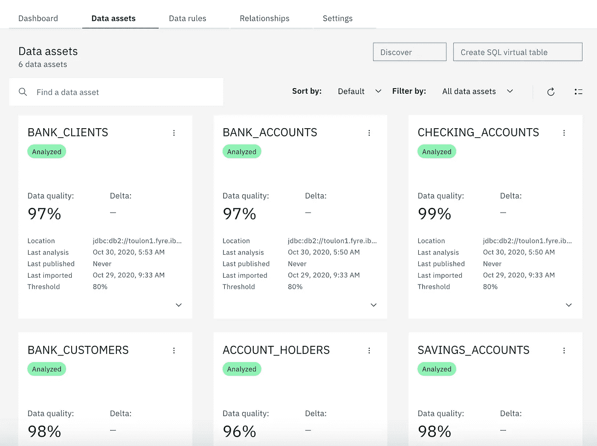

数据质量分数显示在数据 UI 的云包中

# 但是如何设计一个好的数据质量评分呢？

考虑到数据质量可以从非常不同的角度来看，并且可以用非常不同的度量标准来衡量，例如我前面列出的几个度量标准，计算质量分数的公式不一定是显而易见的。为了更好地理解它在 IBM 产品中是如何计算的，让我们先来看看我们对这样一个分数的要求:

1.  数据质量分数应该**简单易懂**:当查看目录中的大量数据集时，应该可以快速识别高质量或低质量的数据集，而不必查看细节。
2.  数据质量分数应该**不依赖于数据集上设置的行数、列数或约束条件**:例如，如果通过分析数据集的所有行来计算，就像在较小的样本上计算一样，则大型数据集的数据质量分数应该或多或少是相同的——假设采样足够好，足以具有统计代表性。
3.  数据质量分数应该与其他数据质量分数具有**可比性**，即使每个分数使用的指标不同和/或比较的数据集具有不同的行数和列数——请参见前面的要求。
4.  数据质量得分应该是**标准化的**:它应该提供一个清晰的最低和最高可能得分的范围，以便用户可以看到数据集的数据质量离理想值有多远。

为了定义一个公式，将各种数据质量函数计算出的不同指标转换为符合这些要求的分数，我们首先需要将我们所理解的数据质量(一般而言)和数据质量分数(具体而言)的概念形式化。

数据质量有许多定义。你可以在维基百科上看到其中的一些。但是一个简单的定义可以是:

> 衡量数据集的数据质量就是衡量数据集与您对数据的期望的匹配程度。

这意味着数据质量分数只能取决于您对数据的期望，而不是一些原始的调查结果。

这听起来可能是显而易见的，但这意味着，如果我们在一列中发现大量缺失值，但我们确实期望该列中有缺失值，或者我们不关心那里的缺失值，那么数据集的数据质量分数不应因发现的缺失值而降低。

这也意味着，如果我们对数据没有具体的期望，那么数据质量分数应该是最大的，不管数据中有什么。

这些简单明了的事实对于建立乐谱的架构非常重要。

# 约束的概念和数据质量问题

让我们定义几个在数据质量分数计算中起重要作用的概念:

我们对数据的期望就是我们所说的**约束**。约束可以用非常不同的形式表示:

*   它可以是在列上设置的简单标志，以指示该列中的值不应该为空，或者应该是不同的，或者不应该是有符号的。
*   它可以是列的域有效性的定义，设置为最终的最小或最大允许值，或者是指向定义列的可接受域的参考值列表的指针
*   它可以是分配给列的数据类，不仅描述列的内容，还可以用于识别不符合列的预期域的值。
*   它可以是两个数据集之间的标识关系，设置多个列之间的相关性或函数依赖关系。
*   它可以是一个数据规则，表达一个非平凡类型的约束，甚至可能涉及多个表。

只要数据不满足其中一个约束条件，我们就会遇到数据质量问题。

一个**数据质量问题**是一个特定的**数据质量问题类型**的报告，或者是一个数据集的一个单元格，或者一行，或者一列或者一组列，或者是整个数据集。数据质量问题报告的数据质量问题类型取决于数据不满足的约束类型。

**数据质量问题**可以在列或数据集上以一定的频率检测到。**相对频率**，计算为有质量问题的列/数据集的所有值的百分比，我们称之为问题的**普遍性**。

例如，如果数据集有 100 行，并且在标记为强制或不可空的列中检测到 15 个缺失值，则在此列上报告**问题类型** *【缺失值】*的**数据质量问题**，其**发生率**为 *15%* 。

# 隐式或显式约束以及数据质量问题的置信度概念

除了**流行度**之外，**数据质量问题**可能与**置信度**相关联。**置信度**表示报告的问题是真实问题的概率。

为了更好地理解这一概念，您需要理解，并非所有对数据设置的约束都是由人指定或确认的明确约束——我们将这种指定或确认的约束称为**显式约束**。

如果数据质量仅基于**显式约束**来衡量，那么我们就不需要置信度的概念，因为所有由人指定的约束，如果不被某些数据所尊重，就会导致 100%置信度的数据质量问题——我们肯定知道这个问题是一个真实的问题，因为有人已经指定任何不满足这个约束的东西都应该被认为是数据质量问题。

但是，如果我们只查看**显式约束**，那么所有数据集都将以 100%的分数开始，直到有人花时间查看它并指定约束。这将导致大量数据集出现高质量的假象，或者导致需要管理员仔细检查每个摄取的数据集的过程，这对于大规模导入来说不太适合。

因此，在数据质量分析期间，系统可能会根据数据中看到的内容，尝试猜测一些约束条件。例如，如果一列的大部分数据不为空，或者它们使用相同的格式或者具有任何类型的可识别模式——即使一些值不遵循这些模式——那么系统可以假设存在**隐含约束**,并且不满足该约束的值可能是数据质量问题。

由于一个**隐含约束**是由系统从数据中看到的推断出来的，它与一个**置信度**的概念相关联，确定系统有多确定这应该是一个真实约束。

例如，如果一列中 95%的值是 5 位数，但是 5%的值具有完全不同的格式，则系统可以——根据设置——假设在该列上有一个**隐式约束**,即值应该具有 5 位数，置信度**为 95%。如果用户检查这个隐式约束并确认它，那么它将成为一个**显式约束**，其**置信度**为 100%。**

检测到的质量问题的普遍性和可信度将用于计算实际质量分数。

# 将它们放在一起形成一个统一的质量分数

既然我们已经介绍了在数据质量分数中起作用的所有重要概念，让我们看一个简单的例子，看看如何在 *IBM Cloud Pak for Data* 或 *Information Analyze* r:

让我们假设一个简单的数据集，有 3 列 6 行，以及以下确定的数据质量问题:

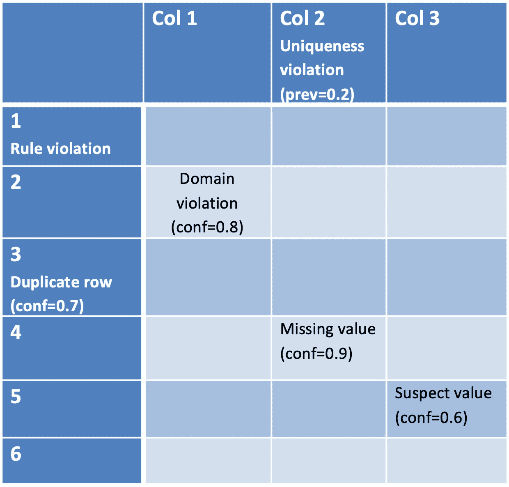

已识别的数据质量问题及其可信度

*   第 1 行违反了数据规则。由于数据规则是由用户指定的，所以它是一个**显式约束**，问题的**置信度**为 **100%** 。
*   **行#3** 是一个重复行，但是没有明确的约束表明不允许重复行。但是，根据数据，分析确定有 70%的可能性该数据集不应该出现重复行。= >数据集上有一个**隐含约束**，用 **70%的置信度**表示不应该有任何重复记录。
*   **第 2 行第 1 列**的单元格不满足**隐含约束，其置信度为 80%** 定义了有效域应该是什么。例如，如果分析确定该列的推断数据类的置信度为 80%，并且该单元格中的值与该数据类不匹配，则可能会出现这种情况。
*   **列 Col 2** 已经设置了一个**显式约束**，表示该列中的所有值都应该不同，但是分析发现其中有 20%的重复值。这导致了一个数据质量问题，其**置信度为 100%** 且**发生率为 20%** 。
*   除此之外，行#4 中第 2 列的**值缺失，并且存在置信度为 90%** 的**隐含约束，即该列中不应出现缺失值。**
*   最后，第 5 行/第 3 列的**单元格似乎是该列的异常值，其**置信度为 60%** 。离群值总是隐含的约束，因为没有硬性的规则来定义一个值何时是离群值。**

**单个细胞的数据质量得分**

请注意，单个单元格、列或行可能有一个以上的数据质量问题，如果可能，不应重复计算该问题:如果单个值违反了其预期的数据类和预期的格式，则不应加倍惩罚该列或数据集的数据质量分数，因为无论该值有多少个问题，都只有一个值是无效的。

基于此，数据集的单个单元格的得分可以计算为该值完全没有问题的概率。这可以计算为 100%减去在单元上检测到的每个问题的置信度的乘积。举例来说:如果我们有 90%的把握某个单元格存在问题，那么这些值没有问题的概率是 100–90 = 10%。如果问题的置信度为 100%(对于显式约束)，则该值没有问题的概率为 100–100 = 0%

对于在数据集的单个单元格上报告的数据质量问题，计算单元格得分的公式如下。

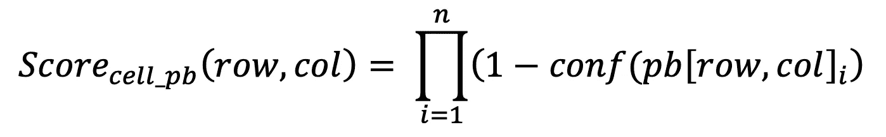

单个单元的质量分数，仅考虑单元级别报告的问题

如果一个单元有两个问题，一个置信度为 80%，另一个置信度为 60%，那么第一个问题不真实的概率是 100%-80%=20%，第二个问题不真实的概率是 100%-60%=40%，根据概率定律，这些问题都不真实且该单元没有数据质量问题的概率仅为 20%乘以 40% = 8%。

请记住，我在本文开头提到过，数据质量问题也可以针对完整的行、完整的列或完整的数据集进行报告。我们需要分配这些问题对细胞得分的影响。

对于针对完整行报告的问题，这很容易，因为如果该行无效，我们可以假设该行的所有值都无效。这些问题对细胞评分的影响可以计算如下:

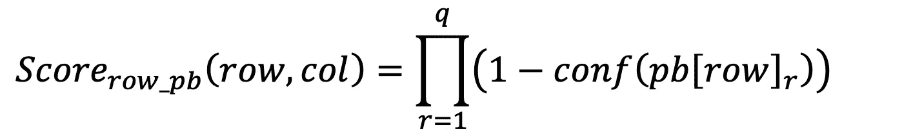

仅考虑行级别报告的问题的单元的质量分数

*conf(pb[row])* 在这里表示为被测量的单元的行报告的一个行级数据质量问题的置信度。

但是，整个列报告的问题需要通过使用问题的普遍性在该列的所有值中平均分布。普遍性告诉我们， *n%* 的价值观受到了问题的影响，尽管我们并不确切知道哪些价值观有问题，哪些没有。因此，每个值的得分将降低一个系数，该系数等于流行率乘以问题真实存在的置信度，如下式所示:

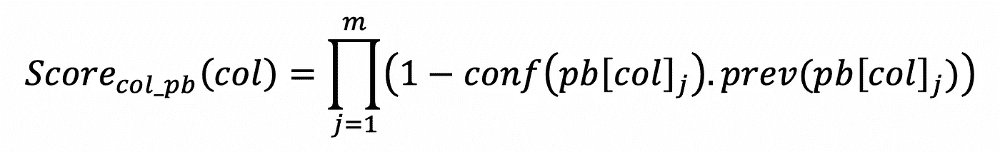

仅考虑在列级别报告的问题的质量分数

*conf(pb[col])* 表示针对被测量单元的列报告的一个列级数据质量问题的置信度，而 *prev(pb[col])* 表示其出现率——具有该问题的列中的值的百分比。

针对整个数据集报告的数据质量问题的影响以相同的方式分布在所有像元中:

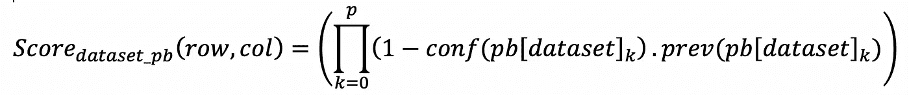

仅考虑在数据集级别报告的问题的质量分数

考虑到单元本身、其列、其行或数据集上报告的所有问题，单个单元的最终数据质量得分可计算如下:

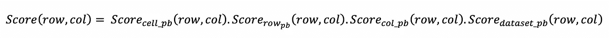

考虑所有问题的单元的质量分数

## 列的数据质量分数

前面的公式为数据集的每个单个像元计算 0%到 100%之间的标准化数据质量分数奠定了基础。基于这一点，计算任何列的数据质量分数就像计算该列的每个值的数据质量分数的平均值一样简单。

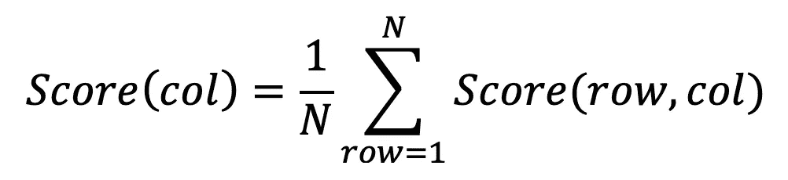

列的质量分数

## 行的数据质量分数

同样，可以通过对该行的每个单元格计算的分数进行平均来计算数据集的任何行的分数。

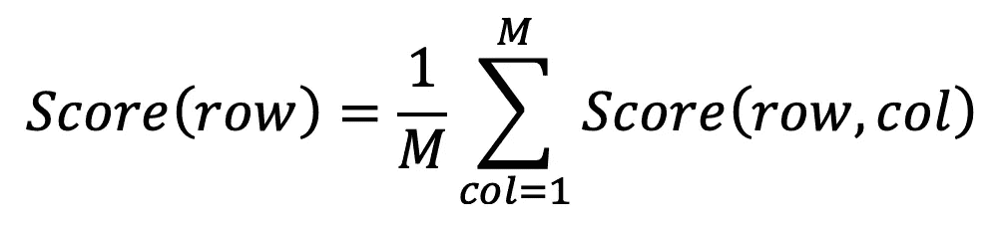

行的质量分数

## 数据集的数据质量分数

计算数据集的数据质量分数就像计算每列分数的平均值或每行分数的平均值一样简单。

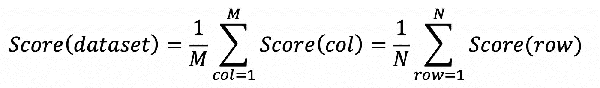

数据集的质量分数

请注意，这也等同于计算所有单元格得分的平均值。由于公式的对称性，所有这些计算将返回相同的结果，这使得它很优雅。

## 示例:

让我们将这些公式应用到之前的具体例子中:

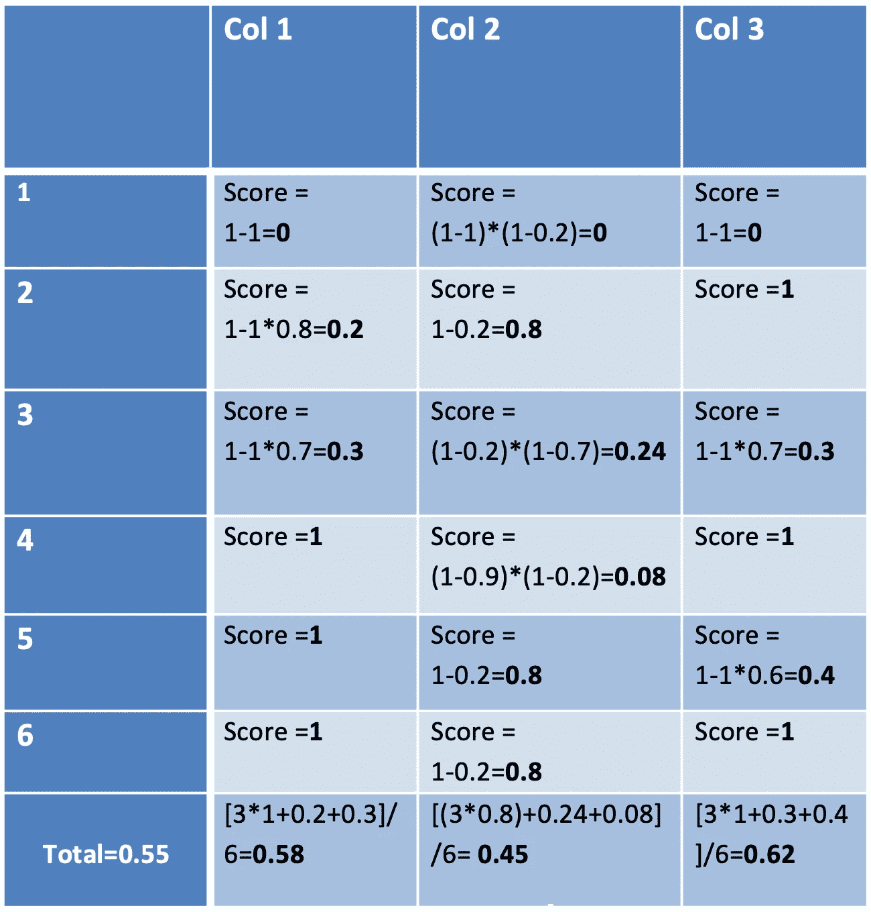

计算的数据质量分数

使用前面的公式，您可以计算每个单元格、每列或每行的质量分数，对单元格分数、列分数或行分数进行平均，您将返回代表数据集数据质量分数的相同结果(55%)。

然后，报告可以深入查看任何列或行，并显示有关其数据质量分数的更多详细信息，哪些行或列对数据集分数的影响最大，等等。这种深入查看功能对于数据清理操作非常有用。

# 摘要

我们已经看到了为每个数据集建立统一的标准化数据质量分数的重要性，这样非数据质量专家也可以使用它。我们已经看到，这样的数据质量分数应该满足什么要求，即使在具有不同结构或约束的数据集需要相互比较的重要情况下也是有用的。我们终于看到了这个数据质量分数是如何在 IBM 产品组合中实现的。