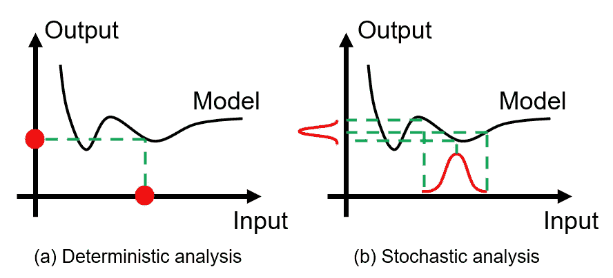
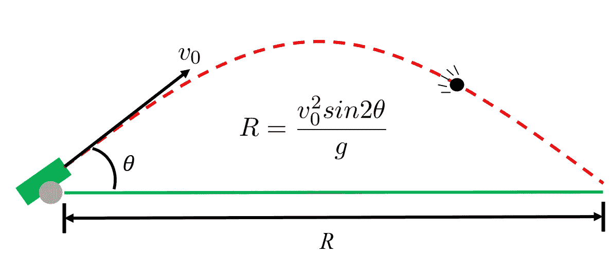
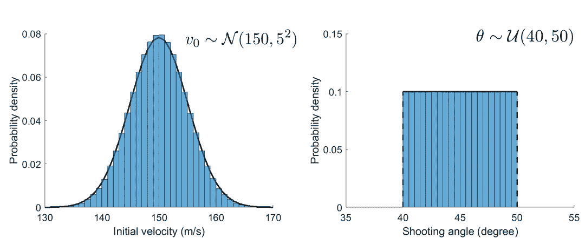
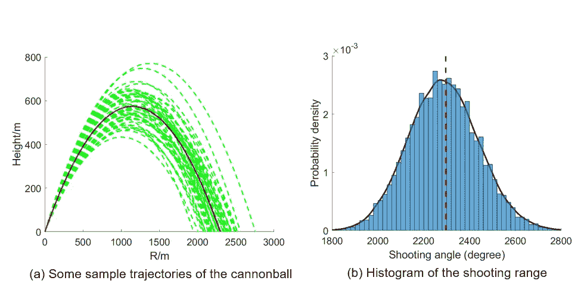
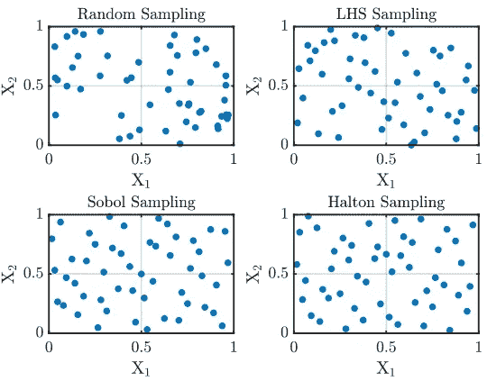

# 利用蒙特卡罗量化模型预测误差

> 原文：<https://towardsdatascience.com/how-to-quantify-the-prediction-error-made-by-my-model-db4705910173?source=collection_archive---------19----------------------->

## 蒙特卡洛模拟证明

> 预测是非常困难的，尤其是关于未来的时候。—尼尔斯·玻尔

作为一名在工程领域工作的数据科学家，我经常与物理学方面的其他研究工程师合作，任务是开发定量模型来预测感兴趣的物理现象。然而，获得可靠的预测从来都不容易，主要是因为我很少能确定模型超参数的正确值。那些传达特定物理解释的超参数通常通过噪声实验来校准。因此，由于校准过程中固有的随机性，无法确定它们的精确值。简单来说，那些超参数是不确定的。

我通常有两个选择:一，我可以只选择超参数的名义值(或最可能值)并基于它们进行预测，希望获得的结果是准确的或至少接近事实；第二，我可以接受这些超参数不确定的事实，并使用适当的*不确定性传播*技术将不确定性从模型超参数传播到模型的预测误差/不确定性。

在实践中，第二种选择通常是首选。在这种情况下，预测输出将不仅仅是一个值。相反，我们将得到它的完整的*概率分布*。这是有利的，因为该选项的结果提供了更多的信息，因为它为我们提供了与我们的预测相关联的置信度，从而实现了我们量化预测误差的目标。

图 1 虽然选项(a)仅选取单个输入值，但选项(b)承认输入是不确定的，并通过模型将这些不确定性传播到输出。(图片由作者提供)

在本文中，我们将介绍一种有用的技术来实现预测误差的不确定性传播和量化。文章的其余部分结构如下:

*   动机:什么是前向不确定性传播？
*   解决方案:基于抽样的蒙特卡罗方法
*   插图:一个简单的案例研究
*   摘要:挑战和应对措施

所以让我们开始吧！

# 1.正向不确定性传播

如前所述，建模者经常需要解决不确定的超参数问题，这很容易损害模型预测的可靠性。在此背景下，提出了*前向不确定性传播*策略，以充分考虑输入参数的不确定性，量化诱导的预测不确定性。

形式上，前向不确定性量化的**主要目标**是评估在各种输入不确定性的影响下输出的变化。

*Forward* 这里指的是不确定性信息从输入，通过正在研究的物理模型，流向输出。根据分析师的目标，向前不确定性传播的重点可能是简单地估计基本统计数据(例如，平均值、方差等)。)或输出值超过某个阈值的概率(即风险分析)，或输出的整个概率密度函数(PDF)。

前向不确定性传播属于计算科学与工程中**不确定性管理**的一个更大的研究领域，其中传播构成了朝向管理目标的一个主要步骤。读者可以在我之前发表的博客中找到不确定性管理的更多细节:[计算科学与工程中的不确定性管理。](/managing-uncertainty-in-computational-science-and-engineering-5e532085512b)

在实践中，设计了几种方法来传递期望的前向不确定性传播。这些方法包括概率分析法、摄动法、谱方法等。通常，这些方法涉及大量的数学推导，并且它们的实现远非简单明了。除此之外，它们可能只对特定问题有效，并且可能只在超参数的不确定性水平较小时才是准确的。因此，这些方法还没有在工业实践中广泛采用，本文也不讨论。相反，我们将关注一个更受欢迎的方法:蒙特卡洛模拟。

# 2.蒙特 卡罗模拟

直观易懂，易于实现，无需对模型进行额外的修改(或者如果您喜欢技术术语的话，称为*非侵入式*)，高度并行化，对模型及其相关的超参数做最少的假设。听起来像是每个从业者都会喜欢的方法，对吗？事实上，正是这些特性使得蒙特卡罗模拟成为实现不确定性传播的最流行的方法。

从技术上讲，蒙特卡罗模拟包括从输入概率分布中抽取随机样本，并使用自己的模型计算每个样本的相应响应。然后可以基于获得的结果集合来推断输出的统计。

蒙特卡洛模拟的工作流程可总结如下:

1.  从模型超参数的分布中随机抽取*个样本*。这里，每个样本对应于模型超参数的特定组合。
2.  对于模型超参数的每个组合，将它们插入到模型中，并使用这个新配置的模型进行预测。在这一步的最后，我们将获得一组预测。
3.  基于这种预测的集合，我们可以很容易地估计各种感兴趣的统计数据，从简单的平均值和方差到完整的概率密度函数。

您可能已经注意到，要开始蒙特卡罗模拟，我们需要知道不确定模型超参数的概率分布。这一点很重要，因为如何对输入进行统计建模将直接影响输出的不确定性。在实践中，贝叶斯统计通常用于从现有数据(例如，实验的和计算的)中导出目标概率分布。在其他情况下，这些概率分布可以由领域专家根据他们的经验和判断简单地分配。在这种情况下，认知的不确定性可能被引入不确定超参数的统计建模中。

# 3.案例研究:大炮射击

现在，让我们看看蒙特卡洛模拟在实践中是如何使用的。这里我们考虑一个抛体运动问题，我们感兴趣的是计算大炮的射程。在现实生活中，这种分析可以用来推导成功摧毁敌方目标的概率。

我们的物理模型很简单，其中射击距离 *R* 由初速度 *v* ₀、射击角度 *θ* 以及重力加速度 *g* 、决定，如图 2 所示(如果你对如何推导这个方程感兴趣，这里是[链接](https://sciencenotes.org/projectile-motion-example-problem-physics-homework-help/))。这是一个简单的模型，因为没有考虑空气阻力的影响。然而，对于我们的演示目的来说，这已经足够好了。

图 2 火炮射击案例研究示意图。(图片由作者提供)

现在，假设我们不太确定 *v* ₀和 *θ* 的值，但我们知道 *g* =9.8m/s。因此，在我们当前的案例研究中， *v* ₀和 *θ* 被视为不确定模型超参数。为了描述它们的不确定性，我们为 *v* ₀选择了一个[正态分布](https://en.wikipedia.org/wiki/Normal_distribution)，为 *θ* 选择了一个[均匀分布](https://en.wikipedia.org/wiki/Continuous_uniform_distribution):

图 3 我们给 *v* ₀分配一个正态分布，给 *θ分配一个均匀分布。(*图片作者 *)*

对于初速度 *v* ₀，其平均值为 150m/s，标准偏差值为 5m/s，对于射击角度 *θ* ，其不确定度范围从 40ᵒ到 50ᵒ.由于模型超参数( *v* ₀和 *θ* )中嵌入的不确定性，我们对射程 *R* 的预测也将是不确定的。现在我们的目标是准确量化我们的 *R* 预测的不确定性，并推导出它的全概率分布。

是时候应用蒙特卡罗程序了。按照上一节概述的步骤，我们首先从各自的分布中抽取 10000 个随机样本 *v* ₀和 *θ* (图 3)。为此，可以使用 Numpy 的随机数生成器。随后，对于 *v* ₀和 *θ* 的每个组合，我们计算相应的 *R* 值。

图 4(a)描绘了基于 *v* ₀和 *θ* 的一些选定样本的几个计算轨迹。我们可以看到，当初始拍摄条件(即 *v* ₀和 *θ* )变化时，这些轨迹有很大不同。这表明 *v* ₀和 *θ* 的不确定性的影响是不可忽略的。

图 4 我们的火炮射击案例的蒙特卡罗结果。(a)中的红线代表使用 *v* ₀和 *θ的标称值计算的火炮弹道。其计算的 R 值在(b)中用红色虚线表示。(*图片作者 *)*

*R* 对应的直方图如图 4(a)所示。在这里，我们可以看到射击场 *R* 的分布呈钟形，中心在 2270 米左右。另一方面，红色虚线的 *R* 值为 2296 米，是利用 *v* ₀和 *θ* 的标称值，即 150m/s 和 45ᵒ.计算出来的请注意，这两个 *R* 值并不相同。当基础模型是非线性的时，这是很常见的(就像我们当前的情况)。这一观察还告诉我们，简单地插入输入的最可能值一般不会产生输出的最可能值。这表明执行严格的不确定性传播分析的重要性。

# 4.挑战和解决方案

正如每个硬币都有两面一样，蒙特卡洛方法也有其自身的缺点。在本节中，我们将讨论在实践中实施蒙特卡罗技术时的主要挑战和可能的补救措施。

对蒙特卡罗方法的主要批评在于它的收敛速度慢。这意味着我们需要大量的样本(∼ o(10⁴)来确保蒙特卡罗结果的可靠性。因此，我们需要重复计算每个样本的模型预测，从而潜在地导致令人望而却步的计算成本。在下文中，我们介绍两种流行的方法来解决这个收敛问题。

## 4.1 智能采样方案

当使用蒙特卡罗方法时，我们可以做的第一件事是改进抽样方案。简单的蒙特卡罗方法利用随机抽样来完成这项工作。该采样方案不是特别好，因为它在参数空间中产生了明显的“簇”和“洞”(我们将在后面说明这一点)。因此，我们需要大量样本来覆盖整个参数空间。

相反，研究人员提出了更先进的采样方案，具有更好的“空间填充”属性，这意味着这些方案可以在参数空间中更均匀地生成样本。这一类的例子有[拉丁超立方体采样](https://en.wikipedia.org/wiki/Latin_hypercube_sampling)，还有 Sobol 序列和 Halton 序列，都是[低差异序列](https://en.wikipedia.org/wiki/Low-discrepancy_sequence)。

图 5 比较了应用于 2D 参数空间的各种采样方案，样本数量相同。这里我们可以看到，随机采样方案往往会形成团块并留下空隙，而其他高级采样方案能够生成更多的“空间填充”样本。

图 5 在 2D 参数空间中由各种采样方案产生的样本。(图片由作者提供)

## 4.2 代理建模技术

另一种避免高计算成本问题的方法是采用代理建模技术。这背后的核心思想是训练廉价的统计模型来近似(或“替代”)原始物理模型，例如图 2 中的抛射体运动模型。之后，蒙特卡罗方法可以直接应用于训练的统计模型。由于统计模型的一次评估涉及可忽略不计的计算成本，蒙特卡罗程序的总费用变得可以承受。

代理建模的核心是监督机器学习，因为目标是基于输入数据和相应的标记输出数据来训练代理模型。许多机器学习技术，如支持向量机、高斯过程、神经网络等。已经被用于加速蒙特卡罗模拟。随着越来越多强大的机器学习技术不断被开发出来，我们可以期待蒙特卡洛模拟的准确性和效率将会进一步提高。

# 5.关键要点

*   前向不确定性传播对于估计由不确定模型超参数引起的模型预测误差/不确定性是至关重要的。
*   蒙特卡罗模拟是实现不确定性传播的最流行的方法之一。
*   蒙特卡洛模拟在计算上可能是昂贵的，因为可能需要许多样本来确保准确性。
*   更智能的采样方案和代理建模技术有助于减轻与蒙特卡罗模拟相关的高计算成本

# 延伸阅读:

[1]阿特·b·欧文，*蒙特卡洛理论、方法和实例*，2013 年

# 关于作者

> *我是一名博士研究员，致力于航空航天应用的不确定性量化和可靠性分析。统计学和数据科学是我日常工作的核心。我喜欢分享我在迷人的统计世界中学到的东西。查看我以前的帖子以了解更多信息，并在* [*中*](https://shuaiguo.medium.com/) *和*[*Linkedin*](https://www.linkedin.com/in/shuaiguo16/)*上与我联系。*