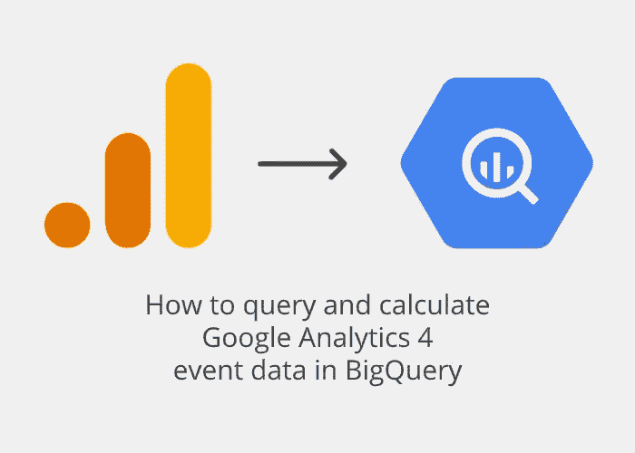
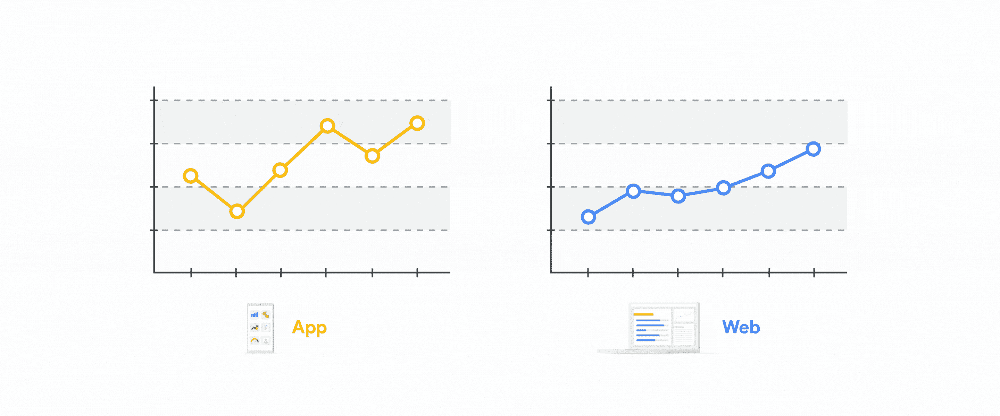
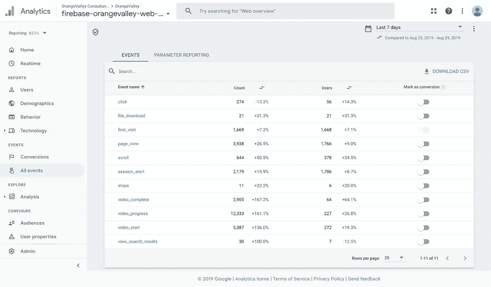
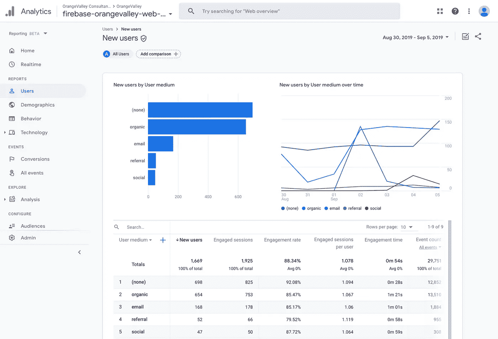
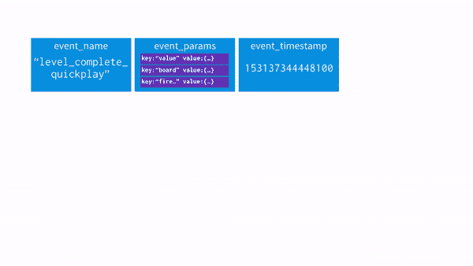

# 如何在 BigQuery 中查询和计算 GA4 事件数据

> 原文：<https://towardsdatascience.com/how-to-query-and-calculate-ga-app-web-event-data-in-bigquery-a77931176d3?source=collection_archive---------5----------------------->

## Google Analytics 4 基于事件的报告示例(之前为 App + Web)

应用程序和网络分析的未来就在这里:谷歌在谷歌分析中宣布了一种[新的衡量方式](https://www.blog.google/products/marketingplatform/analytics/new-way-unify-app-and-website-measurement-google-analytics/)。虽然仍处于测试阶段，但这是网络和应用分析的一次小革命。

最重要的是:所有(甚至非 360)谷歌分析账户都有一个原始数据 BigQuery 导出。让我们开始吧！

*注:你喜欢这篇文章吗？那么你也会喜欢我的新网站*[*GA4BigQuery.com*](https://www.ga4bigquery.com/)*:一个关于如何在 BigQuery &摇滚你的数字营销分析中查询谷歌分析数据的数字指南🤘*

您可能也会对我与 Mari 和 Simo Ahava 共同设计的[数字课程](https://www.teamsimmer.com/checkout/ga4-google-bigquery/bq-course-page/)感兴趣，该课程面向希望深入查询世界的营销专业人士，以及需要掌握 GA4 特定知识的数据专业人士:

[](https://www.teamsimmer.com/checkout/ga4-google-bigquery/bq-course-page/) [## 在 Google BigQuery 中查询 GA4 数据

### 关于如何使用 Google BigQuery 访问 Google Analytics 4 生成的原始数据的在线课程。一门必学的课程…

www.teamsimmer.com](https://www.teamsimmer.com/checkout/ga4-google-bigquery/bq-course-page/) 

图片由[柏柏尔人 Bijlsma](https://medium.com/u/7bf0b2ba1c23?source=post_page-----a77931176d3--------------------------------)

在本文中，我将只关注 web 数据。我将向您展示如何计算新的 GA4 参与度指标，以及如何复制在 GA4 用户界面中再也找不到的“经典”Google Analytics 维度和指标。但是要小心…

> 这不是万能分析。尝试将新的测量模型视为超越 Universal Analytics 所能做到的机会，而不仅仅是填充 GA 古老数据模型的另一种方式。([来源](https://www.simoahava.com/analytics/getting-started-with-google-analytics-app-web/))



App 和 web 统一([来源](https://www.blog.google/products/marketingplatform/analytics/new-way-unify-app-and-website-measurement-google-analytics/))

如果你是 BigQuery 的新手，我推荐你阅读我之前关于如何在 BigQuery 中查询 Google Analytics(通用分析)数据的文章的第一部分。

# 目录

–[这是怎么回事？](#bee4)
–[文档](#1b2d)
–[新参与度指标](#8f8e)
–[Google Analytics 4 big query 导出模式](#c925)
–[嵌套字段](#2e49)
–[获取所有唯一事件和参数](#9160)
–[示例查询:“标准”维度&指标](#4cd2)
–[示例查询:计算维度&指标](#2461)

# 这是怎么回事？

谷歌前分析倡导者克里斯塔·塞登在一系列博客中解释了为什么新的谷歌分析 4 属性是一大进步:

> 目前，如果你同时拥有应用程序和网站数据，你需要分别收集和分析这些数据，在 Google Analytics for web 和 Google Analytics for Firebase for apps 中。虽然平台不同，但在理解数据和报告方面，许多 KPI 和业务需求是相同的，因此是时候将这些数据整合到一个分析属性中了！([来源](https://www.kristaseiden.com/new-app-web-properties-in-google-analytics/))



谷歌分析 4 报告用户界面

这一发展对收集和分析数据的方式有着严重的影响。

> 这种新的测量类型使用与 Google Analytics for Firebase(GA4F)相同的数据模式(……)关于这种新的数据模式，最重要的是它脱离了传统的会话+页面视图方法，传统的 Google Analytics 已经使用了 15 年以上。相反，它使用事件+参数模型。这是不同的，但它打开了一个全新的可能性世界，就您可以跟踪的内容以及您可以通过相关参数添加到每个事件操作的所有附加细节而言。([来源](https://www.kristaseiden.com/new-app-web-properties-in-google-analytics/))

[返回目录](#45b8)

# 证明文件

如果所有这些对您来说都是新的，请在继续查询之前阅读所有关于 GA4 属性的内容。

[](https://www.ga4bigquery.com/best-resources-on-google-analytics-4-ga4-properties/) [## 关于 Google Analytics 4 (GA4)属性的最佳资源

### GA4BigQuery 将主要关注如何在 BigQuery 中利用你的谷歌分析数据。由于 GA4 对…来说相当新

www.ga4bigquery.com](https://www.ga4bigquery.com/best-resources-on-google-analytics-4-ga4-properties/) 

# 新的参与度指标

在 Google Analytics 4 属性中，我们看到了一些以前没有的新指标:

## 参与会议

> 持续时间超过 10 秒、有转换事件、有 2 个或更多屏幕或页面视图的会话数。(来源:GA4 UI 中的定义)

以下是克里斯塔·塞登的一些背景资料:

> 参与式会话的概念源于希望从会话计数中删除反弹，因此，只有在用户在网站上停留 10 秒钟后，参与式会话才会被计数。如果他们在此之前离开，这将被视为反弹，而不是参与会议。([来源](https://www.kristaseiden.com/analyzing-reports-in-the-new-app-web-property/))

弗洛里安·佩尔补充道:

> 这或多或少与通用分析反弹相反。参与式会话是指至少有两次浏览量，或一次浏览量+一次互动，或一次持续时间为 10 秒的浏览量。目前，10 秒超时不能更改。([来源](https://www.florianperl.com/ga-appweb-session-scope-reporting/)



参与度指标

## 每个用户参与的会话数

> 每个用户参与的会话数，因此，如果我们看到相同的用户 ID 返回多次，则每个用户可能有 3、4 或 5 个会话，然后在您的总用户数中取平均值，得出平均值大于 1，实际数量取决于您的内容有多少新用户与返回用户(或删除的 cookies)。([来源](https://www.kristaseiden.com/analyzing-reports-in-the-new-app-web-property/))

## 订婚时间

> 这可能是我最喜欢的新指标。为什么？多年来，我一直在谈论为什么我讨厌通用谷歌分析中的“跳出率”和“页面时间”这两个指标。这种不喜欢有很好的理由:这些指标在计算方式上有缺陷，因为自 15 年前这些指标问世以来，网络的使用发生了变化。(…)在 Firebase 的谷歌分析中，有一个指标叫做“参与时间”，我更喜欢这个指标，因为它是作为应用程序在前台的实际时间计算的，比通用谷歌分析中的“页面时间”可靠得多。
> 
> 对于 A+W，我们想引入类似的逻辑，但由于浏览器和标签的工作方式，这要困难得多。我们的小团队花了相当多的时间来讨论计算对分析有意义的指标的最佳方法，最终得出了“web 参与时间”,这意味着它是如何在应用程序中计算的同义词，使用一些新的处理程序来密切关注前台标签、屏幕睡眠时间等。本质上，一个更好的计算时间的页面。([来源](https://www.kristaseiden.com/analyzing-reports-in-the-new-app-web-property/))

## 订婚率

> 参与会话的百分比(参与会话数除以会话数)。(来源:GA4 UI 中的定义)

## 转换策略

> 如果我们打算在 App+Web 中复制 Universal Analytics 报告，这些不会立即有用:转换是标记为转换的事件计数，而不是在会话级别进行重复数据删除(因此它不是真正的会话范围指标)。更重要的是，现在没有办法指定我们想要查看哪个转换——它们都被扔进了同一个锅里。最有可能的用例是当我们只跟踪单个转换事件时，那么报告将更有意义。([来源](https://www.florianperl.com/ga-appweb-session-scope-reporting/))

[返回目录](#45b8)

# GA4 大查询导出模式

由于没有谷歌分析 4 属性的样本数据集(还没有？)，我将使用一个来自 [OrangeValley](https://orangevalley.nl) 的出口数据集(仅限网络)，这是我在撰写本文时工作的数字营销机构。除了通过' [enhanced measurement](https://support.google.com/analytics/answer/9216061?hl=en&ref_topic=9228654) 收集的标准事件之外，您可能会在我们的数据集中看到一些自定义事件参数，如事件' page_view '中的' wordCount '。这不会以任何方式影响我们的模式。


GA4 在 BigQuery 中导出数据

让我们来看看 GA4 BigQuery [导出模式](https://support.google.com/analytics/answer/7029846?hl=en&ref_topic=9359001):

GA4 大查询导出模式

你会注意到，数据集主要围绕事件和用户数据组织，并辅以一些设备、地理、应用和交通来源数据。

根据不同的定义，您可以预期 Google Analytics 4 用户界面和 BigQuery 导出数据查询的结果之间存在一些相对较小的差异。了解用户计数或[维度&度量定义](https://support.google.com/analytics/answer/9143382?hl=en&ref_topic=9303476)的[差异。](https://support.google.com/analytics/answer/9408920?hl=en&ref_topic=9303476)

[返回目录](#45b8)

# 嵌套字段

在[通用分析导出模式](/how-to-query-and-calculate-google-analytics-data-in-bigquery-cab8fc4f396)中，数据集中的每一行代表一个会话。因为 GA4 属性是基于事件的，所以数据集中的每一行都代表一个事件。每个事件又可以包含多个事件参数和相应的值。为了向您展示这在 BigQuery 中是如何工作的，我们查询我们的嵌套样本集:

```
SELECT
  *
FROM
  `ga4.analytics_1234567890.events_*`
LIMIT
  3
```

这给了我们 3 行，表示为平面表，如下所示:

记住，在这个例子中，只有第 2、9 和 15 行是我们表中真正的行。其他“行”实际上是嵌套字段，大多数情况下是`NULL`值。只有`event.params`列填充了值。

为了处理这些字段，并能够查询我们的表以满足我们的需求，我们需要`UNNEST`函数。

> 这里的问题是它本质上是一个数组(实际上在 BigQuery 中它是一个“重复的记录”，但是你可以把它看作一个数组)。(…)这就是`*UNNEST*`函数的用武之地。它基本上允许你在一个数组中获取元素，然后展开每一个单独的元素。然后，可以将原始行与每个未嵌套的元素连接起来，将它们添加到表中。([来源](https://medium.com/firebase-developers/using-the-unnest-function-in-bigquery-to-analyze-event-parameters-in-analytics-fb828f890b42))



取消嵌套事件 _ 参数([来源](https://medium.com/firebase-developers/using-the-unnest-function-in-bigquery-to-analyze-event-parameters-in-analytics-fb828f890b42))

我强烈推荐阅读[这篇文章](https://medium.com/firebase-developers/using-the-unnest-function-in-bigquery-to-analyze-event-parameters-in-analytics-fb828f890b42)，它以 Firebase Analytics 样本数据集为例详细解释了`UNNEST`概念。

您只需`UNNEST`包含“重复字段”的记录。对于我们的 Google Analytics 4 数据集，这些可能涉及:

*   事件参数
*   用户属性
*   项目

[返回目录](#45b8)

# 获取所有唯一的事件和参数

因为每个数据集都可能包含不同数据类型的不同事件和事件参数，所以查询实际的表来找出答案是非常有帮助的。尤其是当您缺少关于数据收集方式的文档时。要获得所有唯一的事件和参数，您可以使用如下查询:

受[罗伯特·萨赫林](https://robertsahlin.com/get-all-unique-firebase-analytics-events-in-bigquery/)启发的疑问

在我们的数据集的情况下，这导致[所有唯一事件和参数的列表](https://gist.github.com/jhnvdw/b1786ece8e7a90ef49babebb7054efad)及其相应的数据类型。这些重复的字段包含大量数据，我们将使用这些数据来计算维度和指标。

[返回目录](#45b8)

# “标准”维度和指标

许多数据可以直接从表中导出，而不需要对数据进行计算。借助`UNNEST`和`PARSE`获取日期或时间戳，我们可以做到这一点。

查看示例查询中的`-- comments`的名称和定义，并从`SELECT`子句中复制您需要的部分。确保您还添加了正确计算结果所需的任何附加条件(即`WITH`、`FROM`、`WHERE`、`GROUP BY`、`HAVING`和`ORDER BY`)。

—

## 用户维度

user _ id
user _ pseudo _ id
user _ first _ touch _ timestamp
user _ string _ value
user _ set _ timestamp _ micros
user _ ltv _ revenue 货币

## 用户指标

用户整数值
用户浮点值
用户双精度值

[](https://www.ga4bigquery.com/user-dimensions-metrics-ga4/) [## 用户:维度和指标(GA4)

### 许多 Google Analytics 4 数据可以直接从表格中导出，而无需对数据进行计算…

www.ga4bigquery.com](https://www.ga4bigquery.com/user-dimensions-metrics-ga4/) 

—

## 设备尺寸

device . category
device . mobile _ brand _ name
device . mobile _ model _ name
device . mobile _ marketing _ name
device . mobile _ OS _ hardware _ model
device . operating _ system
device . operating _ system _ version
device . vendor _ id
device . advertising _ id
device . language
device . is _ limited _ tracking
device . time _ zone _ offset _ seconds
device . browser

[](https://www.ga4bigquery.com/device-app-web-stream-platform-dimensions-metrics-ga4/) [## 设备、应用、网络、流和平台:维度和指标(GA4)

### 许多 Google Analytics 4 数据可以直接从表格中导出，而无需对数据进行计算…

www.ga4bigquery.com](https://www.ga4bigquery.com/device-app-web-stream-platform-dimensions-metrics-ga4/) 

—

## 地理维度

地理大陆
地理亚大陆
地理国家
地理区域
地理城市
地理地铁

[](https://www.ga4bigquery.com/geo-location-dimensions-metrics-ga4/) [## 地理位置:维度和指标(GA4)

### 许多 Google Analytics 4 数据可以直接从表格中导出，而无需对数据进行计算…

www.ga4bigquery.com](https://www.ga4bigquery.com/geo-location-dimensions-metrics-ga4/) 

—

## 应用程序维度

app _ info . id
app _ info . version
app _ info . install _ store
app _ info . firebase _ app _ id
app _ info . install _ source

[](https://www.ga4bigquery.com/device-app-web-stream-platform-dimensions-metrics-ga4/) [## 设备、应用、网络、流和平台:维度和指标(GA4)

### 许多 Google Analytics 4 数据可以直接从表格中导出，而无需对数据进行计算…

www.ga4bigquery.com](https://www.ga4bigquery.com/device-app-web-stream-platform-dimensions-metrics-ga4/) 

—

## 流量来源维度

traffic_source.name(用户)
traffic_source.medium(用户)
traffic_source.source(用户)

[](https://www.ga4bigquery.com/traffic-source-dimensions-metrics-ga4/) [## 流量来源:维度和指标(GA4)

### 许多 Google Analytics 4 数据可以直接从表格中导出，而无需对数据进行计算…

www.ga4bigquery.com](https://www.ga4bigquery.com/traffic-source-dimensions-metrics-ga4/) 

—

## 事件维度

event _ date
event _ timestamp
event _ name
event _ key
event _ previous _ timestamp
event _ bundle _ sequence _ id
event _ server _ timestamp _ offset
stream _ id
平台
event_dimensions.hostname

## 事件度量

事件 _int_value
事件 _float_value
事件 _double_value
事件 _value_in_usd

[](https://www.ga4bigquery.com/events-dimensions-metrics-ga4/) [## 事件:维度和指标(GA4)

### 许多 Google Analytics 4 数据可以直接从表格中导出，而无需对数据进行计算…

www.ga4bigquery.com](https://www.ga4bigquery.com/events-dimensions-metrics-ga4/) 

[返回目录](#45b8)

## 电子商务维度

commerce.transaction_id

## 电子商务指标

ecommerce . total _ item _ quantity
ecommerce . purchase _ revenue _ in _ USD
ecommerce . purchase _ revenue _ value _ in _ USD
ecommerce . refund _ value _ in _ USD
ecommerce . shipping _ value _ in _ USD
ecommerce . shipping _ value
ecommerce . tax _ value _ in _ USD
ecommerce . tax _ value
ecommerce . unique _ items

[](https://www.ga4bigquery.com/ecommerce-dimensions-metrics-ga4/) [## 电子商务:维度和指标(GA4)

### 许多 Google Analytics 4 数据可以直接从表格中导出，而无需对数据进行计算…

www.ga4bigquery.com](https://www.ga4bigquery.com/ecommerce-dimensions-metrics-ga4/) 

[返回目录](#45b8)

## 项目尺寸

items . item _ id
items . item _ name
items . item _ brand
items . item _ variant
items . item _ category 2
items . item _ category 3
items . item _ category 4
items . item _ category 5
items . coupon
items . affiliation
items . location _ id
items . item _ list _ id

## 项目度量

items . price _ in _ USD
items . price
items . quantity
items . item _ revenue _ in _ USD
items . item _ revenue
items . item _ refund _ in _ USD

[](https://www.ga4bigquery.com/items-dimensions-metrics-ga4/) [## 项目:维度和指标(GA4)

### 许多 Google Analytics 4 数据可以直接从表格中导出，而无需对数据进行计算…

www.ga4bigquery.com](https://www.ga4bigquery.com/items-dimensions-metrics-ga4/) 

[返回目录](#45b8)

# 计算维度和指标

你在谷歌分析分析和报告中习惯的其他维度和指标有点难以获取。您必须使用自己的查询来计算它们。

由于我已经尝试整理出了最常用的维度和指标，我希望我能对下面的示例查询有所帮助。有很多其他的，甚至可能更好的方法来实现这些结果，但这里是我的两美分。

这些示例查询(按类别排序)包含以下所有 Google Analytics 维度和指标。如果您只需要一个维度或度量，请查看示例查询中的`-- comments`的名称和定义，并从`SELECT`子句中复制您需要的部分。确保您还添加了正确计算结果所需的任何附加条件(即`WITH`、`FROM`、`WHERE`、`GROUP BY`、`HAVING`和`ORDER BY`)。

—

## 用户维度

用户类型
会话计数

## 用户指标

用户
新用户
%新会话
每个用户的会话数量
每个用户的事件计数

[](https://www.ga4bigquery.com/user-dimensions-metrics-ga4/) [## 用户:维度和指标(GA4)

### 许多 Google Analytics 4 数据可以直接从表格中导出，而无需对数据进行计算…

www.ga4bigquery.com](https://www.ga4bigquery.com/user-dimensions-metrics-ga4/) 

—

## 会话指标

会话
参与会话
参与率
参与时间
反弹
反弹率
每次会话的事件计数

[](https://www.ga4bigquery.com/sessions-dimensions-metrics-ga4/) [## 会议:维度和指标(GA4)

### 许多 Google Analytics 4 数据可以直接从表格中导出，而无需对数据进行计算…

www.ga4bigquery.com](https://www.ga4bigquery.com/sessions-dimensions-metrics-ga4/) 

—

## 高级:定制您参与的会议

上述参与会话的计算基于事件“user_engagement”。更具体地说:当参数' session_engaged' = '1 '时。根据 GA4 用户界面，参与会话的定义是:

> 持续时间超过 10 秒、有转换事件、有 2 个或更多屏幕或页面视图的会话数。

您可以在 UI 中设置转换事件，但如果您使用事件“user_engagement ”,则不能更改会话长度或页面浏览量的定义。但是，如果我们想要自定义参与式会话的定义，该怎么办呢？您可以使用[这个高级查询](https://www.ga4bigquery.com/tutorial-how-to-customise-the-default-engaged-session-definition-ga4/)(的变体)。

—

## 时间维度

日期
年份
ISO 年份
年份月份
年份月份
年份星期
年份星期
ISO 年份星期
ISO 年份星期
月份日期
星期日期
星期名称
小时
分钟
日期小时和分钟

[](https://www.ga4bigquery.com/date-and-time-dimensions-metrics-ga4/) [## 日期和时间:维度和指标(GA4)

### 许多 Google Analytics 4 数据可以直接从表格中导出，而无需对数据进行计算…

www.ga4bigquery.com](https://www.ga4bigquery.com/date-and-time-dimensions-metrics-ga4/) 

## 备注:时区格式

> BigQuery 通常以 UTC 显示数据。这在使用日期格式化函数时会导致问题，因为日期和时间可能会不一致。将日期时间格式转换为正确的时区可以解决这些问题。
> ( [出处&如何](https://www.pascallandau.com/bigquery-snippets/convert-timestamp-date-datetime-to-different-timezone/))

—

## 交通来源维度

默认频道分组(用户或会话)
源/媒体(用户或会话)
活动(用户或会话)
完整推荐人

[](https://www.ga4bigquery.com/traffic-source-dimensions-metrics-ga4/) [## 流量来源:维度和指标(GA4)

### 许多 Google Analytics 4 数据可以直接从表格中导出，而无需对数据进行计算…

www.ga4bigquery.com](https://www.ga4bigquery.com/traffic-source-dimensions-metrics-ga4/) 

—

## 页面跟踪尺寸

主机名
页面
上一页路径
页面路径一级
页面路径二级
页面路径三级
页面路径四级
页面标题
登陆页面
第二页
退出页面

## 页面跟踪指标

入口
浏览量
独特浏览量
页面/会话
出口
%出口

[](https://www.ga4bigquery.com/page-tracking-dimensions-metrics-ga4/) [## 页面跟踪:维度和指标(GA4)

### 许多 Google Analytics 4 数据可以直接从表格中导出，而无需对数据进行计算…

www.ga4bigquery.com](https://www.ga4bigquery.com/page-tracking-dimensions-metrics-ga4/) 

—

## 电子商务维度和指标

由于到目前为止我还没有访问过 GA4 的任何电子商务数据集，我建议看看 Bounteous 查询 GA4 数据指南中的电子商务[交易](https://www.bounteous.com/insights/2020/09/18/querying-app-web-or-firebase-data-bigquery/#sample-query-5-ecommerce-in-bigquery)和[产品](https://www.bounteous.com/insights/2020/09/18/querying-app-web-or-firebase-data-bigquery/#sample-query-6-the-items-array-in-bigquery)的查询示例。

[返回目录](#45b8)