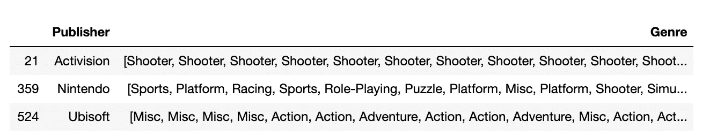
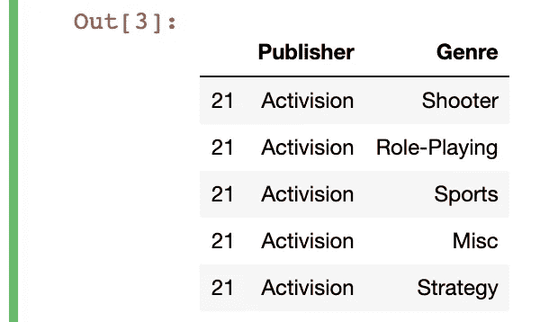
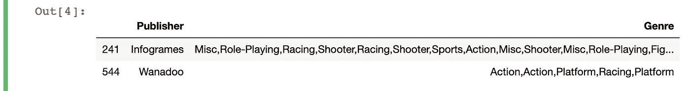
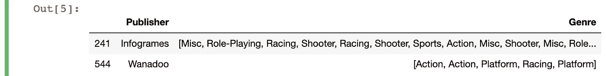
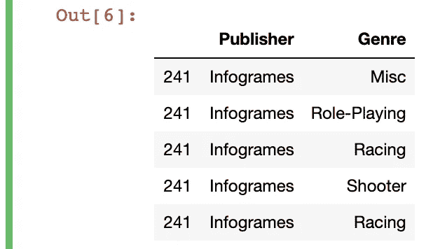

# 如何快速创建和打开熊猫列表

> 原文：<https://towardsdatascience.com/how-to-quickly-create-and-unpack-lists-with-pandas-d0e78e487c75?source=collection_archive---------15----------------------->

## 大蟒

## 使用 df.explode()解决使用熊猫数据框架时的常见问题


当你需要打开清单时，很快你就会像这个人一样微笑

预处理和“数据争论”占用了大量时间，但这并不总是数据分析项目中最有趣的部分。

当涉及到重新格式化初始数据时，必须解包一个列表。幸运的是，Pandas 提供了许多常见问题的矢量化解决方案，所以我们不必为在数据帧中解包列表而感到太大压力。

在这篇文章中，我们将关注两件事:

*   如何使用`df.explode()`取消数据帧中带有列表值的列嵌套；
*   如何使用`Series.str.split()`从一个字符串创建一个列表。

我们将使用[这个](https://www.kaggle.com/gregorut/videogamesales)视频游戏销售数据的修改版本，所以如果你想跟进的话，可以下载 csv 文件。这一次，我在最底部加入了代码来获取每个示例的初始表。我建议先浏览一遍这段代码，然后复制代码以获得输入，然后再尝试示例。

# 如何在熊猫数据框架中取消嵌套(分解)一列

我们的初始表格如下所示:



目标是分隔“流派”列中的所有值，以便每行只有一个值。就数据库规范化而言，这将是实现“第一范式”的一个步骤，在第一范式中，每一列只包含原子(不可分的)值。

为此，我们需要做的就是使用`df.explode()`功能。我们只需要传递一个参数，它是包含列表 like 值的列的名称。

我们的代码是这样的。

```
df2 = df2.explode('Genre').drop_duplicates()
```

结果数据帧的子集如下所示:



现在我们有了一个包含每个出版商所有不同类型的表格。我们还通过在数据帧上传递`.drop_duplicates()`来确保只有唯一的值。

您会注意到原始数据帧中的索引值是为每一行保留的，这表明`df.explode()`函数所做的只是在 iterable 中分离元素，同时保持所有其他行的值不变。如果我们想要新的索引值，我们也可以轻松地通过`.reset_index()`。

# 如何在 Pandas 数据框架中创建(和解包)一个具有列表式值的列

在最后一个问题中，我们使用了一个包含一列列表的数据帧。然而，您经常会处理不完全符合预定义的 Pandas 函数的数据。例如，假设我们有一个类似于上一个问题的表格，如下所示:



你能看出区别吗？

“流派”列中仍有一堆值，但它们不再在 Python 列表中。`df.explode()`函数不起作用，因为根据它的文档:

> 这个例程(df.explode)将分解类似列表的内容，包括列表、元组、序列和 np.ndarray。

我们目前对每个列值都有多个条目，但是它们不是“类似列表”的格式。我们只有一堆很长的字符串。

为了将子字符串组合成一个列表，我们将使用一行简单的代码将字符串转换成一个列表:

```
df3['Genre'] = df3['Genre'].str.split(',')
```

这里，我们在“流派”列上使用了`Series.str.split()`方法来创建一个列表。顾名思义，这个方法在您指定的分隔符上分割字符串，在我们的例子中是逗号。如果你不向`split()`传递任何东西，这个方法将试图在空白上分割一个字符串，但是我们的字符串没有空白。

生成的表格如下所示:



现在，我们有了一个与前一个几乎相同的表，只是这次所有不同的值都在一个列表中。

我们现在要做的就是运行与第一个问题中相同的代码行:

```
df3 = df3.explode('Genre')
```



姐姐创作的漫画

我希望你发现这个快速浏览`df.melt`对你的熊猫工作有用！如果你需要在你的数据框架中创建或者解压列表，你可以分别使用`Series.str.split()`和`df.explode()`方法。

正如所承诺的，下面是设置这两个示例的代码:

```
import pandas as pddf = pd.read_csv('vgsales.csv').dropna()
df['Year'] = df['Year'].astype(int)# problem 1
df2 = df.groupby('Publisher')['Genre'].apply(','.join).reset_index()
df2 = df2.loc[(df2['Publisher']=='Nintendo') | (df2['Publisher']=='Ubisoft') | (df2['Publisher']=='Activision')]
df2['Genre'] = df2['Genre'].str.strip().str.split(',')# problem 2
df3 = df.groupby('Publisher')['Genre'].apply(','.join).reset_index()
df3 = df3.loc[(df3['Publisher']=='Infogrames') | (df3['Publisher']=='Wanadoo')]
```

你可以看到我使用了`.loc[]`函数为我的数据帧设置了一些条件，所以如果你还不熟悉使用它，你可以看看这个:

[](/you-dont-always-have-to-loop-through-rows-in-pandas-22a970b347ac) [## 你不需要总是在熊猫的行列中循环！

### 用向量化解决方案看一下“for 循环”的替代方案。

towardsdatascience.com](/you-dont-always-have-to-loop-through-rows-in-pandas-22a970b347ac) 

我在这里也使用了`.apply()`，这是一种沿着数据帧的轴执行函数的简单方法。对于逐行编辑数据帧的另一种方法(我建议只在遇到问题*没有*的矢量化熊猫解决方案时才使用)，请查看以下内容:

[](/a-really-simple-way-to-edit-row-by-row-in-a-pandas-dataframe-75d339cbd313) [## 一个非常简单的方法来编辑熊猫数据帧中的一行一行

### 使用 pd.loc 根据条件更改数据的子集。

towardsdatascience.com](/a-really-simple-way-to-edit-row-by-row-in-a-pandas-dataframe-75d339cbd313) 

祝你和熊猫的冒险之旅好运！