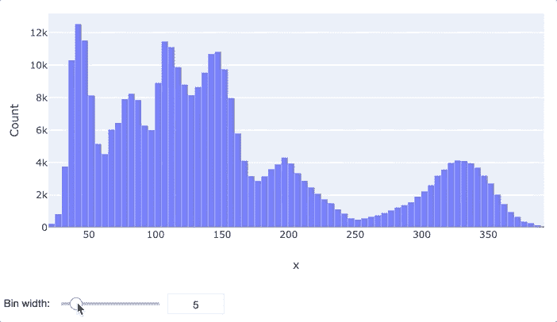

# 如何快速找到最适合直方图的条柱

> 原文：<https://towardsdatascience.com/how-to-quickly-find-the-best-bin-width-for-your-histogram-4d8532f053b0?source=collection_archive---------11----------------------->

数据探索是每个数据科学项目中的关键步骤，通常从查看单个变量的分布开始。这就是直方图的亮点。

直方图对于可视化列的分布非常有用，这有助于理解数据的重要方面。例如，通过简单地查看直方图，我们可以立即识别数据中的异常值甚至错误(例如，包含患者年龄的列中的负值)。

当处理直方图时，我们几乎总是最终调整条柱宽度，这是一个关键参数，因为它决定了我们可以从图中提取多少信息和什么类型的信息。

在本文中，我将向您展示如何通过在 Jupyter Notebook 或 JupyterLab 中使用 plotly 和 ipywidgets 创建一个交互式直方图来快速找到您的最佳 bin 宽度。

**注意:**尽管我用 plotly 展示了交互式重新绑定，但是您可以将我所展示的逻辑应用于任何绘图库，比如 seaborn 和 matplotlib。

为了可视化，我将以分钟为单位显示 2013 年从纽约出发的 300，000 多个航班的飞行时间( [NYCflights13](https://cran.r-project.org/web/packages/nycflights13/nycflights13.pdf) 数据)。你可以在 GitHub 上找到这篇文章的完整代码。

# 交互式宁滨直方图

在这张图中，你可以看到最终的结果。如果我们通过一个滑块改变箱的宽度，plotly 图会自动调整。

为了实现这个行为，我们将`plotly.graph_objs`(创建 plotly 图)与`ipywidgets.Floatslider`结合起来。

这是创建可重组直方图的代码。

让我们一行一行地过一遍。

# 逐行解释代码

## 0.功能签名

注意，我们的函数有两个参数:`series`一只熊猫。Series 和`initial_bin_width`，指定我们希望在绘图中将 a 作为默认值的 bin 宽度。在我们的例子中，它是 10 分钟的广播时间窗口。

## 1.创建图形

我们生成一个新的`FigureWidget`实例。`FigureWidget`物体是 plotly 的新“魔法物体”。你可以在 Jupyter 笔记本或 JupyterLab 中显示它，就像任何普通的 plotly 图形一样。但是，这种方法有一些优点:

*   FigureWidgets 可以与 ipywidgets 相结合，以创建更强大的结构(事实上，这就是 FigureWidgets 的设计目的)
*   您可以在 Python 中以各种方式操作`FigureWidget`
*   您还可以收听一些事件和
*   当事件被触发时，您可以执行更多的 Python 代码

`FigureWidget`接收属性`data`，该属性指定了我们想要显示的所有轨迹的列表。在我们的例子中，我们只想显示一个直方图。直方图的 x 值来自`series`。我们通过将字典传递给`xbins`来设置 bin 宽度。当我们在字典中设置`size=None`时，plotly 会为我们选择一个 bin 宽度。

## 2.创建滑块

我们使用`ipywidgets`库生成一个`FloatSlider`。通过这个滑块，我们稍后将能够操纵我们的直方图。

## 3.保存对直方图的引用

我们获取对直方图的引用，因为我们想在最后一步操作它。特别是，我们将更改对象的`xbins`属性，我们可以通过`histogram_object.xbins`访问它。

## 4.编写并使用回调

我们已经实现的`FloatSlider`带有一些魔力。每当它的值改变时(即我们移动滑块)，它就触发一个事件。我们可以使用该事件来更新直方图中的区间宽度。从技术上来说，您可以通过调用 bin 滑块上的`observe`方法来实现这一点，向它传递您想要调用的函数(在我们的例子中是`set_bin_size`，并告诉它何时调用该函数(`name="value"`意味着每当滑块的`value`改变时我们都会调用该函数)。现在，每当滑块的值改变时，它就会调用`set_bin_size`。`set_bin_size`通过魔术参数`change`访问滑块的值，魔术参数是一个字典，包含关于由`bin_slider`触发的事件的数据。例如，`change["new"]`包含滑块的新值，但是您也可以使用`change["old"]`来访问它以前的值。注意，你不必使用参数名`change`。你可以给它取任何你想要的名字。

在回调函数`set_bin_size`中，我们可以看到它简单地采用了引用`histogram_object`，以便通过覆盖`xbins`来更新`FigureWidget`的 bin 设置(即改变 bin 宽度)。

当我们把上面的所有部分放在一起时，我们就有了第一个漂亮的交互式直方图的原型。

# 结论

直方图是开始探索数据集的单个列的一个很好的方法。使用 plotly，我们可以创建强大的交互式可视化，并可以使用 ipywidgets 进一步增强。

在本文中，我向您展示了在 Jupyter Notebook 或 JupyterLab 中使用 plotly 和 ipywidgets 时，如何交互式地快速找到直方图的(主观)最佳条宽。

在 8080 实验室，我们使用我们的 python 工具 [bamboolib](http://bamboolib.8080labs.com) 中的重新绑定特性。与许多其他交互式功能一起，它帮助我们的用户更快地获得洞察力。

如果您对本文有任何反馈或建设性的批评，或者想讨论如何为直方图添加更多功能，请随时通过 [LinkedIn](https://www.linkedin.com/in/tobias-krabel-830532114/) 联系我。

*原载于 2020 年 02 月 06 日 https://8080labs.com**[*。*](https://8080labs.com/blog/posts/find-best-bins-for-plotly-histogram/)*