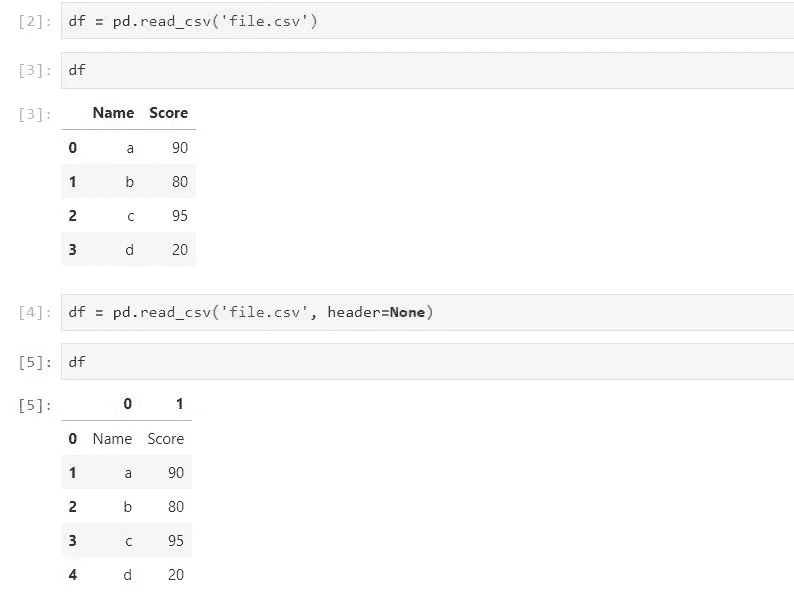
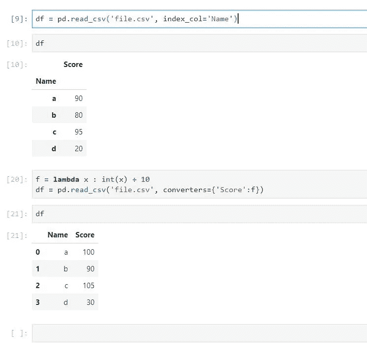

# 如何使用 Pandas 将 CSV 文件读入 Python

> 原文：<https://towardsdatascience.com/how-to-read-csv-file-using-pandas-ab1f5e7e7b58?source=collection_archive---------0----------------------->

## 在本帖中，我们将讨论如何将 CSV 文件导入 Python。


由 [Unsplash](https://unsplash.com?utm_source=medium&utm_medium=referral) 上的[absolute vision](https://unsplash.com/@freegraphictoday?utm_source=medium&utm_medium=referral)拍摄的照片

# 简短回答

最简单的方法是:

```
import pandas as pddf = pd.read_csv ('file_name.csv')
print(df)
```

如果您想要导入列的子集，只需添加`usecols=['column_name']`；

```
pd.read_csv('file_name.csv', usecols= ['column_name1','column_name2'])
```

如果想用另一个分隔符，只需添加`sep='\t'`；默认分隔符是`','`。

```
pd.read_csv('file_name.csv', sep='\t')
```

# 概述熊猫数据框架

Pandas DataFrames 是一个类似 excel 的数据结构，带有标记轴(行和列)。下面是一个熊猫数据帧的例子，我们将把它作为下面的例子:

生成数据帧的代码:

# 将 CSV 文件导入数据帧

Pandas `read_csv()`函数将 CSV 文件导入到 DataFrame 格式。

以下是一些选项:

**文件路径或缓冲区:**这是文件名或文件路径

```
df.read_csv('file_name.csv’) # relative position
df.read_csv('C:/Users/abc/Desktop/file_name.csv')
```

**header** :这允许您指定哪一行将被用作数据框的列名。应为 int 值或 int 值列表。

默认值是`header=0`，这意味着 CSV 文件的第一行将被视为列名。

如果您的文件没有标题，只需设置`header=None`。

```
df.read_csv('file_name.csv’, header=None) # no header
```

没有标题的输出:



**sep** :为 CSV 输入指定一个自定义分隔符，默认为逗号。

```
pd.read_csv('file_name.csv',sep='\t') # Use Tab to separate
```

**index_col:** 这允许您设置哪些列将用作数据帧的索引。默认值是 None，pandas 将从 0 开始添加一个新列来指定索引列。

它可以设置为列名或列索引，将用作索引列。

```
pd.read_csv('file_name.csv',index_col='Name') # Use 'Name' column as index
```

**nrows:** 仅从文件中读取第一行的数量。需要一个 int 值。

**使用列**:指定将哪些列导入数据框架。它可以是 int 值或列名的列表。

```
pd.read_csv('file_name.csv',usecols=[1,2,3]) # Only reads col1, col2, col3\. col0 will be ignored.
pd.read_csv('file_name.csv',usecols=['Name']) # Only reads 'Name' column. Other columns will be ignored.
```

**转换器**:通过定义的函数帮助转换列中的值。



**na_values** :缺省值为 NaN。如果您希望其他字符串被视为 NaN，请使用此选项。预期的输入是字符串列表。

```
pd.read_csv('file_name.csv',na_values=['a','b']) # a and b values will be treated as NaN after importing into dataframe.
```