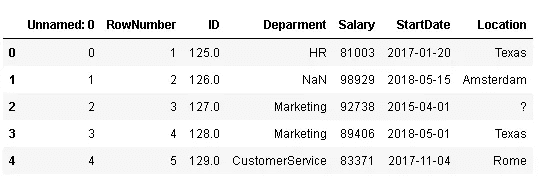
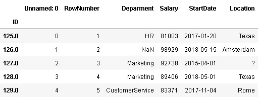
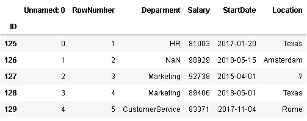
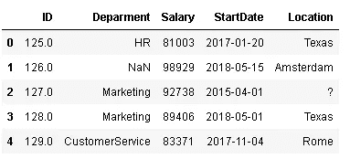
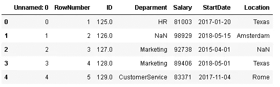
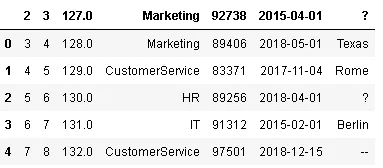
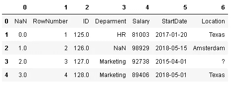
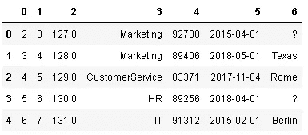
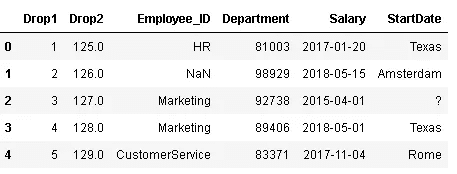

# 如何和熊猫“读 _csv”

> 原文：<https://towardsdatascience.com/how-to-read-csv-with-pandas-e91ea6016e76?source=collection_archive---------11----------------------->

## 使用 read_csv 作为通用工具

数据科学项目中最耗时的部分是数据清理和准备。Pandas 是一个非常强大和通用的 Python 数据分析库，可以加速项目的预处理步骤。我们通常倾向于使用带有默认参数的函数，这使得我们无法充分利用函数的优势。


米卡·鲍梅斯特在 [Unsplash](https://unsplash.com/s/photos/csv?utm_source=unsplash&utm_medium=referral&utm_content=creditCopyText) 上的照片

熊猫最广泛使用的功能之一是 **read_csv** ，它读取逗号分隔值(csv)文件并创建一个数据帧。在这篇文章中，我将重点介绍 read_csv 函数的许多不同参数以及如何有效地使用它们。

> Pandas 的基本数据结构是 **DataFrame** ，它以表格的形式表示数据，带有标记的行和列。

一如既往，我们从进口熊猫开始。

```
import numpy as np
import pandas as pd
```

我创建了一个示例数据框架，旨在显示参数的效果和有用性，因此这些值可能没有意义。

让我们从使用不带可选参数的 read_csv 开始:

```
df = pd.read_csv("SampleDataset.csv")
df.head()
```



唯一需要的参数是文件路径。我们需要告诉熊猫文件在哪里。如果 csv 文件在同一个工作目录或文件夹中，您可以只写文件名。如果没有，我们可以如下指定位置:

```
df = pd.read_csv(r"C:\Users\soner\Downloads\SampleDataset.csv")
```

# **index_col**

默认情况下，从 0 开始的整数索引被分配给数据帧。我们可以显式定义一个列作为索引。例如，我们可能希望使用“ID”列作为索引:

```
df = pd.read_csv("SampleDataset.csv", index_col='ID')
df.head()
```



# **数据类型**

有浮点 ID 号有点奇怪。我觉得没有哪家公司是这样分配身份证号的。我们可以使用 **dtype** 参数指定 read_csv 函数中任何列的数据类型:

```
df = pd.read_csv("SampleDataset.csv", index_col='ID', 
                  dtype={'ID':np.int32})df.head()
```



# **用途**

在某些情况下，根据我们对日期的计划，我们可能不需要所有的特性(列)。我们可以在读取所有数据后删除不必要的列。然而，更好的选择是只读取我们需要的列，这可以通过 **usecols** 参数轻松完成:

```
cols = ["ID","Deparment","Salary","StartDate","Location"]
df = pd.read_csv("SampleDataset.csv", usecols=cols)df.head()
```



我们也可以使用列的索引作为参数来使用 cols 参数。以下代码可以很好地完成这项工作:

```
df = pd.read_csv("SampleDataset.csv", usecols=[2,3,4,5,6])
```

# **解析日期**

让我们检查列的数据类型:

```
df = pd.read_csv("SampleDataset.csv")df.dtypes
Unnamed: 0      int64
RowNumber       int64
ID            float64
Deparment      object
Salary          int64
StartDate      object
Location       object
dtype: object
```

StartDate 列的数据类型是 object，但是我们知道该列包含日期，所以我们可以通过使用 **parse_Dates** 参数将值读取为 date。

```
df = pd.read_csv("SampleDataset.csv", parse_dates=[5])df.dtypes
Unnamed: 0             int64
RowNumber              int64
ID                   float64
Deparment             object
Salary                 int64
StartDate     datetime64[ns]
Location              object
dtype: object
```

日期现在有了更合适的格式。

# **na_values**


缺失值有时不是熊猫可以检测为“缺失”的格式。例如，在位置列中，'？'是一个缺失值，但是 read_csv 函数无法知道这一点，除非我们指定它。我们可以使用 **na_values** 来指示要被识别为“缺失”的附加值:

```
df = pd.read_csv("SampleDataset.csv", na_values=['?'])df.head()
```



# **船头和船尾**

如果我们有一个非常大的数据帧，并且只想读取其中的一部分，我们可以使用 **nrows** 参数，并指出我们想读取多少行并放入数据帧:

```
df = pd.read_csv("SampleDataset.csv")
df.shape
(30,7)df = pd.read_csv("SampleDataset.csv", nrows=10)
df.shape
(10,7)
```

在某些情况下，我们可能希望跳过文件开头的一些行。我们可以把要跳过的行数传递给**skip prows**parameter，或者传递一个带有整数的列表，指示要跳过的行:

*   skiprows=5:跳过前 5 行
*   skiprows=[1，3]:跳过第一行和第三行

原始数据帧:


```
df = pd.read_csv("SampleDataset.csv", skiprows=3)
df.head()
```



跳过前三行，数据帧从第四行开始。然而，这里有一个问题。第 4 行用作列名。

# **表头**

我们可以使用**头**参数来解决这个问题。在大多数情况下，csv 文件中的第一行包括列名，并推断为标题。因此，如果没有指定列名，csv 文件的默认行为是采用`header=0`，并且从文件的第一行推断列名。

如果`header=None` ，列名被指定为整数索引，文件的第一行被读取为数据帧的第一行:

```
df = pd.read_csv("SampleDataset.csv", header=None)
df.head()
```



所以我们可以设置`header=None`并使用 skiprows，但是记住第一行包括列名。如果`skiprows=3`，数据框的第一行变成有`ID=127`的人。

```
df = pd.read_csv("SampleDataset.csv", header=None, skiprows=3)
df.head()
```



# **姓名**

如果我们想改变列名或者文件中没有一行包含列名，我们可以使用 **names** 参数:

```
cols=["Drop1","Drop2","Employee_ID","Department","Salary", "StartDate"]df = pd.read_csv("SampleDataset.csv", names=cols, skiprows=1)
df.head()
```



read_csv 函数还有很多附加参数。我试着解释我常用的参数，但是你可以在这里查看所有的参数列表[。](https://pandas.pydata.org/pandas-docs/stable/reference/api/pandas.read_csv.html)

感谢您的阅读。如果您有任何反馈，请告诉我。