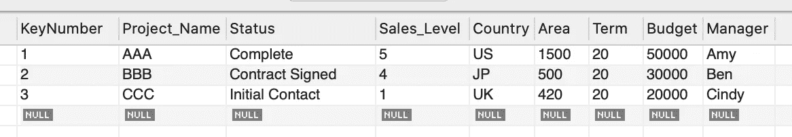
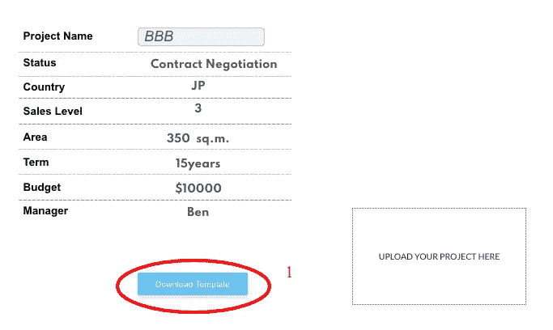
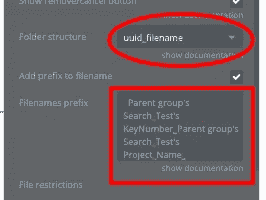
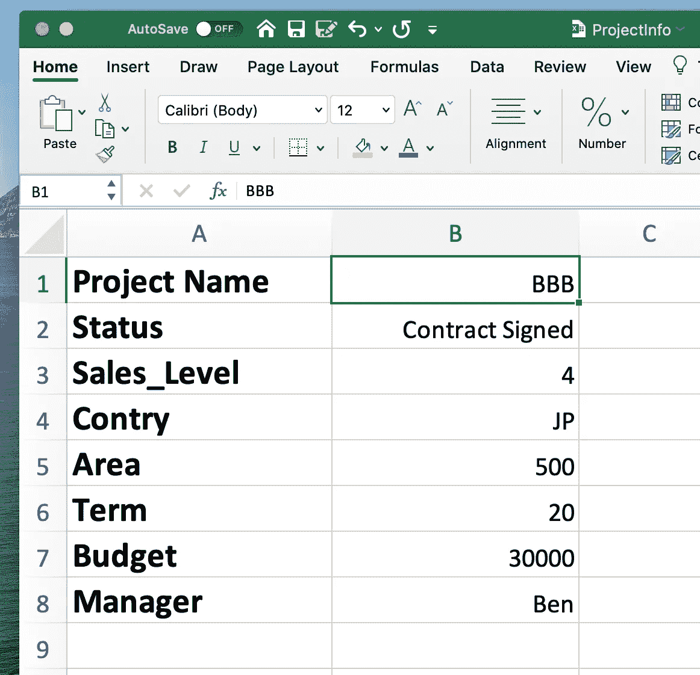
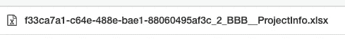
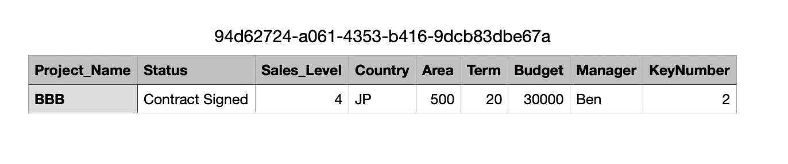
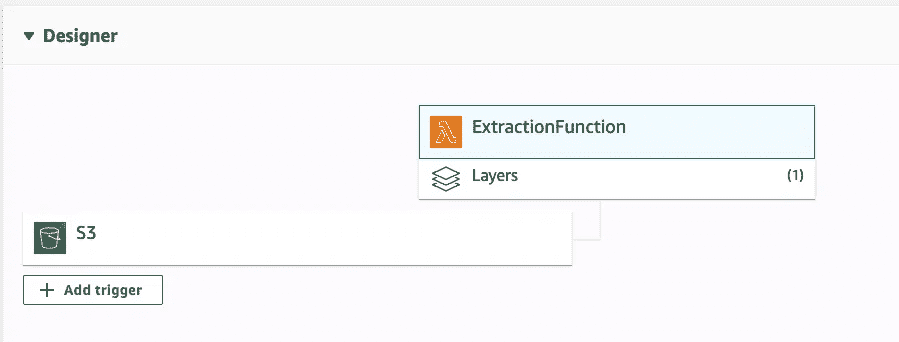
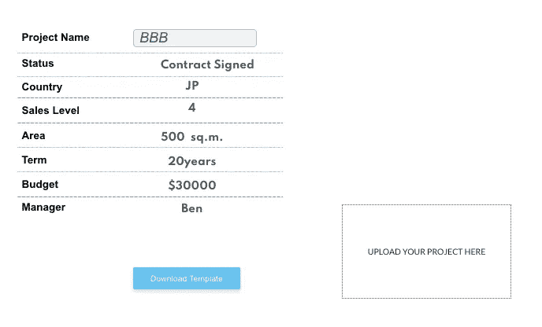

# 如何使用 AWS S3/Lambda 在 bubble.io 中读取 Excel/CSV 文件

> 原文：<https://towardsdatascience.com/how-to-read-excel-csv-file-in-bubble-io-using-aws-s3-lambda-a9af89153d2a?source=collection_archive---------29----------------------->

## [入门](https://towardsdatascience.com/tagged/getting-started)

## 代码少的数据 ETL 管道；)

照片由 [ETA+](https://unsplash.com/@etaplus?utm_source=medium&utm_medium=referral) 在 [Unsplash](https://unsplash.com?utm_source=medium&utm_medium=referral) 上拍摄

嗨大家好，今天我将在 [bubble.io](http://bubble.io) 中演示一个非常简单的方法来实现从 Excel/csv 文件到 SQL 数据库的数据提取。

此工作流使用 AWS S3/Lambda 函数作为连接桥梁，与手动输入相比，它既节省时间，如果您使用 AWS 自由层服务，也节省成本。

唯一的成本是在 bubble 中安装一个名为 [AWS 文件上传器](https://zeroqode.com/plugin/aws-file-uploader-1533465056312x784389392881156100)的插件(35 美元)，仅此而已。很神奇，对吧？

现在让我们深入研究一下，看看它是如何工作的。

## **第一步:确认您输入的数据，并据此建立数据库**

这其实是一个蛋和鸡的问题。通常，当您发现 Excel/Access 不再能满足您快速管理和检索数据的目的时，就会发生这种情况，这时您就开始构建关系型(和/或)非关系型数据库。

迪伦·吉利斯在 [Unsplash](https://unsplash.com?utm_source=medium&utm_medium=referral) 上的照片

例如，作为一名负责全球或地区市场的高级项目经理，使用 Excel 作为分发和提取数据的标准模板将非常有用，特别是当您的项目经理遍布世界各地，并且您希望集中项目信息并从整体角度监控进度时。

## **第二步:创建你的泡泡页面来反映项目信息**

测试用项目数据库

假设我想更新这个项目信息。

演示项目信息的气泡页

我知道这个页面看起来很丑，但它只是所列信息的一个非常基本的演示。您可以在此基础上开发许多变体。

这里有一些额外的注释:

1.  允许用户下载 excel 模板，确保所有用户将输入统一的数据，并易于更新；
2.  您可以为文件添加前缀，这样我们就不会被各种不同的文件名所困扰，也可以从文件名中提取关键信息作为关键标识符；
3.  我建议选择 *uuid_filename* 作为文件结构，因为这样更容易看到每个上传的文件。

文件上传功能调整

## **第三步:部署 bubble 插件——AWS 工作流程**

*AWS 文件上传插件👉S3 水桶👉希腊字母的第 11 个👉SQL 数据库*

S3 桶和 Lambda 之间的微妙联系是通过触发器实现的，所以一旦任何东西上传到 S3 桶，就会有一个事件生成，你的代码将从这里开始。

新 Excel 文件信息

已将文件上传到 uuid 为的 S3 桶中

在我的方法中，我使用两层来提取数据。

第一层，“文件上传”S3 存储桶触发“提取功能”Lambda 功能，该功能在“csv 接收器”S3 存储桶中输出新的 CSV 文件。

为加载生成的 CSV

λ接口

第二层，“csv 接收器”S3 存储桶触发“CSV 到 RDS”Lambda 函数，该函数从 CSV 中提取数据并将其输入到 SQL 数据库中。

这背后的原因:

1.  这个中间步骤允许用户检查是否有不规则的数据；
2.  如果它是非常大的 excel 文件，它转移了 1 lambda 函数的计算压力；
3.  如果需要，你可以在第一个 lambda 函数中写一些简单的代码来创建一个文件上传日志，跟踪所有用户的上传历史；

成功上传文件并刷新页面后，项目信息就成功更新了！

更新的项目信息页面

实际上，AWS 生态系统中有许多有趣的部分，围绕 Lambda 也有许多有用的工具，但由于文章的长度，我将只提到几个:

1.  如果你正在使用 **pandas** 或 **pymysql** 库，在 Lambda 中部署一个层；
2.  CloudWatch 非常非常有用，可以记录你所有的 lambda 活动；
3.  如果你在 bubble 中使用 AWS 文件上传插件，请确保调整你的 S3 存储桶权限策略，否则它将无法工作。

参考:[https://docs.zeroqode.com/plugins/aws-file-uploader-plugin](https://docs.zeroqode.com/plugins/aws-file-uploader-plugin)

感谢大家阅读这篇文章，我将继续在 bubble.io 中分享有用的工具和技巧。