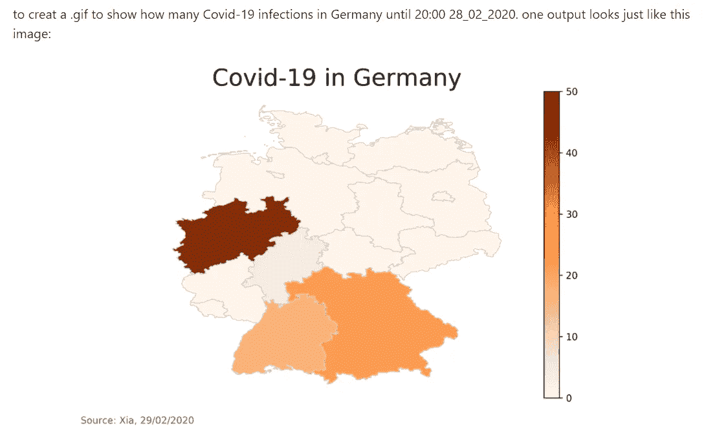
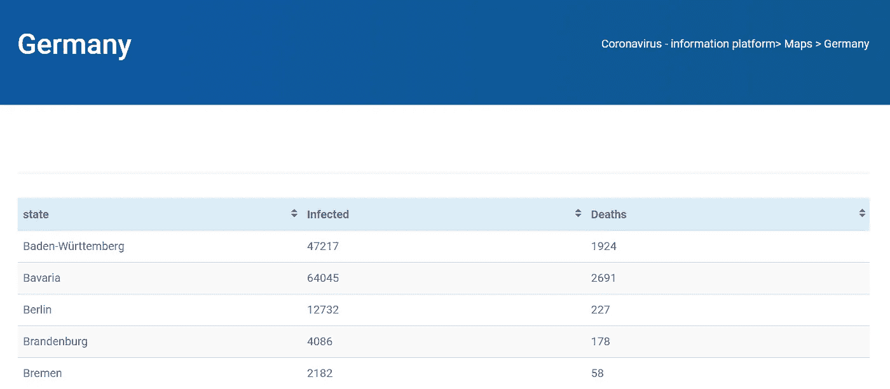
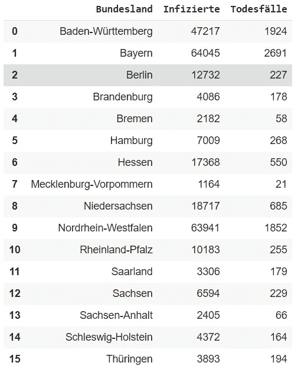
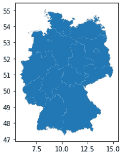
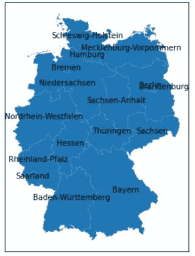
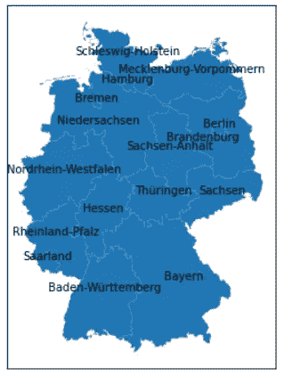
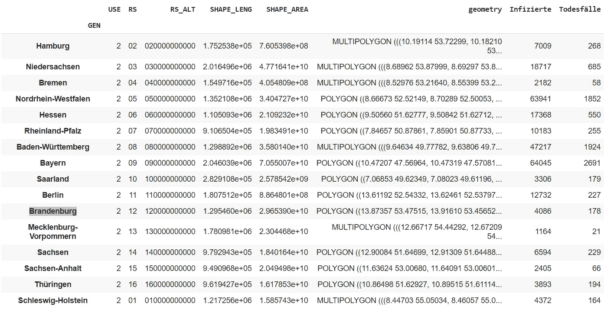
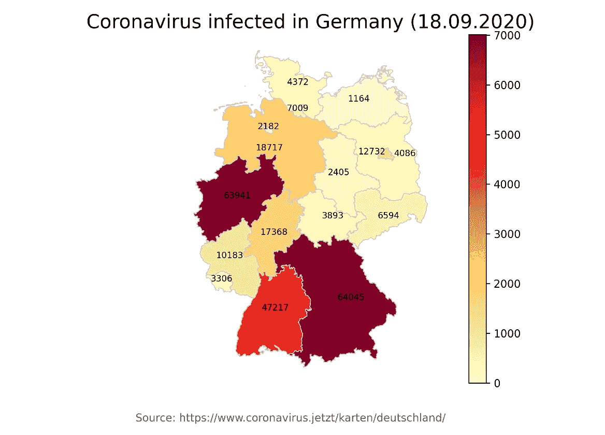
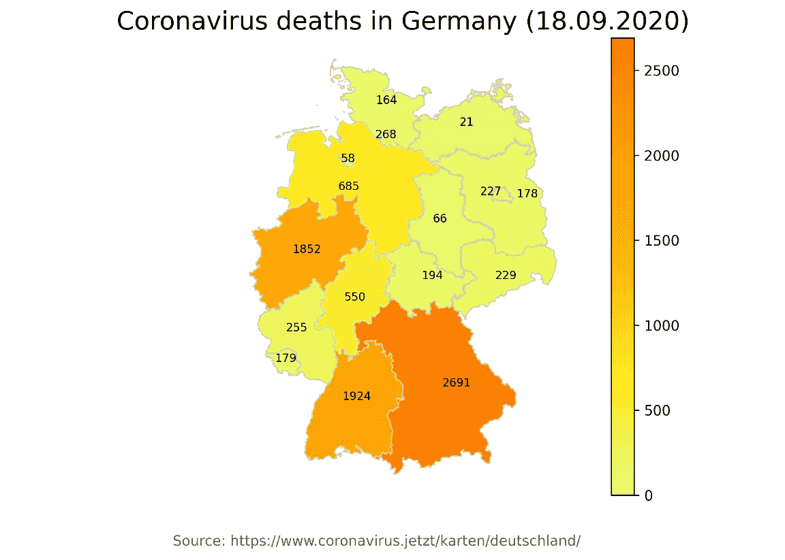

# corona 疫情期间如何用 Python 实现地理可视化

> 原文：<https://towardsdatascience.com/how-to-realize-geo-visualization-with-python-during-corona-pandemic-f822d3cbf4fe?source=collection_archive---------28----------------------->

## 基于 GeoPandas 和 Matplotlib 的德国 web 刮削日冕信息的地理演示


乔纳森·博尔巴在 [Unsplash](https://unsplash.com/s/photos/corona-pandemic?utm_source=unsplash&utm_medium=referral&utm_content=creditCopyText) 上的照片

在这个故事中，我尝试分享我用 Python 包(Geopandas，pandas，Matplotlib)制作 Corona 信息地理可视化的经验。电晕信息是通过网刮提取的。由于 web 抓取并不是我们的目标，而是一种获取信息的方法，所以我不会花太多时间解释这部分代码🌚。

*编者注:*[*towardsdatascience.com*](https://slack-redir.net/link?url=http%3A%2F%2Ftowardsdatascience.com)*是一家以数据科学和机器学习研究为主的中型刊物。我们不是健康专家或流行病学家。想了解更多关于疫情冠状病毒的信息，可以点击* [*这里*](https://slack-redir.net/link?url=https%3A%2F%2Fwww.who.int%2Femergencies%2Fdiseases%2Fnovel-coronavirus-2019) *。*

# 社会背景:科罗纳·疫情

> 截至 2020 年 3 月 13 日，当新增病例数超过中国时，[世界卫生组织](https://en.wikipedia.org/wiki/World_Health_Organization)(世卫组织)开始认为欧洲是[新冠肺炎疫情](https://en.wikipedia.org/wiki/COVID-19_pandemic)的活跃中心。[1][2]

我的父母住在中国，他们目睹了疫情的严重性。在一月、二月和三月，他们不得不总是呆在家里😷。只有我的父亲一周两次去市场购买全家基本生活所需的必需品。后来在欧洲，许多城市也实行了封锁。我住在德国，那些日子太可怕了。在欧洲爆发之前，我呆在家里，做了一个在德国感染的电晕的地理可视化，以消磨时间😇。[https://github.com/Kopfgeldjaeger/Covid-19_in_germany](https://github.com/Kopfgeldjaeger/Covid-19_in_germany)，于 2020 年 2 月 28 日提交。



存储库的简介图像

代码上传至今已经半年多了。现在在欧洲，第二波疫情来势凶猛。我将为抗击疫情贡献自己的力量，用可视化的日冕信息警告人们。

在疫情开始的时候，关于日冕的视觉信息很少。我和朋友每天打开[网站](http://www.coronavirus.jetzt/karten/deutschland/)了解德国 16 个州有多少感染者。后来，更多的 Dash 网站被建立来可视化相同的信息，甚至 YouTube 上的 Corona 实时计数器。

今天我打开了每天早些时候访问的 www.coronavirus.jetzt/karten/deutschland/[网站。那里关于日冕的信息是以表格的形式呈现的。](http://www.coronavirus.jetzt/karten/deutschland/)



网站截图

它非常清晰和简洁，然而，对于不熟悉德国地理的人来说，很难想象每个州的日冕分布情况。因此，我们需要添加这些地理信息，最好是在图像中与日冕信息一起展示。

# 抓取日冕信息的 HTML 表格

我们目标的第一步是收集所有 16 个州的感染和死亡人数。这部分作品与另一个媒介故事非常相似[3]。

下面的代码可以让我们得到信息，我把这些信息保存在一个 Numpy 数组中，这个数组很容易转换成 Pandas 数据帧。

```
import requestsimport lxml.html as lhimport pandas as pd
import numpy as npurl='https://www.coronavirus.jetzt/karten/deutschland/'page = requests.get(url)doc = lh.fromstring(page.content)tr_elements = doc.xpath('//tr')tr_elements = doc.xpath('//tr')col=[]#For each row of 16 states, store the name of state, the numbers of infected and deathsfor n in range(1,len(tr_elements)):row =[]for t in tr_elements[n]:name=t.text_content()row.append((name))col.append(row)col= np.array(col)df = pd.DataFrame({'Bundesland': col[:,0], 'Infizierte': col[:,1], 'Todesfälle':col[:,2]})df
```

数据帧(df)看起来像:



# 查找德国的 shapefile

最后一步完成后，我们寻找德国 16 个州的地理信息🌴🌋🌅。使用地理定位数据时，地图是交流和比较信息的一种很好的方式。如何用 Python 展示地图？答案是 GeoPandas[4],这是一个开源项目，旨在简化 python 中地理空间数据的处理。它结合了 pandas 和 shapely 的功能，在 pandas 中提供地理空间操作，并为 shapely 提供多种几何图形的高级接口。

为了生成德国地图，我们需要下载必要的[形状文件](https://www.arcgis.com/home/item.html?id=ae25571c60d94ce5b7fcbf74e27c00e0)。这个链接并不是唯一为我们提供德国形状文件的链接。不同类别的 shapefiles 有很多种。我在这里使用的是解压 zip 文件后的文件名“geomap/vg2500_bld.shp”。

```
import matplotlib.pyplot as pltimport geopandas as gpdfp = "geomap/vg2500_bld.shp"map_df = gpd.read_file(fp)map_df.head()map_df.plot()
```

map_df 展示了德国各州的地图。



map_df.plot()的结果

我们可以用 plt.annotate 添加州名，代码如下

```
fig, ax = plt.subplots(1, figsize=(10, 6))map_df['coords'] = map_df['geometry'].apply(lambda x: x.representative_point().coords[:])map_df['coords'] = [coords[0] for coords in map_df['coords']]map_df.plot(ax=ax)for idx, row in map_df.iterrows():plt.annotate(s=row['GEN'], xy=row['coords'],horizontalalignment='center')plt.xticks(np.array([]))plt.yticks(np.array([]))
```



带注释的德国各州地图

最后一个插图有一个小问题，柏林和勃兰登堡的注释相互重叠。我们可以对 if 句使用一个技巧:

```
fig, ax = plt.subplots(1, figsize=(10, 6))map_df.plot(ax=ax)for idx, row in map_df.iterrows():if idx ==10:  # the idx of Brandenburg is 10plt.annotate(s=row['GEN'], xy=row['coords'],verticalalignment='top',horizontalalignment='right')continueplt.annotate(s=row['GEN'], xy=row['coords'],verticalalignment='bottom',\horizontalalignment='center')plt.xticks(np.array([]))plt.yticks(np.array([]))
```

如果注释是针对勃兰登堡或柏林的，我们可以设置它们注释的属性，以使它们不再重叠。



带有清晰注释的德国各州地图

由于柏林在地理上被勃兰登堡包围，两个州的注释很容易重叠，所以我们后来又使用了这个技巧。

# 信息融合

我们既有日冕信息，也有德国各州的地理信息。然而，这两条信息并不相关。我们需要将它们合并成一个表格或数据帧。和熊猫一起🐼连接方法[5]，我们可以将它们合并成一个数据帧。

```
merged = map_df.set_index('GEN').join(df.set_index('Bundesland'))merged
```



结合日冕信息和地理信息的合并数据帧

# 用 Matplotlib 从数据帧到插图

令人兴奋的是，我们已经到了用 Matplotlib 绘制结果的最后一步。

> Matplotlib 是 Python 编程语言及其数字数学扩展 NumPy 的绘图库。它提供了一个面向对象的 API，使用 Tkinter、wxPython、Qt 或 GTK+等通用 GUI 工具包将绘图嵌入到应用程序中。还有一个基于状态机(如 OpenGL)的过程化“pylab”接口，设计得与 MATLAB 非常相似，尽管不鼓励使用它。[6]“维基百科”

在我的最后一个故事中，也是关于如何利用 Matplotlib 对研究结果进行可视化[7]。

[https://towards data science . com/how-to-draw-a-bar-graph-for-your-scientific-python-a 6 C2 a5 E6 BCD 7](/how-to-draw-a-bar-graph-for-your-scientific-paper-with-python-a6c2a5e6bcd7)

在这里，我们继续利用 Matpotlib 实现地理可视化，因为数据帧包含所需的地理信息。

```
column = df['Infizierte']max_Infizierte = column.max()column = df['Todesfälle']max_Todesfälle = column.max()vmin, vmax = 0, max_Infiziertemerged['coords'] = merged['geometry'].apply(lambda x: x.representative_point().coords[:])merged['coords'] = [coords[0] for coords in merged['coords']]# create figure and axes for Matplotlibfig, ax = plt.subplots(1, figsize=(10, 6))merged.plot(column='Infizierte', cmap='YlOrRd', linewidth=0.8, ax=ax, edgecolor='0.8')for idx, row in merged.iterrows():if idx =='Berlin':plt.annotate(s=row['Infizierte'], xy=row['coords'],horizontalalignment='right',fontsize=8)continueplt.annotate(s=row['Infizierte'], xy=row['coords'],horizontalalignment='center',fontsize=8)# remove the axisax.axis('off')# add a titleax.set_title('Coronavirus infected in Germany (18.09.2020)', \fontdict={'fontsize': '18','fontweight' : '3'})ax.annotate('Source: [https://www.coronavirus.jetzt/karten/deutschland/',](https://www.coronavirus.jetzt/karten/deutschland/',)xy=(0.2, .06), xycoords='figure fraction',horizontalalignment='left', verticalalignment='top',fontsize=10, color='#555555')sm = plt.cm.ScalarMappable(cmap='YlOrRd', norm=plt.Normalize(vmin=vmin, vmax=vmax))sm._A = []cbar = fig.colorbar(sm)fig.savefig('testmap_1.png', dpi=300)
```

使用上面的代码，我们得到如下的图



截至 2020 年 9 月 18 日，德国最新的冠状病毒感染病例数

同样，我们也可以绘制德国直到今天 2020 年 9 月 18 日的死亡人数。为了使这个图与上一个不同，我从 Matplotlib [8]中选择了另一个调色板。



截至 2020 年 9 月 18 日，德国最新的电晕死亡病例数

正如上图“带有清晰注释的德国各州地图”所示，我们使用相同的技巧为柏林和勃兰登堡的数字设置了不同的注释格式，这样两个注释几乎不会重叠。

# 结论

在这个故事中，我介绍了一种制作地理可视化的方法，通过解释我的工作流程，使德国地图中显示的日冕情况直观且易于访问，从 web 抓取开始，到日冕地图的插图结束。所有相关文件上传到 GitHub:[https://GitHub . com/Kopfgeldjaeger/Medium _ blogs _ code/tree/master/1 _ corona _ visualization](https://github.com/Kopfgeldjaeger/Medium_blogs_code/tree/master/1_corona_visualization)。

最后但同样重要的是，我希望疫情将很快结束。我们可以一起在未来取得进步🚀，不管你现在住在哪里，也不管外面的日冕情况有多糟糕。

# 参考

[1]弗雷德里克斯 2020 年 3 月 13 日)。[“世卫组织称欧洲是疫情冠状病毒的新中心”](https://nypost.com/2020/03/13/who-says-europe-is-new-epicenter-of-coronavirus-pandemic/)。[纽约邮报*纽约邮报*T5。2020 年 5 月 9 日检索。](https://en.wikipedia.org/wiki/New_York_Post)

[2] [“世卫组织宣布南美为新新冠肺炎震中”](https://brazilian.report/coronavirus-brazil-live-blog/2020/05/22/who-declares-south-america-as-new-covid-19-epicenter/)。*巴西报道*。2020 年 5 月 22 日。检索于 2020 年 6 月 1 日。

[3][https://towards data science . com/we b-scraping-html-tables-with-python-C9 Baba 21059](/web-scraping-html-tables-with-python-c9baba21059)

[https://geopandas.org/](https://geopandas.org/)

[https://pandas.pydata.org/docs/](https://pandas.pydata.org/docs/)

[https://matplotlib.org/](https://matplotlib.org/)

[7][https://towards data science . com/how-to-draw-a-bar-graph-for-your-science-paper-a 6 C2 a5 E6 BCD 7](/how-to-draw-a-bar-graph-for-your-scientific-paper-with-python-a6c2a5e6bcd7)

[8][https://matplotlib . org/3 . 1 . 1/tutorials/colors/colormaps . html](https://matplotlib.org/3.1.1/tutorials/colors/colormaps.html)