# 如何识别和纠正谷歌分析报告中的(未设置)值

> 原文：<https://towardsdatascience.com/how-to-recognize-and-correct-the-not-set-value-in-google-analytics-reports-1441ff26cd2f?source=collection_archive---------43----------------------->

来源:[沉积照片](https://ru.depositphotos.com/182063950/stock-photo-fortune-cookie-cookies-predictions.html)

## 了解更多关于 Google Analytics 报告中(未设置)值出现的信息，为什么它会出现在那里，以及如何减少该值的百分比。

你有没有注意到谷歌分析中的(未设置)值而不是实际值？这意味着 Google Analytics 没有关于这个值的数据，或者无法解读它。很明显，这个值对你这个营销专员来说是个美中不足的地方。你有数字，但不清楚它们是什么意思，以及如何在你的数据分析中使用它们。

此外，在一些标准的谷歌分析报告中获得一个(未设置的)值是一个警告信号，表明在你的网站上如何实现分析存在一些错误。在第一次设置分析和添加新功能时，观察这个值尤其重要。

# 观众报告

## 地理和移动报告组

Google Analytics 借助 cookies、移动设备的广告标识符等自动获取这些报告的数据。

您可以在地理语言报告中找到(未设置的)值。例如，在这张截屏显示的报告中，Google Analytics 无法为 1.24%的网站访问者定义语言:

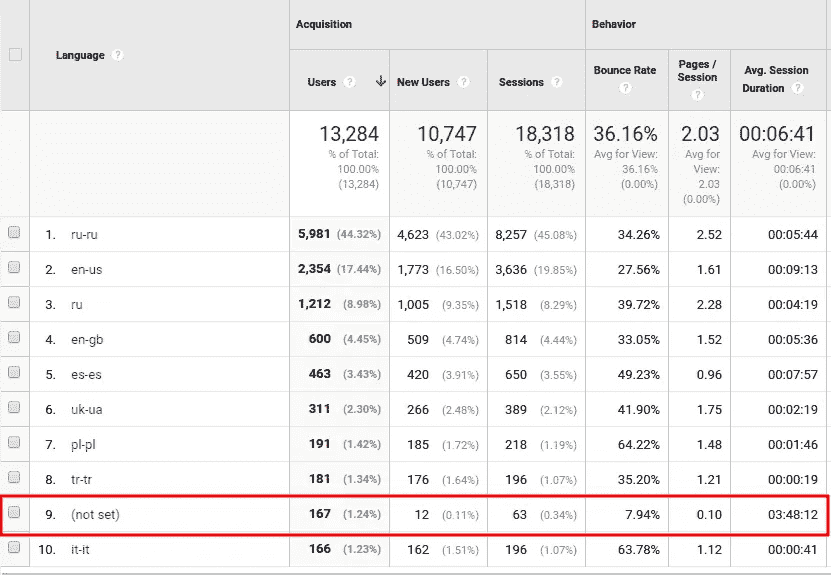

图片由作者提供

地理位置报告几乎相同:

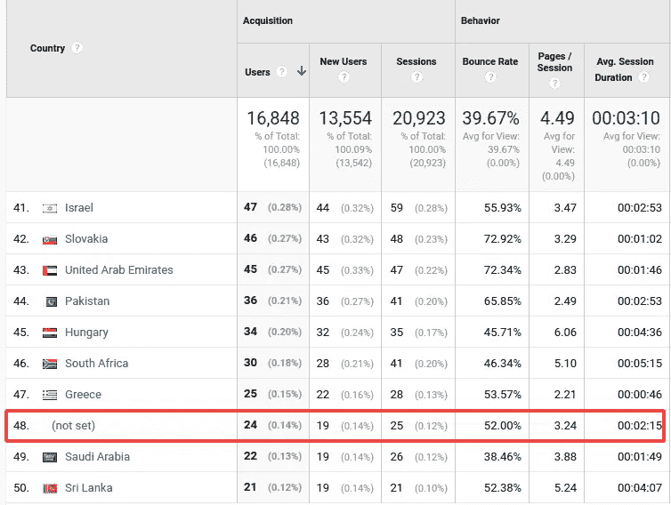

图片由作者提供

移动设备报告显示，3%的访问者的设备无法识别:

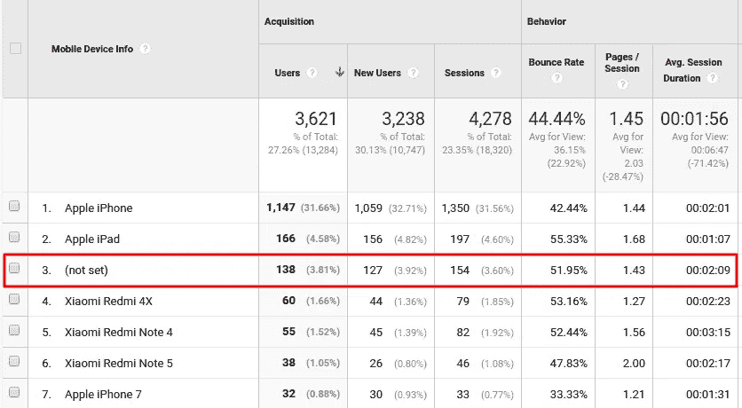

图片由作者提供

一般来说，你至少可以找到 1%访问者的(未设置)值。显示该值有各种原因，遗憾的是，我们无法影响这些原因:

*   删除的 cookies
*   用户浏览器中禁用了 JavaScript
*   无法检测到基于 IP 的位置或根本无法检测到 IP
*   各种拦截器(广告拦截器等。)

## 技术报告小组

这里有一个更有趣的报告:技术——浏览器和操作系统。每次访问者进入网站，他们的浏览器都会发送一个带有用户代理的字符串。该字符串包含有关发送请求的平台的信息，包括浏览器上的数据。GA 接收该信息，但有时它可能不可用。结果，我们在报告中得到(未设置的)值:

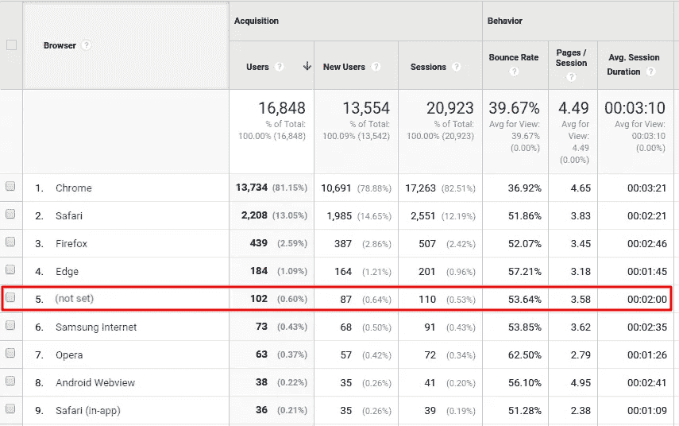

图片由作者提供

如果报表中具有(未设置)值的独立访问者的数量少于 5%，这被认为是正常的。如果更高，你应该检查你的流量——可能是由垃圾邮件引起的。在[测量协议](https://developers.google.com/analytics/devguides/collection/protocol/v1/?hl=en)的帮助下，他们可以向 GA 发送任何虚假点击。要做到这一点，让他们知道你的谷歌分析资源 ID 就足够了。

有两种垃圾邮件。第一个访问你的网站，并产生虚假的流量。这些机器人可以发送带有虚假推荐人标题的 HTTP 请求来掩盖自己。为此，他们甚至可以在 URL 中使用另一个流行网站的名称。由于它们执行 JavaScript 代码的能力，它们不会被 GA 过滤为机器人。

第二种垃圾邮件发送虚假点击，而不访问您的网站。这种垃圾邮件被称为幽灵垃圾邮件。

在我们的例子中，高达 14.95%的访问者的浏览器是未定义的。事务的平均会话持续时间接近两分钟。为了调查这种可疑情况，我们需要更深入地打开采集-所有流量-转介:

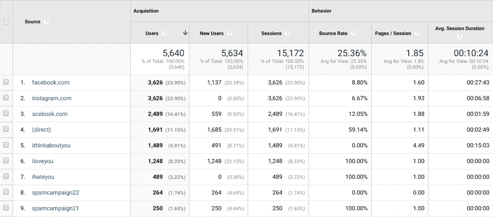

图片由作者提供

注意跳出率接近 0%或 100%且会话数超过 10 的推荐源。正如我们所看到的，这发生在字符串 5 到 9 中。最有可能的是，这些是机器人。垃圾邮件的第二个迹象是奇怪的来源名称:在我们的例子中，有*我爱你*和*我想约你*。

另外，注意字符串 8 中源名称为 *spamcampaign22* 的访问者。他们进行了 264 次交易——每位访问者一次。如果我们没有手动将这些数据放入属性中，我们对垃圾邮件流量的猜测将被证明是正确的。

让我们添加*主机名*作为第二个维度:

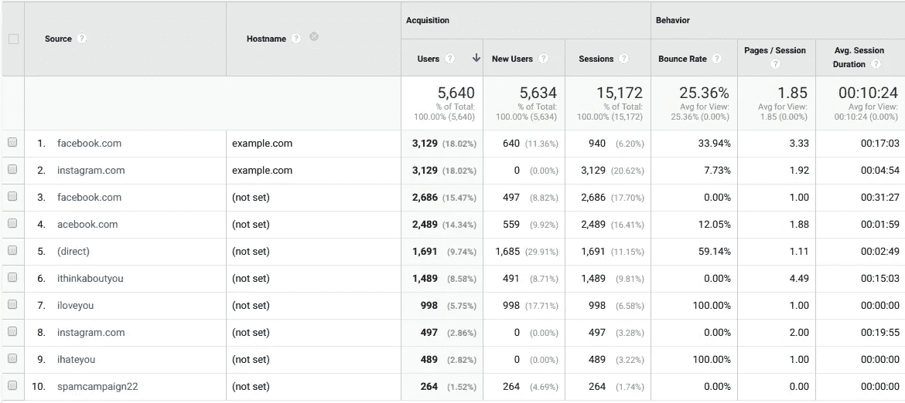

图片由作者提供

在这种情况下，我们的网站叫做 example。com。确切地说，该主机需要出现在报告的所有行中。但是所有可疑的推荐源都有值(未设置)，正如我们所看到的。我们终于找到了幽灵垃圾邮件！事实上，脸书和 Instagram 的流量也有一部分是垃圾邮件。这意味着这些机器人向 GA 发送虚假的点击，并试图使它们尽可能真实。

如果所有的机器人都发送一个主机值，就像报告中的字符串 9(hostname*ghost*)，我们永远不会知道我们有过多的访客和推荐数据。

在这些报告中忽略(未设置)会导致销售数据损坏，向物业发送虚假交易。因此，您会看到不在您的规格中的事件和您从未销售过的产品视图。

如果您已经设置了从 Google Analytics 到 Google BigQuery 的数据导出(无论是 [standard](https://support.google.com/analytics/answer/3437618?hl=en) 还是在 [OWOX BI Pipeline](https://www.owox.com/products/bi/pipeline/) 的帮助下)，这些虚假数据将增加数据库表的权重。因此，数据处理将会变慢，你将会在数据存储和处理上花费更多。

# 如何摆脱垃圾邮件流量

首先，您必须排除 bot 流量。打开**查看设置**，在**僵尸过滤**设置中勾选**排除已知僵尸和蜘蛛**的所有点击。这将排除可见的机器人。

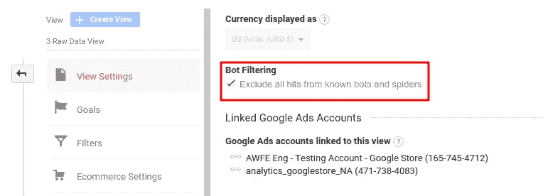

图片由作者提供

您也可以将过滤器应用于推荐来源。为此，打开**视图设置**，转到**滤镜**子菜单，然后点击**添加滤镜**。现在将过滤器的类型设置为**自定义**，选中**排除**，并选择推荐过滤器字段。在**过滤器模板**字符串中，输入您要从报告中排除其通信的可疑来源的名称。

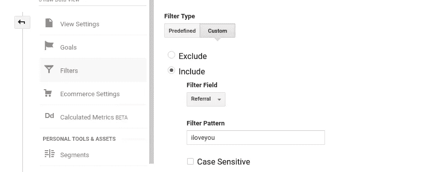

图片由作者提供

这种方法的局限性在于，我们无法利用真实网站的网址来排除来自僵尸程序的流量。否则，来自这些网站的合法流量也会被过滤掉。在这种情况下，我们可以尝试基于 IP 地址而不是来源进行阻止。如果你已经在 OWOX BI Pipeline 中建立了一个流，那么获取僵尸工具的 IP 地址就不是什么大事了。但是如果机器人不访问网站，IP 屏蔽就没有效果。

要消除幽灵垃圾邮件，请尝试使用*主机名*过滤器。设置过滤器时，选择**包含**，然后在**过滤器模式**字段中输入您网站的域名。

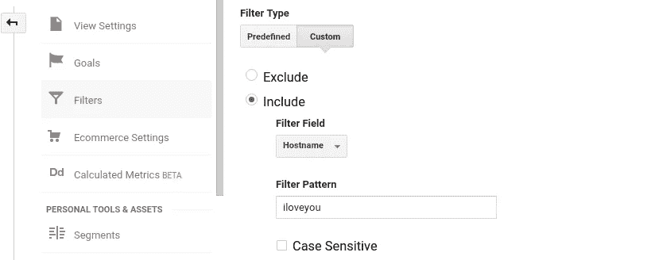

图片由作者提供

# 流量来源报告

流量来源报告帮助您评估广告来源和渠道的效率。在这些报告的帮助下，您可以比较您发起的每个活动的费用和收入，分析流量质量，并最终增加销售额。如果您看到这些报告中的值(未设置)，您将无法确定在哪些方面投入更多，哪些活动需要更改，以及哪些活动应该简单地结束。

如果您没有值得信赖的数据，您就无法正确设置重新定位或为某个活动选择受众群体。显然，不可信的数据也不能应用于队列分析、收入预测、[客户终身价值(CLV)](https://www.owox.com/blog/use-cases/customer-lifetime-value/) 等增强型报告。

## 所有交通报告

让我们看一些所有交通报告的例子。让我们假设你想知道哪个频道给你最新的访问者。为了找到答案，让我们打开“所有流量-通道”报告，选择通道作为主要参数。我们可以在字符串 4 中观察到 7.19%的新访问者的值(未设置)。但是在这个字符串中隐藏了哪个或哪些特定的频道还不清楚。

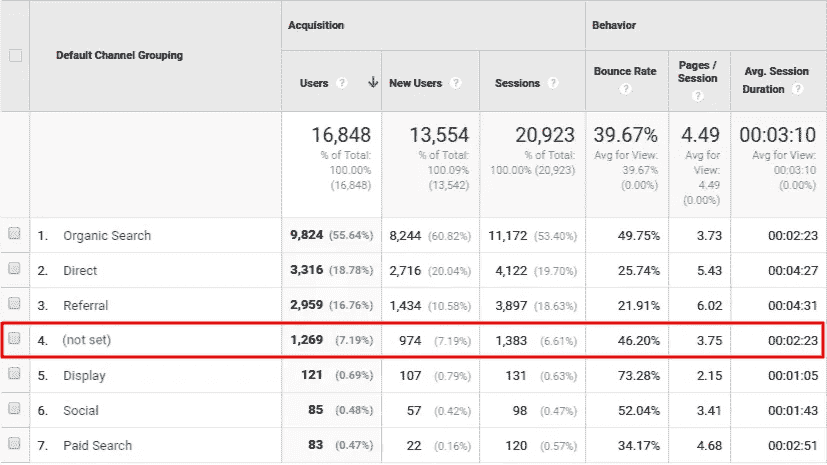

图片由作者提供

在“所有流量—源/媒体”报告中，您可以看到类似的情况:

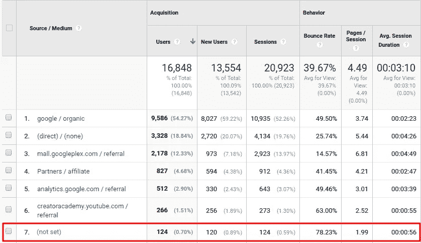

图片由作者提供

为什么此报告显示(未设置的)值？因为部分渠道和来源是由 Google Analytics 自动识别的:有机搜索、其他网站的推荐、[直接流量](https://www.owox.com/blog/articles/direct-traffic/)。但是对于一个特殊的活动或广告服务，你需要 UTM 标签。如果 UTM 标签包含错误，就会出现问题。

UTM 标签是包含在来自广告消息的 URL 中的代码片段，并且引导到目标网站。这里有一个例子:

site.com/?UTM _ source = Google & UTM _ medium = CPC & UTM _ campaign = test

有三个必需的 UTM 参数:utm_source、utm_medium 和 utm_campaign。还有两个可选参数:utm_term 和 utm_content。这些参数的值可以是 google、cpc 或 test。

UTM 代码中导致(未设置)报告的典型错误包括:

*   拼错的参数。
*   参数和它的值之间没有等号。
*   没有用&符号分隔的参数和值对。
*   其他语法错误:重复的问号等。

为了避免这些错误，使用[专门的 URL 创建工具](https://ga-dev-tools.appspot.com/campaign-url-builder/)来帮助自己标记 URL。

## 活动报告

在“营销活动-有机关键词”报告中，您可能会看到两种有趣的值:(未设置)和(未提供)。

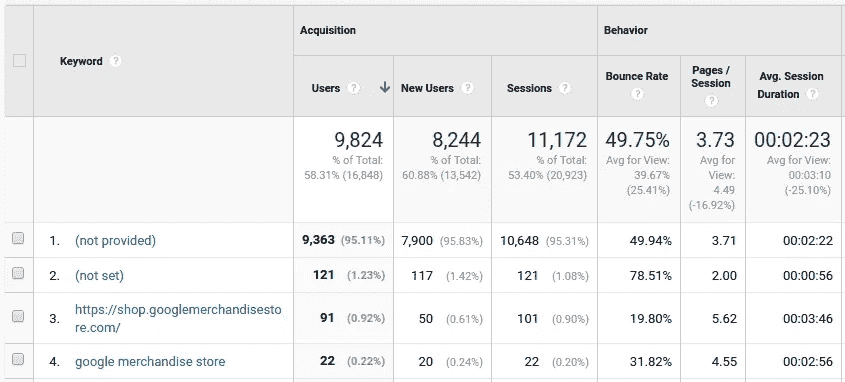

图片由作者提供

(未设置)值意味着 Google Analytics 无法准确定义哪个请求为您的网站带来了有机流量。这可能是由以下原因造成的:

*   一些不发送关键字信息的旧搜索系统
*   忘记在使用手动 UTM 标签的活动中设置关键字
*   来自电子邮件中链接的流量

(未提供)值通常在此报告中更常见。这意味着访问者在 HTTPS 协议的帮助下进行了搜索。根据其隐私政策，谷歌必须在这种情况下隐藏关键词信息。

## 谷歌广告报告

这组报告将帮助你估计你的广告在谷歌展示网络中的效率，并让你知道用户点击广告后做了什么。(未设置)值帮助您优化付费流量的费用。

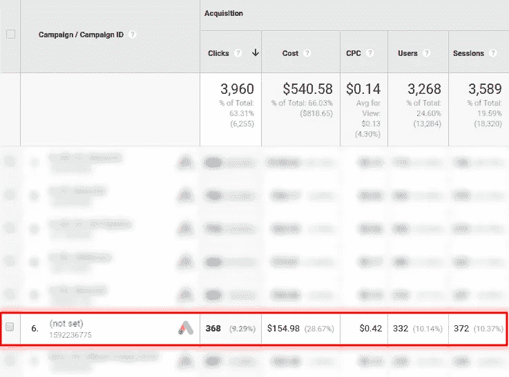

图片由作者提供

## Google Ads 报告中的一个(未设置的)值可能是由几个原因造成的

1.不恰当的[谷歌广告和谷歌分析的整合](https://www.owox.com/blog/articles/how-to-link-your-google-adwords-and-analytics-accounts/)(检查你是否在 GA 中连接了正确的视图和广告中的账户。)

2.谷歌广告中的[自动标记被关闭](https://support.google.com/google-ads/answer/3095550?co=ADWORDS.IsAWNCustomer%3Dfalse&hl=en)。当访问者点击广告消息时，谷歌点击标识符(GCI)值被添加到目标 URL。它保存在该网站域名的一个新的谷歌分析 cookies 文件中。由于这一功能，我们可以在谷歌分析报告中看到谷歌广告的活动和费用数据。

如果您的网站没有自动标记功能，您可以手动标记链接。为此，打开 Google Analytics 资源首选项并选中复选框**允许手动标记**。

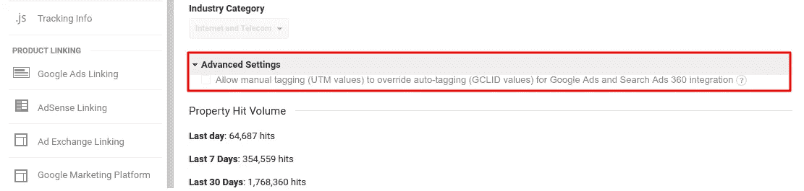

图片由作者提供

3.同时使用手动和自动标记。

4.无效点击。Google Ads 认为这些是机器人或恶意软件的点击，或者是对广告商没有任何用处的两次或三次点击。你可以在[谷歌帮助中心](https://support.google.com/google-ads/answer/2549113)找到更多关于无效点击以及如何处理的信息。

5.重定向。当从一个 URL 重定向到另一个 URL 时， *gclid* 可能会丢失。结果，你会看到(未设置)。你可以用 Chrome 开发者工具检测并修复这个问题。在[谷歌分析帮助中心](https://support.google.com/analytics/answer/2938246?hl=en)阅读更多信息。

6.语法和 *gclid* 问题，例如，如果 URL 中的寄存器发生变化，或者如果您的网站因为超过 100 个符号而删除了 *gclid* 参数，或者如果您的网站设置禁止处理正确处理标签所需的请求。您可以通过确保所有脚本正确运行来解决此问题。

# 行为报告

您可以在“网站内容-登录页面”报告中找到(未设置的)值:

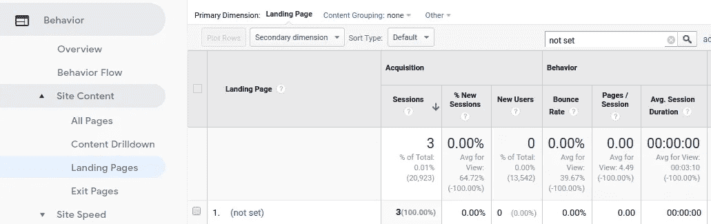

图片由作者提供

此报告显示访问者从哪些页面开始他们的会话。登录页面是新访问者熟悉您的网站的页面。在这里检查跳出率。跳出率是在页面上没有采取任何行动就离开的访问者的百分比。

如果你在这个报告中没有数据，你就无法在高跳出率的基础上定义哪些页面需要改进。

如果选择主要维度“内容分组”,您还可以在“网站内容报告”组的其他报告中找到(未设置的)值。

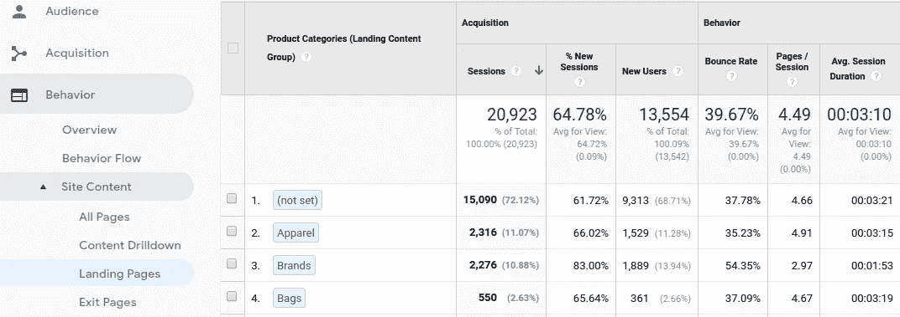

图片由作者提供

您可以将网站内容分成逻辑组，如品牌或产品类别，以便在一份报告中比较它们的效率。很明显，如果你发现(未设置)代替了类别名，那么比较将毫无意义。

## 在行为报告中，如果出现以下情况，可能会出现(未设置)

1.会议在午夜或访客等待 30 分钟后结束。这 30 分钟后完成的任何操作都将被标记为新会话。如果此操作是会话中的唯一点击，则登录页面值将为(未设置)。

2.会话没有页面或屏幕视图。如果您设置了删除特定页面视图的过滤器，或者屏幕和页面跟踪设置错误，则可能会发生这种情况。查看[谷歌帮助中心](https://support.google.com/analytics/answer/2820717?hl=en)来解决这个问题。

3.您一次使用了两个跟踪代码(分析。js 和 gtag。js)，在这种情况下，一个会话框架中的点击将不会被链接。你应该使用一个代码。谷歌分析推荐[使用 gtag。js](https://developers.google.com/analytics/devguides/collection/upgrade/analyticsjs?hl=en) 。

4.如果(未设置)值出现在内容分组报告中，可能是由于页面标题中的<title>标签创建错误或根本没有创建。要知道哪些页面导致了问题，请使用附加页面参数。也许您的 GA 跟踪代码在<title>标签之前启动。在这种情况下，交换顺序。</title>

# 转换报告

这些报告有助于跟踪你的网站上的转换，并分析买家的行为。它们包含关于交易、产品、目标等的有用信息。

## 电子商务报告小组

电子商务-产品列表性能报告中的(未设置)值使得无法知道哪些产品最受欢迎，哪些列表应该移动或需要改进，以及哪些应该从该网站部分删除。

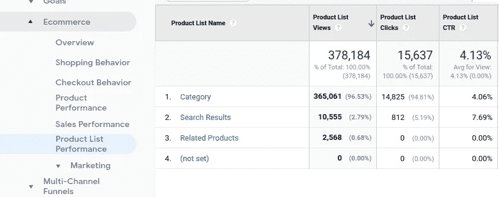

图片由作者提供

没有准确的数据，你就无法针对受众群体开展个性化的营销活动。例如，您不能在产品卡上设置折扣块，然后将那些在购买其他产品时查看折扣的访问者分隔开来，并向他们发送包含特殊优惠的电子邮件。

让我们仔细看看另一个例子。假设您在网站上发起了一项内部推广活动，创建了一个对您的活动感兴趣的细分市场，发送带有个人优惠的电子邮件。如果你打开电子商务——营销——内部推广，看到(未设置)值，这意味着你的部分受众没有定义。因此，你失去了将这些用户添加到你的细分市场并赚取更多的机会。

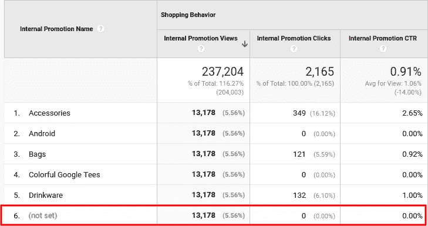

图片由作者提供

通常,(未设置的)值出现在电子商务报告中，因为增强型电子商务跟踪代码缺少单独参数的值:产品列表、订单优惠券、产品优惠券等。要解决这个问题，您需要正确地设置增强的电子商务，以便将必要参数的值和点击发送到 Google Analytics。

## 目标报告

目标-反向目标路径报告显示访问者在哪个页面上实现了他们的目标，以及在此之前他们访问的三个页面。

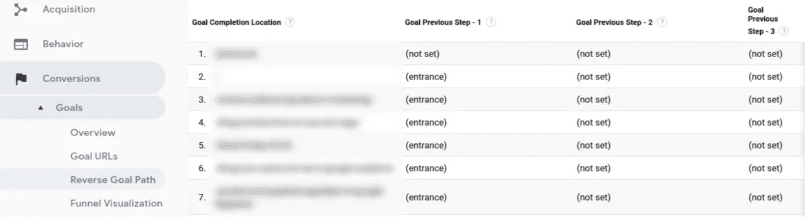

图片由作者提供

(未设置的)值将始终出现在此报告中，因为访问者可以在不到三步的时间内实现他们的目标。如果访问者进入网站并立即注册，第 2 步和第 3 步将(未设置)，如上面截图中的字符串 2 所示。

# 结论

(未设置的)值可以在大多数谷歌分析报告中找到。表示系统要么没有数据，要么不识别。发生这种情况有各种原因。有些我们可以解决，有些我们不能，但我们可以在分析数据时考虑到这一点。

如果您忽略报表中的(未设置的)值，您的业务将会付出高昂的代价。谁喜欢把钱投在低效的措施上？数据损坏会导致曲解报告和不可靠的决策。