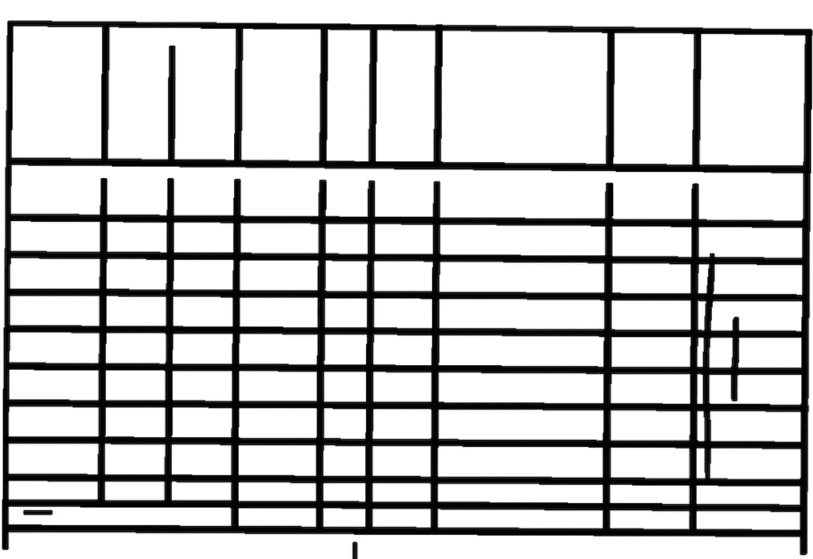
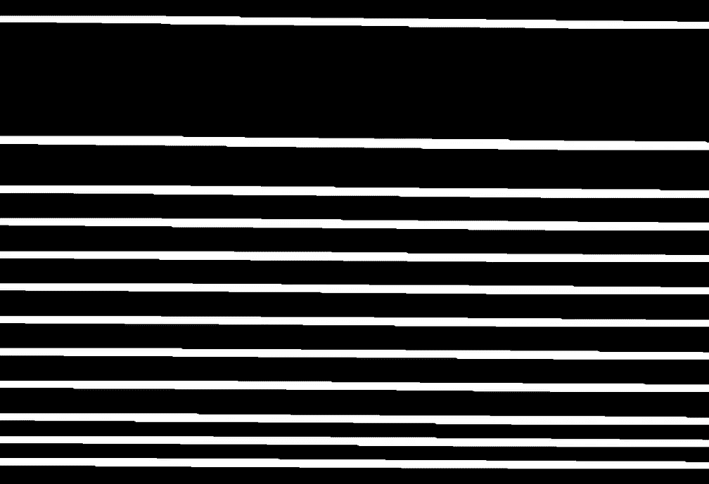
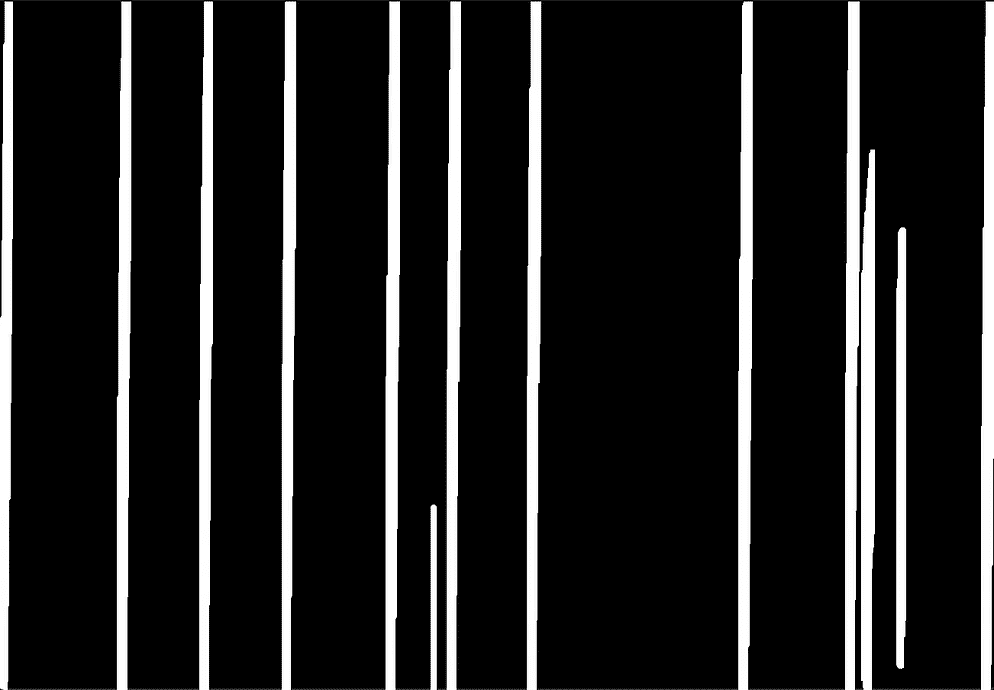
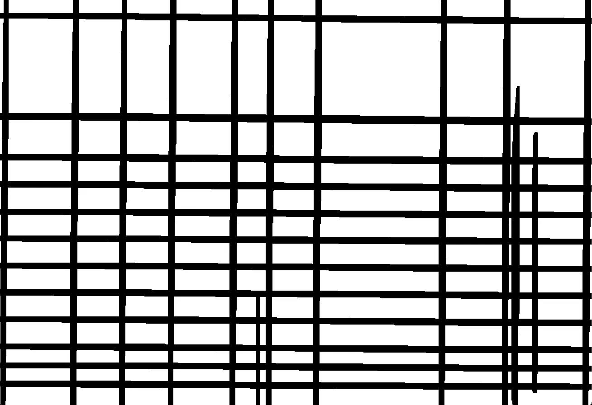
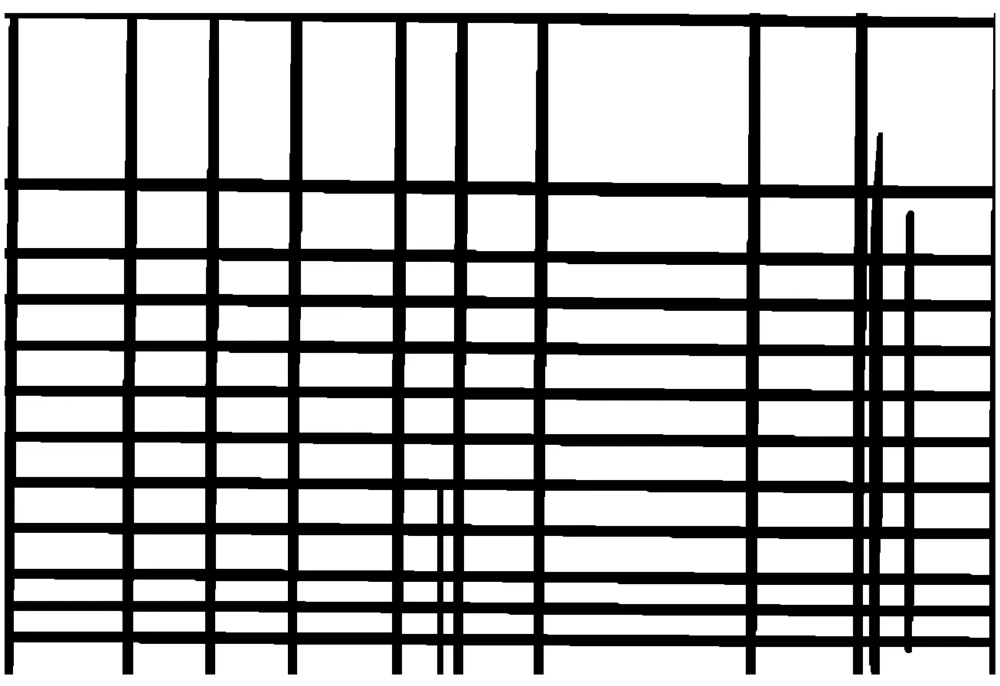

# 表格识别中如何识别和修复断线

> 原文：<https://towardsdatascience.com/how-to-recognize-and-fix-broken-lines-in-table-recognition-1a19f22d59f2?source=collection_archive---------13----------------------->

## 使用 OpenCV / Python 修复表格的孔洞和缺失轮廓


来源:[unsplash](https://unsplash.com/photos/fKAjOxgZNPg)([agrêBarros](https://unsplash.com/@agebarros))。

当文档通过扫描或照片数字化时，图像质量可能会受到错误设置或恶劣条件的影响。在表格识别的情况下，这可能导致表格结构损坏。因此，一些线条可能会有轻微的瑕疵，甚至有洞，并且桌子作为一个整体不能被认为是一个连贯的系统。有时创建的表格在单元格的某些边上没有线条。在这种情况下，系统会用上面单元格的行来关闭这些行。有各种各样的表格和单元格类型，因此建议的代码可能并不完全适用于所有情况。尽管如此，只要稍加修改，它在许多情况下都是有用的。

大多数细胞识别算法是基于线和细胞结构。由于“遗忘”的细胞，没有线导致识别率差。这种方法也是如此。台词是必须的。如果你的桌子没有清晰可辨的线条，那就没用了。**但是现在，让我们来看看代码！**

首先，我们需要进口。在这种情况下，它仅限于两个导入:OpenCV 和 NumPy。

```
import cv2
import numpy as np
```

然后我们需要加载包含表格的图像/文档。如果它是一个完整的文档，文本围绕着表格，你需要首先识别表格，然后将图像剪切到表格大小。(要了解更多关于表格识别和切割到表格尺寸的信息，[点击此处](/a-table-detection-cell-recognition-and-text-extraction-algorithm-to-convert-tables-to-excel-files-902edcf289ec)。)

```
**# Load the image** image = cv2.imread(‘/Users/marius/Desktop/holes.png’, -1)
```



输入图像。

正如您在输入图像中看到的，第二行中的单元行没有完全连接。在表格识别中，算法不会识别和考虑第二行，因为单元格不是封闭的方框。本文提出的解决方案不仅适用于这种间隙情况。它也适用于表格中的其他折线或孔洞。

现在，我们需要获取图像的大小(高度和宽度)并将其存储在变量 hei 和 wid 中。

```
(hei,wid,_) = image.shape 
```

下一步是通过高斯滤波器进行灰度和模糊处理。这有助于识别线条。关于灰度的更多信息，[点击这里](/understanding-the-basics-of-digital-image-processing-and-computer-vision-using-opencv-8bc0e67243c8)。

```
**#Grayscale and blur the image**
gray = cv2.cvtColor(image, cv2.COLOR_BGR2GRAY)
blur = cv2.GaussianBlur(gray, (3,3), 0)
```

然后我们需要设定图像的阈值。如果你想了解更多关于阈值处理的知识，你可以阅读这篇文章:[点击这里](/understanding-the-basics-of-digital-image-processing-and-computer-vision-using-opencv-8bc0e67243c8)(一直到*二值化图像*)。

```
**#Threshold the image**
thresh = cv2.threshold(blur, 0, 255, cv2.THRESH_BINARY_INV + cv2.THRESH_OTSU)[1]
```

然后使用 OpenCV 的 findContours 算法获得所有轮廓的位置。对于所有轮廓，绘制边界矩形以创建表格的框/单元。然后，这些框与四个值 x，y，width，height 一起存储在列表框中。

```
**#Retrieve contours** 
contours, hierarchy = cv2.findContours(thresh, cv2.RETR_TREE, cv2.CHAIN_APPROX_SIMPLE)**#Create box-list**
box = []**# Get position (x,y), width and height for every contour** for c in contours:
    x, y, w, h = cv2.boundingRect(c)
    box.append([x,y,w,h])
```

然后，所有的高度、宽度、x 和 y 分别存储在列表中，并计算最小高度、宽度以及 x 和 y。此外，y 和 x 的最大值是必要的。

```
**#Create separate lists for all values**
heights=[]
widths=[]
xs=[]
ys=[]**#Store values in lists** for b in box:
    heights.append(b[3])
    widths.append(b[2])
    xs.append(b[0])
    ys.append(b[1])**#Retrieve minimum and maximum of lists** min_height = np.min(heights)
min_width = np.min(widths)
min_x = np.min(xs)
min_y = np.min(ys)
max_y = np.max(ys)
max_x = np.max(xs)
```

存储的值现在用于了解表的位置。最小 y 值可用于获取表格的最上面一行，该行可视为表格的起点。最小 x 值是表格的左边缘。为了获得大概的大小，我们需要检索最大的 y 值，也就是表格底部的单元格或行。最后一行的 y 值表示单元格的上边缘，而不是单元格的底部。要考虑单元格和表格的整体大小，需要将最后一行的单元格高度加上最大值 y，以获得表格的完整高度。最大值 x 将是表格的最后一列和最右边的单元格/行。x 值是每个单元格的左边缘，我们需要连续地将最后一列的宽度加上最大 x 值，以检索表格的整个宽度。

```
**#Retrieve height where y is maximum (edge at bottom, last row of table)**
for b in box:
    if b[1] == max_y:
        max_y_height = b[3]**#Retrieve width where x is maximum (rightmost edge, last column of table)** for b in box:
    if b[0] == max_x:
        max_x_width = b[2]
```

在下一步中，提取所有水平线和垂直线并分别存储。这是通过创建一个内核来实现的，该内核设定阈值并应用形态学操作。水平内核的大小为(50，1)。你可以根据图片的大小来调整尺寸。垂直内核的大小为(1，50)。

形态学操作根据其几何形状对检测到的结构进行变换(Soille，第 50 页，1998)。膨胀是应用最广泛、最基本的形态学操作之一。如果内核下至少有一个像素是白色的，则原始图像中正在查看的像素将被视为白色。因此，白色区域被扩大。请注意，由于反转，背景是黑色的，前景是白色的，这意味着表格线目前是白色的。扩张可以被看作是最重要的一步。孔洞和断线现在已修复，为了进一步识别表格，将考虑所有单元格。

```
**# Obtain horizontal lines mask** horizontal_kernel = cv2.getStructuringElement(cv2.MORPH_RECT, (50,1))
horizontal_mask = cv2.morphologyEx(thresh, cv2.MORPH_OPEN, horizontal_kernel, iterations=1)
horizontal_mask = cv2.dilate(horizontal_mask, horizontal_kernel, iterations=9)**# Obtain vertical lines mask**
vertical_kernel = cv2.getStructuringElement(cv2.MORPH_RECT, (1,50))
vertical_mask = cv2.morphologyEx(thresh, cv2.MORPH_OPEN, vertical_kernel, iterations=1)
vertical_mask= cv2.dilate(vertical_mask, vertical_kernel, iterations=9)
```



表格的水平和垂直掩码。

然后使用 OpenCV 的 bitwise_or 操作将水平和垂直两个掩码合并到一个表中。为了检索原始的背景和前景，通过从 255 中减去 cv2.bitwise_or 来反转图像。

```
**# Bitwise-and masks together**
result = 255 — cv2.bitwise_or(vertical_mask, horizontal_mask)
```



合并和反转水平和垂直遮罩。

如果表格被文本包围，而不是孤立的(在我的例子中，它没有被包围)，我们把它剪下来，放在白色背景上。现在我们需要之前检索的表的大小。我们通过使用最小 y(它是顶部的边缘)、最大 y +最大 y 单元的高度(它是底部的边缘)、最小 x(它是左侧边缘)和最大 x +最大 x 单元的宽度(它是右侧边缘)将最终图像切割成表格大小。然后，图像被裁剪为表格的大小。创建文档原始大小的新背景，并用白色像素完全填充。检索图像的中心，修复后的表格与白色背景合并，并设置在图像的中心。

```
**#Cropping the image to the table size**
crop_img = result[(min_y+5):(max_y+max_y_height), (min_x):(max_x+max_x_width+5)]**#Creating a new image and filling it with white background** img_white = np.zeros((hei, wid), np.uint8)
img_white[:, 0:wid] = (255)**#Retrieve the coordinates of the center of the image**
x_offset = int((wid — crop_img.shape[1])/2)
y_offset = int((hei — crop_img.shape[0])/2)**#Placing the cropped and repaired table into the white background**
img_white[ y_offset:y_offset+crop_img.shape[0], x_offset:x_offset+crop_img.shape[1]] = crop_img**#Viewing the result**
cv2.imshow(‘Result’, img_white)
cv2.waitKey()
```



修复了虚线的结果图像。

这就是结果。该方法可用于表格中多种类型的折线、间隙和孔洞。这个结果是进一步表格识别的基础，在我的[另一篇文章](/a-table-detection-cell-recognition-and-text-extraction-algorithm-to-convert-tables-to-excel-files-902edcf289ec)中有解释。所解释的方法应用于一个空表。您也可以将它应用于包含文本或被文本包围的表格。对于包含文本的表格，仍然需要将包含具有数据的表格的原始图像与具有修复的孔洞的最终图像合并。这可以通过 OpenCV 位运算来完成，并且不会太复杂。

**我希望你喜欢我的教程，并能将其用于你自己的项目。**

# 想看更多这样的故事？

## [上手](https://medium.com/@hucker.marius/membership)