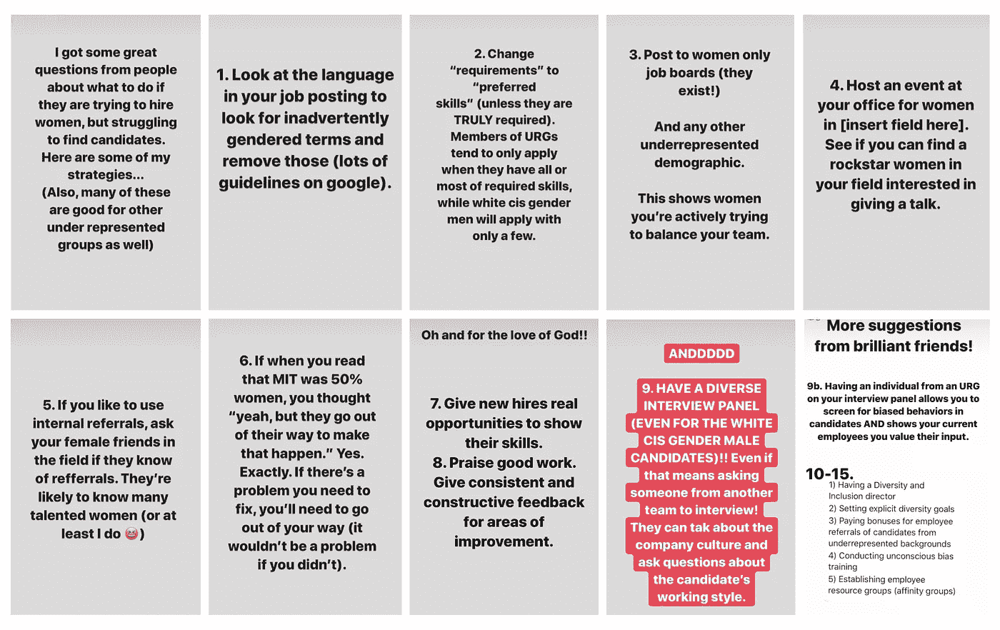

# 如何招(和留！代表不足群体的个人

> 原文：<https://towardsdatascience.com/how-to-recruit-and-keep-members-of-under-represented-groups-on-your-team-d0df50bae431?source=collection_archive---------29----------------------->

## 十七(..和计数..)提高公司多样性的策略

这份名单是与朋友、同事和其他社交媒体关系合作创建的。有些观点特别关注招募女性的方式，因为这是我最了解和理解的，但我相信这也是从其他代表性不足的群体中引入个人的有用方式。

1.  看看你的招聘启事中的语言。寻找不经意的性别术语，并利用在线资源进行筛选。
2.  将“需求”改为“首选技能”——除非它们是真正的需求。urg 成员倾向于只申请那些拥有大部分所需技能的职位，而白人 cis 性别的男性更愿意申请那些只有少量要求的职位。
3.  针对代表性不足的人口统计向职务公告板发布。这不仅会给你带来更多来自这些群体的申请人，还会向你的申请人表明你对多样性的重视。(作为一名白人女性数据科学家，我熟悉编写代码的[女性](https://www.womenwhocode.com)和[女性以及机器学习和数据科学](http://wimlds.org)，但还有更多，谷歌搜索会帮助你找到适合你职位的发布位置)
4.  在您的办公室为[在此插入字段]的女性举办一次活动。看看你是否能在你的领域找到一个有兴趣在活动中发言的摇滚女明星，即使她不在你的公司工作。这同样适用于在你的领域招聘黑人，LGBTQIA 等。依我看，最好是单独举办针对特定群体的活动，而不是为几个代表性不足的群体举办一次联合活动，以专注于特定的事情。(我当然愿意接受其他观点！)
5.  如果你喜欢用内部引荐，那就找你所在领域的女性朋友引荐。他们可能认识很多有才华的女性。(同样，这也适用于其他人口统计)。
6.  不要让它看起来像一件坏事，你需要“走出你的方式”来招募那些不像你的团队已经有的人。这是一个问题，解决它的唯一方法是走出自己的路。
7.  给新员工真正的机会，让他们在你的公司茁壮成长，展示他们的技能。
8.  表扬好的工作。对需要改进的地方给予一致和建设性的反馈。
9.  为所有候选人设立一个多元化的面试小组。这有助于你筛选候选人中有问题的态度或偏见，告诉你的员工他们的意见是有效的，并给候选人一个更平等的机会。
10.  聘用一名多元化、公平和包容(DEI)主管。
11.  设定明确的多元化目标。追踪你在这些方面的进展，注意哪些策略对实现你的目标最有效。
12.  向推荐来自代表性不足的背景的候选人的员工提供奖金。
13.  进行无意识偏见训练。
14.  在你的公司建立员工资源组(亲和组)。
15.  使推广标准不分性别。关注你需要从个人身上得到的结果，而不是你在这些方面描述候选人的方式。
16.  浏览你发送给候选人、新员工和雇员的所有信息，寻找性别代词(例如，“他将具备以下技能…”)
17.  对于每个职位，至少面试两个来自代表名额不足的候选人，以防止一个候选人相对于一群同质的候选人来说看起来像局外人。

# 我作为 STEM 女性的就业背景

通过自由职业和全职工作，我在很多团队工作过。大多数时候，团队成员都是异性恋、独联体性别的白人或亚裔男性。有几次，我是队里唯一的女性。在一家公司工作的 9 年里，我是第一个加入 7 人团队的女性。(在我的第一天，有人评论说我是“试验品”,以决定团队是否有能力让一名女性加入。)

三年前，我为自己制定了一个规则。我不会参加所有白人或亚裔男性面试小组的面试。当招聘人员给我安排了一次面试时，我礼貌地要求他们在面试者名单中特别添加一名女性或非二元个体。

这一要求对招聘人员产生了两极分化的影响。我已经让招聘人员感谢我提出这个要求，并把令人印象深刻的女性列入我的面试名单。

我的要求也激怒了招聘人员。我被告知这个要求是不可能满足的。有人告诉我，我不愿意加入一个全是男性的大型团队，这是他们的团队中没有女性的原因，我是真正的问题所在。

# 在 Instagram 上吸引我的朋友

几天前，我和一位招聘人员进行了一次特别糟糕的交流，我在 Instagram stories 上发泄了一下。让我特别沮丧的是，有一种观点认为面试名单缺乏多样性的原因是“管道问题”，是雇主无法控制的。我的机械工程专业毕业班女生比男生多。我不知道他们还需要这条管道走多远。

在发泄情绪的过程中，我遇到了意想不到的转机。我收到了很多人真诚的请求，询问如何让他们的申请人多样化。我开始张贴我对我的故事的回答，然后张贴别人发给我的想法。我从一个女性的角度写了一些吸引女性的方法，然而，我认为这些是吸引来自任何代表不足群体(URG)的候选人的有用技巧:

我的 insta rant

(9b 的荣誉归于[凯西·韦塞尔](https://medium.com/u/eb879e156af6?source=post_page-----d0df50bae431--------------------------------)。10-15 的荣誉属于兰登·迪基。)

# 朋友的反馈

一个朋友要求澄清什么会被认为是“不经意的性别术语”我很难准确定义这些是什么，但我认为任何暗示“兄弟”文化的东西，无论是说所有员工都是“摇滚明星忍者”，还是要求候选人喜欢“努力工作，努力聚会”。

我众包了一些更好的方法来描述无意中性别化的术语， [Maddie Mirzoeff](https://medium.com/u/ba7aa6ea81a3?source=post_page-----d0df50bae431--------------------------------) 向我推荐了[这篇文章](https://business.linkedin.com/talent-solutions/blog/job-descriptions/2016/17-words-that-are-turning-women-away-from-your-jobs)。她还在列表中添加了下面的第一个要点。

这些截图之后，我收到的一些建议包括:

*   使推广标准不分性别。为了做到这一点，你必须确保你描述的是结果而不是个人。所以不要说“有高管风度”，而要说“能够主持会议，并得出结果。”
*   通过软件发布招聘信息，这些软件会检查有问题的措辞，比如 Textio ( [劳伦·毕晓普](https://medium.com/u/e1bfe56df4da?source=post_page-----d0df50bae431--------------------------------))
*   浏览你所有的表格回答中的性别代词，确保不要用“他将具备这些技能”来描述一个好的候选人
*   面试至少两个 urg 的候选人，而不是一个。[这篇文章](https://hbr.org/2016/04/if-theres-only-one-woman-in-your-candidate-pool-theres-statistically-no-chance-shell-be-hired)解释了为什么*会显著增加 URGs 的候选人获得该角色的公平机会。*

# *后续步骤:*

*我希望继续补充这个列表。我也希望通过分享我的白人男性朋友的问题来帮助我制定这个列表，那些不是 URGs 成员的人会觉得加入对话和提问很舒服。我对其他人的想法很感兴趣，他们可以创建一个名单，任何人都可以添加到名单中，同时也给人们的贡献带来荣誉。*

*成功地包容未被充分代表的群体，尤其是处于这些群体交汇点的个人，将需要一些创造力来颠覆现状。确定可操作的清晰的后续步骤并不容易。但我相信 STEM 领域的专业人士能够应对这一挑战。*