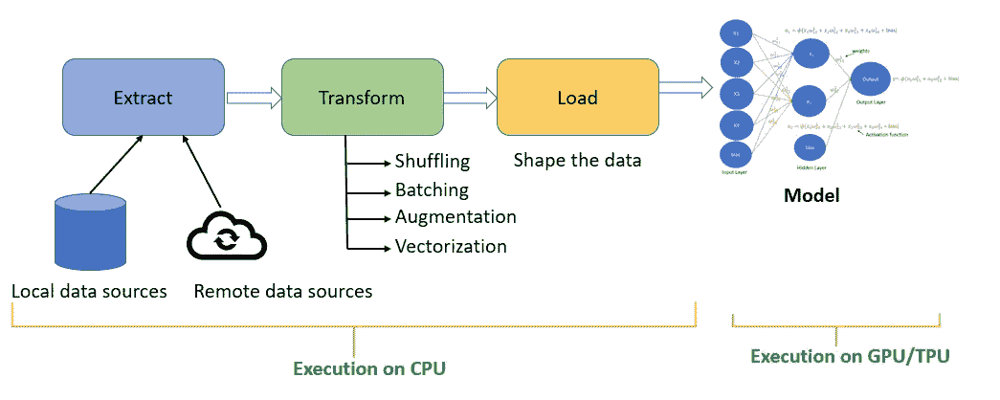
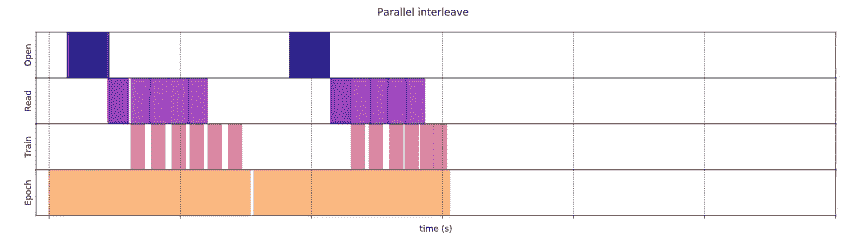
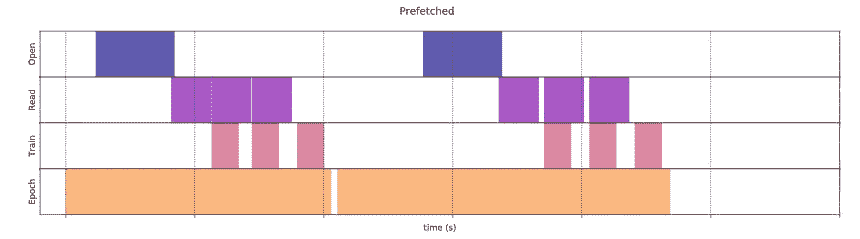
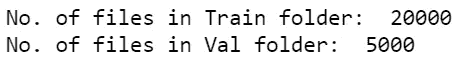
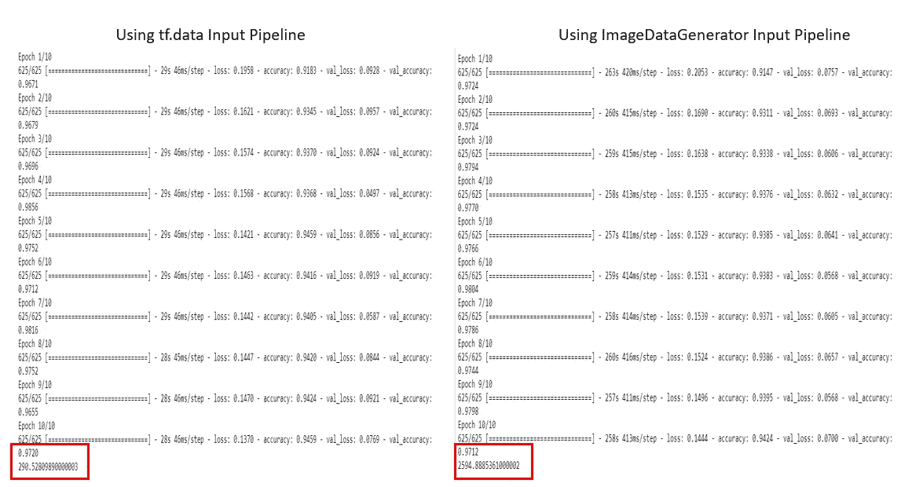

# 如何使用 tf.data 减少深度学习模型的训练时间

> 原文：<https://towardsdatascience.com/how-to-reduce-training-time-for-a-deep-learning-model-using-tf-data-43e1989d2961?source=collection_archive---------8----------------------->

## *学习为图像创建输入管道，以高效地使用 CPU 和 GPU 资源来处理图像数据集，并减少深度学习模型的训练时间。*

*在这篇文章中，你将学到*

*   *在模型训练中，CPU 和 GPU 资源是如何以一种天真的方式使用的？*
*   *如何高效利用 CPU 和 GPU 资源进行数据预处理和训练？*
*   *为什么要用 tf.data 构建高效的输入管道？*
*   *如何使用 tf.data 为图像建立高效的输入数据管道？*

***一个朴素的方法如何为输入数据管道和模型训练工作？***

在创建输入数据管道时，我们通常执行 ETL(提取、转换和加载)过程。



*   **提取**、**从不同的数据源提取数据，如本地数据源、**可以从硬盘或远程数据源提取数据，如云存储。
*   **转换**，你将**洗牌数据，创建批次，应用矢量化或图像放大。**
*   **加载数据包括清理数据并将其塑造成一种我们可以传递给深度学习模型进行训练的格式**。

数据的预处理发生在 CPU 上，模型通常在 GPU/TPU 上训练。

在简单的模型训练方法中， **CPU 预处理数据，为模型训练做好准备，而 GPU/TPU 处于空闲状态**。当 GPU/TPU 开始训练模型时，CPU 是空闲的。这不是管理资源的有效方式，如下所示。


原始数据预处理和训练方法

有哪些方法可以加快培训过程？

为了加快训练，我们需要优化数据提取、数据转换和数据加载过程，所有这些都发生在 CPU 上。

**数据提取:优化从数据源读取的数据**

**数据转换:并行化数据扩充**

**数据加载:在训练前一步预取数据**

这些技术将有效地利用 CPU 和 GPU/TPU 资源进行数据预处理和训练。

***怎样才能实现输入管道的优化？***

## 优化数据提取

通过同时处理多个文件来优化数据提取。 **tf.data.interleave()通过交错读取文件的 I/O 操作和应用数据预处理的 map()优化数据提取过程**。



来源:[https://www . tensor flow . org/guide/data _ performance # parallelising _ data _ extraction](https://www.tensorflow.org/guide/data_performance#parallelizing_data_extraction)

要重叠的数据集数量由 ***cycle_length*** 参数指定，而并行度由***num _ parallel _ calls***参数设置。您可以使用 AUTOTUNE 来决定要实现的并行级别。

***num _ parallel _ calls*产生多个线程，利用机器上的多个内核，通过使用多个 CPU 来并行化数据提取过程。**

***如何知道要用多少个 CPU 或核心？***

您可以找到机器上的内核数量并指定，但更好的选择是使用**tf.data . experimental . auto tune .**将并行级别委托给 TF . data

*   自动调优将要求 tf.data 在运行时动态调优该值。
*   tf.data 将在所有可调操作中找到正确的 CPU 预算。
*   自动调优决定缓冲区大小、CPU 预算以及 I/O 操作的并行级别。

## 并行数据转换

图像增强是预处理的一部分，发生在 CPU 上。图像的每一次放大、归一化、重新缩放都是一种代价高昂的操作，并且会减慢训练过程。

如果你能通过并行处理利用所有内核来运行所有这些图像操作。

***tf.data.map()* 可以采用用户定义的函数，该函数包含您想要应用于数据集的所有图像增强。**

**tf.data.map()有一个参数 *num_parallel_calls* 来产生多个线程，以利用机器上的多个内核来使用多个 CPU 并行化预处理。**

## 缓存数据

***cache()* 允许将数据缓存在指定文件或内存中**。

*   在内存中缓存时，第一次迭代数据时，将缓存数据，所有后续迭代，将从缓存中读取数据。
*   当缓存一个文件时，即使是第一次迭代数据也会从缓存的文件中读取。
*   缓存为每次迭代产生相同的元素，在缓存数据后，使用 shuffle()随机化迭代中的元素。

## 通过重叠数据处理和训练来预取数据

**TF . data 中的预取功能重叠了数据预处理和模型训练。数据预处理比训练提前一步运行，**如下所示，这减少了模型的总训练时间。



来源:[https://www . tensor flow . org/guide/data _ performance #预取](https://www.tensorflow.org/guide/data_performance#prefetching)

要预取的元素数量应该等于或大于用于单个训练步骤的批量大小。我们可以使用 AUTOTUNE 来提示 tf.data 在运行时动态分配缓冲区大小值。

**所有的操作:*映射*，*预取*，*交错*，*批量*，*重复*，*混洗，*和*缓存*都是 tf.data 的一部分，可以让你构建**

*   通过使用计算资源、GPU、CPU 和 TPU，更快、更高效地建立数据管道，高效地从数据源获取数据。
*   灵活处理不同的数据格式，如文本数据、图像和包含数字和分类数据的结构化数据。
*   通过应用数据扩充、混排数据集和创建用于训练的批量数据，轻松构建复杂的输入数据管道

***如何使用 tf.data 为自定义影像数据集构建数据管道？***

在本节中，您将为来自 Kaggle 的流行的 C [ats 和 Fogs 数据集构建一个数据输入管道。](https://www.kaggle.com/c/dogs-vs-cats/data)

这里我们将使用 MobileNetV2 和 TensorFlow 2.3 进行迁移学习

## 导入所需的库

```
**import tensorflow as tf
config = tf.compat.v1.ConfigProto()
config.gpu_options.allow_growth = True
sess = tf.compat.v1.Session(config=config)
import numpy as np
import pandas as pd
import pathlib
import os
from os import getcwd
import pandas as pd
from glob import glob
import multiprocessing
from tensorflow.keras.applications.mobilenet_v2 import preprocess_input**
```

为数据集设置 train 和 val 目录

```
**train_dir=r'\dogs-vs-cats\train_data'
val_dir=r'\dogs-vs-cats\validation_data'**
```

## 将文件转换为数据集对象

使用***TF . data . dataset . list _ files()***根据匹配的 glob 模式返回文件名。这里我们希望所有的文件都来自 train_dir 和 val_dir 文件夹下的子文件夹，所以我们指定了“\*\\*”

```
**train_files = tf.data.Dataset.list_files(str(train_dir + '\\*\\*'), shuffle=False)**
**val_files = tf.data.Dataset.list_files(str(val_dir + '\\*\\*'), shuffle=False)**#getting the number of files in train and val dataset
**train_num_files=len([file for file in glob(str(train_dir + '\\*\\*'))])
val_num_files=len([file for file in glob(str(val_dir + '\\*\\*'))])** print("No. of files in Train folder: ",train_num_files)
print("No. of files in Val folder: ",val_num_files)
```



## 预处理训练和验证数据集

设置参数

```
epoch=10
batch_size = 32
img_height = 224
img_width = 224
```

**应用 MobileNet 的预处理技术**

```
**#Get class names from the folders
class_names = np.array(sorted([dir1 for dir1 in os.listdir(train_dir)]))
class_names**#To process the label
**def get_label(file_path):**
  # convert the path to a list of path components separated by sep
 ** parts = tf.strings.split(file_path, os.path.sep)**
  # The second to last is the class-directory
  **one_hot = parts[-2] == class_names**
  # Integer encode the label
  **return tf.argmax(tf.cast(one_hot, tf.int32))**# To process the image
**def decode_img(img):**
  # convert the compressed string to a 3D uint8 tensor
 ** img = tf.image.decode_jpeg(img, channels=3)**  
  # resize the image to the desired size
  **return tf.image.resize(img, [img_height, img_width])****def process_TL(file_path):
  label = get_label(file_path)** 
# load the raw data from the file as a string
  **img = tf.io.read_file(file_path) 
  img = decode_img(img)
  img = preprocess_input(img)
  return img, label**
```

## 通过交错优化数据提取和数据转换过程

***Interleave()*** 将通过交错读取文件的 I/O 操作和 ***map()*** 将数据预处理应用到数据集的内容来并行化数据加载步骤。

```
#Interleaving the train dataset  to read the file and apply preprocessing **train_dataset = train_files.interleave(lambda x: tf.data.Dataset.list_files(str(train_dir + '\\*\\*'), shuffle=True), cycle_length=4).map(process_TL, num_parallel_calls=tf.data.experimental.AUTOTUNE)**#Interleaving the val dataset  to read the file and apply preprocessing **val_dataset = val_files.interleave(lambda x: tf.data.Dataset.list_files(str(val_dir + '\\*\\*'), shuffle=True), cycle_length=4).map(process_TL, num_parallel_calls=tf.data.experimental.AUTOTUNE)**
```

要重叠的数据集数量设置为 4，这由 ***cycle_length*** 参数指定。并行级别由 ***num_parallel_calls、*** 指定，后者设置为 **AUTOTUNE**

## 加载数据集进行训练

**在内存中缓存数据集**

```
##Cache the dataset in-memory
**train_dataset = train_dataset.cache()
val_dataset = val_dataset.cache()****train_dataset = train_dataset.repeat().shuffle(buffer_size=512 ).batch(batch_size) 

val_dataset = val_dataset.batch(batch_size)**
```

**TF . data . dataset 类的 repeat()** 方法用于重复数据集中的张量。

**shuffle ()** 使用大小为 512 的缓冲区对 train_dataset 进行混洗，以便挑选随机条目。

**batch()** 将根据设置的批量大小获取前 32 个条目，并从中进行批量处理

```
**train_dataset = train_dataset.repeat().shuffle(buffer_size=512 ).batch(batch_size)****val_dataset = val_dataset.batch(batch_size)**
```

**TF . data 中的预取功能重叠了数据预处理和模型训练**

```
**train_dataset =train_dataset.prefetch(tf.data.experimental.AUTOTUNE )
val_dataset =val_dataset.prefetch(tf.data.experimental.AUTOTUNE )**
```

创建用于垂直和水平翻转图像、旋转图像、缩放和应用对比度的数据增强。

```
**data_augmentation = tf.keras.Sequential([                      tf.keras.layers.experimental.preprocessing.RandomFlip('horizontal'),                      tf.keras.layers.experimental.preprocessing.RandomFlip('vertical'),                      tf.keras.layers.experimental.preprocessing.RandomRotation(0.45),                      tf.keras.layers.experimental.preprocessing.RandomContrast(0.2),                      tf.keras.layers.experimental.preprocessing.RandomZoom(0.1),])**
```

通过首先应用数据扩充来创建迁移学习模型

```
**def create_model():
    input_layer = tf.keras.layers.Input(shape=(224, 224, 3))
    x= data_augmentation(input_layer)
    base_model = tf.keras.applications.MobileNetV2(input_tensor=x,                                                   weights='imagenet',include_top=False)

    base_model.trainable = False
    x = tf.keras.layers.GlobalAveragePooling2D()(base_model.output)
    x = tf.keras.layers.Dense(2, activation='softmax')(x)

    model = tf.keras.models.Model(inputs=input_layer, outputs=x)
    model.compile(optimizer='adam',
                  loss='sparse_categorical_crossentropy',
                  metrics=['accuracy'])
    return model****model= create_model()**
```

创建检查点阈值，训练将继续，直到我们获得 99.96%的验证准确率，或者直到完成指定数量的时期。

```
**class MyThresholdCallback(tf.keras.callbacks.Callback):
    def __init__(self, threshold):
        super(MyThresholdCallback, self).__init__()
        self.threshold = threshold****def on_epoch_end(self, epoch, logs=None): 
        val_acc = logs["val_accuracy"]
        if val_acc >= self.threshold:
            self.model.stop_training = True****my_callback = MyThresholdCallback(threshold=0.9996)**
```

**将训练数据集拟合到模型中**

```
**import time
start_time= time.perf_counter()
history_tfdata =model.fit(train_dataset,
          steps_per_epoch=int((train_num_files)/batch_size),
          validation_data=   val_dataset,
          validation_steps=int(val_num_files/batch_size),
                           callbacks=[my_callback],

          epochs=epoch)****print(time.perf_counter()-start_time)**
```

如果我们使用如下所示的 ImageDataGenerator 训练数据集，我们可以比较训练时间的差异。

```
**from tensorflow.keras.models import Sequential
from tensorflow.keras.layers import Dense, Conv2D, Flatten, Dropout, MaxPooling2D
from tensorflow.keras.preprocessing.image import ImageDataGenerator, img_to_array, load_img, array_to_img
from tensorflow.keras.models import load_model
from tensorflow.keras import optimizers, callbacks**#Creating Image Train DataGenerator
**image_gen_train = ImageDataGenerator(rescale=1./255, 
                                     zoom_range=0.1, 
                                     rotation_range=45,
                                     shear_range=0.1,
                                     horizontal_flip=True,
                                     vertical_flip=True)
train_data_gen = image_gen_train.flow_from_directory(batch_size=batch_size,                                               directory=train_dir, 
shuffle=True,                                                     target_size=(224,224),                                                     class_mode='sparse')**# Val data generator
**image_gen_val = ImageDataGenerator(rescale=1./255)
val_data_gen = image_gen_val.flow_from_directory(batch_size=batch_size,directory=val_dir, target_size=(224,224),class_mode='sparse')****def create_model():
    input_layer = tf.keras.layers.Input(shape=(224, 224, 3))
    input_layer=preprocess_input(input_layer)

    base_model = tf.keras.applications.MobileNetV2(input_tensor=input_layer,
                                                   weights='imagenet',
                                                   include_top=False)

    base_model.trainable = False
    x = tf.keras.layers.GlobalAveragePooling2D()(base_model.output)
    x = tf.keras.layers.Dense(2, activation='softmax')(x)

    model = tf.keras.models.Model(inputs=input_layer, outputs=x)
    model.compile(optimizer='adam',
                  loss='sparse_categorical_crossentropy',
                  metrics=['accuracy'])
    return model****model_idg=create_model()****start_time2= time.perf_counter()
history = model_idg.fit(
    train_data_gen,
    steps_per_epoch=len(train_data_gen),
    epochs=10,
callbacks=[tboard_callback],
    validation_data=val_data_gen,
    validation_steps=len(val_data_gen)
)
print(time.perf_counter()-start_time2)**
```

将使用 tf.data 输入管道完成训练的时间与使用 ImageDataGenerator 完成训练的时间进行比较



您可以看到使用 tf.data 完成训练的时间是 290.53 秒，而使用 ImageDataGenerator 完成相同数据的训练是 2594.89 秒，这在训练时间方面是一个很大的进步

代码可用[此处](https://github.com/arshren/Image_Input_TF2.3/blob/master/Cat%20n%20Dog.ipynb)

## 结论:

tf.data 允许您通过高效地使用 GPU、CPU 和 TPU 等计算资源，为不同的数据格式构建高效的输入数据管道，从而减少训练时间。

## 参考资料:

[](https://www.tensorflow.org/guide/data) [## tf.data:构建 TensorFlow 输入管道| TensorFlow 核心

### 创建数据集有两种不同的方法:将 TensorFlow 作为 tf 导入 pathlib 导入 os 导入…

www.tensorflow.org](https://www.tensorflow.org/guide/data) [](https://www.tensorflow.org/guide/data_performance) [## 使用 tf.data API | TensorFlow 核心提高性能

### GPU 和 TPU 可以从根本上减少执行单个训练步骤所需的时间。实现最佳性能…

www.tensorflow.org](https://www.tensorflow.org/guide/data_performance) 

[https://github . com/tensor flow/docs/blob/master/site/en/guide/data . ipynb](https://github.com/tensorflow/docs/blob/master/site/en/guide/data.ipynb)