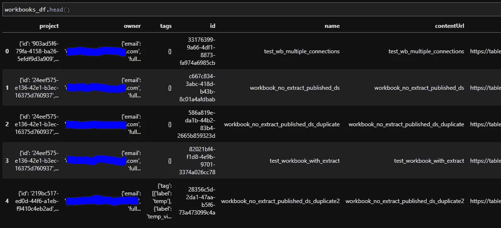
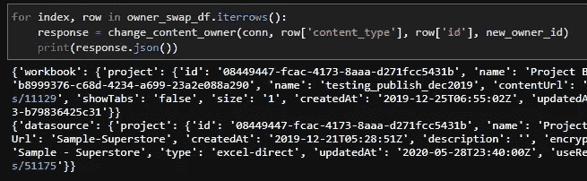

# 如何删除拥有内容的 Tableau 服务器用户

> 原文：<https://towardsdatascience.com/how-to-remove-tableau-server-users-who-own-content-bb84fbd6948d?source=collection_archive---------52----------------------->

## TABLEAU REST API: TABLEAU-API-LIB 教程

## 使用 Python 和 REST API 彻底删除内容所有者


通过几个 REST API 调用彻底打破这种局面(由 [Unsplash](https://unsplash.com?utm_source=medium&utm_medium=referral) 上的 [Kelly Sikkema](https://unsplash.com/@kellysikkema?utm_source=medium&utm_medium=referral) 拍摄)

*这个在我们的 YouTube 频道(Devyx)也有报道:* [*看看*](https://youtu.be/nocriB3EzW8) *。*

分手很难。Tableau 用户来来去去，幸运的是，我们手边有一些工具，可以帮助我们彻底摆脱处理孤立内容时令人不快的细微差别。

本文探索了一种使删除 Tableau 服务器用户变得轻松的方法。无论您的团队是手动添加和删除用户，还是采用一点自动化，本教程中涵盖的主题都有助于简化这一过程，确保被删除的用户不再拥有服务器上的任何内容，防止用户进入“未经许可”的墓地，并确保服务器上的内容不属于未经许可的用户。

本教程介绍了如何使用 Python [tableau-api-lib](https://github.com/divinorum-webb/tableau-api-lib) 包，并且是如何像使用小桶一样使用 tableau 服务器的系列教程的一部分，让您能够控制 Tableau 服务器的 REST API。

这些教程假设您已经安装了 Python 3。如果你还没有 Python 3，这将帮助你入门:[安装 Python 的指南](https://wiki.python.org/moin/BeginnersGuide/Download)。

## 搭建舞台

当你删除一个不拥有任何内容的 Tableau 用户时，这是小菜一碟。不会弹出任何错误，您所看到的只是一条愉快的确认消息，表明用户已被成功删除。

但是，如果您尝试删除拥有内容的 Tableau 用户，您将收到一条错误消息，通知您不能删除该用户，因为他们在服务器上被列为内容的所有者。

当我们试图删除拥有内容的用户时，该用户反而变成了某种 Tableau 僵尸，被放逐到“未经许可”的用户角色，但仍然拥有其内容的所有权。Tableau 不会让任何内容成为孤儿，因此所有者的精神会在 Tableau 服务器上徘徊，直到其未完成的业务(内容所有权)得到处理，用户可以完全移除。

## 构建解决方案

那么我们能做些什么呢？在本教程中，我们将演示如何使用 REST API 来完成以下任务:

1.  确定被删除的用户是否拥有任何内容
2.  如果用户拥有内容，请指定另一个用户作为新的所有者
3.  删除用户

让我们也强调一下用户在 Tableau 服务器中可以拥有哪些对象:

1.  工作簿
2.  数据源
3.  流
4.  项目

目前，Tableau Server REST API 不支持更改项目所有者。如果您的用户拥有一个项目，您将需要在删除用户之前手动更改该项目的所有权(对不起，请不要杀死 messenger)。

如果你像我一样，希望能够使用 REST API 来改变项目所有者，请出去[在 Tableau 论坛](https://community.tableau.com/ideas/10553)上投票支持这个想法。

## 步骤 1:确保你已经安装了 tableau-api-lib

即使你是这些教程的专家，帮自己一个忙，下载最新版本的库。

`pip install --upgrade tableau-api-lib`

不熟悉 Python 这个东西？别担心，你会很快明白的。跟随[这个入门教程](https://medium.com/snake-charmer-python-and-analytics/tableau-server-on-tap-getting-started-89bc5f0095fa)。该教程将引导您使用 tableau-api-lib 连接到 Tableau 服务器。

## 步骤 2:进入 Tableau 服务器环境

使用下面的代码作为连接到您的服务器的模板。在接下来的步骤中，我们将使用一次性代码行来构建这个 boiler 板。在本文的最后，您会发现一个合并的代码块，为了方便起见，您可以复制/粘贴它。

```
from tableau_api_lib import TableauServerConnection
from tableau_api_lib.utils.querying import queryingtableau_server_config = {
        'my_env': {
                'server': '[https://YourTableauServer.com'](https://tableaupoc.interworks.com%27/),
                'api_version': '<YOUR_API_VERSION>',
                'username': '<YOUR_USERNAME>',
                'password': '<YOUR_PASSWORD>',
                'site_name': '<YOUR_SITE_NAME>',
                'site_url': '<YOUR_SITE_CONTENT_URL>'
        }
}conn = TableauServerConnection(tableau_server_config, env='my_env')
conn.sign_in()
```

有趣的事实:你也可以使用个人访问令牌，假设你在 Tableau Server 2019.4 或更新版本上。如果你对访问令牌很感兴趣，请查看我的文章了解如何使用它们的细节。

## 步骤 3:建立服务器上所有内容所有者的列表

这个难题的第一部分是为我们自己建立一个服务器上所有内容所有者的列表。一旦我们有了这个，我们可以做一个简单的检查，看看我们计划删除的用户是否是服务器上任何内容的所有者。

为了建立内容所有者的完整列表，我们需要:

1.  获取所有项目所有者
2.  获取所有工作簿所有者
3.  获取所有数据源所有者
4.  获取所有流所有者
5.  整合上述各项的相关信息

完整的代码作为 GitHub 要点提供在本文的最后，所以我不会在这里详细描述每个步骤，但是让我们强调一下 tableau-api-lib 在这里是如何派上用场的。

让我们以工作簿为例。这里有一个模式，我们可以用它来提取所有工作簿的信息，这也允许我们提取关于工作簿所有者的信息。

```
workbooks_df = querying.get_workbooks_dataframe(conn)
```

结果 workbooks_df 将如下所示:



现在，放大“所有者”栏，我们希望从中提取一些有价值的信息。这个金块就是拥有内容的用户的“id”值。让我们通过使用 tableau-api-lib 的 *flatten_dict_column* util 函数来提取嵌套的 dict / JSON 值。

```
workbooks_df = flatten_dict_column(workbooks_df, keys=['id'], col_name='owner')
```

如果您看一看文章末尾的完整代码，您会注意到我们还为创建的每个数据帧添加了一个“content_type”列。

```
workbooks_df['content_type'] = 'workbook'
```

这只是为了当我们迭代用户拥有的所有内容时，我们可以识别要使用的适当的 REST API 端点。更新工作簿、数据源和流有不同的端点，我们需要根据更新的内容类型调用正确的 tableau-api-lib 方法。

如果我们对我们的工作簿、数据源、流程和项目遵循这种模式，那么我们可以很容易地组合结果数据(请参见文章末尾的代码中的例子)。

## 步骤 4:指定一个将接受孤立内容的用户

因为我们要更改内容的所有权以便删除一个用户，所以我们需要指定另一个 Tableau 用户来获得内容的所有权。这个过程有几种有效的方法。

您可以随机选择任何一个服务器管理员用户，并将内容分配给他们中的一个，您可以按名称选择用户，或者您可以挑选用户 ID 值，并选择您喜欢的任何一个。

对于这个例子，我的测试环境总共有…两个用户。所以我只是叫出了另一个用户的名字，就像这样:

```
new_owner_id = list(users_df[users_df['name'] == 'estam']['id']).pop()
```

用户名为“estam”的用户将成为被删除用户以前拥有的任何内容的新所有者。

说到被删除的用户，我也在我的工作流中进行了定义:

```
user_id_to_remove = list(users_df[users_df['name'] == 'estam2']['id']).pop()
```

同样，有许多有效的方法来定义这些值。重要的是，您有一个新所有者的用户 ID，以及一个被删除用户的用户 ID。

## 步骤 5:定义一个改变内容所有权的函数

我运行的实现遍历被删除用户拥有的所有内容。对于该用户拥有的每一条内容，都会调用一个名为*的函数 change_content_owner* 。

关于如何定义该函数的确切细节，请参见本文末尾的完整代码。

总之，该函数包含一些 *if* 语句，这些语句根据正在处理的内容类型执行不同的 REST API 更新调用。如果工作簿需要所有权变更，那么将调用'[更新工作簿](https://help.tableau.com/current/api/rest_api/en-us/REST/rest_api_ref.htm#update_workbook) ' REST API 端点。如果一个流需要一个所有权，那么就调用' [Update Flow](https://help.tableau.com/current/api/rest_api/en-us/REST/rest_api_ref.htm#update_flow) ' REST API 端点。等等，等等。

现在，鉴于项目还不能通过 REST API 调用来更新，这对我们来说有点不方便。在将这种能力添加到 REST API 的可能性领域之前，我们将需要手动更改这种所有权。如果您真的对自动化感兴趣，您可以修改我在这里定义的函数，以便在拥有项目的用户被删除时触发 Slack 消息或电子邮件。该消息可能会提醒您的服务器管理员团队，该用户需要一些手动操作才能从服务器中成功删除。

## 第六步:证明流程有效

下面是我的流程运行的一些示例输出。在本演示中，被删除的用户拥有一个工作簿和一个数据源。



Tableau 服务器的 JSON 响应确认了我们的所有权交换是成功的。

## 步骤 7:总结局限性

在我们结束之前，让我们回顾一下这个过程的局限性以及这些局限性来自哪里。

1.  您不能删除拥有内容的用户
2.  在成功删除用户之前，您必须更改用户拥有的所有内容的所有权
3.  您不能通过 REST API 调用来改变项目的所有权(希望这个功能将很快被添加进来；去投票吧！)
4.  试图删除拥有内容的用户将导致用户的角色被修改为“未经许可”，但他们仍将拥有内容。
5.  当您更改工作簿或数据源的所有者时，任何嵌入的凭据都将失效。

想了解更多？查看 Tableau 关于改变内容所有权的[文档](https://help.tableau.com/current/online/en-us/owner.htm#considerations-for-changing-content-ownership)。

## 包装它

这就是关于删除拥有内容的 Tableau 用户的教程。归根结底，在内容所有权方面不能留下任何漏洞。

如果你的用户不拥有任何内容，这是小菜一碟！

如果您的用户确实拥有内容，请更改您的工作簿、数据源和流的所有权。如果您的用户拥有项目，您需要手动更改所有者，然后才能从服务器中成功删除用户。

感谢收听！如果您的团队需要 Tableau Server REST API 自动化方面的帮助，请联系我们。

## 合并代码

使用[这个 GitHub 要点](https://gist.github.com/divinorum-webb/3a8b32a4be0b4c98c96d15b997b88aa8)作为模板，将本教程中的概念整合到你自己的工作流程中。