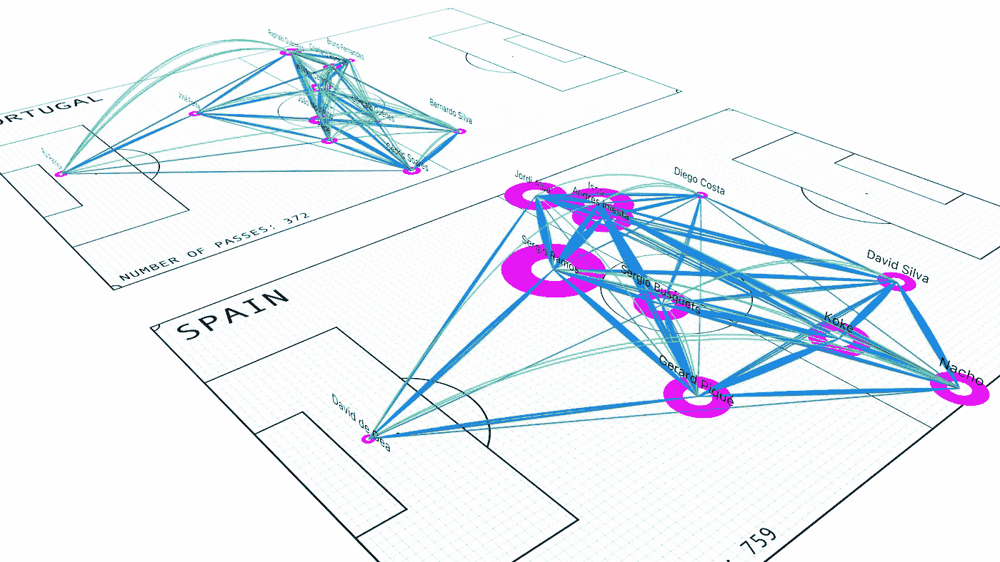
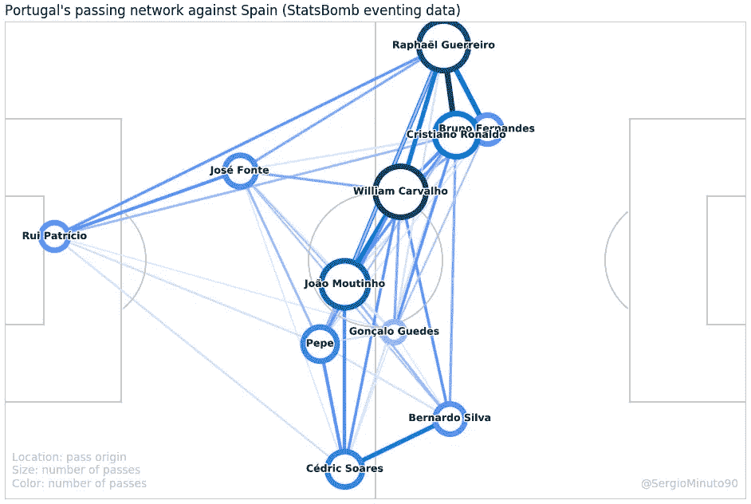
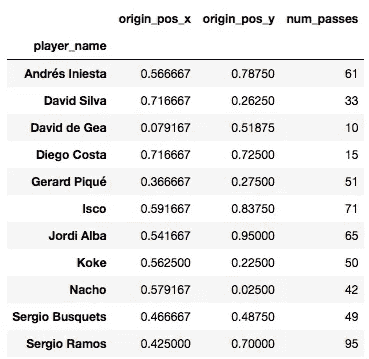
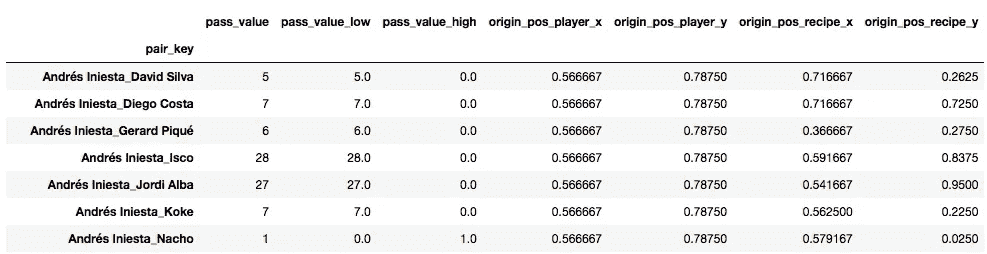
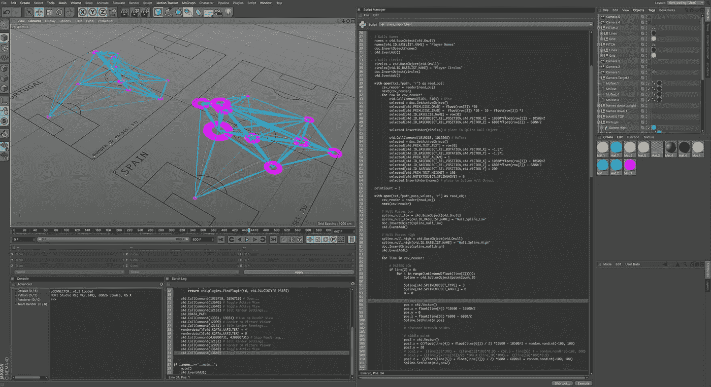
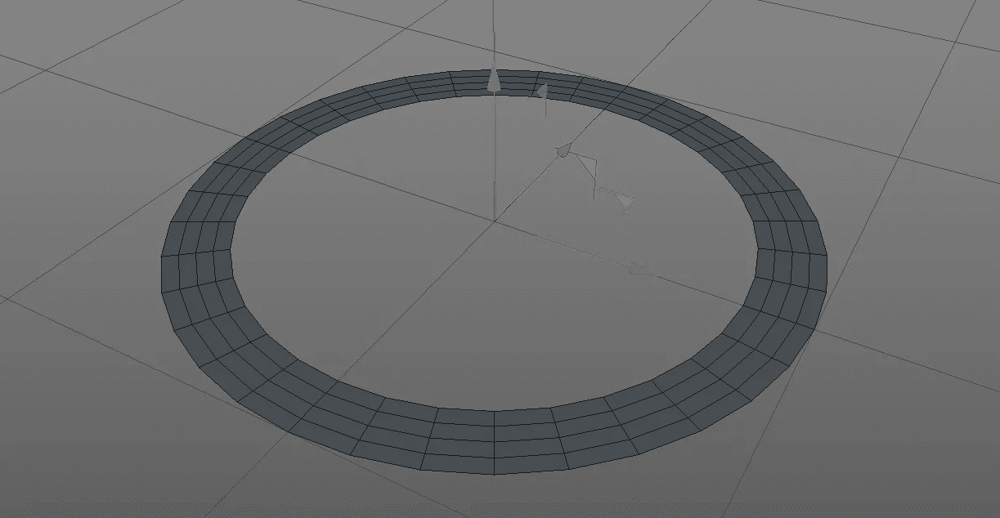
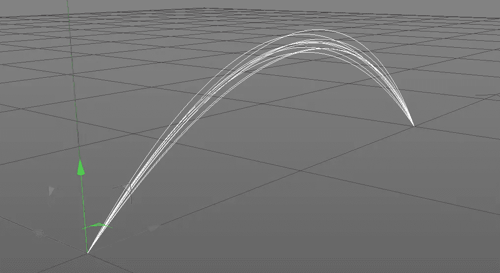
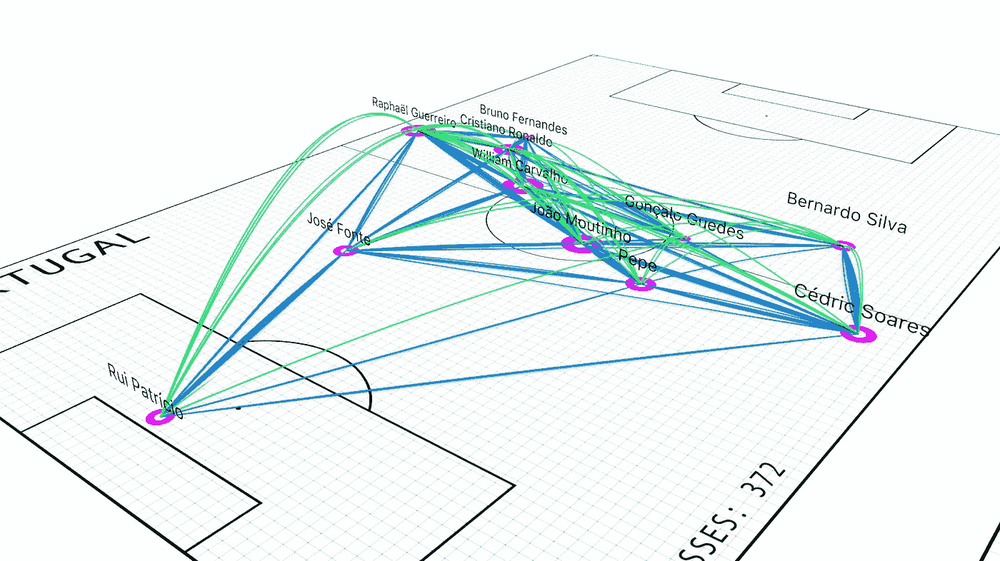
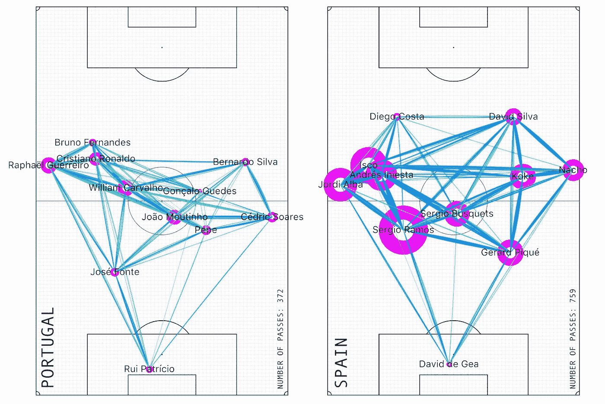

# 如何渲染 3D 足球传球网络

> 原文：<https://towardsdatascience.com/how-to-render-3d-football-pass-networks-bf889f5ab1b0?source=collection_archive---------32----------------------->

## 用 Python 和 Cinema4D 实现体育数据可视化

传球网络分析长期以来一直是足球分析师中流行的可视化方法。那么，为什么又有一篇关于它的文章呢？嗯，一个下雨的周日，我认为在我的电脑上运行别人的全面 Python 脚本来提升我的科学自尊是一个好主意，并为自己是一名多么伟大的数据科学家而沾沾自喜。毫不奇怪，该脚本在第一次尝试时成功执行——显然不是因为我的编程天才，而是因为我使用的脚本的优秀质量，即用于使用 Matplotlib 构建可定制的传球网络的 [Sergio Llana 的 GitHub 库](https://github.com/Friends-of-Tracking-Data-FoTD/passing-networks-in-python)。所以在一键按下*【运行脚本】*后，我骄傲地盯着我的第一个“自编程序”的 pass 网络:

2D 通行证网络。图片作者。科迪由[塞尔吉奥利亚纳](https://github.com/Friends-of-Tracking-Data-FoTD/passing-networks-in-python)。

但随后一个念头涌上心头:“*如果我能沉浸在网络中，看看到底打了多少个低传球或高传球，那不是很好吗？”。就在那时，我开始尝试 Cinema4D 的内置 Python 模块。令我自己惊讶的是，我能够不费吹灰之力就实现我的想法。在这篇文章中，我想分享我的(可能是非传统的)可视化方法。*

> 免责声明:如果你是来寻求分析见解的，恐怕你会失望。这篇文章是关于如何将传统的 2D 传球网络转换成 3D 的。

# 如何开始

如前所述，我之所以能够取得我的成果，是因为有人慷慨地分享了他/她的代码。我用于数据准备的许多代码段直接取自 [Sergio Llana 的 GitHub 页面](https://github.com/Friends-of-Tracking-Data-FoTD/passing-networks-in-python)(特别是[statspamb 的](https://github.com/statsbomb/open-data)开放数据仓库的导入和处理)。人们毕竟是懒惰的，所以复制粘贴代码没有什么可耻的！*…对吗？*也就是说，你可以在我的 [GitHub](https://github.com/dmlinke/c4d_pass_networks) 上找到我的 Python 脚本和 C4D 项目文件。

## 数据采集

我很惊讶现在有这么多的球探数据是公开的。对于这个项目，我使用了发生在 2018 年世界杯小组赛期间的比赛**葡萄牙 vs 西班牙(3:3)** ，。你可以在 [StatsBomb](https://github.com/statsbomb/open-data) 找到 2018 年世界杯所有比赛的赛事数据。另一个值得一提的重要来源是最近在《自然》杂志上发表的一篇文章，其中附有时空匹配事件的公共数据集。

## 网络基础

足球传球网络由一组通过“边”(即传球)连接的圆形“**节点**”(即球员)组成。从现在开始，我将使用术语“**样条线**”来代替“边缘”。以后你就明白为什么了。节点的大小通常代表玩家在游戏中完成的传球总数。每个球员的场地位置(也称为战术阵容)可以通过以下方法获得:(a)根据每个球员的时空跟踪数据(如果可用)计算平均 XY 坐标，或者(b)根据每个球员的侦察事件(即传球)计算平均 XY 坐标。传统上，边的重量(厚度)代表两个球员之间完成传球的次数。

## 准备数据

我将跳过如何解析 StatsBomb 的 JSON 文件并将完整的 pass 连接提取到单独的数据帧中的部分。塞尔吉奥的剧本非常管用，所以我只做了些小调整。我事先知道我要渲染每个节点，一个一个的通过。这就是为什么我创建了两个数据帧，可以保存为文本文件，并使用内置的 Python 连接器导入 Cinema4D:

*   对于**玩家节点，**我们需要每个玩家的**名字**，平均场**坐标**，以及**完成的总遍数**:

玩家节点表。图片作者。

*   对于**传球样条**，我们需要一个列表，包含(a)所有**球员配对***【pair _ key】，* (b)每个球员配对完成的**低传球和高传球**的数量，以及(c)传球和接球球员的平均场地**坐标**:

传递值表的一部分。图片作者。

# 使用 Cinema4D 进行网络渲染

[Cinema4D](https://www.maxon.net/en-gb/products/cinema-4d/overview/) (C4D)是一款 3D 设计、动画和渲染软件，主要用于运动图形、建模和纹理；但是，它附带了一个全面的 Python 模块。也就是说，几乎每个用户操作都可以通过 Python 命令来执行，从而允许设计过程的自动化。下面是一个我自定义的用户界面的例子，显示了三维视口(左上)，对象管理器(右上)，和材质管理器(右中)。介于两者之间的是 Python 脚本管理器，允许以编程方式创建单个对象以及整个场景。接下来的两段将展示只用几行代码创建任何 3D 对象是多么容易。

Cinema4D Python 接口。图片作者。

## 生成玩家节点

我将用一个简单的**圆盘**来代表一个玩家的节点。在 C4D，通过 Python 命令创建一个磁盘并更改其属性非常简单。下面的代码示例在原点(0，0，0)生成一个外径为 100 厘米的圆盘:

Cinema4D 磁盘示例。图片作者。

## 生成刀路轨迹

我不想显示球员之间的单个加权边(代表传球次数)，而是想单独渲染每个传球。为了达到这种效果，我们必须引入一些随机性…

我发现渲染两个球员之间传球轨迹最简单的方法是创建一个**样条**对象。最初，我认为每个样条应该只包括起点(传球手)和终点(接球手)，但这将导致完美的直线——正如我们从传统传球网络中所知的那样。相反，我想创造这样一种印象:( a)每个通道轨迹都略有不同,( b)高通被渲染为一个弧形。这就是为什么我最终为每个通道轨迹使用三个样条点，这使我有可能向高通添加飞行曲线，并向中心样条点引入一些随机偏移(创建每个通道单独显示的假象)。下面的代码示例在两点之间生成十个随机样条线对象。

Cinema4D 随机通过轨迹示例。图片作者。

# 运行循环

既然我们知道了如何生成球员节点和传球轨迹，那么是时候用我们球员特有的值替换默认值了。这最适合使用一个循环来遍历**播放器节点文件**，并为每个播放器创建一个名称和磁盘。第二个循环通过**传球值文件**进行迭代，并在球员配对之间生成随机传球轨迹——取决于他们之间完成的传球次数。

# 收尾

现在剩下要做的就是添加场线，选择你最喜欢的颜色(又名材料)，添加一些信息文本，找到一个合适的相机角度，根据你的喜好调整渲染设置——然后点击*【渲染】*按钮:

图片作者。

图片作者。

图片作者。

# 关键外卖？

对于典型的足球分析师来说，可以说很少。但是如果你像我一样，你的兴趣介于数据科学和图形设计之间，你会惊讶于编程语言(Python)和 3D 设计软件(C4D)的结合所能实现的东西。

诚然，C4D 不一定被认为是数据科学家的标准工具，你也需要投入一些时间来学习基础知识。与传统的 2D 网络相比，3D pass 网络是否提供了任何附加值，这仍然是一个有争议的问题。尽管如此，我还是很喜欢在 C4D 尝试 Python，并且我将来肯定会更频繁地集成它。

# 接下来是什么？

**动画！** C4D 展示了它在动画方面的真正实力，这很棒，因为有些人可能会认为静态通行证网络提供了对游戏相当肤浅的洞察。相反，展示一个团队的网络动态如何随时间变化(以及它如何对对手的网络做出反应)可以提供更深入的见解。让我们看看有什么可能。我会随时通知你的！

*感谢您阅读我的文章！如果您有任何问题或反馈，或者您只是想联系我，请不要犹豫，请联系我。*