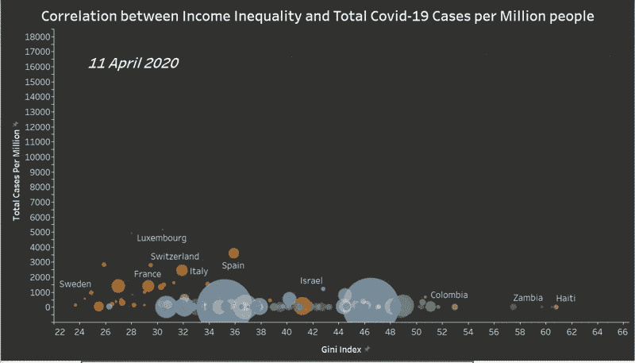
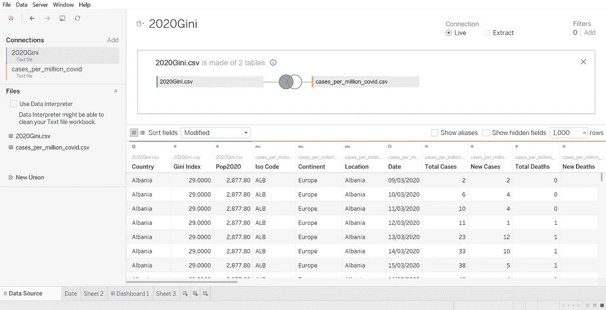
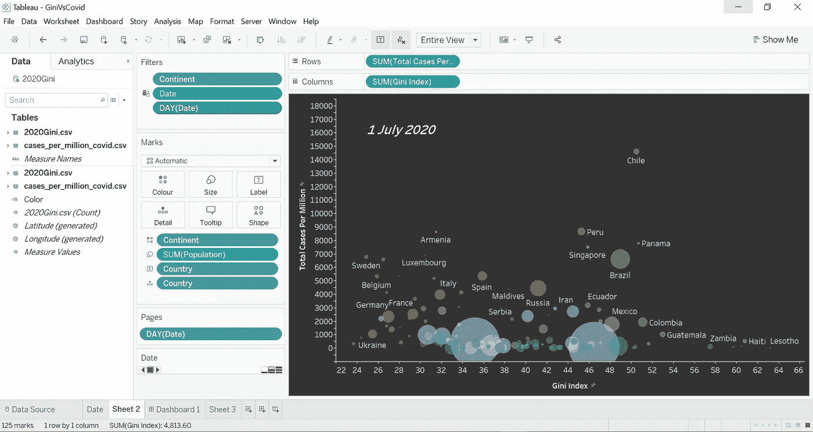
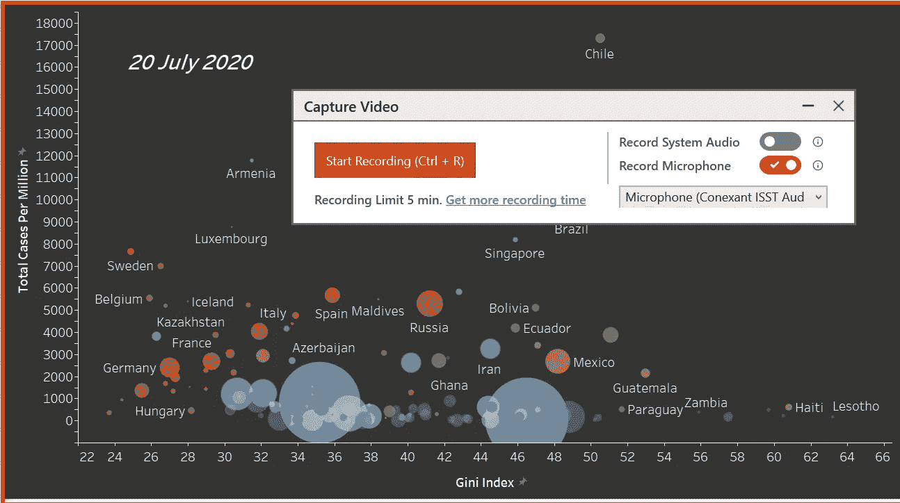
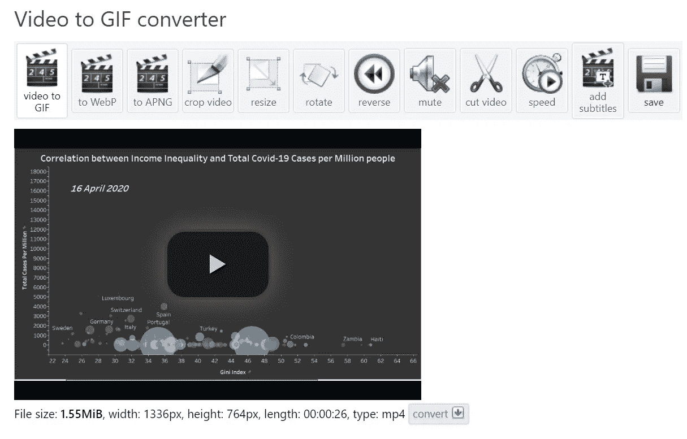
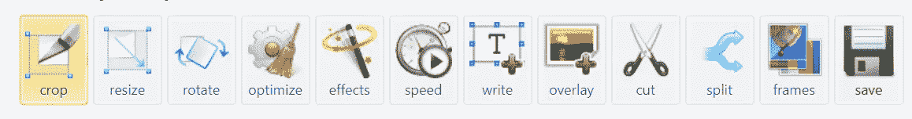

# 如何将 Tableau 图表呈现为 GIF 文件

> 原文：<https://towardsdatascience.com/how-to-render-your-tableau-viz-as-a-gif-file-b0a11ed6acf9?source=collection_archive---------38----------------------->

## 将动态数据可视化打包为 GIF 的简单步骤

来源:作者

*本例的数据来源:*

[数据中的我们的世界:冠状病毒(新冠肺炎)病例](https://ourworldindata.org/covid-cases)

[《世界人口评论:按国家分列的基尼系数》](https://worldpopulationreview.com/country-rankings/gini-coefficient-by-country)

*撰写本文时考虑的时间表:2010 年 3 月 30 日至 2010 年 7 月 26 日*

# 介绍

本文将向您展示两个简单快捷的步骤，您可以通过它们将已经动态的 Tableau 可视化制作成 GIF 文件。

如今，动态和有效的数据通信的激增也使得图表越来越倾向于以与大多数人交流的数字媒体类型相一致的交互方式进行交流。在这方面，gif 无疑是一种趋势，当涉及到增加数据图表的交互性以及向相关受众展示数据图表的方式时，gif 可能会非常有效。

因此，我将通过一个简单的示例向您展示如何将 Tableau 图表转换为 GIF 文件，然后可以通过报告/演示共享该文件，从而为您将与网络共享的任何内容添加一点交互性。

# 步骤 1:生成动态 Tableau 图表

本图表的目的是检验收入不平等(由基尼系数估计)与一个国家每百万居民的新冠肺炎病例总数(数据来源见页面顶部)之间的相关性，并观察这种相关性如何随着时间的推移而发展。为此，您将利用两个数据集和 Tableau 的 Pages Shelf 向图表中添加第一个交互元素。

首先，您可以输入本例所需的两个数据源，并使用 Tableau 的 data source 选项卡连接它们，如下图所示。您可以使用基尼系数表中的“国家列”与第二个数据源进行左连接，从而得到一个包含基尼系数和新冠肺炎相关列(按日期排列的病例数、测试数等)的单一表格。

为了防止您继续使用这个例子，请注意，您可能需要预处理 country 列的格式(即基尼系数表上国家名称的大写)，以便正确执行左连接。

来源:作者

一旦这样做了，你就可以打开一张空白纸，画出你的图表。我在下面分享我的图表，但是你可以根据你自己的喜好随意发展它！

在下面的视图中，你可以画出基尼指数与每个国家每 100 万居民新冠肺炎病例总数的散点图。您可以给图上的每个点涂上颜色，以标出该国的大陆，并根据每个国家的人口来确定点的大小。

然后，您可以使用日期列过滤感兴趣的相关时间段的数据(您还可以过滤掉任何偶然的空值)以及特定洲的数据。

来源:作者

你现在已经画出了图表的基础。为了增加交互性，您可以使用 [Pages shelf](https://help.tableau.com/current/pro/desktop/en-gb/buildmanual_shelves.htm#pages-shelf) 来分解该时间段内每一天的散点图(表示 shelf 中的单个“页面”),从而分析相关性如何随时间发展。为了跟踪页面名称(在这种情况下，它实际上是您在页面架的特定框架的图表上看到的日期)，您可以添加一个[注释](https://help.tableau.com/current/pro/desktop/en-us/annotations_annotations_add.htm)来可视化每个散点图框架的日期细分。

为此，右键单击图表上的任意位置，转到“批注”>“区域”>“插入”>“页面名称”；完成后，您还可以根据自己的喜好设置注释的格式。

因此，Pages 搁板是制作图表动画的绝佳方式。这样做会导致以下结果:

来源:作者

现在您已经通过 Pages shelf 绘制了图表并制作了动画，让我们看看如何将它转换为 GIF 文件格式。

# 步骤 2:录制动画

要记录由 Pages shelf 启用的 Tableau 动画，您可以使用您选择的任何屏幕记录器来视频捕捉图表随时间的发展。我个人使用 MangoApps 的[tiny take](https://tinytake.com/)，但是在这里可以根据你的个人喜好随意选择。使用它，您可以选择屏幕的一部分来录制动画的简短视频。这就是这一步的全部内容！现在，您可以在本地保存您的视频文件，并进入第 3 步，在这里您将把它转换成 GIF！

来源:作者

# 第三步:将视频转换成 GIF

在这最后一步，你最终把你的视频文件(MP4，WebM，AVI，MPEG，FLV，MOV，3GP 和其他视频文件)转换成 GIF 文件格式。

一个我觉得很方便的在线工具是[ezgif.com](https://ezgif.com/video-to-gif)，它允许你对你的视频进行不同的、有用的编辑。

你可以快速上传你的录像到他们的[视频到 GIF 转换器](https://ezgif.com/video-to-gif/ezgif-6-702eb508309b.mp4)页面。然后你可以调整视频的开始时间、结束时间、大小和帧速率，这些将决定 GIF 运行的最终长度和循环次数。

来源:作者

来源:作者

在这一步之后，最后一个有用的调整是利用网站的速度转换器，让你的 GIF 循环更快和/或更慢。

你现在可以下载并保存你的文件为 GIF 格式，并分享到你喜欢的任何地方！

你可能想在你的数据报告或仪表板、Power Point 演示文稿以及任何其他相关材料和/或网页上添加 GIF 风格，比如这个，我把我的 GIF 作为静态特色图像的简洁替代。

你完了！希望这些简短的步骤将有助于为你的 Tableau 作品增加一点 GIF 的乐趣和互动性。感谢阅读！

**访问我的免费数据科学资源清单** [**这里**](https://landing.mailerlite.com/webforms/landing/k1n3r2)

 [## 通过我的推荐链接加入 Medium-Edoardo Romani

### 作为一个媒体会员，你的会员费的一部分会给你阅读的作家，你可以完全接触到每一个故事…

edo-romani1.medium.com](https://edo-romani1.medium.com/membership)