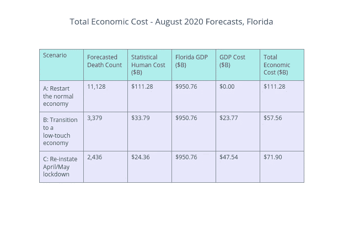

# 如何在新冠肺炎疫情时期重新开启经济

> 原文：<https://towardsdatascience.com/how-to-reopen-an-economy-during-the-covid-19-pandemic-e93923163e03?source=collection_archive---------63----------------------->

## 试析佛罗里达州重新开放经济的尝试及其对其他州的启示

南佛罗里达州是令人惊叹的市中心场馆和原始海滩的所在地，但新冠肺炎相关的封锁使它们在今年夏天更难进入。图片来源:[安东尼奥·库埃拉尔](https://unsplash.com/@antoniocphoto?utm_source=medium&utm_medium=referral)在 [Unsplash](https://unsplash.com?utm_source=medium&utm_medium=referral) 上拍摄

南佛罗里达是一个标志性的地方，充满了新鲜的海鲜餐厅，清澈的海滩和穿着宽松的人们。离开学校的暑假是一种享受——我可以整天和一群朋友在一起，在拉斯奥拉斯大道的商店和海滩上放松。

今年对佛罗里达人来说不幸的是，酒吧和海滩的封锁让这个夏天变得不那么令人兴奋，越来越大的压力迫使佛罗里达州的政治家们过早地重新开放。6 月 5 日，州长罗恩·德桑蒂斯开始了他的逐步重新开放计划的第二阶段，该计划旨在减轻病毒的威胁。整整三个星期后，佛罗里达州宣布，他们将重新关闭酒吧，因为新冠肺炎病毒的传播仍在以惊人的速度增长。上周新增病例高达 63，552 例，比截至 6 月 6 日的一周高出 8 倍多！

## 增加测试并不是案件数量增加的唯一原因

上周末，当我和哥哥在门廊上享用着当地酿造的卡罗莱纳 IPA、一种佛罗里达葡萄柚和 90%黑巧克力，享受着一次远离社交的聚会时，我们争论着病例数量的增加是病毒真正传播的结果，还是增加检测的孤立影响。

我们同意可能会有一些上升，但由于测试的可用性一直在不断上升，真实的死亡率仍然难以捉摸。第二天早上，我在[约翰·霍普斯金数据仪表板](https://coronavirus.jhu.edu/testing/individual-states/florida)上做了一些研究，发现了一个奇怪的现象——阳性检测率上升到了 20%，几乎是 5 月低点的四倍！

佛罗里达州在 6 月份大力加强了新冠肺炎检测，但阳性检测率却出现了无法解释的增长。归功于约翰·霍普斯金的。来源:[COVID 跟踪项目](https://covidtracking.com/)

在某些情况下，初始关闭期间，阳性测试率稳定地徘徊在 5-10%左右。在这个初始阶段，由于检测短缺，只对极有可能的病例进行检测，这导致了相当高的阳性检测率，约为 11%。孤立地看，让大众更容易接受检测应该会继续降低阳性检测率，但显然还有其他变量在起作用。

## 这种病毒正在所有年龄组中传播

大多数积极的测试结果是由 50 岁以下的人驱动的，这是一个低风险的人群，他们更有可能仍然在飞机上旅行，在室内餐厅就餐和在酒吧社交，甚至可能没有蒙面。这个群体的死亡率是 5 月份新增病例的 0.25%，所以他们如此自信地恢复正常生活是有道理的。

在过去的几周里，所有年龄组的病例数量都增加了。来源:[佛罗里达 DOH](https://open-fdoh.hub.arcgis.com/datasets/florida-covid19-case-line-data/data)；[点击查看互动图表](https://chart-studio.plotly.com/~natefrey93/1/#/)

不幸的是，低风险人群并不是生活在真空中，更脆弱的人群也在以惊人的速度被感染。自阵亡将士纪念日周末以来，新的每周感染人数在 50-70 岁人群中增加了 11.5 倍，在 71 岁以上人群中增加了 7.9 倍！

## 这种病毒仍然非常危险

正如我们从 3 月份以来所看到的，死亡率与病例数量成反比。进行的测试越多，确诊的病例越多，死亡率就越低。这听起来像是好消息，但是还不清楚是病毒越来越弱还是我们越来越擅长治疗它。更有可能的是潜在数据的变化。

6 月份观察到的死亡率继续下降，但不一定表明 7 月份继续下降。来源:[佛罗里达州卫生部](https://open-fdoh.hub.arcgis.com/datasets/florida-covid19-case-line-data/data)；[点击查看互动图表](https://chart-studio.plotly.com/~natefrey93/4/#/)

**观察到的死亡率的下降实际上具有误导性**，因为更严格的社会距离标准、免疫缺陷个体更加谨慎以及病例检出率的增加导致了行为的特定变化。

然而，过去死亡率的下降并不是未来死亡率将继续下降的指标。行为上正在发生的变化可能会再次扭曲受感染的人群:佛罗里达州的许多不同场所重新开放，现在仍然开放，对社会隔离和积极信号的疲劳可能会导致一些人取消预防措施，每周新病例创下历史新高，阳性检测率几乎是 4 月份高点的两倍。更不用说，如果严重病例的激增过快地填满医院，有限的医疗能力可能会使病人的结果*更糟*。

这一切都好说，**病毒还是很危险的**。为了根据今天的病例数量预测死亡人数，我建立了两个主要假设:未来死亡率和死亡滞后时间。

**假设#1:未来死亡率**

自 4 月份以来，观察到的 60 岁以上人口的死亡率下降了一半以上，50 岁以下人口的死亡率几乎保持不变。然而，如上所述，**新增病例的潜在人口统计数据的持续变化可能会推动死亡率上升，也可能会降低死亡率。**

最终，只有时间能证明一切，我不会试图在这里做出复杂的预测。对于本分析中的基线预期，我选择假设死亡率等于 6 月前 3 周每个年龄组的平均死亡率。

**假设#2:报告的死亡延迟时间**

来源: [Covid 跟踪](https://covidtracking.com/blog/why-changing-covid-19-demographics-in-the-us-make-death-trends-harder-to)

虽然病例数量的增加预示着一场迫在眉睫的危机，但在医院不堪重负和意大利式的大规模葬礼发生之前，这不是一场真正的危机。在预测佛罗里达何时会真正感受到今天更高的案件数量的后果时，将这一变量作为基础是至关重要的。

平均而言，受感染的患者在症状出现后大约 14 天死亡，直到他们死亡后 7 天才被报告。这些指标也有大量的可变性(例如，一些死亡在死亡后 21 天才被报告)，但为了简单起见，我假设所有新病例的固定总滞后时间为 21 天。

## 佛罗里达州不会经历意大利级别的危机，但…

使用基于上述的假设，佛罗里达州新冠肺炎相关死亡的严重性和时间的预测看起来很严峻。在截至 8 月 1 日的一周中，我的模型预测每周死亡人数为 880 人，即每 10 万人口中约有 4 人死亡。

据预测，到 8 月 1 日，每周死亡人数将翻两番，从 7 月 12 日的 266 人增至 880 人；[点击查看互动图表](https://chart-studio.plotly.com/~natefrey93/6/#/)

相比之下，在意大利最糟糕的一周，共有 5691 人死亡，约为每 10 万人口中有 9 人死亡。然而，尽管该州重新关闭已有两周，病例仍在增加。周日，佛罗里达州创下 15，300 例病例的新纪录，比之前 7 天的平均水平高出 66%。希望这是一个异常现象，但如果不是，佛罗里达州可能会发现自己陷入真正的危机比它讨价还价。

## 重启经济的经济学

关于世界各国政府是应该保持经济开放以保护 GDP，还是应该实施封锁以减少人员死亡，有两种难以置信的*两极分化的*观点。

许多人关注封锁的直接经济成本，因为它们更容易量化。但是衡量病毒给人类造成的损失也很重要。*但是你如何衡量一个人生命的价值呢？你如何将这与封锁造成的 GDP 损失进行比较？*信不信由你，政府已经悬赏捉拿你，我将采用现有的框架来衡量未来的最佳路径。

**经济成本**

[2020 年第一季度美国 GDP 总量下降 4.8%(年化)。由于经济在本季度的前两个月运行平稳，估计 3 月份的封锁是这一下降的唯一驱动力。将这些指标外推到佛罗里达州，我假设每月保持完全封锁的经济成本等于其年度 GDP 的 5%，或大约 475 亿美元。](https://www.businessinsider.com/us-gdp-falls-first-quarter-impact-coronavirus-economy-recession-economy-2020-4)

**人力成本**

你愿意为了经济而牺牲自己的生命吗？

我不这么认为。环境保护署利用统计生命框架的[价值来衡量每个人的生命价值为 1000 万美元](https://www.bloomberg.com/graphics/2017-value-of-life/)。这项措施是基于人们接受与特定工作相关的风险津贴的平均意愿。这一数值对所有人都是固定的，与性别、年龄、种族等无关。这种方法长期以来一直被用来确定一项特定法规的成本是否值得它所能挽救的生命。由于其与新冠肺炎难题的相关性，采用这一框架评估开放的总体经济影响是有意义的。

来源:彭博

在这个时候，佛罗里达州实际上可以采取三种不同的方案来决定该如何进行:

**场景 A——重启“正常”经济:**佛罗里达州开始走上这条道路。但由于它只持续了 3 个星期前，锁定恢复，这种情况已被证明是不切实际的。然而，我已经把它包括在我的分析中，以量化如果佛罗里达州电力通过，这将招致的总成本。

**场景 B——向“低接触”经济转型:**这是佛罗里达州在重新关闭酒吧和一些室内场馆后的现状，但这尚未被证明是一个可行的解决方案。目前还没有这方面的数据，但这种情况将假设损失的经济成本是全面封锁的一半，案件量将降至 5 月低点和当前高点之间的中点。

**情景 C -恢复 4 月/5 月的封锁:**这种选择对经济来说极其可怕，尤其是在不确定何时重新开放是安全的情况下。这种疫苗开始看起来像是摆脱疫情的最佳方式，但它可能还需要 6-18 个月才能开发和分发，更不用说最近的一项调查表明只有 50%的美国人会接种疫苗。

根据佛罗里达州处理新增病例数量的能力，截至 8 月底，每周死亡人数可能在 136 至 1254 人之间；[点击查看互动图表](https://chart-studio.plotly.com/~natefrey93/41/#/)

基于这些假设，经济上的最佳解决方案是在八月份**过渡到低接触经济**(见下表)。低接触经济将产生 575.6 亿美元的最低人力成本和 GDP 成本。最不可取的结果是经济恢复正常，因为这种情况下仅人力成本就将产生 1118.8 亿美元。

这两种情况下总成本的差异令人震惊，并要求优先考虑的顺序是首先减少病毒的威胁，然后重新启动经济。

恢复 5 月份实施的全面封锁将最大限度地减少死亡和 GDP 损失带来的负面经济影响；[点击查看表格](https://chart-studio.plotly.com/~natefrey93/22/#/)

## 我对一个严重两极分化的政治问题的非政治性结论

作为低风险人群中的一员，我理解失去工作或被自己的政府禁止与朋友一起喝酒而对我的福祉几乎没有风险是多么令人沮丧。但重要的是退一步，从整体上看待经济。匆忙回归“正常”经济可以让年轻人维持生计，而限制经济活动可以让老年人维持生活。上表反映了这两种后果的权重差异。我们必须要有耐心，因为在 T2 至少 70%的人口通过疫苗或传染病隔离产生抗体之前，这场健康危机不会得到解决。佛罗里达州已经证明，过早启动经济引擎可能会带来致命的后果，迫使他们已经踩下刹车，开始逆转。如果其他正在观望的国家要吸取什么教训的话，那就是谨慎行事。

对于那些对分析感兴趣的人，请随意查看我在 [GitHub](https://github.com/nathanfreystaetter/florida_covid_epicenter) 上的代码。