# 如何表示 3D 数据？

> 原文：<https://towardsdatascience.com/how-to-represent-3d-data-66a0f6376afb?source=collection_archive---------6----------------------->

## 3D 创意

*帮助在 3D 点云、网格、参数模型、深度图、RGB-D、多视图图像、体素中选择数据表示的可视化指南……*

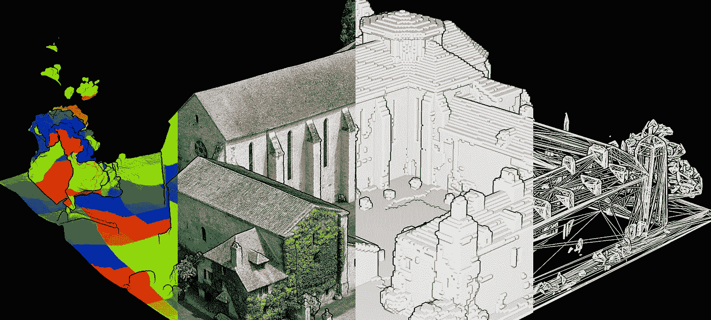

3D 点云数据集的不同数据表示

我们的计算机化生态系统中的 3D 数据集——其中越来越多的数据集直接来自现实捕捉设备——以不同的形式存在，在结构和属性上都有所不同。有趣的是，由于它的规范性质，它们可以以某种方式成功地映射到点云。当绑定将云指向应用程序时，本文提供了主要的 3D 数据表示模式供您选择。

# 三维点云

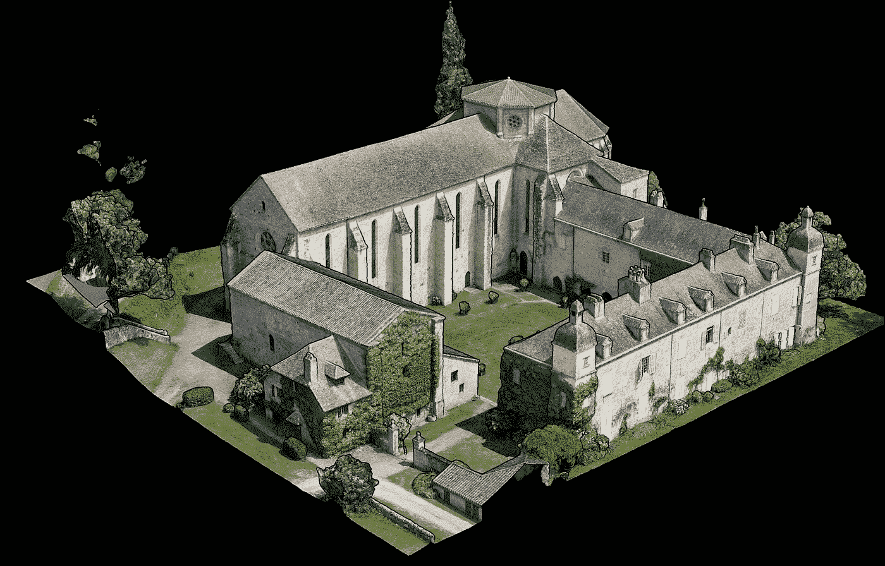

这是 2014 年使用摄影测量学(Gerpho)获得的一座修道院的 3D 点云，位于我的家乡法国南部🙂。分辨率为 1 cm，表示为地面采样距离。

点云是三维坐标系中的一组数据点。这些点在空间上由`X, Y, Z`坐标定义，通常代表一个对象的包络。现实捕捉设备获取外部表面的三维信息以生成点云。这些通常是通过摄影测量(上面的例子)、激光雷达(陆地激光扫描、移动制图、下面模拟的空中激光雷达)、深度传感以及最近通过生成式对抗网络的深度学习来获得的。

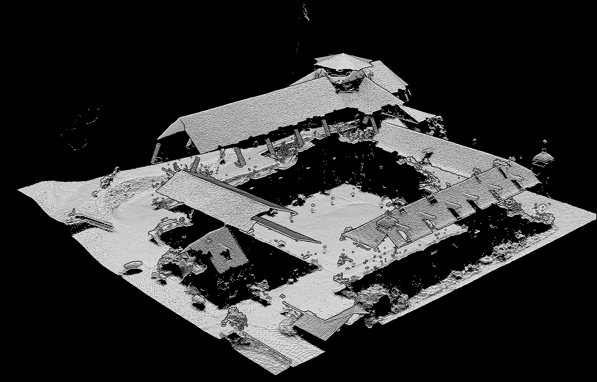

航空激光雷达模拟点云。从自上而下的感知来看，这主要是 2.5D。

每种技术都有几个影响数据质量和完整性的特性，您已经可以看到完整 360°捕获与传统航空激光雷达采集之间的差异。这扩展了本文的范围，将在另一期或 3D 地理数据学院的信息中讨论:

[](https://learngeodata.eu/point-cloud-processor-formation/) [## 点云处理在线课程- 3D 地理数据学院

### 编队学习先进的点云处理和三维自动化。开发新的 python 地理数据技能和开源…

learngeodata.eu](https://learngeodata.eu/point-cloud-processor-formation/) 

点云提供了简单而有效的 3D 数据表示，下面我总结了它们的主要操作、优点和缺点。

**主要经营**

*   变换:可以用线性变换矩阵乘以点列表中的点。
*   组合:“对象”可以通过合并点列表来组合。
*   渲染:将点投影并绘制到图像平面上

**主要好处**

*   快速渲染
*   精确表示
*   快速转换

**主要缺点**

*   无数的点(obj。曲线，精确表示)
*   高内存消耗
*   有限组合操作

虽然快速渲染和转换使直接检查点云变得很方便，但它们通常不能直接集成到常用的三维应用程序中。然而，最近的发展显示了一种趋势，即使在纯基于网格的渲染平台中也有更好的支持，最近的一个例子是虚幻 4 游戏引擎。

一个常见的过程是使用合适的表面重建技术来导出网格。有几种将点云转换成三维显式表面的技术，其中一些将在下面的文章中介绍。

[](/5-step-guide-to-generate-3d-meshes-from-point-clouds-with-python-36bad397d8ba) [## 使用 Python 从点云生成 3D 网格的 5 步指南

### 生成 3D 网格的教程(。obj，。ply，。stl，。gltf)自动从三维点云使用 python。(奖金)…

towardsdatascience.com](/5-step-guide-to-generate-3d-meshes-from-point-clouds-with-python-36bad397d8ba) 

让我们进一步深入 3D 模型作为一种表示，以更好地把握可能性的范围。

# 3D 模型

几乎所有的 3D 模型都可以分为两类。

*   **固体**:这些模型定义了它们所代表的物体的体积。实体模型主要用于工程和医学模拟，通常由构造性实体几何图形或体素集合构建。

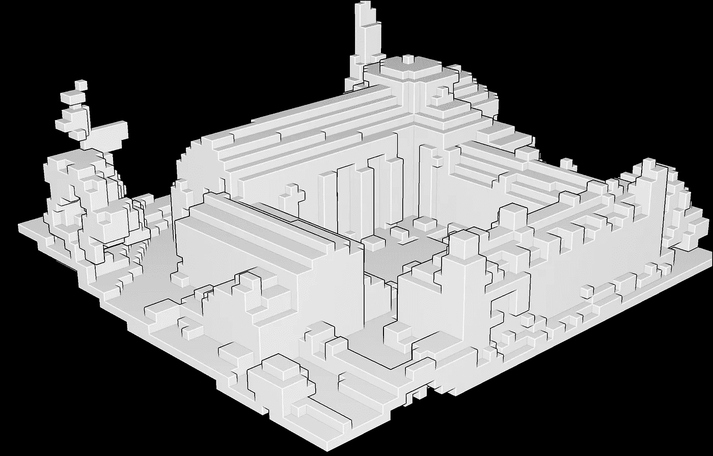

通过体素化的实体 3D 模型示例。

*   **壳**或**边界** (B-Reps):这些模型代表表面，即物体的边界，而不是它的体积。几乎所有在现实捕捉工作流、游戏和电影中使用的视觉模型都是边界表示。

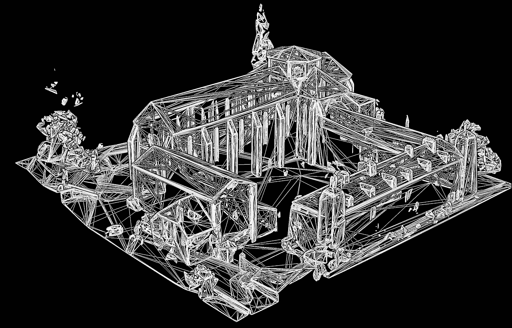

修道院的贝壳代表的例子。

实体和壳建模可以创建功能相同的对象。它们之间的差异主要是创建和编辑它们的方式的变化，以及在各个领域中使用的惯例，以及模型和现实之间近似类型的差异。

三种主要策略允许通过 3D 模型描述点云。构造实体几何图形、隐式曲面(+参数化建模)和边界表示(B-Reps)。虽然构造性立体几何非常有趣，我们将很快讨论，但最常见的 3D 模型是 B-Reps 作为 3D 网格。让我们首先扩展这些论点。

## 三维网格

网格是一种几何数据结构，它允许用一组多边形来表示曲面细分。网格在计算机图形学中特别用于表示曲面，或者在建模中用于离散化连续或隐式曲面。网格由顶点(或顶点)组成，通过边连接，形成多边形的面(或小平面)。当所有的面都是三角形时，我们称之为三角形网格。这些是现实捕捉工作流中最常见的。

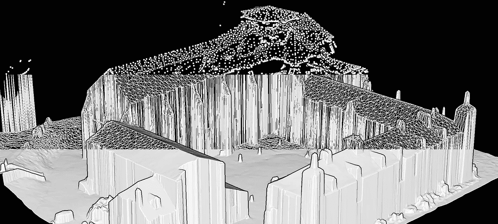

从上到下:网格的顶点；将顶点连接在一起的边；由顶点和边形成的面填充，大多是三角形。

四边形网格也非常有趣，但通常通过网格优化技术来获得更紧凑的表示。也可以使用体积网格，它通过四面体、六面体(长方体)和棱柱连接顶点。这些所谓的网格是基于边界表示的，这取决于线框模型(对象由 3D 线简化，对象的每条边由模型中的一条线表示)。让我们扩展这个理论。

**边界表示法**

3D 模型的边界表示主要由两部分组成:拓扑(元素的组织)和几何(曲面、曲线和点)。主要的拓扑项目是面、边和顶点，我在一个立方体的简单 B-Rep 下面进行了图解。

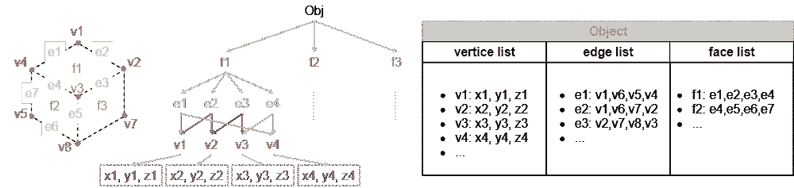

结构下边界表征的图式化

**作战**

*   变换:所有的点都像线框模型一样进行变换(将点列表中的点与线性矩阵相乘)，此外，还可以变换曲面方程或法向量。
*   组合:可以通过将点列表和边分组来组合对象；对多边形的操作(根据交点进行分割，删除多余的多边形，合并它们…
*   渲染:可以使用隐藏表面或线算法，因为对象的表面是已知的，因此可以计算可见性。

**好处**

*   被广泛采用的表示法
*   通过“新一代扫描”生成模型
*   转换既快速又简单

**缺点**

*   高内存需求
*   昂贵的组合
*   弯曲的物体是近似的

网格是显示点云几何图形的一种很好的方式，并且通常允许大大减少作为顶点的所需点的数量。最重要的是，它允许通过面的连通性来了解对象之间的关系。然而，网格化是基点云几何的插值，并且只能在一定程度上表示数据，与网格的复杂性相关联。存在多种策略来最佳地网格化点云，但是这通常需要有一些理论背景，并且知道调整哪个参数来获得最佳结果。

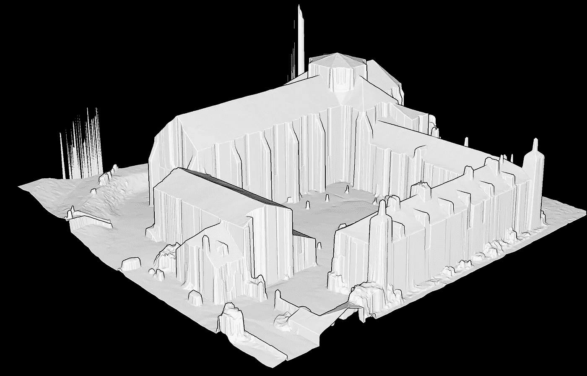

点云的 2.5D Delaunay 三角剖分示例。

## 基于体素的模型

体素可被视为可用于表示 3D 模型的 3D 基本立方体单位。它的 2D 类比是像素，最小的栅格单位。因此，基于体素的模型是“3D 像素”的离散化组合，通常与实体建模相关联。

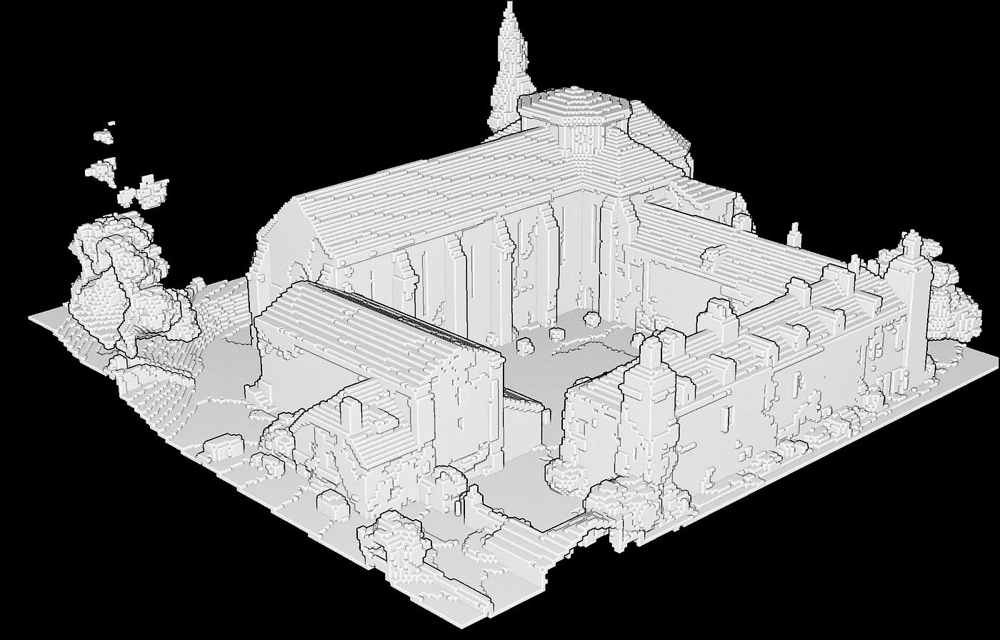

在点云数据的情况下，可以将每个点表示为大小为`x`的体素，以获得点之间空白空间的“填充”视图。它主要与八叉树等数据结构相关联，并允许根据所需的细化级别对每个体素单位的一定数量的点进行平均(参见下图中的示例)。这非常有趣，我将在另一篇专门的文章中讨论理论和实现。

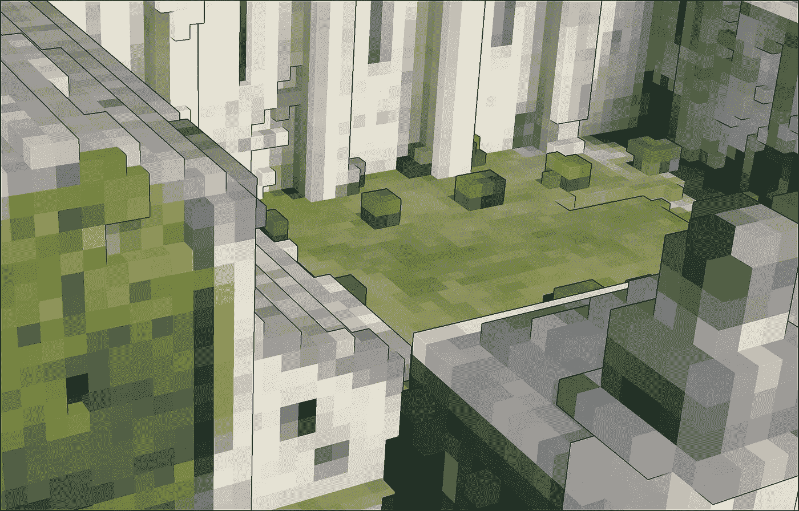

基于由点云数据占据的空间的八叉树细分的体素一般化的例子。

虽然这对于渲染和平滑可视化是实用的，但是它近似于初始几何形状，并且伴随有混叠伪影，并且如果不恰当地使用体积信息，则可能给出错误的信息。然而，由于体素模型的非常结构化的网格布局，它可以非常方便地用于处理任务，例如通过 3D 卷积神经网络进行分类。

## 参数模型(CAD)

“参数化”用于描述通过将参数设置为修改基础几何图形的目标值来改变形状的能力。例如，如果您想通过设置“墙”的方向、长度、宽度和高度来对其建模，这将非常方便。

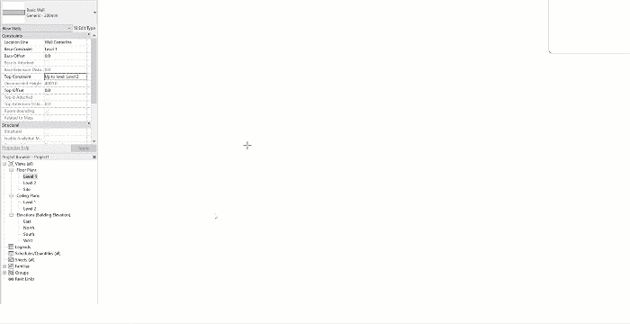

通过交互设置参数来创建 BIM 模型(建筑信息建模)的墙建模示例

然后，参数化建模适合于使用计算能力，该计算能力可以以真实世界的行为为目标对组件属性进行建模。参数化模型使用基于特征(参数化，如后面部分所述)、实体和曲面建模的组合，以允许操纵模型的属性。

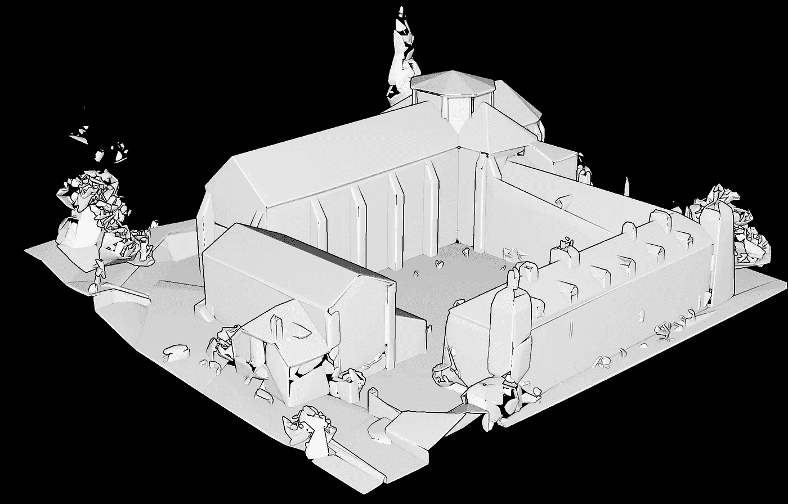

这是一个自动生成的 CAD 模型，没有拓扑修复。

参数化建模的一个最重要的特性是，相互链接的属性可以自动更改值。换句话说，参数化建模允许定义整个“形状类别”，而不仅仅是特定的实例。然而，这通常需要底层点云几何的非常“智能”的结构化，以将模型实体分解成聚集在类中的子实体(例如，段)。

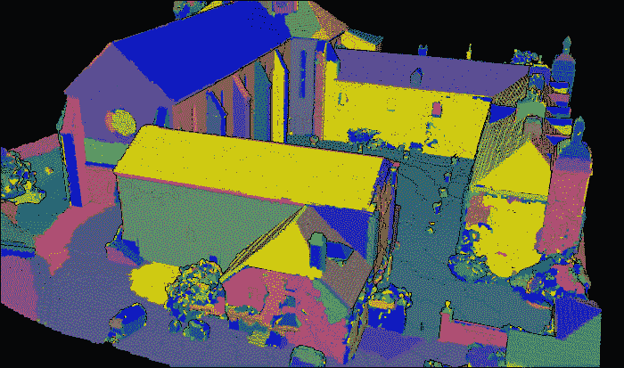

在这篇获奖的[开放存取文章](https://www.mdpi.com/2220-9964/8/5/213)【0】中描述了自动分段的例子

这个过程极大地受益于对象检测场景和智能点云基础设施，如下文所定义。

[](/the-future-of-3d-point-clouds-a-new-perspective-125b35b558b9) [## 三维点云的未来:一个新的视角

### 被称为点云的离散空间数据集通常为决策应用奠定基础。但是他们能不能…

towardsdatascience.com](/the-future-of-3d-point-clouds-a-new-perspective-125b35b558b9) 

通常，这些参数模型也可以通过组合插入点云形状的 2D CAD 绘图来组合或提取，并根据元素的类别对其进行分层。

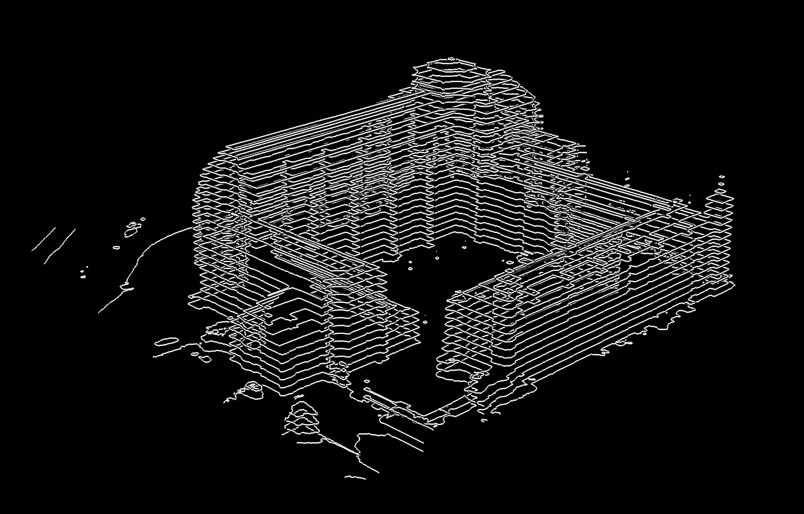

分层前来自初始点云的几个原始 CAD 截面的示例。

这些参数模型的创建通常很费时，但却是给 3D 点云数据带来最大价值的模型。这些来自大量的语义丰富和对构成场景的物体之间的关系的额外触发。

# 深度图

现在，我们跳到基于光栅的点云表示。第一个是深度图。

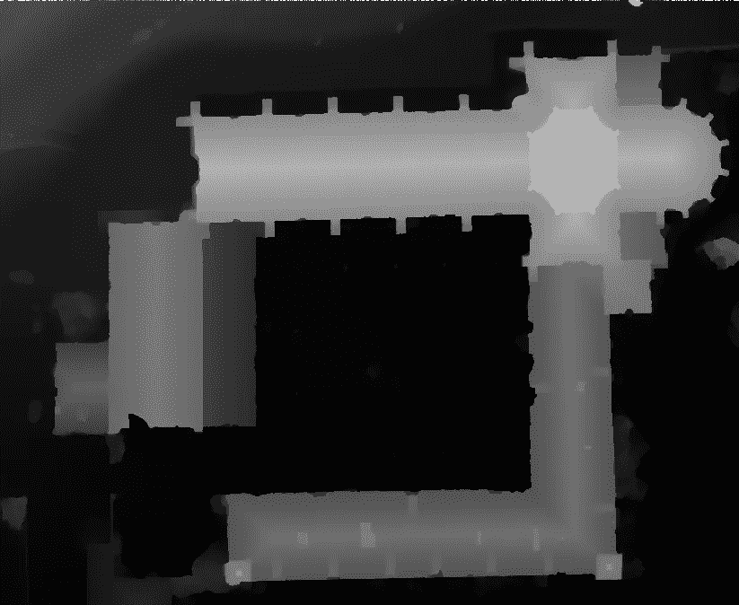

基于俯视图的点云深度图

深度图是图像或“图像通道”,其包含与从单个视点构成场景的点的距离相关的信息。虽然我们习惯于处理 RGB 图像，但表达深度的最简单形式是在一个通道上用颜色编码，并带有强度值。亮像素具有最高值，暗像素具有最低值。就是这样。深度图像只是根据物体有多远来呈现值，其中像素颜色给出了离相机的距离。

💡 ***提示:*** *深度图与 Z-buffer 有关，其中“Z”与相机的中心轴方向有关，与绝对 Z 场景坐标无关。*

如果您只需要链接到已知视点的表面信息，这种形式的点云表示就可以了。这是自动驾驶场景的情况，其中您可以通过 360°投影深度图非常快速地绘制每个位置的环境。然而，最大的不同是，你不是在处理 3D 数据，而是 2.5D 数据，因为你不能在视线上表示 2 个不同的值。下面是深度图的操作、优点和缺点:

**操作**

*   变换:用线性变换矩阵乘以图像中的像素
*   组合:可以通过合并点列表来组合对象。
*   渲染:在图像平面上绘制像素

**好处**

*   低内存需求
*   非常熟悉光栅格式
*   转换既快速又简单

**缺点**

*   本质上是 2.5 维的表现
*   无法单独描述完整的 3D 场景
*   弱拓扑

## 特例:RGB-D

第三，由于 RGB-D 传感器的普及，近年来将 3D 数据表示为 RGB-D 图像已经变得流行。RGB-D 数据通过将深度图与 2D 颜色信息(RGB)一起附加来提供关于捕获的 3D 对象的 2,5D 信息。

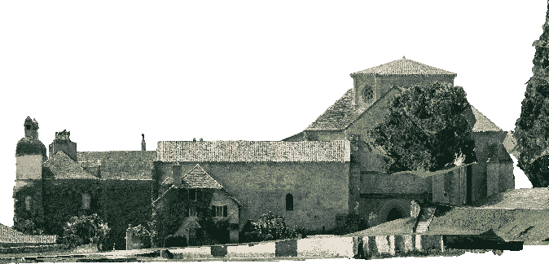

这是 RGB 光栅影像

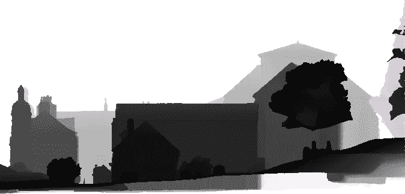

这是相关的深度通道

除了价格低廉之外，RGB-D 数据还是 3D 对象的简单而有效的表示，可用于不同的任务，如身份识别[1]、姿态回归[2]和通信[1]。与点云或 3D 网格等其他 3D 数据集相比，可用的 RGB-D 数据集的数量非常庞大，因此是通过大量训练数据集训练深度学习模型的首选方式。

## 特例:预测

其次，将 3D 数据投影到另一个 2D 空间是原始 3D 数据的另一种表示，其中投影的数据封装了原始 3D 形状的一些关键属性[3]。

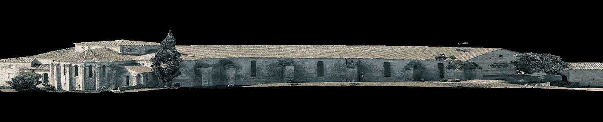

点云的大范围变形圆柱投影示例

存在多个投影，其中每个投影将 3D 对象转换成具有特定信息的 2D 网格。将 3D 数据投影到球形和圆柱形区域(例如[4])已经成为以这种格式表示 3D 数据的常见实践。这种投影有助于投影数据对于围绕投影主轴的旋转是不变的，并且由于所得投影的欧几里德网格结构，简化了 3D 数据的处理。然而，由于投影中的信息损失，这种表示对于复杂的 3D 计算机视觉任务不是最佳的，例如密集对应[5]。

# 隐性表征

现在，我们转到点云的较小的视觉组件:隐式表示。它只是一种通过一组形状描述符来表示点云的方法，如[6，7]中的文章所述。

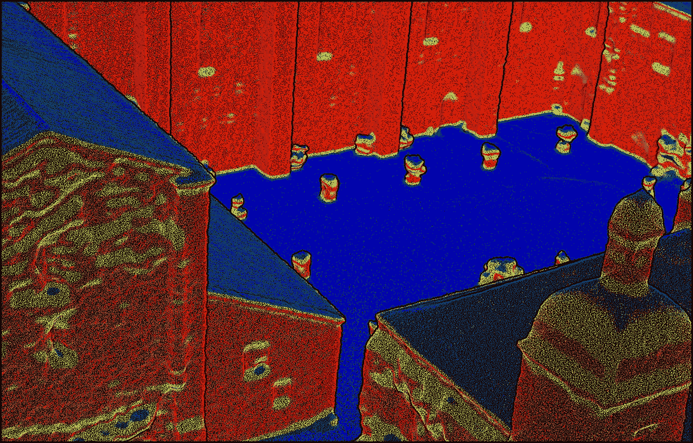

基于颜色的点云垂直特征可视化

这些可以被视为 3D 形状的签名，以通过捕捉一些关键属性来提供 3D 对象的紧凑表示，从而简化处理和计算(例如，表示为. csv 文件)

```
x      y      z   surface   volume   omn.  ver.       
9.9   30.5   265.3   334.5   103.3   4.6   0.0       
-27.0   71.6   274.2   18.2   12.5   1.3   0.4       
-11.8   48.9   273.8   113.2   620.4   3.7   0.7       
26.9   43.8   266.1   297.1   283.6   3.9   0.0       
42.9   61.7   273.7   0.1   0.0   0.3   0.8       
-23.1   36.5   263.3   26.3   14.8   1.6   0.0       
-9.5   73.1   268.2   24.0   11.4   2.2   0.0       
32.2   70.9   284.0   36.0   139.1   1.7   0.8       
-20.5   20.7   263.2   34.0   3.4   1.8   0.8       
-2.3   73.6   262.2   28.2   15.6   2.6   1.0
```

该签名的性质和含义取决于所使用的形状描述符的特征及其定义。例如，全局描述符为整个 3D 形状提供了简明而信息丰富的描述，而局部描述符为形状中较小的小块提供了更局部化的表示。Kazmi 等人[6]、Zhang 等人[7]以及最近 Rostami 等人[8]的工作提供了关于这种 3D 形状描述符的综合调查。

作为处理管道的一部分，隐式表示非常方便，并且可以简化不同基础设施之间的数据传输。对于受益于难以直观表示的信息特征的高级流程，它也非常有用。

# 多视图

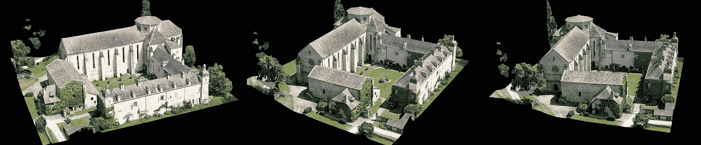

第五，我们可以从多视图图像中访问 3D 信息，多视图图像是基于 2D 的 3D 表示，其中通过匹配来自不同视点的同一物体的若干 2D 图像来访问信息。以这种方式表示 3D 数据可以导致学习多个特征集，以减少噪声、不完整、遮挡和照明问题对捕获数据的影响。然而，多少视图足以模拟 3D 形状的问题仍然是开放的，并且与摄影测量重建的获取方法相关联:视图数量不够少的 3D 对象可能无法捕捉整个 3D 形状的属性(尤其是对于 3D 场景)，并且可能导致过拟合问题。体积数据和多视图数据都更适合分析变形最小的刚性数据。

# 机器学习和深度学习呢？

3D 数据对于构建机器学习系统，尤其是深度学习，有着巨大的潜力。然而，目前，关于另一种深度学习范例，需要考虑诸如 3D 网格的真实 3D 数据表示。

事实上，绝大多数深度学习都是在**欧几里得数据上进行的。**这包括 1 维和 2 维域中的数据类型。图像、文本、音频和许多其他数据都是欧几里得数据。其中，特别是 RGB-D 数据集，如果想要自动检测场景中的对象，现在能够建立在大规模标记库的基础上。但是网格或结构化的点云可以从利用它们丰富的潜在关系中受益。例如，这是通过将它们嵌入图结构(一种由与**边**(关系)连接的**节点**(实体)组成的数据结构)来实现的，但这使得它们是非欧几里德的(网格本质上是这样的)，因此不可用于经典的机器学习架构。

为此，一个名为**几何深度学习(GDL)** 的新兴领域旨在建立可以从非欧几里得数据中学习的神经网络。

正如一位科学家同事 [Flawnson Tong](https://medium.com/@flawnsontong1?source=post_page-----b2adb662d91d----------------------) 在这篇推荐文章中所说的:

> 关系、联系和共有财产的概念是自然存在于人类和自然界的概念。从这些联系中理解和学习是我们理所当然的事情。几何深度学习意义重大，因为它允许我们利用具有内在关系、联系和共享属性的**数据。**

因此，每种 3D 数据表示都可以在机器学习项目中使用，但有些将用于更多的实验项目(非欧几里得表示)，而欧几里得数据可以直接在您的应用程序中获取

# 结论

如果你一直读到现在，那么恭喜你😆！总之，3D 数据表示世界非常灵活，您现在已经掌握了选择数据表示的明智决策:

*   3D 点云简单高效但缺乏连通性；
*   作为 3D 网格、参数模型、体素组件发现的 3D 模型提出了专用级别的附加信息，但近似于基本数据；
*   深度图是众所周知的和紧凑的，但是本质上处理 2.5D 数据；
*   隐式表示包含了上述所有内容，但几乎不是可视化的；
*   多视图是互补的，并利用光栅图像，但在最佳视点选择的情况下容易失败。

和往常一样，如果你想超越，你会发现以下几个参考。您也可以今天就在[地理数据学院](https://learngeodata.eu/)开始卓越之旅。

[](https://learngeodata.eu/point-cloud-processor-formation/) [## 点云处理在线课程- 3D 地理数据学院

### 编队学习先进的点云处理和三维自动化。开发新的 python 地理数据技能和开源…

learngeodata.eu](https://learngeodata.eu/point-cloud-processor-formation/) 

## 参考

0.波克斯，女；基于体素的三维点云语义分割:无监督的几何和关系特征与深度学习方法。 *ISPRS 国际地理信息杂志* **2019** ， *8* ，213。

1.新泽西州埃尔多穆斯；Marcel，s.《2D 的欺骗:使用 3D 面具的人脸识别和使用 Kinect 的反欺骗》.《第六届国际生物统计学会议论文集:理论、应用和系统》(BTAS)；IEEE，2013；第 1-6 页。

2.法内利公司；WeiseGall，j；来自消费者深度相机的实时头部姿态估计。 **2011** ，101–110。

3.Houshiar，h.《3D 点云处理的文档和制图》,维尔茨堡大学，2012 年。

4.曹；黄；通过球形投影的三维物体分类。 **2017** 。

5.辛哈，a。白；使用几何图像深度学习 3D 形状表面。《欧洲计算机视觉会议论文集》(ECCV)；2016 年德国阿姆斯特丹；第 223-240 页。

6.卡兹米，英国；你，我。和三维形状描述符的综述。第 10 届国际计算机图形学、成像和可视化会议录(CGIV)；IEEE，2013；第 1-10 页。

7.申博士；福尔克斯，加州大学；像素、体素和视图:单视图三维物体形状预测的形状表示研究。 **2018** 。

8.罗斯塔米河；Bashiri，F.S .罗斯塔米湾；数据驱动的三维形状描述符综述。*计算机图形学论坛* **2018** ， *00* ，1–38。