# 如何表现 2048 年的游戏状态

> 原文：<https://towardsdatascience.com/how-to-represent-the-game-state-of-2048-a1518c9775eb?source=collection_archive---------21----------------------->

## [用极大极小算法玩 2048](https://towardsdatascience.com/tagged/playing-2048-with-minimax)

## 以及如何以面向对象的方式实现它

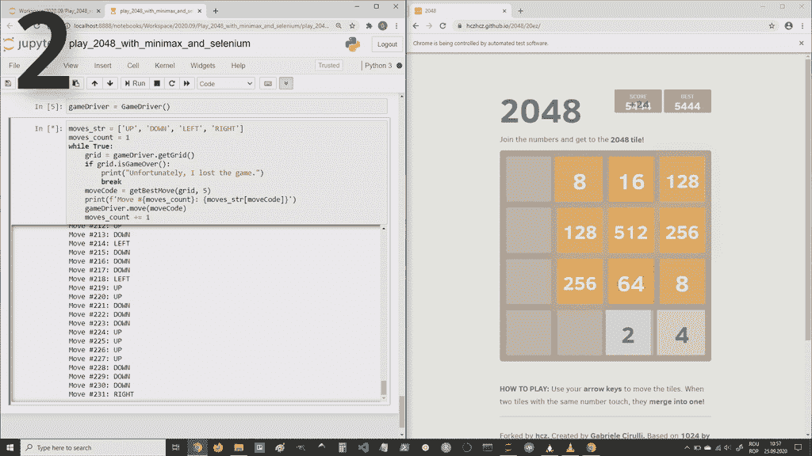

作者图片

在关于解决这个游戏的上一篇文章中，我已经在概念层面上展示了如何应用极大极小算法来解决 2048 游戏。但是为了将这些想法付诸实践，我们需要一种方法来表示游戏的状态并对其进行操作。我选择以面向对象的方式，通过一个我命名为`Grid`的类来这样做。这个类保存游戏状态，并为我们提供进一步实现极大极小算法所需的方法(在下一篇文章中)。

如果你错过了我以前的文章，这里是:

[](/playing-2048-with-minimax-algorithm-1-d214b136bffb) [## 如何将 Minimax 应用到 2048 年

### 2048 年——一个简单的游戏，但是给计算机编程来解决它并不简单

towardsdatascience.com](/playing-2048-with-minimax-algorithm-1-d214b136bffb) 

现在，让我们开始用 Python 实现`Grid`类。

在`Grid`类中，我们将游戏状态保存为一个矩阵，矩阵中有方块数，在有空方块的地方，我们将保存一个 0。在 Python 中，我们将使用一个列表列表，并将它存储到`Grid`类的`matrix`属性中。

这种表示法的一个例子如下所示:

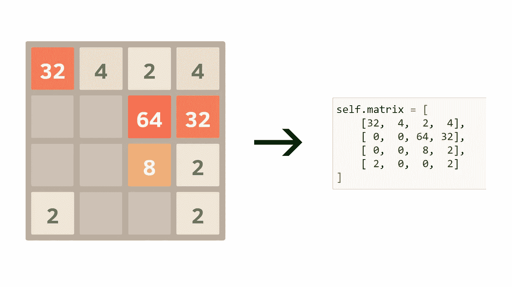

作者图片

在我们的实现中，我们需要稍微传递一下这个矩阵；我们将从一个`Grid`对象获取它，然后用它实例化另一个`Grid`对象，等等。因此，为了避免通过引用传递它所带来的副作用，我们将使用`deepcopy()`函数，因此我们需要导入它。我们将导入的另一个东西是`Tuple`，以及来自`typing`的`List`；这是因为我们将使用类型提示。

```
from copy import deepcopyfrom typing import Tuple, List
```

我们可以从创建用于设置和获取类的矩阵属性的方法开始。然后我们将创建一个在棋盘上放置瓷砖的方法；为此，我们只需将矩阵的相应元素设置为瓷砖的编号。输入行/列参数是 1 索引的，所以我们需要减去 1；图块编号按原样分配。

然后我们将定义`__init__()`方法，它将只是设置矩阵属性。

对于 minimax 算法，我们需要测试`Grid`对象的相等性。当两个对象的矩阵相同时，我们将认为两个`Grid`对象是相等的，我们将使用`__eq__()`魔法方法来做到这一点。我们遍历 2 个矩阵的所有元素，一旦有不匹配，我们就返回 False，否则最后返回 True。

接下来，我们创建一个实用方法。这个方法评估我们的游戏网格“有多好”。对此可能有许多可能的选择，但是这里我们使用下面的度量(如前一篇文章中所述):对矩阵的所有元素求和，然后除以非零元素的数量。

下一段代码有点棘手。我们需要检查 Max 是否能做以下动作之一:上、下、左、右。每一步的代码都非常相似，所以我将只解释其中的一步:up，它是在`.canMoveUp()`方法中实现的。

当我们想做“向上”移动时，事情只能垂直变化。棋盘的不同列之间没有交互作用。因此，我们可以为每一列独立运行代码。

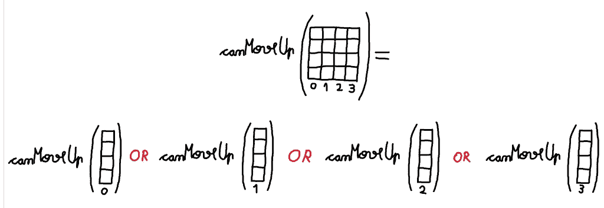

作者图片

我们可以在 for 循环中这样做:

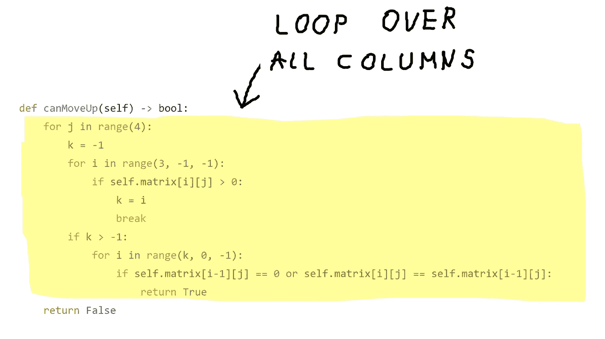

作者图片

我们不一定需要检查所有的列。一旦我们遇到一个允许在“向上”移动中改变某些东西的列，我们就返回 True。如果没有这样的列，我们最后返回 False。

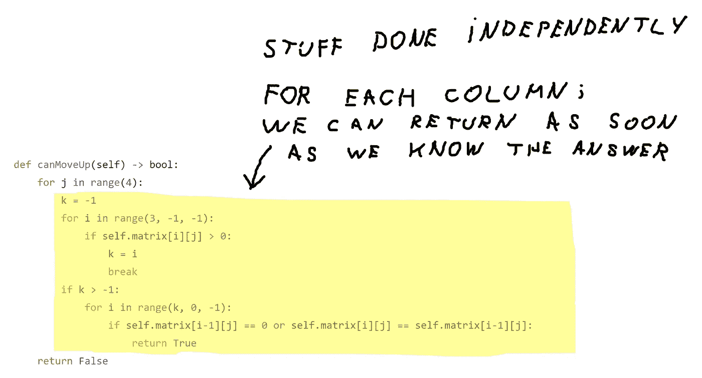

作者图片

对于每一列，我们执行以下操作:从底部开始向上移动，直到遇到一个非空(> 0)元素。在我们看到这样一个元素之后，我们如何知道一个“向上”的移动是否改变了这个列中的一些东西呢？有两种可能的情况会产生变化:要么有一个空方块可以移动，要么有两个相邻的相同的方块。

举个例子:

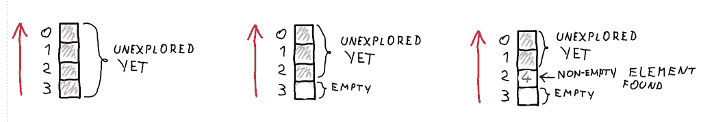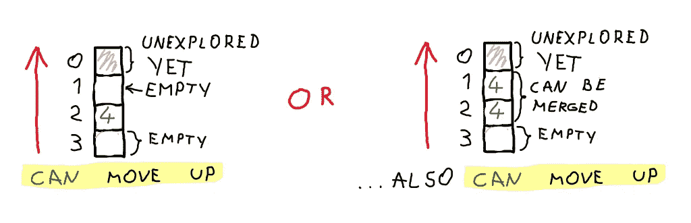

作者提供的图片

下面突出显示的代码负责查找最下面的非空元素:

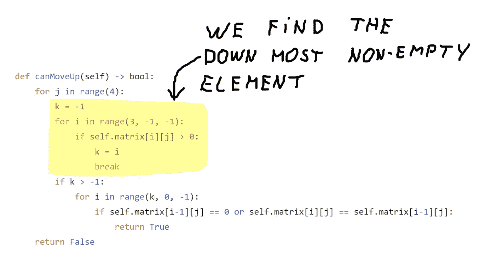

作者图片

下面突出显示的这段代码一旦找到可以移动方块的空方块或两个方块之间可能的合并，就返回 True。

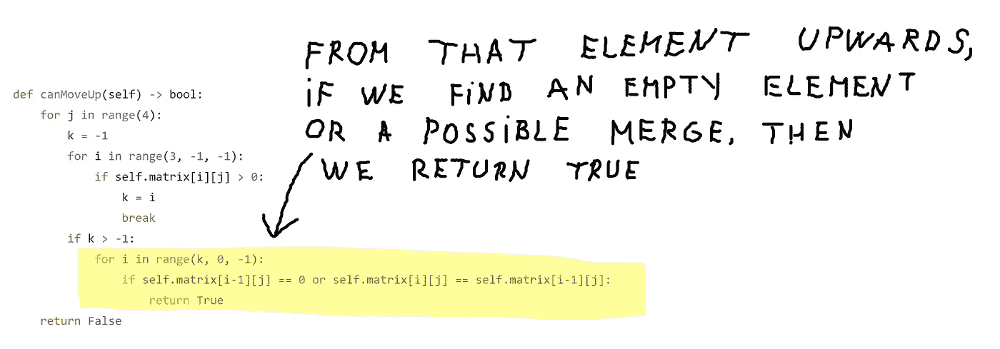

作者图片

下面是所有这些方法的代码，它们与`.canMoveUp()`方法的工作方式相似。

我们将需要一个方法，返回最大和最小的可用移动。对麦克斯来说，这是动作的子集:上，下，左，右。我们将这些移动表示为整数；每个方向都有一个相关的整数:

*   向上= 0
*   向下= 1
*   左= 2
*   右= 3

在`.getAvailableMovesForMax()`方法中，我们使用之前创建的方法检查我们是否可以在每个方向上移动，如果某个方向的结果为真，我们将相应的整数附加到一个列表中，我们将在方法结束时返回该列表。

`.getAvailableMovesForMin()`方法将返回网格上的空位置集和{2，4}集之间的叉积。该返回值将是(row，col，tile)形式的元组列表，其中 row 和 col 是空单元格的 1 索引坐标，tile 是{2，4}之一。

`.getChildren()`采用一个可以是“最大”或“最小”的参数，并使用前面两种方法之一返回适当的移动。这些是在极大极小算法的树中导致子游戏状态的移动。

对于极大极小算法，我们需要一种方法来确定一个游戏状态是否是终结的。正如我在上一篇文章中所说的，如果没有可用的移动，或者达到了一定的深度，我们将认为游戏状态是终结的。但是在极大极小算法内部检查深度条件会更容易，而不是在这个类内部。因此，通过`.isTerminal()`方法，我们将只检查最大值或最小值是否有可用的移动。一个简单的方法是使用`.getAvailableMovesForMin()`或`.getAvailableMovesForMax()`返回一个包含所有走法的列表，如果是空的则返回 True，否则返回 False。但是更有效的方法是，一旦我们“看到”一个可用的移动就返回 False，最后，如果没有返回 False，则返回 True。

`.isGameOver()`方法只是`.isTerminal(who=”max”)`的简写，它将在我们的游戏求解循环中用作结束条件(在下一篇文章中)。

下面的方法是用来上下左右移动的。这次我们实际做这些动作，不要只检查能不能做。每个移动方向的代码是相似的，所以，我将只解释向上移动。

每列都可以独立地向上移动。我们将有一个遍历列的 for 循环。对于每一列，我们将把变量`w`和`k`初始化为 0。`w`保存下一个写操作的位置。`k`存储最后遇到的非空单元格的平铺值。

该算法运行如下:

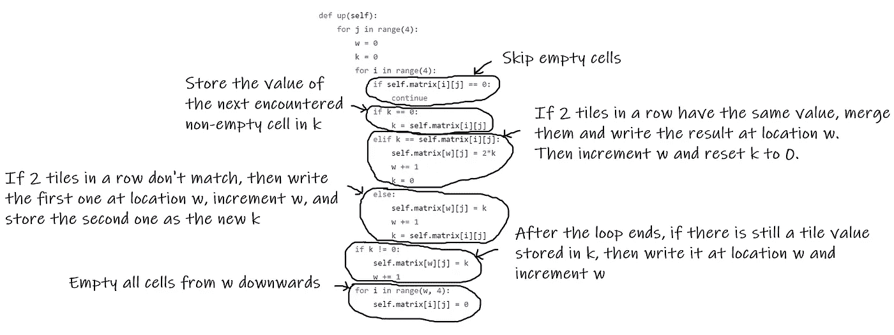

作者图片

下面是一个给定列的工作原理示例:

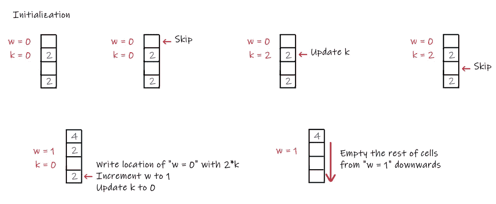

作者图片

下面是包含所有 4 种方法的代码:`.up()`、`.down()`、`.left()`、`.right()`:

然后，我们围绕上述 4 个方法创建了一个包装器，并将其命名为`.move()`，它按照参数给定的方向移动。

我们需要的另一件事是移动的“逆”方法。`.move()`将方向代码作为参数，然后进行移动。现在，我们想要一个方法，它将另一个`Grid`对象作为参数，该对象被假定为对`.move()`的调用的直接子对象，并返回生成该参数的方向代码。我们将这种方法命名为`.getMoveTo()`。

这个方法的工作原理是创建当前对象的副本，然后依次调用这些副本上的`.up()`、`.down()`、`.left()`、`.right()`，并根据方法的参数测试是否相等。当等式成立时，我们返回适当的方向代码。

下面是`Grid`类的完整代码:

这就是本文的全部内容。在下一部(这是关于 2048 年和 minimax 的最后一部)中，我们将看到我们如何控制这款游戏的网页版游戏板，实现 minimax 算法，并看着它比我们玩得更好(…或至少比我好)。

[](/how-to-control-the-game-board-of-2048-ec2793db3fa9) [## 如何控制 2048 的游戏板

### …并完成最小最大算法的实现

towardsdatascience.com](/how-to-control-the-game-board-of-2048-ec2793db3fa9) 

我希望这些信息对你有用，感谢你的阅读！

这篇文章也贴在我自己的网站[这里](https://www.nablasquared.com/how-to-represent-the-game-state-of-2048/)。随便看看吧！