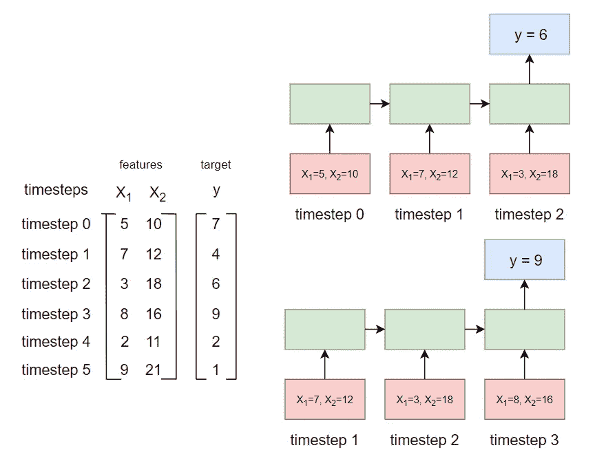
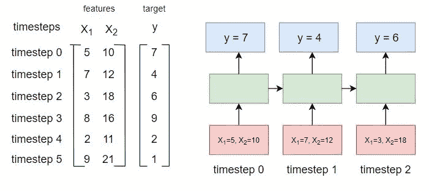
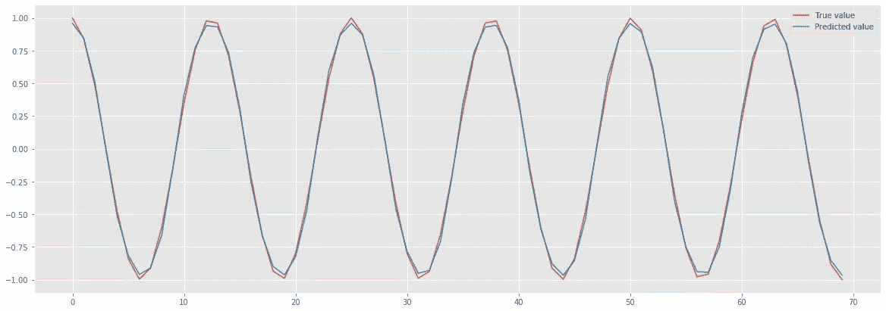
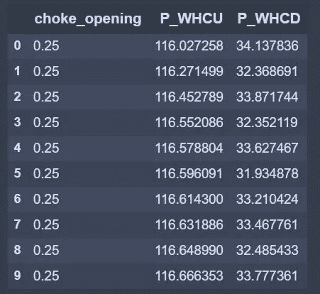
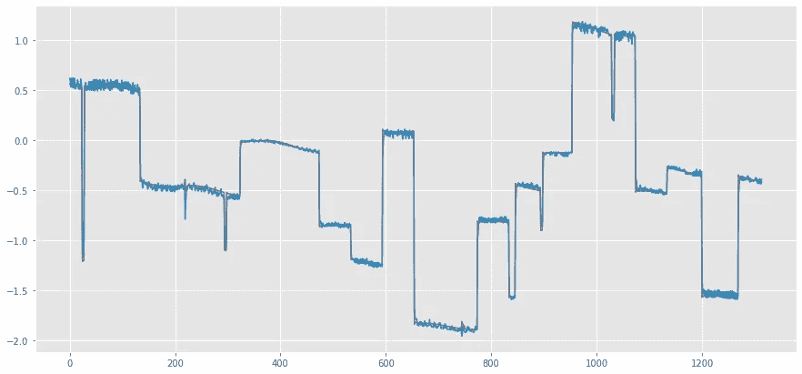

# 如何使用 LSTM 重塑数据并对时间序列进行回归

> 原文：<https://towardsdatascience.com/how-to-reshape-data-and-do-regression-for-time-series-using-lstm-133dad96cd00?source=collection_archive---------5----------------------->

## 逐步解释如何使用 LSTM 进行时间序列回归，包括多对多和多对一架构的输入整形。

在过去的几年里，一般的递归神经网络，特别是 LSTM，在许多数据科学从业者中变得非常流行。尽管 LSTMs 的主要应用是自然语言处理(NLP ),但对于计算科学家和工程师来说，LSTMs 为数据中存在时间相关性的问题提供了创建强大回归模型的可能性。

**你将学到什么**

在本文中，您将学习如何:

*   重塑 LSTM 培训的输入数据
*   用 **Keras** 拟合 LSTM 时间序列数据
*   使用 LSTM 处理单变量和多变量数据集

**输入数据形状混乱**

撰写本文的主要原因之一是，在 Keras 等神经网络框架中，您需要以 3D 格式提供 LSTM 输入数据，这可能会让许多人感到非常困惑。更令人困惑的是 Keras 中输入维度的命名方式。 ***根据文档和源代码，Keras LSTM 输入数据的格式必须为:[batch_size，timesteps，input_dim]。*** 此外，可能不需要指定 batch_size。令人困惑。我知道。让我们看看如何将我们的 1D 和 2D 数据改造成 3D 数据形状，以便 LSTM 能够工作！

**LSTM 架构以及与输入数据形状的关系**

在开始数据重塑之前，让我们回顾一下存在哪些 LSTM 架构。我们来看下图:


图 1—http://karpathy.github.io/2015/05/21/rnn-effectiveness/ LSTM 网络架构(来源—)

*我们不会逐一介绍。在我看来，对于时间序列问题，最有用的是多对一和多对多(图 1 中的最后一个)，所以我们将更详细地讨论它们。*

***在 Keras 中，时间步长的数量等于 LSTM 单元的数量。这就是单词“时间步长”在形状的 3D 张量中的含义[batch_size，time steps，input_dim]。***

为了更好地理解这一点，让我们考虑一个玩具(完全随机)数据集，如图 2 所示。在数据集中，我们有 2 个特征和 6 个时间步长(因为我们使用 Python，所以我们从 0 开始计数)。

首先，考虑多对一的例子。

在这种情况下，Keras 希望我们对数据进行整形，以便根据指定数量的先前和当前时间步长特征来计算时间步长 *t* 处的预测。 ***在右图所示的 LSTM 架构中，时间步数设置为 3。***



图 2 —多对一架构示例

***要素的数量等于 2D 数据集中的要素数量。因此，shape [batch_size，timesteps，input_dim]的 3D 张量中的单词“input_dim”表示原始数据集中的要素数量。在我们的例子中," input_dim"=2***

为了将我们的原始 2D 数据整形为 3D“滑动窗口”形状，如图 2 所示，我们将创建以下函数:

```
def lstm_data_transform(x_data, y_data, num_steps=5):
    """ Changes data to the format for LSTM training 
for sliding window approach """ # Prepare the list for the transformed data
    X, y = list(), list() # Loop of the entire data set
    for i in range(x_data.shape[0]):
        # compute a new (sliding window) index
        end_ix = i + num_steps # if index is larger than the size of the dataset, we stop
        if end_ix >= x_data.shape[0]:
            break # Get a sequence of data for x
        seq_X = x_data[i:end_ix]
        # Get only the last element of the sequency for y
        seq_y = y_data[end_ix] # Append the list with sequencies
        X.append(seq_X)
        y.append(seq_y) # Make final arrays
    x_array = np.array(X)
    y_array = np.array(y) return x_array, y_array
```

***形状的 3D 张量中的 batch _ size【batch _ size，timesteps，input_dim】可能不需要指定，可以指定只是为了加速训练过程。***

现在，让我们看看我们需要如何为多对多 LSTM 模型重塑数据。为此，请看图 3。这里，我们有 2 个特征，数据集中的 6 个时间步长和 LSTM 神经网络中的 3 个时间步长。因此，为了将 2D 数据转换成所需的 3D 张量，我们可以如下使用 Numpy 功能:

```
num_steps = 3
num_features = 2
x_shaped = np.reshape(x, newshape=(-1, num_steps, num_features))
```



图 3—多对多架构示例

现在，让我们考虑两个例子，这样我们就可以完全理解如何重塑数据，并使用多对一和多对多 LSTM 模型。在第一个例子中，我们将有一个正弦波的一维自回归模型，而在第二个例子中，我们将有一个包含 3 个特征的 2D 数据集。

# 1D 示例—正弦波的自回归模型

在这种情况下，我们要做的是使用指定数量的先前时间步长预测时间步长 *t* 处的函数值。首先，让我们生成数据。

```
x = np.arange(0, 200, 0.5).reshape(-1, 1)
y = np.sin(x).reshape(-1, 1)
```

假设我们想要使用 sin 波的前 10 个时间步长来预测 sin 函数的下一个值。然后，为了将 LSTM 用于此任务，我们使用已经定义的函数来转换数据:

```
num_steps = 10
x_new, y_new = lstm_data_transform(y, y, num_steps=num_steps)
print ("The new shape of x is", x_new.shape)The new shape of x is (390, 10, 1)
```

**请注意，我们为函数的 x 和 y 参数都传递了 y，因为我们想要创建一个自回归模型。**

太好了！现在，我们有了 LSTM 形状，这应该对我们有用。接下来，我们分割数据集，80%用于模型训练，20%用于模型测试。

```
train_ind = int(0.8 * x.shape[0])
x_train = x_new[:train_ind]
y_train = y_new[:train_ind]
x_test = x_new[train_ind:]
y_test = y_new[train_ind:]
```

最后，我们定义一个简单的 Keras 模型并训练它！

```
model = Sequential()
model.add(LSTM(100, activation='tanh', input_shape=(num_steps, 1), 
               return_sequences=False))
model.add(Dense(units=50, activation='relu'))
model.add(Dense(units=1, activation='linear'))
adam = optimizers.Adam(lr=0.0001)
model.compile(optimizer=adam, loss='mse')
model.fit(x_train, y_train, epochs=20)
```

然后在测试集上进行预测:

```
test_predict = model.predict(x_test)
plt.style.use('ggplot')
plt.figure(figsize=(20, 7))
plt.plot(y_test, label="True value")
plt.plot(test_predict.ravel(), label="Predicted value")
plt.legend()
```



图 4。—用于估计正弦波的多对一 LSTM 模型结果

我们得到了一个很好的 sin 函数！这为您提供了一个如何将 1D 数据重塑为 3D 数据以创建多对一架构的 LSTM 模型的示例。 ***注意，这里我们做了一个自回归模型，把 y 放在“lstm_data_transform”的 x_data 和 y_data 两个输入上。请随意将您的要素数据转换为 x_data，这样它会将 x_data 转换为所需的形式。***

# 2D 示例——通过节流阀的流量

在这个例子中，我们将考虑有 3 个特性和 1 个目标变量的情况，并将使用**多对多和多对一架构。**目标变量是通过[阻风门](https://en.wikipedia.org/wiki/Choke_valve)的流量。*如果您对该流程一无所知，请不要担心，这只是一个说明性的示例，该概念将完全适用于手头的任何问题。*

让我们看看数据帧的开头。在“特征”中，我们有节流器前的压力(P_WHCU)、节流器后的压力(P_WHCD)和节流器开口(0 到 1 之间的值)。因此，我们有 3 个特征和 1 个目标变量，即通过节流器的流量。



## 资料组

在数据集中，我们有 6570 个点。像以前一样，80%用于培训，20%用于测试。最初，我还使用应用于训练数据的标准缩放器来重新缩放数据，并转换训练和测试数据。

拆分:

```
train_ind = int(0.8 * x_data.shape[0])
x_train = x_data[:train_ind]
x_test = x_data[train_ind:]
y_train = y_data[:train_ind]
y_test = y_data[train_ind:]
```

缩放:

```
# scalers
scaler_x = StandardScaler()
scaler_y = StandardScaler()
# scaling
x_train_sc = scaler_x.fit_transform(x_train)
x_test_sc = scaler_x.transform(x_test)
y_train_sc = scaler_y.fit_transform(y_train)
y_test_sc = scaler_y.transform(y_test)
```

**多对多培训**

假设我们想要使用 3 个先前的时间步长特征来预测通过节流器的流量的当前值。首先，我们按如下方式重塑数据:

```
num_steps = 3
# training set
x_train_shaped = np.reshape(x_train_sc, newshape=(-1, num_steps, 3))
y_train_shaped = np.reshape(y_train_sc, newshape=(-1, num_steps, 3))
assert x_train_shaped.shape[0] == y_train_shaped.shape[0]
# test set
x_test_shaped = np.reshape(x_test_sc, newshape=(-1, num_steps, 3))
y_test_shaped = np.reshape(y_test_sc, newshape=(-1, num_steps, 3))
assert x_test_shaped.shape[0] == y_test_shaped.shape[0]
```

“newshape”参数的最后一个参数等于 3，因为我们有 3 个特征。

现在，我们编译这个模型。**请注意，对于多对多模型，我们需要使用 return _ sequences = True:**

```
model = Sequential()
model.add(LSTM(20, activation='tanh', input_shape=(num_steps, 3), return_sequences=True))
model.add(Dense(units=20, activation='relu'))
model.add(Dense(units=1, activation='linear'))
adam = optimizers.Adam(lr=0.001)
model.compile(optimizer=adam, loss='mse')
```

拟合模型并根据测试数据进行预测:

```
model.fit(x_train_shaped, y_train_shaped, epochs=10)
test_predict = model.predict(x_test_shaped)
```



图 5-节流流量的多对多估计结果

我们看到，预测是好的，除了一些波动行为，这可能是由过拟合引起的，并通过更好的模型训练来减少。*现在，让我们考虑相同的数据集，但采用多对一架构。*

**多对一培训**

和以前一样，我们需要重塑我们的数据，但现在我们需要使用预建的函数:

```
num_steps = 3# training set
(x_train_transformed,
 y_train_transformed) = lstm_data_transform(x_train_sc, y_train_sc, num_steps=num_steps)
assert x_train_transformed.shape[0] == y_train_transformed.shape[0]# test set
(x_test_transformed,
 y_test_transformed) = lstm_data_transform(x_test_sc, y_test_sc, num_steps=num_steps)
assert x_test_transformed.shape[0] == y_test_transformed.shape[0]
```

之后，数据集就可以进行训练了。我们编译与多对多相同的模型。**请注意，对于多对一模型，我们需要使用 return _ sequences = False:**

```
model = Sequential()
model.add(LSTM(20, activation='tanh', input_shape=(num_steps, 3), return_sequences=False))
model.add(Dense(units=20, activation='relu'))
model.add(Dense(units=1, activation='linear'))
adam = optimizers.Adam(lr=0.001)
model.compile(optimizer=adam, loss='mse')
```

然后，我们拟合模型并对测试集进行预测:

```
model.fit(x_train_transformed, y_train_transformed, epochs=10)
test_predict = model.predict(x_test_shaped)
```


图 6-节流流量的多对一估计结果

如我们所见，我们得到了与多对多模型相似的拟合。然而，这是一个简单的数据集，对于许多问题，结果可能不同。

# 结论

在这篇文章中，我们考虑了如何使用 Keras LSTM 模型进行时间序列回归。我们展示了如何将 1D 和 2D 数据集转换为 3D 张量，以便 LSTM 适用于多对多和多对一架构。在多对多的情况下，我们可以使用 Numpy 功能，而对于多对一，我们需要使用转换函数。此外，对于多对多，Keras 参数 return_sequence 必须等于 True，而对于多对一模型，它必须等于 False。我希望这篇文章对你有用，它将允许你从现在起在研究和日常工作中更多地使用 LSTM 模型！