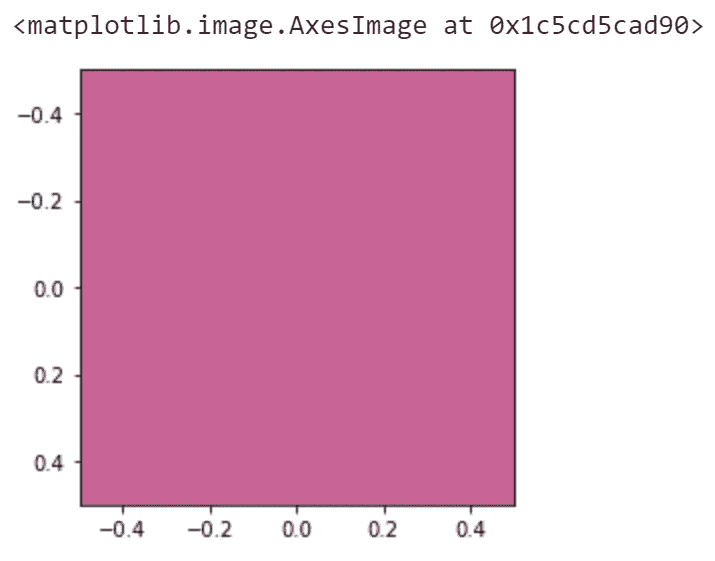
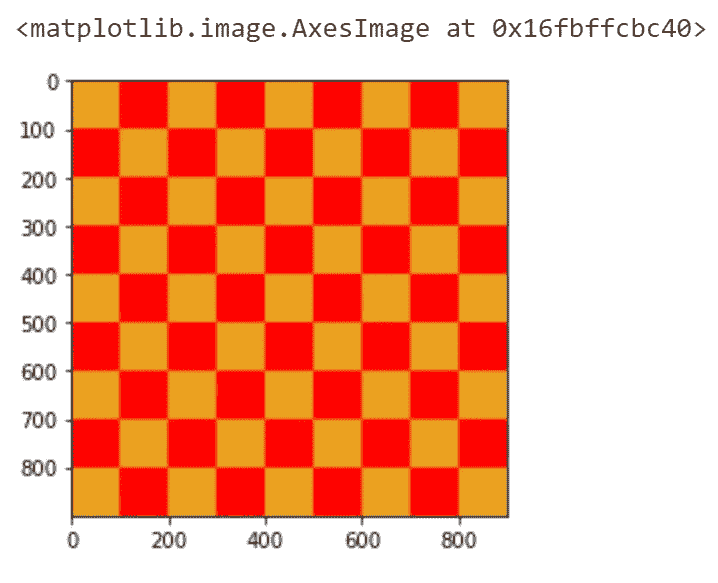
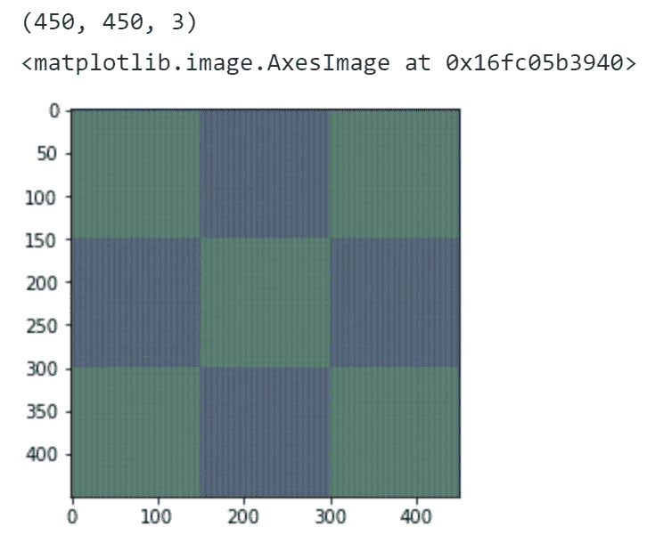
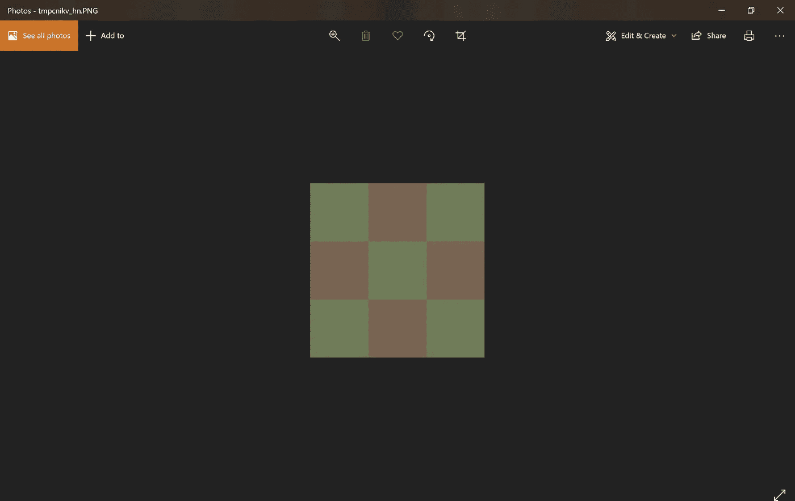

# 如何使用 Python 调整图像大小

> 原文：<https://towardsdatascience.com/how-to-resize-images-using-python-8aaba74602ed?source=collection_archive---------13----------------------->

## “可扩展”的技术


在 [Unsplash](https://unsplash.com?utm_source=medium&utm_medium=referral) 上由[阿米拉里·米尔哈西米安](https://unsplash.com/@amir_v_ali?utm_source=medium&utm_medium=referral)拍摄的照片

可以肯定地说，每个“电脑人”都曾经需要调整图像的大小。MacOS 的预览版可以做到； [Windows PowerToys](https://github.com/microsoft/PowerToys) 也可以。

如果你懂 Photoshop 或者 Gimp，那么你和我……我们不一样。命令行实用程序？好吧，现在我可以理解了。

幸运的是，图像处理和命令行工具是 Python 的两个专长。

本文旨在向您展示三件事:

1.  什么是图像的基础知识。
2.  用于处理图像的 Python 库。
3.  您可以在自己的项目中使用的代码。

我们将要构建的命令行程序可以一次调整一个或多个图像文件的大小。

让我们跳进来吧！

# 创建图像

对于这个例子，我们将创建我们自己的图像，而不是找到一个真实的图像来操纵。

为什么？因为我不得不把事情复杂化，这就是原因！

事实上，创造我们自己的图像是一个很好的方式来说明图像到底是什么。这个调整大小的程序可以在 Instagram 上运行。

那么，什么是图像呢？在 Python 数据术语中，图像是整数元组列表的列表。

```
image = list[list[tuple[*int, float]]]
```

NumPy *esque* 定义将是一个 shape (h，w，4)的二维数组，其中`h`是高(上下)的像素数，`w`是横(从左到右)的像素数。

换句话说，图像是像素(单元)的列表(行)的列表(整个图像)。每个像素是一个由 3 个整数和 1 个可选浮点数组成的序列:红色通道、绿色通道、蓝色通道、alpha(可选的浮点数)。红色、绿色、蓝色通道(RGB)的值从 0 到 255。

从现在开始，为了简单起见，我们将讨论没有 alpha 通道的彩色图像。Alpha 是像素的透明度。图像也可以只有一个通道，其值从 0 到 255。这就是灰度图像，也就是黑白图像。但这是真实的世界…我们用彩色图像工作！

```
import matplotlib as plt
​
pixel: tuple = (200, 100, 150)
plt.imshow([[list(pixel)]])
```



从 Python 代码渲染的单个像素。

很性感。

# 用纯 Python 制作图像

Vanilla Python 完全能够创建图像。为了显示它，我将使用`matplotlib`库，您可以使用:

```
pip install matplotlib
```

创建像素:

创建图像:



这是渲染的图像。在幕后，数据看起来是这样的(对于 90x90):

```
[[[234, 162, 33],
  [234, 162, 33],
  [234, 162, 33],
  [234, 162, 33],
  [234, 162, 33],
  [234, 162, 33],
  [234, 162, 33],
  [234, 162, 33],
  [234, 162, 33],
  [234, 162, 33],
  [255, 0, 0],
  [255, 0, 0],
  [255, 0, 0],
  [255, 0, 0],
  [255, 0, 0],
  [255, 0, 0],
  [255, 0, 0],
  [255, 0, 0],
  [255, 0, 0],
  [255, 0, 0],
  [234, 162, 33],
  ...
```

现在我们有了一个图像，让我们开始调整它的大小！

# 在普通 Python 中调整大小

心理！我们将*而不是*用 Python 写一个调整图像大小的算法。

为什么？

TLDR:工作量太大了。

图像处理算法中有太多的东西。有些人把他们的生命奉献给了它。重采样——用缩小图像中的一个像素代替高分辨率图像中的许多像素——本身就是一个巨大的话题。如果你想自己看看，在`path/to/site-packages/PIL`安装 Pillow 的时候可以查看一下 Pillow 的源代码中的`Image.py`。

还有像抗锯齿和缩小差距这样的优化…这是无止境的。我们将站在巨人的肩膀上，这意味着相信计算机视觉领域的杰出工作，并无耻地调用一行程序来解决我们的问题。

> 如果您有兴趣了解更多关于处理图像时幕后发生的事情，我鼓励您更多地查看“机器视觉”主题！这绝对是一个蓬勃发展的领域，有比一个人有更多的时间去探索。
> 
> 变得足够好，有一大群公司愿意为你的计算机视觉专业知识支付高价。自动驾驶、物联网、监控，应有尽有；都是从根本上依赖于处理图片(通常用 Python 或者 C++)。
> 
> 一个很好的起点是查看 [scikit-image](https://scikit-image.org/) 。

# OpenCV

[OpenCV](https://opencv.org/opencv-3-3/) 是图像处理的终极目标。OpenCV 是用 C++编写并移植到 Python 的，它运行在你自制的自动驾驶汽车的后备箱中，用于车道检测。

用于`interpolation`参数的选项是`cv2`包中提供的标志之一:

```
INTER_NEAREST – a nearest-neighbor interpolation 
INTER_LINEAR – a bilinear interpolation (used by default) 
INTER_AREA – resampling using pixel area relation. It may be a preferred method for image decimation, as it gives moire’-free results. But when the image is zoomed, it is similar to the INTER_NEAREST method. 
INTER_CUBIC – a bicubic interpolation over 4×4 pixel neighborhood INTER_LANCZOS4 – a Lanczos interpolation over 8×8 pixel neighborhood
```

这将返回:



它达到了我们的预期。图像从 900 像素高、900 像素宽变成了 450 X 450(仍然是三个颜色通道)。上面的截图看起来不太好，因为朱庇特实验室的`matplotlib`着色。

# 枕头

`pillow`库在`Image`类上有一个调整大小的方法。它的论据是:

```
size: (width, height)
resample: Defaults to BICUBIC. A flag for the resampling algorithm.
box: Defaults to None. A 4-tuple defining a rectangle of the image to work on within parameters (0, 0, width, height).
reducing_gap: Defaults to None. A resampling optimization algorithm to make the output look better.
```

在这里它是为我们的目的而设的一个函数:

使用 Pillow 的功能*与 OpenCV 非常*相同。唯一的区别是`PIL.Image.Image`类有一个属性`size`来访问图像的`(width, height)`。

结果是:



注意`show`方法如何打开操作系统的默认程序来查看图像的文件类型。

# 创建命令行程序

现在我们有了一个调整图像大小的函数，是时候用一个运行 resize 的界面来完善它了。

调整一个图像的大小是好的。但是，如果我们要经历所有这些麻烦，我们也需要批量处理图像的能力。

我们将要构建的界面将是最简单的:一个命令行工具。

[托盘项目](https://palletsprojects.com/)是 Flask(Jinja 模板引擎)背后的天才社区，与我们现在相关:[点击](https://click.palletsprojects.com/en/7.x/)。

```
pip install click
```

Click 是一个制作命令行程序的库。这比使用简单的`argparse`或者在`if __name__ == '__main__':`语句中加入一些 if-then 逻辑要好得多。因此，我们将使用点击来装饰我们的图像大小。

这是从命令行调整图像大小的完整脚本！

命令行程序从入口点函数`main`运行。参数由`click.option`装饰者传递给`main`:

*   `pattern`使用一个 Python / [RE2](https://github.com/google/re2) 样式的字符串来定位相对于脚本运行目录的一个或多个图像。`--pattern="../catpics/*.png"`将向上一级并找到`catpics`文件夹，并返回该文件夹中带有`.png`图像扩展名的任何文件。
*   `scale`接受一个浮点数或整数，并将其传递给`resize`函数。这个脚本很简单，这意味着没有数据验证。如果你添加代码，检查`scale`是一个介于 5 和 99 之间的数字(合理的缩小参数)。现在，你可以通过`-s "chicken nuggets"`，直到 Pillow 停止程序才会抛出异常。
*   `quiet`是一个选项参数，用于在程序运行时不希望文本打印为标准输出。

从命令行运行程序:

```
python resize.py -s 35 -p "./*jpg"
```

结果:

```
$ py resize.py -p "checkers.jpg" -s 90
resized image saved to checkers_90_810x810.jpg.
```

正在检查文件夹:

```
$ ls -lh checkers*
-rw-r--r-- 1 nicho 197609 362K Aug 15 13:13 checkers.jpg
-rw-r--r-- 1 nicho 197609 231K Aug 15 23:56 checkers_90_810x810.jpg
```

不错！所以程序缩小了图像，给了它一个描述性的标签，我们可以看到文件大小从大约 362KB 变成了大约 231KB！

为了看到程序一次处理多个文件，我们将再次运行它:

```
$ py resize.py --pattern="checkers*" --scale=20
resized image saved to checkers_20_180x180.jpg.
resized image saved to checkers_90_810x810_20_162x162.jpg.
```

和文件系统:

```
$ ll -h checkers*
-rw-r--r-- 1 nicho 197609 362K Aug 15 13:13 checkers.jpg
-rw-r--r-- 1 nicho 197609 1.8K Aug 16 00:23 checkers_20_180x180.jpg
-rw-r--r-- 1 nicho 197609 231K Aug 15 23:56 checkers_90_810x810.jpg
-rw-r--r-- 1 nicho 197609 1.8K Aug 16 00:23 checkers_90_810x810_20_162x162.jpg
```

好吧，递归运行这个程序只适用于疯狂的人，但是它表明你可以同时运行任意数量的匹配模式的图像。去吧，自动化！

> **奖金**
> 
> 点击是一个神奇的工具。它可以包装一个函数，并从一个`if __name__ == '__main__':`语句“以正常方式”在一个模块中运行。(而实际上，它甚至不需要那个；你可以定义和修饰你想要运行的函数。)但是它真正的亮点是将脚本作为一个包安装。
> 
> 这是通过 Python 自带的`setuptools`库完成的。
> 
> 这是我的`setup.py`。

> 使用以下命令构建可执行文件/包装包:
> 
> `*pip install -e .*`
> 
> 现在你可以不使用`python`命令来调用这个脚本了。另外——作为一个额外的奖励——如果你将新的可执行文件添加到路径中的一个文件夹中，你可以从你计算机上的任何地方调用这个程序，就像`resize -p *jpg -s 75`！

# 结论

本教程变化很大:首先浏览一些第三方 Python 库进行图像处理。然后使用 Python 从头构建一个图像，以更好地理解图像实际上是什么。然后，选择其中一个选项并构建一个脚本来缩小图像，同时保持它们的比例。最后—*吸入*——将所有这些都放在一个命令行实用程序中，使用`click`接受可配置的选项。

再多说几句我就完事了，我保证。

我只想说:我和你一起一口气谈完所有这些话题是有原因的。这个原因不是因为我有多动症。

是因为编程思路需要从想法到执行的闭环。关于如何用 Python 做一些事情的一次性概念是好的…但是归根结底，编程语言是一种工具。它需要帮助我们完成有价值的事情。

当你开始觉得教程“又一件你必须学的东西”压得你喘不过气来时，这意味着是时候放下阅读，开始为一些小项目编码了。一次就能完成的事情，感觉自己有进步。

记住，编写代码可能需要几个小时或几天的时间。然而运行只需要几毫秒。你做的程序不一定要大。你做的任何一件事，只要能节省你的时间或让你产出更多，都有可能让你受益终生！

# 资源

*   [点击](https://click.palletsprojects.com/en/7.x/)
*   [matplotlib](https://matplotlib.org/3.2.0/tutorials/introductory/images.html)
*   [opencv](https://docs.opencv.org/4.4.0/)
*   [枕头](https://pillow.readthedocs.io/en/stable/)
*   [scikit-image](https://scikit-image.org/)