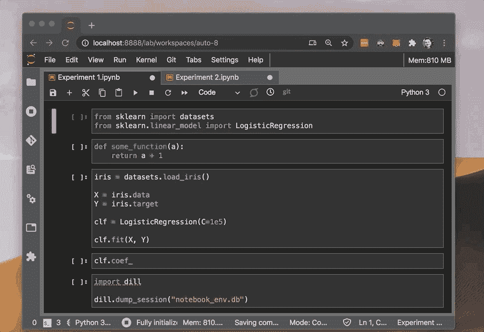

# 如何恢复您的 Jupyter 笔记本会话

> 原文：<https://towardsdatascience.com/how-to-restore-your-jupyter-notebook-session-dfeadbd86d65?source=collection_archive---------19----------------------->

## 重新启动计算机时，不要丢失 Jupyter 笔记本会话中的进度。Dill 包可以保存笔记本会话供以后使用。


尼克·舒利亚欣在 [Unsplash](https://unsplash.com?utm_source=medium&utm_medium=referral) 上的照片

H 有没有发生过这样的事情，你重启了电脑，却忘记了你打算以后用的那个重要的 Jupyter 笔记本？“花了这么长时间才完成，现在一切都没了”。

我感觉到你了！在我身上发生过很多次。

好吧，我唯一能给你的建议就是“重启内核，重新运行所有的细胞”。但下次就不一定了。

> 有一个工具可以让您保存 Jupyter 笔记本会话的状态，并在以后用一个命令恢复它。

**这里有几个你可能会感兴趣的链接:**

```
- [Labeling and Data Engineering for Conversational AI and Analytics](https://www.humanfirst.ai/)- [Data Science for Business Leaders](https://imp.i115008.net/c/2402645/880006/11298) [Course]- [Intro to Machine Learning with PyTorch](https://imp.i115008.net/c/2402645/788201/11298) [Course]- [Become a Growth Product Manager](https://imp.i115008.net/c/2402645/803127/11298) [Course]- [Deep Learning (Adaptive Computation and ML series)](https://amzn.to/3ncTG7D) [Ebook]- [Free skill tests for Data Scientists & Machine Learning Engineers](https://aigents.co/skills)
```

*上面的一些链接是附属链接，如果你通过它们进行购买，我会赚取佣金。请记住，我链接课程是因为它们的质量，而不是因为我从你的购买中获得的佣金。*

**如果你错过了我关于 Jupyter 笔记本的其他帖子:**

[](/are-you-still-using-jupyterlab-ce1a4339c0a9) [## 你还在用 JupyterLab 吗？

### 数据科学城推出了一款新的高端产品。它有优越的编码辅助，调试和更多…是吗…

towardsdatascience.com](/are-you-still-using-jupyterlab-ce1a4339c0a9) [](/jupyterlab-2-0-edd4155ab897) [## JupyterLab 2.0

### 让我们来一窥 Jupyter 笔记本编辑的未来。有了编码等特性，未来看起来一片光明…

towardsdatascience.com](/jupyterlab-2-0-edd4155ab897) [](/3-must-have-jupyterlab-2-0-extensions-41024fe455cc) [## 3 个必备的 JupyterLab 2.0 扩展

### JupyterLab 刚刚成为一个成熟的 IDE，具有代码辅助、调试和 Git 等功能——欢迎来到未来……

towardsdatascience.com](/3-must-have-jupyterlab-2-0-extensions-41024fe455cc) [](/transform-jupyter-notebook-to-an-ebook-ef3a9d32ac4f) [## 将 Jupyter 笔记本转变为电子书

### 将你的 Jupyter 笔记本转换成 PDF、EPUB 和 AWZ3 格式的精美电子书的一些技巧。不要花几个小时…

towardsdatascience.com](/transform-jupyter-notebook-to-an-ebook-ef3a9d32ac4f) [](/how-to-run-sql-queries-from-a-jupyter-notebook-aaa18e59e7bc) [## 如何从 Jupyter 笔记本运行 SQL 查询

### SQL IDEs 不能可视化数据。您知道吗，您可以使用…运行并可视化查询结果

towardsdatascience.com](/how-to-run-sql-queries-from-a-jupyter-notebook-aaa18e59e7bc) 

# 遇见迪尔



使用 Dill 保存和恢复会话

[Dill](https://github.com/uqfoundation/dill) 使您能够保存 Jupyter 笔记本会话的状态，并通过一个命令恢复它。

安装 Dill 就像安装任何其他 Python 包一样简单:

```
pip install dill
```

要保存 Jupyter 笔记本会话，只需执行以下命令:

```
import dill
dill.dump_session('notebook_env.db')
```

要恢复 Jupyter 笔记本会话:

```
import dill
dill.load_session('notebook_env.db')
```

Dill 也使用 python 解释器会话。


Gif 来自 [giphy](https://giphy.com/gifs/dancing-happy-seinfeld-BlVnrxJgTGsUw)

## 缺点

Dill 有一些你应该知道的缺点:

*   这种方法不适用于发电机。
*   保存的会话不包括生成的图形。所以你需要重新运行代码。
*   一些用户报告说，恢复会话在另一台计算机上不起作用。

## 关于莳萝

[Dill](https://github.com/uqfoundation/dill) 将 python 的 pickle 模块扩展到大多数内置 python 类型，用于序列化和反序列化 Python 对象。序列化是将对象转换为字节流的过程，其逆过程是将字节流转换回 python 对象层次结构。

Dill 为用户提供了与 pickle 模块相同的界面，还包括一些额外的特性。除了 pickling python 对象之外，Dill 还提供了在单个命令中保存解释器会话状态的能力。因此，保存解释器会话、关闭解释器、将标记的文件运送到另一台计算机、打开新的解释器、取消标记会话并因此从原始解释器会话的“保存”状态继续是可行的。

Dill 可用于将 python 对象存储到文件中，但主要用途是通过网络以字节流的形式发送 python 对象。Dill 非常灵活，允许序列化任意用户定义的类和函数。因此，Dill 并不旨在防止错误或恶意构造的数据。由用户决定他们提取的数据是否来自可信的来源。

## 主要特点

莳萝可以腌制以下标准型[1]:

*   none，type，bool，int，long，float，complex，str，unicode，
*   元组、列表、字典、文件、缓冲区、内置、
*   新旧风格的课程，
*   新旧样式类的实例，
*   集合，冷冻集，数组，函数，异常

莳萝也可以腌制更多的“奇异”标准型[1]:

*   有收益的函数，嵌套函数，lambdas
*   单元格，方法，unboundmethod，模块，代码，methodwrapper，
*   dictproxy，methoddescriptor，getsetdescriptor，memberdescriptor，
*   wrapperdescriptor，xrange，slice，
*   未实现，省略号，退出

莳萝还不能腌制这些标准类型[1]:

*   框架、生成器、回溯

Dill 还提供了以下功能[1]:

*   保存和加载 python 解释器会话
*   从函数和类中保存和提取源代码
*   交互式诊断酸洗错误

## **参考文献**

*   [1]https://github.com/uqfoundation/dill

# 我的选择

莳萝无疑是你工具箱中的一个有用的工具。当我需要在另一个操作系统中重启我的计算机时，或者当我预计 Jupyter 内核可能会因为下一个命令而崩溃时，我会使用它。

IMO Dill 不是你应该在每个 Jupyter 笔记本中自动使用的工具。明智地使用它，只在你需要的时候。此外，如果任何底层代码使用了生成器，也要小心，因为还不能 pickle 它。

# 在你走之前

在 [Twitter](https://twitter.com/romanorac) 上关注我，在那里我定期[发布关于数据科学和机器学习的](https://twitter.com/romanorac/status/1328952374447267843)。


由[考特尼·海杰](https://unsplash.com/@cmhedger?utm_source=medium&utm_medium=referral)在 [Unsplash](https://unsplash.com/?utm_source=medium&utm_medium=referral) 拍摄的照片