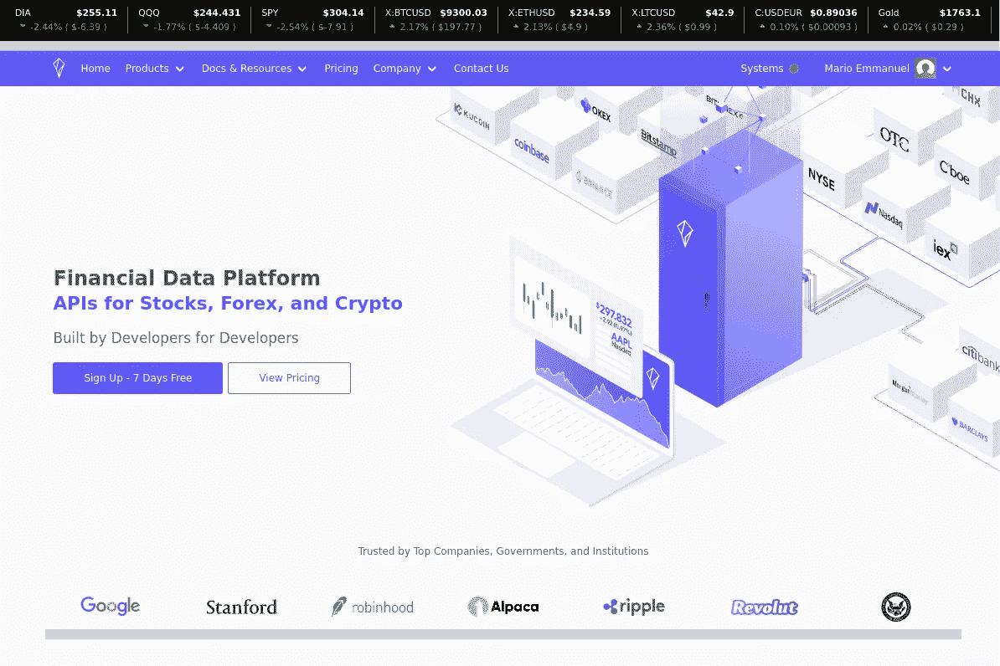

# Polygon.io 查看-检索历史刻度数据

> 原文：<https://towardsdatascience.com/how-to-retrieve-historical-tick-data-from-polygon-71512f224b67?source=collection_archive---------11----------------------->

## 演练日内策略的分笔成交点数据 API 方法



来源:polygon.io 网站。经许可使用

在过去的几个月里，我的主要目标之一，也是最耗时的任务之一，是从分笔成交点数据中提取优势，用于日内操作。

在这种情况下，高质量的数据输入变得极为重要。我已经开始使用 Polygon.io 从 SPY 获取分笔成交点数据，因为我想测试我在过去几个月中学习的一套自主策略。这些策略旨在对期货进行操作，但我想评估它们是否适用于其他资产/工具，如间谍 ETF 和外汇工具。

本文涵盖了通过 REST API 检索历史数据。我还将简要介绍一下所涉及的数据量。

# 报价和交易

您需要理解的第一件事是，分笔成交点数据通常涉及两个独立的数据源。一个覆盖账簿的*顶部，包括最佳买价和最佳卖价，另一个覆盖实际交易。在股票市场(SPY 是一种 ETF，但 ETF 是作为股票交易的)，可以在不同的交易所进行交易。这意味着没有交易发生的中心点。美国目前有 13 家上市交易所。并非所有的资产都在每个交易所交易，但它们也不会只在一个交易所交易。还有暗池和私人交易所，机构玩家可以跨单，大型券商也可以在客户之间跨单。*

这意味着单一、统一、连续和独特的报价和交易流的简化视图在现实世界中并不存在。

所有市场信息由证券信息处理器(SIPs)整合，SIPs 是受监管的实体，整合并提供统一的股票数据。它们定义了一套清晰而确定的交易合并规则。美国的两家运营中的 sip 是*联合磁带协会* (CTA)和*非上市交易特权* (UTP)。这些 sip 分别巩固了纽约证券交易所和纳斯达克上市的代码。关于它们如何工作的很好的信息可以在这篇博客文章中找到。

虽然这些信息对散户交易者来说并不重要(很少有人理解这些晦涩难懂的东西是如何运作的)，但有几个重要的要点需要了解:

1.  股票在不同的地方交易，所以它们不是完全集中的。你所看到的高质量的实时数据只是市场上实际发生的事情的一个像样的代理。
2.  不同的时间戳在 SIP 和交换机处关联信息。它们与零售无关，但与交易的买价/卖价相关(如订单流和 Delta 分析所要求的)。

对于书的深度来说，情况是一样的，但是我不会去讨论它，因为现在我不会在我的任何策略中分析书的深度。

## 历史报价(NBBO 出价/要价)

> 为了获得历史报价，使用**/v2/ticks/stocks/nbbo/{ ticker }/{ date }**请求

可以通过它们的 REST API 接口从 Polygon 中检索历史数据。服务器将为每个请求提交最多 50，000 条记录。虽然 OHLC 每日数据的 50，000 条记录代表了 200 多年的股票市场历史，但这只是分笔成交点数据的每日数据量的一小部分。

URL 中包含基本的日期和报价器参数:

```
ticker:string, ticker name (i.e. SPY for SPDR S&P500 ETF)date:string, date in YYYY-MM-DD format. Notice that the API assumes Eastern Time by default, so 2020-06-15 means 2020-06-15 00:00 New York time.
```

> 经过长期(通常是痛苦的)时区工作后，我得出结论，一个简单且一致的方法是在 et 中存储和处理你所有的市场数据。它被广泛用作市场数据的参考时区(有时甚至用于欧洲资产/工具)，也是金融市场的标志性时间参考(纽约证券交易所 RTH 开盘是每个人每天都可以观察到的事件)。这不适用于加密数据，因为它 24x7 全天候运行，当从夏令时切换到非夏令时时，您将面临问题。在这种情况下，建议使用 GMT。

API 在这里[有完整的文档](https://polygon.io/docs/#get_v2_ticks_stocks_nbbo__ticker___date__anchor)，但是我强调/评论以下参数。注意，这些被指定为 HTTP GET 参数，而不是 URL 的一部分。

```
timestamp:long value, represents the first epoch timestamp (with nanoseconds resolution) for which data is requested. timestampLimit:long value, represents the last epoch timestamp (with nanoseconds resolution) for which data is requested, provided that the hard limit of 50,000 (or the custom limit) is not reached first. Note that this timestamp is returned, so the value is included.limit:integer value, maximum number of records to be retrieved, 50,000 if not specified.apiKey:string, your API key, required in every request.
```

因为我们有 50，000 项的限制，所以需要执行分页。为了执行分页，我们将简单地使用*时间戳*参数。算法非常简单:如果我们收到 50，000 个条目，我们假设需要一个额外的请求，我们指定最近收到的*时间戳*作为下一个请求的参数。我们这样做，直到最后一个请求收到少于 50，000 个项目。这意味着没有更多的请求要做。

必须考虑三个具体细节:

*   将 *timestampLimit* 设置为第二天的 00:00 时间是个好主意。由于 API 将 *timesetampLimit* 作为有效的返回项，我们需要稍后从返回的结果中排除该值。
*   用于连续请求的时间戳被包含两次，因为它是第 *n* 和第 *n+1* 个请求之间的边界。因此，当计划一个 *n+1* 请求时，将其从 *n* 请求中移除是很重要的。
*   可能的情况是，我们收到 50，000 个项目，而这些正是所有可用的数据。在这种情况下，我们的算法将请求一个只返回一个结果的新批次。这不是问题，这是算法分页的一部分。

一种替代方法是为连续请求的时间戳请求增加 1 纳秒；理论上，这将避免在后续请求中出现重复。因为我不能 100%确定可以接收到相同纳秒时间时间戳的两个记录，所以我决定不走这条路，因为前一条路可以处理相同时间戳的多个记录的情况。

报价和交易都使用完全相同的算法(并且可以在单独的共享方法/例程中编码)。

## 历史贸易

> 为了获得历史交易，使用**/v2/ticks/stocks/trades/{ ticker }/{ date }**请求

如前所述，历史交易可以类似地检索。同样的条件和参数也适用。

# 内存/存储要求的简要回顾

历史交易几乎总是在本地存储和处理，以避免开销。可以按需请求更高的时间范围，但是在每次回溯测试迭代中按需请求几个月的历史 tick 数据是不切实际的。

我总是试图用原始数据存储一个易于阅读和解析的文件，如果可能的话，使用 ASCII 文本文件。在这个例子中，我们创建了两个文件(*报价*和*交易*)。

```
user[@almaz](http://twitter.com/almaz):~/NetBeansProjects/SealionPolygonAdapter % java -jar dist/SealionPolygonAdapter.jar
1592387342715007986
1592393505203343776
1592398291430866793
...
1592419244447798705
1592421981410064896
1592423485600194378
1592423485600194378[user@almaz](http://twitter.com/almaz):~/NetBeansProjects/SealionPolygonAdapter % ls -lh data/*
-rw-r--r--  1 user  user   399M Jun 21 19:04 data/SPY.2020-06-17.quote.json
-rw-r--r--  1 user  user    54M Jun 21 19:05 data/SPY.2020-06-17.trade.jsonuser[@almaz](http://twitter.com/almaz):~/NetBeansProjects/SealionPolygonAdapter % head data/SPY.2020-06-17.quote.json 
{"p":313.9,"P":315,"q":9801,"c":[1,81],"s":2,"S":1,"t":1592380800048084434,"x":12,"X":11,"y":1592380800047963904,"z":1}
{"p":313.9,"P":315,"q":9901,"c":[1,81],"s":2,"S":5,"t":1592380800048834673,"x":12,"X":11,"y":1592380800048768512,"z":1}
{"p":313.9,"P":315,"q":10001,"c":[1,81],"s":2,"S":6,"t":1592380800048839409,"x":12,"X":11,"y":1592380800048774400,"z":1}
...
```

数据被存储为每行一个 JSON 对象，这很容易解析(注意，这在存储和性能方面也是低效的)。它每天使用大约 450Mb，每年大约 100Gb 的数据。如果您存储许多资产，一个关键因素是要注意整数压缩算法。使用专有和优化的数据库将节省空间，尽管作为一种权衡，它在开发和调试工作方面有成本，并且增加了操作的复杂性。我仍然喜欢对可读数据进行简单的备份，即使我进一步将数据转换成性能更友好的格式。

我们还可以注意到每个交易日涉及的数据量:

```
user@almaz:~/NetBeansProjects/SealionPolygonAdapter % wc data/SPY.2020-06-17.quote.json 
 3060489 3060489 418579482 data/SPY.2020-06-17.quote.jsonuser@almaz:~/NetBeansProjects/SealionPolygonAdapter % wc data/SPY.2020-06-17.trade.json
  435989  435989 56996300 data/SPY.2020-06-17.trade.json
```

SPY 在一天之内有 300 万个报价点和超过 40 万个交易点。

为了在任何回溯测试或定制工具中使用数据，可能需要进一步的处理，但是正如本文开头提到的，将数据存储在简单的 ASCII 可读数据中作为永久备份是有用的。这将简化开发和转换时间，并将数据历史提供者从我们分析工具链中分离出来。

一个简单而有效的改进方法是压缩两个档案。在这种情况下，我们得到:

```
user@almaz:~/NetBeansProjects/SealionPolygonAdapter % gzip data/SPY.2020-06-17.quote.json
user@almaz:~/NetBeansProjects/SealionPolygonAdapter % gzip data/SPY.2020-06-17.trade.json
user@almaz:~/NetBeansProjects/SealionPolygonAdapter % ls -lh data/*
-rw-r--r--  1 user  user    54M Jun 21 19:04 data/SPY.2020-06-17.quote.json.gz
-rw-r--r--  1 user  user   9.2M Jun 21 19:05 data/SPY.2020-06-17.trade.json.gz
```

仅仅通过使用标准的 *gzip* 工具，我们每天只能得到 64Mb，每年需要大约 16Gb。更友好的存储大小，无需特殊资源即可轻松实现。

压缩和解压缩需要时间，因此这只能用作永久数据备份。

# 源代码

下面是检索历史报价(报价和交易)的源代码的基本版本，作为参考。请注意，该代码是测试版，没有经过优化，它旨在展示 Java 中的一个用例，阐明如何访问历史分笔成交点数据。它可以很容易地移植到其他语言。

数据以 JSON 格式检索，这种格式便于调试。代价是 JSON 远不是一种有效格式。对于一个历史数据检索 API，我认为这是不相关的，尤其是在为了回溯测试的目的而以批处理方式检索数据的情况下。在这种情况下，JSON 提供的简单性和可维护性是明显的优势。

对于这个特定的实现，我使用了 *simple-json v1.1.1* 作为解析 json 的配套库。这个库在它的版本 1 中不再被维护，但是它是一个完全工作的库，使用起来非常简单，并且是轻量级的。

主类:检索并存储 2020 年 6 月 17 日 SPDR 间谍 ETF 的 BidAsk 和 Trades

HistoricalRequest 类包含检索每日竞价和交易并将它们存储到磁盘的方法。