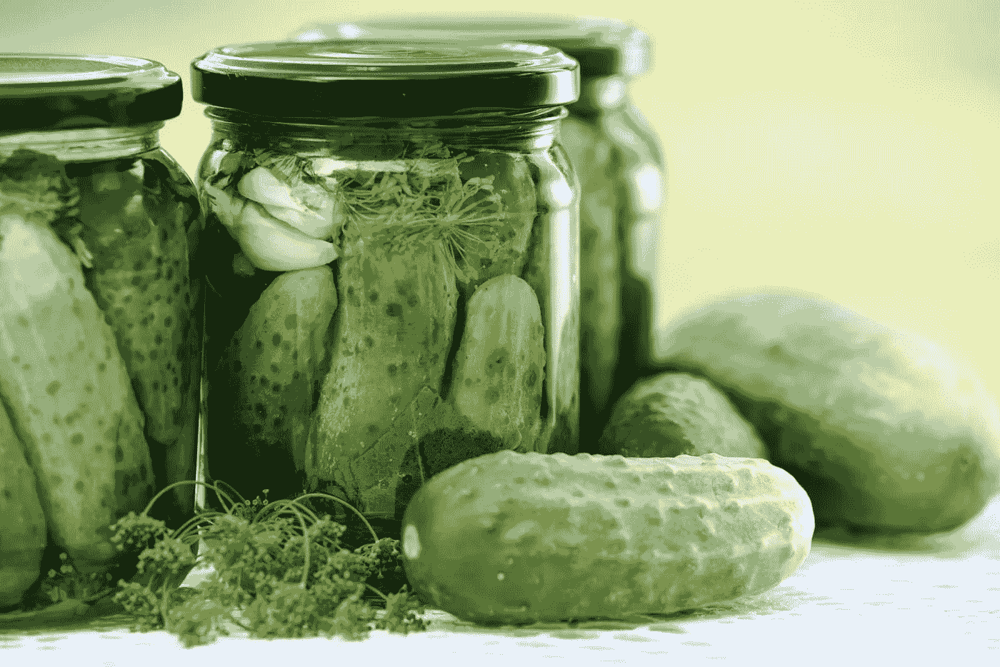

# 如何重用您的 Python 模型而无需重新训练它们

> 原文：<https://towardsdatascience.com/how-to-reuse-your-python-models-without-retraining-them-39cd685659a5?source=collection_archive---------15----------------------->



## Python 的对象序列化库简介

> 注:在计算机科学中，保存一个对象以备后用的过程叫做 ***序列化*** ，而加载一个保存的对象叫做 ***反序列化*** 。

作为一名数据科学家，您可能希望重用您的一个模型，而不必重新训练它。

避免需要重新训练你的模型是特别有用的，因为它允许“部署”模型，即把你训练好的模型转移到一个公共服务器上，任何有互联网连接的人都可以查询预测。

例如，假设您已经创建了一个简单的 scikit-learn 模型，您希望保存它并在以后重用它。

```
>>> from sklearn.datasets import load_iris
>>> from sklearn.tree import DecisionTreeClassifier
>>> model = DecisionTreeClassifier()
>>> X, y = load_iris(return_X_y=True)
>>> clf = model.fit(X,y)
```

在这种情况下，我们的训练模型存储在 Python 对象`clf`中。

为了保存`clf`对象供以后重用，我们将使用内置的`pickle`库。

```
>>> import pickle
>>> with open('clf.pickle', 'wb') as f:
...     pickle.dump(clf, f)
```

我们通过指定`wb`用“写字节模式”打开了一个名为`clf.pickle`的文件，并且我们已经在变量`f`中存储了对该文件的引用。

然后，我们使用`pickle.dump`方法将对象`clf`保存在文件`clf.pickle`中。在幕后，Python 实际上将`clf`对象转换成一系列字节，稍后它可以将这些字节转换回原始的`clf`对象。

您可以检查工作目录的内容现在包含一个名为`clf.pickle`的文件。

```
>>> import os
>>> os.listdir()
['clf.pickle']
```

如果您通过键入`exit()`退出当前的 Python 会话，然后启动一个新的 Python 提示符，那么您可以重新加载`clf`对象来恢复训练好的模型。

```
>>> import pickle
>>> with open('clf.pickle', 'rb') as f:
...     clf = pickle.load(f)
>>> type(clf)
sklearn.tree._classes.DecisionTreeClassifier
```

注意我们如何通过指定`rb`以“读取字节”模式打开文件`clf.pickle`，然后将对该文件的引用存储在变量`f`中。

然后，`pickle.load`能够读取文件`clf.pickle`并返回一个新的对象，该对象与我们最初传递给`pickle.dump`的`clf`对象*完全相同。*

> 任何 Python 对象都可以使用 pickle.dump 保存到一个文件中，并且可以使用`**pickle.load**`从文件中加载完全相同的对象

因此，我们可以使用从文件中加载的新的`clf`对象在*中进行预测，就像我们使用原始的`clf`对象进行预测一样。*

```
>>> clf.predict([
...     [1,1,0,0],
...     [1,0,1,1]
... ])
[0,0]
```

当然，将训练好的模型保存到本地目录中的文件意味着其他人将不能重用该模型。将训练好的模型保存到其他程序可以访问的数据库中会更方便。

## 将腌制模型保存到数据库中

pickle 模块允许将对象转换为内存中的字节，然后我们可以用它将训练好的模型保存在数据库中。

```
>>> pickled_clf = pickle.dumps(clf)
>>> type(pickled_clf)
bytes
```

请注意我们如何使用`pickle.dumps`方法，即“ **dump s** tring”，而不是`pickle.dump`方法。

`dumps`方法直接返回一个*字节的*对象`pickled_clf`，而不是将其写入文件。(`dumps`方法的命名被选择为与其他序列化库一致，并且它不返回`str`类型对象)。

我们现在可以将`pickled_clf`字节对象直接保存到数据库中。

例如，假设我们有一个名为`db.sqlite3`的 sqlite3 数据库，其中包含一个名为`models`的表，该表带有一个`BLOB`(即字节)字段。

```
sqlite3 db.sqlite3 "create table models(name TEXT, data BLOB);"
```

为了将经过酸洗的模型保存到那个表中，我们可以使用`sqlite3`模块。

```
>>> import sqlite3
>>> conn = sqlite3.connect('db.sqlite3')
>>> query = 'insert into models values (?, ?)'
>>> conn.execute(query, ['clf', pickled_clf])
>>> conn.commit()
```

然后，我们可以从数据库中重新加载 pickled 对象，然后将 bytes 对象转换回原始模型。

```
>>> cursor = conn.execute('select * from models')
>>> name, pickled_clf = cursor.fetchone()
>>> clf = pickle.loads(pickled_clf)
```

注意我们是如何使用`pickle.loads`方法加载分类器的。正如我们使用`pickle.load`来恢复用`pickle.dump`保存的对象一样，我们也可以使用`pickle.loads`来恢复用`pickle.dumps`保存的对象。

现在，您可以重用该模型，而无需重新训练它。

```
>>> clf.predict([
...     [1,1,0,0],
...     [1,0,1,1]
... ])
[0,0]
```

感谢阅读！如果你觉得这个教程有用，我在 Medium 上写了关于 Python 和数据科学的技巧，所以你可以关注我来获得更多类似的文章。

[](/top-features-of-pandas-1-0-26abff08d1b6) [## 熊猫 1.0 的主要特性

### 您今天就可以开始使用的新改进

towardsdatascience.com](/top-features-of-pandas-1-0-26abff08d1b6) [](https://levelup.gitconnected.com/3-python-list-comprehension-tricks-you-might-not-know-yet-5891d904ee76) [## 你可能还不知道的 3 个 Python 列表理解技巧

### 列表理解不仅仅是为了列表

levelup.gitconnected.com](https://levelup.gitconnected.com/3-python-list-comprehension-tricks-you-might-not-know-yet-5891d904ee76)