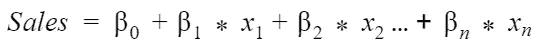
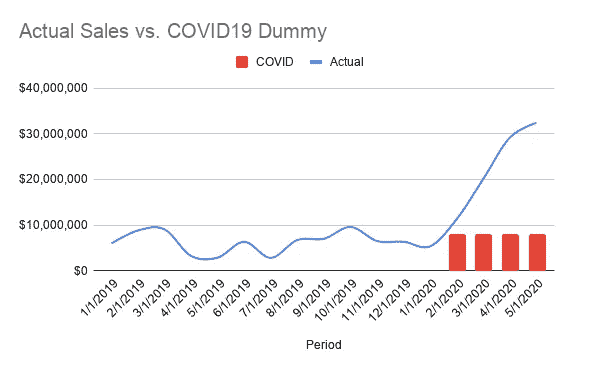
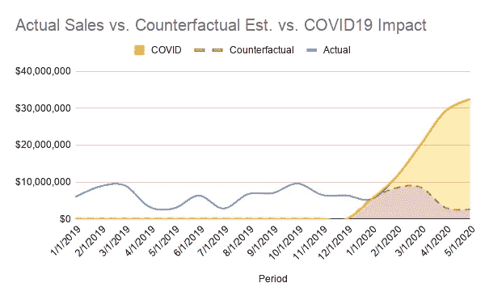
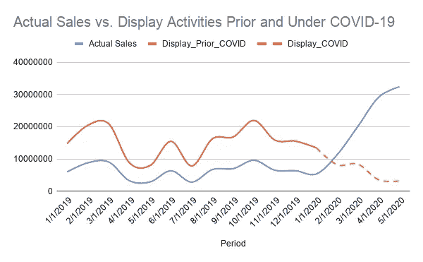

# 如何修改你的营销组合模型来捕捉新冠肺炎的影响？

> 原文：<https://towardsdatascience.com/how-to-revise-your-marketing-mix-model-to-capture-covid-19-impact-863b65982408?source=collection_archive---------25----------------------->

## [现实世界中的数据科学](https://towardsdatascience.com/data-science-in-the-real-world/home)

## 你可以做 5 件事来评估新冠肺炎的影响力，并让你的营销组合模型重新发挥作用

C OVID-19 震惊了世界，不可避免地改变了人们的工作、购物和生活方式。它不仅推动了经济的发展，还对广大广告客户的营销方式产生了重大影响。Influencer Marketing Hub 最近公布的新冠肺炎营销报告称，69%的品牌表示他们将在 2020 年减少广告支出。他们调查的公司中有 74%放慢了社交媒体发布的速度。


照片由[联合国新冠肺炎回应](https://unsplash.com/@unitednations?utm_source=medium&utm_medium=referral)在 [Unsplash](https://unsplash.com?utm_source=medium&utm_medium=referral)

毫无疑问，削减营销支出将确保短期生存，并给陷入困境的企业带来微弱的复苏机会。然而，严格衡量你的营销业绩，让每一美元都推动更多的销售比以往任何时候都更加重要和必要。在今天的帖子中，我们将讨论如何更好地评估新冠肺炎·疫情领导下的营销效率。


照片由[托尼克](https://unsplash.com/@thetonik_co?utm_source=medium&utm_medium=referral)在 [Unsplash](https://unsplash.com?utm_source=medium&utm_medium=referral) 上拍摄

**衡量营销效率的方法**

为了评估营销绩效和优化渠道组合，我们需要回答的最重要的问题是，我们在每个渠道上投入的资金获得了什么样的投资回报(ROI)。营销组合模型和多接触归因是流行的技术，往往能提供回答这个问题所需的深度见解。

我更倾向于使用**营销组合模型**来评估新冠肺炎疫情期间的营销投资回报率，原因有二。

首先，多点接触归因是一种自下而上的评估营销效果的方法。它专注于在线营销和销售，更擅长分析实时用户数据。营销组合建模更多地采用自上而下的宏观视角，而不是评估用户最终转化的每个接触点。因此，不仅可以检查和捕捉营销相关因素，还可以检查和捕捉宏观经济、季节性、天气和竞争影响等因素。从这个角度来看，前所未有的新冠肺炎疫情不在每个人的正常控制范围内，MMM 可以更好地捕捉到它的影响。

此外，MTA 主要专注于数字生态系统，而 MMM 可以轻松覆盖更多线下渠道。鉴于冠状病毒，人们被困在家里。这最终推动了电视收视率的上升。根据 eMarketer 的最新预测，传统电视预计今年将增加 830 万美国观众，这将是自 2012 年以来传统电视观众首次增加👀。因此，与 MTA 相比，MMM 在衡量电视节目效果方面可能做得更好。

**建立营销组合模型简介**

一般来说，MMM 采用多元线性回归原理，试图在您的目标 KPI(因变量)和一组将影响您的 KPI 的驱动因素(自变量)之间形成一个方程。



您的候选驱动因素最终可分为以下两大类:

*   **不可控因素:**我们无法控制的外部因素，包括宏观经济、季节性、节假日、天气等。
*   **可控因素:**我们可以调整和优化的媒体和营销相关指标。

通常，那些不可控因素与你的目标 KPI 呈线性关系，这意味着这些因素每增加一个单位都会改变你的 KPI 一定的量(这种改变可以是负的，也可以是正的)。然而，对于媒体和营销相关的驱动因素，它们的影响是非线性的，必须考虑三个独特的参数。它们是滞后效应、结转效应(Adstock)和收益递减。

*   滞后效应意味着你的广告转化顾客需要多长时间。如果我们将销售收入作为目标 KPI，来自社交媒体参与等漏斗下端渠道的滞后效应将比来自电视和广播等漏斗上端渠道的滞后效应更短，这些渠道旨在提高知名度和激发兴趣。


Jakob Owens 在 [Unsplash](https://unsplash.com?utm_source=medium&utm_medium=referral) 上拍摄的照片

*   **结转效应(Adstock)** 本质上被描述为广告将随着时间的推移而扩散，并在发生后对你的 KPI 产生持续的影响。比方说，如果你在 Instagram 上看到一个购物广告，在接下来的日子里，你仍然会记得那些创意图片，但记忆已经褪色。

Adstock 的公式为: *At = Xt + Adstock Rate * At-1*

要查看更多关于 Adstock 的详细信息，请点击[这里](https://thinktv.ca/)查看群邑在消费电子、零售、金融、汽车和消费品行业的营销组合模式

*   **收益递减**原本是一个经济学原理，这里有一个非常经典的例子来阐述它:当你饥饿的时候，你从吃第一个汉堡中获得的效用会高于下一个汉堡带给你的效用。

将这一定律应用到营销绩效的测量中，它表明每花一美元在广告上，它将提升你的 KPI，但以递减的速度。


照片由 [Denys Nevozhai](https://unsplash.com/@dnevozhai?utm_source=medium&utm_medium=referral) 在 [Unsplash](https://unsplash.com?utm_source=medium&utm_medium=referral) 上拍摄

这三个参数的值因通道而异。并且当驱动不同的 KPI 时或者在不同的时间段期间，即使对于相同的通道，它们也不会相同。因此，它们不是预先决定或预先假设的。相反，它涉及迭代模型训练和测试，以获得在特定时期影响特定 KPI 的每个渠道的这三个参数的最理想组合。

多元回归模型使我们能够轻松识别影响您的目标 KPI 的重要驱动因素，并用系数量化它们的影响。

**如何捕捉新冠肺炎的影响力并修改你的 MMM？**

由于新冠肺炎是一个前所未有的情况，类似的影响从未在您的模型中捕获和评估过，因此会使您的 MMM 不能很好地运行。您可能已经意识到，如果应用冠状病毒爆发前建立的 MMM 进行预测，您将会看到与实际相比的极高错误率。如果不考虑冠状病毒的影响，你的营销效率也会被错误地评估。

如何修改我们的 MMM 来捕捉新冠肺炎的影响？这里有一些你可以尝试的选择。

*   **新冠肺炎虚拟变量**

这是将冠状病毒影响作为外部因素纳入你的模型的一种非常直接和简单的方法。哑变量最大的警告是，它只取值 0 或 1 来表示某些因素的存在或不存在。然而，我们不知道疫情什么时候会走到尽头，它很有可能永远不会消失。此外，新冠肺炎的影响是动态的，它使曲线变平，而不是固定值。因此，具有 0 或 1 的虚拟变量不能完全和准确地拾取衰减的影响。



*图片由作者提供:0/1 虚拟变量。为了便于说明，图表中的数字是任意的

*   **新冠肺炎相关指标**

为了更好地捕捉来自新冠肺炎的动态影响，我们可以直接获取疫情相关指标，如每日增量和累积确诊病例数、恢复或死亡等。作为代理人。谷歌已经在谷歌云平台中提供了免费的公共数据集。你可以去[这里](https://console.cloud.google.com/marketplace/product/bigquery-public-datasets/covid19-public-data-program?_ga=2.201839506.-2096084823.1593138024)查看更多细节。

*   **宏观经济指数**

冠状病毒，一个黑天鹅事件，导致了严重的经济萎缩。因此，除了新冠肺炎相关指标，我们还可以间接利用一些宏观经济指数来估计影响。最直观的就是**失业率**。由于冠状病毒，4 月份美国失业率飙升至 14.7%，为大萧条以来的最高水平。数据可以从美国劳工统计局获得，也可以很容易地下载。

使用失业率的一个限制是，数据通常按月刷新和公布。因此，它可能无法完全反映每日或每周的波动和变化。

除此之外，考虑到股市一直被视为经济晴雨表，股市中的指数如 **S & P 500** 和**道琼斯**也是潜在的候选。雅虎财经是我经常去下载这些指数数据的地方。


由 [Markus Spiske](https://unsplash.com/@markusspiske?utm_source=medium&utm_medium=referral) 在 [Unsplash](https://unsplash.com?utm_source=medium&utm_medium=referral) 上拍摄的照片

*   **反事实分析**

上述代理可能有助于捕捉你的业务一般上下。事实上，他们可能无法完美地捕捉到你的趋势。另一种获得特定于您的业务的新冠肺炎影响指标的潜在方法是利用冠状病毒爆发前建立的 MMM 进行反事实估计。具体来说，反事实分析测量没有新冠肺炎会发生什么，因此我们可以通过比较实际观察到的表现和反事实结果来量化其影响。



*作者图片:反事实分析。为了便于说明，图表中的数字是任意的

你可能会问，如果你以前没有做过 MMM，如何进行反事实分析？我们可以使用疫情之前的历史数据来利用 R 中的预测包。以下是进行预测的示例代码。

```
library(forecast)#Step 1: Convert sales data into time series. Here is using 2-year data to forecast next yearts <- ts(sales$Sales[sales.Period >= '2018-01-01' & sales.Period <='2019-12-31'])#Step 2: Fitting an auto.arima model in R using the Forecast package
sales<- auto.arima(ts)
pred <- forecast(object = sales, h = 365)
```

到目前为止，我们已经讨论了四种方法来得出新冠肺炎指标，并衡量其作为外部因素的影响。然而，新冠肺炎不仅从外部影响我们的业务，而且从根本上影响营销效率和效果。有鉴于此，你还需要做些什么来修改你的营销组合模式，以适应疫情期间不同的营销效果？

您需要通过将媒体和营销指标分成两部分，用最新数据重新训练您的营销组合模型。通过这样做，我们可以在新冠肺炎前后获得不同的系数，并跨营销渠道计算相应的投资回报率。



*作者图片:拆分营销指标。为了便于说明，图表中的数字是任意的

在下一篇文章中，我们将讨论如何利用 R 来建立一个基于你的营销组合模型结果的迷你优化器，并提高你的营销效率。💖