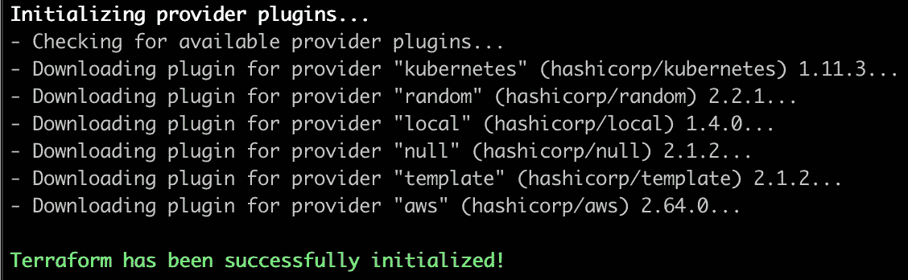
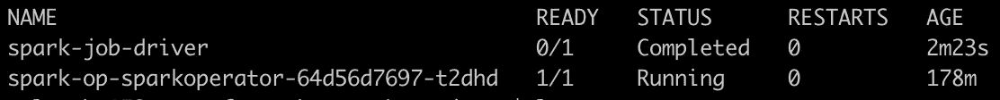

# 如何在 Kubernetes (AWS EKS)运行 PySpark 作业

> 原文：<https://towardsdatascience.com/how-to-run-a-pyspark-job-in-kubernetes-aws-eks-d886193dac3c?source=collection_archive---------19----------------------->

## 关于使用 Terraform 部署 EKS 集群和使用 Spark 操作符运行 PySpark 作业的完整教程


萨姆森在 Unsplash.com 拍摄的照片

在本教程中，我们将重点关注在 AWS EKS 上端到端部署 Spark 应用程序。我们将执行以下步骤:

*   在 AWS 中的定制 VPC 内部署 EKS 集群
*   安装火花操作器
*   运行一个简单的 PySpark 应用程序

**TL；博士:** [**Github 代码回购**](https://github.com/BogdanCojocar/medium-articles/tree/master/terraform_eks_spark)

# **步骤 1:部署 Kubernetes 基础设施**

要在 AWS 上部署 Kubernetes，我们至少需要部署:

*   **VPC、子网和安全组**负责集群中的网络
*   **EKS 控制平面**主要运行 Kubernetes 服务，如`etcd`和`Kubernetes API`
*   **EKS 工人节点**能够运行 pod 和更具体的针对我们案例的 spark 作业

让我们深入研究 Terraform 代码。首先，让我们看看 VPC:

```
module "vpc" {
  source  = "terraform-aws-modules/vpc/aws"
  version = "2.6.0"name                 = join("-", [var.cluster_name, var.environment, "vpc"])
  cidr                 = var.vpc_cidr
  azs                  = data.aws_availability_zones.available.names
  private_subnets      = [var.private_subnet_az_1, var.private_subnet_az_2, var.private_subnet_az_3]
  public_subnets       = [var.public_subnet_az_1, var.public_subnet_az_2, var.public_subnet_az_3]
  enable_nat_gateway   = true
  single_nat_gateway   = false
  one_nat_gateway_per_az = true
  enable_dns_hostnames = true
  enable_dns_support   = truetags = {
    "kubernetes.io/cluster/${var.cluster_name}" = "shared"
  }public_subnet_tags = {
    "kubernetes.io/cluster/${var.cluster_name}" = "shared"
    "kubernetes.io/role/elb"                      = "1"
  }private_subnet_tags = {
    "kubernetes.io/cluster/${var.cluster_name}" = "shared"
    "kubernetes.io/role/internal-elb"             = "1"
  }
}
```

VPC 是一个孤立的网络，其中可以有不同的基础架构组件。我们可以将这个网络分解成更小的块，在 AWS 上我们称之为子网。有些子网可以访问互联网，这就是我们称之为公共子网的原因，而有些子网不能访问互联网，则称为私有子网。我们将在网络流量上下文中使用的另一个术语是出口和入口。出口是指从网络内部流向外部世界的流量，以及从外部世界流向网络的入口流量。如您所料，这些规则可能会因用例而异。我们还使用安全组，这是 VPC 内部的流量规则，它定义了 EC2 实例如何相互“对话”,基本上是在哪些网络端口上。

对于 Spark EKS 集群，see 将为工作线程使用专用子网。所有的数据处理都是在完全隔离的情况下完成的。但是我们需要到互联网的出口流量，以进行更新或安装开源库。为了支持互联网流量，我们在 VPC 中使用 NAT 网关。我们必须将它们添加到公共子网中。在地形代码中，这是使用标志`enable_nat_gateway.`完成的

我们可以注意到的另一件事是，我们使用了三个公共和私有子网。这是因为我们希望拥有网络容错能力。子网部署在一个区域的不同可用性区域中。

标签是按照 AWS 的要求创建的。控制平面需要它们来识别工作节点。我们可以更详细地介绍网络，但这超出了本教程的范围，所以如果您需要更多的细节，请查看 Github 代码，在那里您可以找到完整的示例。

让我们看看 EKS 集群的设置:

```
module "eks" {
  source       = "terraform-aws-modules/eks/aws"
  cluster_name = join("-", [var.cluster_name, var.environment, random_string.suffix.result])
  subnets      = module.vpc.private_subnetstags = {
    Environment = var.environment
  }vpc_id = module.vpc.vpc_id
  cluster_endpoint_private_access = truecluster_enabled_log_types = ["api", "audit", "authenticator", "controllerManager", "scheduler"]worker_groups = [
    {
      name                          = "worker-group-spark"
      instance_type                 = var.cluster_instance_type
      additional_userdata           = "worker nodes"
      asg_desired_capacity          = var.cluster_number_of_nodes
      additional_security_group_ids = [aws_security_group.all_worker_mgmt.id, aws_security_group.inside_vpc_traffic.id]
    }
  ]workers_group_defaults = {
    key_name = "eks_key"
    subnets = module.vpc.private_subnets
  }
}
```

在这个代码片段中，我们可以看到我们在私有子网内声明了集群。我们为控制面板的所有组件启用 Clowdwatch 日志。我们为配置`var`模块设置 EC2 实例类型和数量，默认情况下，我们使用`m5.xlarge`作为实例类型和 3 个节点。如果我们需要 ssh 进入工作节点，我们设置一个 EC2 键`eks_key`。

为了能够运行本教程中的代码，我们需要安装一些工具。在 Mac 上，我们可以使用`brew:`

```
brew install terraform aws-iam-authenticator kubernetes-cli helm
```

为了达到 AWS，我们还需要[设置我们的 AWS 凭证](https://docs.aws.amazon.com/sdk-for-java/v1/developer-guide/setup-credentials.html)。

现在，我们可以开始初始化 Terraform，以获得部署基础设施所需的所有依赖项:

```
cd deployment/ && terraform init
```

如果一切运行成功，您应该能够看到类似于下图的内容:



我们已经准备好部署基础设施。为此，请运行:

```
terraform apply
```

部署完成还需要一段时间，所以我们可以高枕无忧了。

完成后，您应该会看到消息`Apply complete! Resources: 55 added, 0 changed, 0 destroyed.`和部署的资源的名称。

检查部署是否正确的另一个步骤是查看工作节点是否已经连接到集群。为此我们设置了`kubectl:`

```
aws --region your-region eks update-kubeconfig --name your-cluster-name
```

当我们运行以下命令时，应该能够看到三个节点:

```
kubectl get nodes
```

# 步骤 2:安装 Spark 操作器

通常，我们使用`spark-submit`部署 spark 作业，但是在 Kubernetes 中，我们有一个更好的选择，与环境更加集成，称为 [Spark 操作符](https://github.com/GoogleCloudPlatform/spark-on-k8s-operator)。它带来的一些改进包括自动重新提交应用程序、使用自定义重启策略自动重启、自动重试失败的提交，以及与 Prometheus 等监控工具的轻松集成。

我们可以通过`helm:`安装它

```
helm repo add incubator http://storage.googleapis.com/kubernetes-charts-incubator
helm install spark-op incubator/sparkoperator
```

如果我们在终端中运行`helm list`，那么`spark-op`图表应该是可用的。此外，我们应该有一个运行的火花操作员吊舱。我们可以使用命令`kubectl get pods.`来观察在`default`名称空间中运行的 pods

# 步骤 3:运行 PySpark 应用程序

现在我们终于可以在 K8s 中运行 python spark 应用了。我们需要做的第一件事是创建一个`spark`用户，以便让 spark jobs 访问 Kubernetes 资源。为此，我们创建了一个服务帐户和一个群集角色绑定:

```
apiVersion: v1
kind: ServiceAccount
metadata:
  name: spark
---
apiVersion: rbac.authorization.k8s.io/v1
kind: ClusterRoleBinding
metadata:
  name: spark-role
roleRef:
  apiGroup: rbac.authorization.k8s.io
  kind: ClusterRole
  name: edit
subjects:
  - kind: ServiceAccount
    name: spark
    namespace: default
```

要执行角色的创建:

```
kubectl apply -f spark/spark-rbac.yml
```

您将收到`serviceaccount/spark created`和`clusterrolebinding.rbac.authorization.k8s.io/spark-role created.`的通知

星火操作员工作定义:

```
apiVersion: "sparkoperator.k8s.io/v1beta2"
kind: SparkApplication
metadata:
  name: spark-job
  namespace: default
spec:
  type: Python
  pythonVersion: "3"
  mode: cluster
  image: "uprush/apache-spark-pyspark:2.4.5"
  imagePullPolicy: Always
  mainApplicationFile: local:////opt/spark/examples/src/main/python/pi.py
  sparkVersion: "2.4.5"
  restartPolicy:
    type: OnFailure
    onFailureRetries: 2
  driver:
    cores: 1
    memory: "1G"
    labels:
      version: 2.4.5
    serviceAccount: spark
  executor:
    cores: 1
    instances: 1
    memory: "1G"
    labels:
      version: 2.4.5
```

我们在一个`yml`文件中定义我们的 spark run 参数，类似于 Kubernetes 上的任何其他资源声明。基本上，我们定义我们正在运行一个`Python 3` spark 应用程序，我们是映像`uprush/apache-spark-pyspark:2.4.5.`我推荐使用这个映像，因为它带有一个更新版本的 yarn，可以更有效地处理对`s3a`的写入。我们有一个重试策略，如果作业失败，它将重新启动。驱动程序和执行器的一些资源分配。由于工作非常简单，我们只使用一个执行程序。我们可以注意到的另一件事是，我们使用了之前定义的`spark`服务帐户。我们使用的 To 代码是计算`pi`数的经典例子。

要提交我们再次使用的代码`kubectl`:

```
kubectl apply -f spark/spark-job.yml
```

完成后，如果我们再次检查豆荚，我们应该有类似的结果:



如果我们通过运行`kubectl logs spark-job-driver`来检查日志，我们应该会在日志中找到一行给出 pi 的近似值`Pi is roughly 3.142020.`

那是所有的人。我希望你喜欢这个教程。我们已经看到了如何使用 terraform 创建我们自己的 AWS EKS 集群，以便在不同的环境中轻松地重新部署它，以及如何使用更友好的 Kubernetes 语法提交 PySpark 作业。