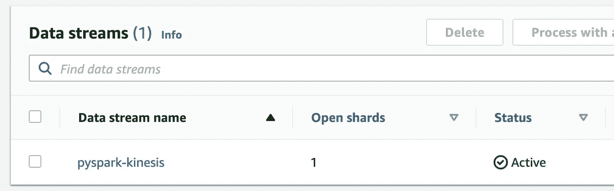

# 如何使用 PySpark 结构化流在 AWS Kinesis 中运行实时管道

> 原文：<https://towardsdatascience.com/how-to-run-a-real-time-pipeline-in-aws-kinesis-using-pyspark-structured-streaming-1b6bc5e6edc9?source=collection_archive---------25----------------------->

## 使用 Python 结构化流应用程序从 AWS Kinesis 消费数据，并在 Jupyter 笔记本中运行


照片由 [Aron 视觉效果](https://unsplash.com/@aronvisuals?utm_source=unsplash&utm_medium=referral&utm_content=creditCopyText)在 [Unsplash](/s/photos/real-time?utm_source=unsplash&utm_medium=referral&utm_content=creditCopyText) 上拍摄

在本教程中，我们将使用 Spark 的最新流技术，结构化流，从 AWS Kinesis 流中使用`JSON`数据。

我们将执行以下步骤:

*   使用 boto3 在 AWS 中创建 Kinesis 流
*   将一些简单的`JSON`消息写入流中
*   消费 PySpark 中的消息
*   在控制台中显示消息

**TL；DR:** [**Github 代码回购**](https://github.com/BogdanCojocar/medium-articles/tree/master/pyspark_kinesis)

# 步骤 1:为 Jupyter 设置 PySpark

为了能够在笔记本上运行 PySpark，我们必须使用`findspark`包。我们需要添加另一个包，允许 PySpark 从 Kinesis 获取消费者数据。对于此功能，我们在笔记本的开头添加了:

```
import os
os.environ['PYSPARK_SUBMIT_ARGS'] = '--packages=com.qubole.spark/spark-sql-kinesis_2.11/1.1.3-spark_2.4 pyspark-shell'import findspark
findspark.init()
```

# 步骤 2:创建一个动力流

AWS Kinesis 是使我们能够实时读取和处理数据的基础设施。与其他类似的技术(Kafka)相比，它更容易建立。在 python 中，我们可以使用`boto3`库:

```
client = boto3.client('kinesis')
stream_name='pyspark-kinesis'client.create_stream(
        StreamName=stream_name,
        ShardCount=1)
```

这将创建一个流分片，它本质上是控制吞吐量的单元。更多的碎片意味着我们可以接收更多的数据，但是对于本教程来说，一个就足够了。

如果我们打开 AWS 控制台，导航到 Amazon Kinesis board(服务-> Amazon Kinesis)，我们应该会看到类似的内容:



# 步骤 3:将信息写入 Kinesis

要将一些消息写入我们刚刚创建的 Kinesis 流，我们可以再次使用`boto3`:

```
messages = [
    {'message_type': 'message1', 'count': 2},
    {'message_type': 'message2', 'count': 1},
    {'message_type': 'message1', 'count': 2},
    {'message_type': 'message3', 'count': 3},
    {'message_type': 'message1', 'count': 5}
]for message in messages:
    client.put_record(
        StreamName=stream_name,
        Data=json.dumps(message),
        PartitionKey='part_key')
```

我们有一个字典列表，我们将其序列化到`JSON`中，并使用`put_record`函数编写。一个字典代表我们信息的模式。因为我们只使用一个碎片，所以如何定义分区键并不重要。

# 第四步:阅读信息

当使用结构化流读取数据时，我们需要注意 Kinesis 的一些特殊性。

首先，我们需要定义`format` Kinesis，以便使用正确的连接器。我们还必须使用端点和区域，这取决于我们部署基础架构的位置。我的情况是爱尔兰`eu-west-1.`

我们使用设置`startingposition`作为`TRIM_HORIZON`，这意味着当我们重启应用程序时，我们总是会读取 Kinesis 中所有可用的数据。如果我们只想处理最新的可用数据，我们可以将该标志改为`LATEST`。

我已经为 AWS 凭证创建了环境变量。我们也可以直接使用它们，但这样更安全。

```
kinesis = spark \
        .readStream \
        .format('kinesis') \
        .option('streamName', stream_name) \
        .option('endpointUrl', '[https://kinesis.eu-west-1.amazonaws.com')\](https://kinesis.eu-west-1.amazonaws.com')\)
        .option('region', 'eu-west-1') \
        .option('awsAccessKeyId', os.environ['KINESIS_ACCESS_KEY'])\
        .option('awsSecretKey', os.environ['KINESIS_SECRET_KEY']) \
        .option('startingposition', 'TRIM_HORIZON')\
        .load()\
```

一旦我们执行了这段代码，我们将能够读取数据帧中的运动数据。

# 步骤 5:在控制台中显示消息

我们现在设置的好处是我们可以执行标准的数据帧操作。

我们的数据在 JSON 中，所以我们需要转换它。前三个 select 语句就是关于这个的。我们使用`from_json`将 JSON 列转换为包含所有字段的结构，使用`data.*`的技巧是将一列分成单独的列，因此在我们的例子中，一列用于`message_type`，一列用于`count`。

```
schema = StructType([
            StructField("message_type", StringType()),
            StructField("count", IntegerType())])kinesis\
    .selectExpr('CAST(data AS STRING)')\
    .select(from_json('data', schema).alias('data'))\
    .select('data.*')\
    .writeStream\
    .outputMode('append')\
    .format('console')\
    .trigger(once=True) \
    .start()\
    .awaitTermination()
```

因为我们使用选项`trigger(once=True)`，我们将只读取一批数据，这不是一个连续的操作。如果我们删除这个标志，那么处理将是无限的。

在我们启动 Jupyter 笔记本的终端中，我们将能够看到数据:


一批运动数据

最后，我们可以删除我们在 AWS 中使用的资源，即我们部署的 Kinesis 流:

```
client.delete_stream(StreamName=stream_name)
```

仅此而已！我希望您喜欢来自精彩的流处理世界的另一个教程。我们已经看到了如何通过几个步骤在 Kinesis 的 PySpark 中连接和处理数据。