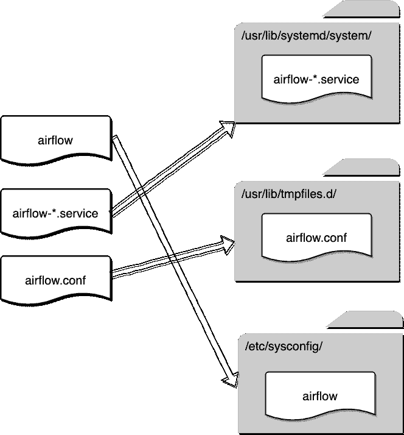

# 如何使用 Linux“systemd”将 Apache Airflow 作为守护进程运行

> 原文：<https://towardsdatascience.com/how-to-run-apache-airflow-as-daemon-using-linux-systemd-63a1d85f9702?source=collection_archive---------5----------------------->


由[拍摄的](https://pixabay.com/users/VanVangelis-7215570/)在 [Pixabay](https://pixabay.com/photos/pinwheel-park-wind-children-s-toys-985699/)

## CentOS 上的气流守护程序教程。从安装、下载、配置到使用 systemctl 运行。

自从 Airflow 从孵化器成为顶级 Apache 项目后，它作为一个具有简洁 Web UI 的工作流调度管理器越来越受欢迎。

在一个典型的用例中，Airflow 需要两个必须**持续**运行的组件，web 服务器和调度器。前者是用于管理和监控工作流的 Web UI，后者负责在预定义的时间戳正确触发工作流。

但是，使用 Linux 中提供的命令来运行这两个组件并不是一个好主意，例如:

```
$ airflow scheduler
$ airflow webserver
```

缺点显而易见:

*   如果任何组件崩溃，服务将被终止，没有任何通知。
*   这些服务的日志被打印在 stdout 中，如果 crush 的话，这些日志将会丢失，所以要找出发生了什么是很困难的
*   当 Linux 系统重新启动时，它不会自动启动运行。

为了解决这些问题，我们需要将 Apache Airflow 作为守护进程运行。Apache Airflow GitHub repo 已经提供了支持`systemd`和`upstart`的守护程序服务定义。在本文中，我们将使用前者。

官方文档只给出了非常简要的解释，没有可以遵循的教程。对于一些没有太多 Linux 经验的数据工程师或数据科学家来说，这相对比较困难。本文将一步步演示如何将 Airflow 作为守护进程运行。从安装到启动和运行。

# 安装阿帕奇气流


照片由 [teru_teru](https://pixabay.com/users/teru_teru-1434373/) 在 [Pixabay](https://pixabay.com/photos/pinwheel-park-wind-children-s-toys-985699/) 上拍摄

在 Medium 上已经有一些关于如何安装 Airflow 的教程，比如这个，如果你在 Ubuntu 上的话:

[](https://medium.com/@shaikzillani/how-to-install-apache-airflow-on-ubuntu-using-python-interpreter-20f10348e7bd) [## 如何使用 python 解释器在 Ubuntu 上安装 apache airflow

### 在这篇博文中，我将向您展示如何在 ubuntu 上安装 apache airflow，

medium.com](https://medium.com/@shaikzillani/how-to-install-apache-airflow-on-ubuntu-using-python-interpreter-20f10348e7bd) 

然而，对于 CentOS 等基于 Red Hat 的 Linux，似乎还没有这样的教程，依赖项的名称和安装方式可能与基于 Debian 的 Linux 略有不同。

首先，强烈建议为气流创建一个特定的用户

```
useradd airflow
```

此外，您的 Linux 可能会也可能不会绑定 Airflow 所需的一些依赖项。典型的，我发现有以下三种缺失是相当普遍的。

*   （同 groundcontrolcenter）地面控制中心
*   Python 开发
*   MySQL 开发(如果你需要连接到 MySQL)

请注意，Ubuntu 和 CentOS 中的库名并不相同。例如，Python Dev 包在 Ubuntu 的`apt-get`中是`python-dev`，而在 CentOS 的`yum`中，它被称为`python-devel`。如果你使用 Python3，确保你安装了`python3-devel`。此外，MySQL Dev 在`apt-get`中被称为`libmysqldev`，而在`yum`中被称为`mysql-devel`。

```
yum install gcc
yum install python3-devel
yum install mysql-devel
```

然后，让我们安装气流和额外的软件包，如有必要，如:

```
pip3 install apache-airflow
pip3 install 'apache-airflow[crypto]'
pip3 install 'apache-airflow[mysql]'
```

# 气流守护程序的准备


由[汉斯](https://pixabay.com/users/Hans-2/)在 [Pixabay](https://pixabay.com/photos/pinwheel-park-wind-children-s-toys-985699/) 上拍摄的照片

在我们能够为气流配置我们的`systemd`服务之前，我们需要做一些准备。第一步是从 Airflow GitHub Repo 下载服务定义文件。

[https://github . com/Apache/air flow/tree/master/scripts/systemd](https://github.com/apache/airflow/tree/master/scripts/systemd)

## 下载守护程序服务文件

让我们为下载文件创建一个临时文件夹。

```
mkdir /tmp/airflow-daemon
cd /tmp/airflow-daemon
```

然后，将文件下载到这个临时文件夹中。

```
# wget [https://raw.githubusercontent.com/apache/airflow/master/scripts/systemd/airflow](https://raw.githubusercontent.com/apache/airflow/master/scripts/systemd/airflow)
# wget [https://raw.githubusercontent.com/apache/airflow/master/scripts/systemd/airflow-scheduler.service](https://raw.githubusercontent.com/apache/airflow/master/scripts/systemd/airflow-scheduler.service)
# wget [https://raw.githubusercontent.com/apache/airflow/master/scripts/systemd/airflow-webserver.service](https://raw.githubusercontent.com/apache/airflow/master/scripts/systemd/airflow-webserver.service)
# wget [https://raw.githubusercontent.com/apache/airflow/master/scripts/systemd/airflow.conf](https://raw.githubusercontent.com/apache/airflow/master/scripts/systemd/airflow.conf)
```

在 GitHub 回购中，有一个简短的解释如下:

> 该目录中的 systemd 文件是在基于 RedHat 的系统上测试的。将它们复制(或链接)到/usr/lib/systemd/system
> 并将 airflow.conf 复制到/etc/tmpfiles . d/or/usr/lib/tmpfiles . d/。复制 airflow.conf 确保/run/airflow 是用正确的所有者和权限创建的
> ( 0755 air flow air flow)
> 
> 然后，您可以使用 systemctl start <service>启动不同的服务器。启用服务可以通过发出
> systemctl enable <服务>来完成。</service>
> 
> 默认情况下，环境配置指向/etc/sysconfig/airflow。你可以复制这个
> 目录下的“气流”文件，根据自己的喜好进行调整。
> 
> 经过一些小的改动，它们可能可以在其他 systemd 系统上工作。

嗯，我想对于大多数没有 Linux 背景的人来说，上面的文档可能会非常模糊和误导。所以，我画了这个图来显示哪个文件应该放在哪个路径上。



根据图中所示的路径，让我们将文件复制到正确的位置。

```
cp *.service /usr/lib/systemd/system/
cp airflow.conf /usr/lib/tmpfiles.d/
cp airflow /etc/sysconfig/
```

## 创建必要的目录

我们还需要创建一些守护进程需要的目录。首先，它需要一个专用的目录来存储运行时信息，比如`pid`。让我们在`/run`目录下创建目录，并更改权限。

```
mkdir /run/airflow
chown airflow:airflow /run/airflow
chmod 0755 airflow -R
```

请注意，权限被设置为`0755`,因为实际上我们可能有其他多个用户来开发 Dag(工作流)。有了`0755`权限，它确保所有其他用户都有他们的次要组，因为`airflow`将有足够的权限。

我们需要创建的另一个目录是 Airflow 主目录，它包括:

*   气流配置
*   气流使用的 SQLite
*   熟练的技艺
*   Dag 日志

通常如果没有`export AIRFLOW_HOME=...`，这些会在当前用户的主目录下自动生成，比如`/home/airflow/airflow/`。如果您正在测试气流或开发一些 Dag，这很好。但是，不建议这样做，而且在生产中也不方便，因为其他用户不容易访问`airflow`用户的主目录。

在我的例子中，我想把 Airflow 主目录放在`/opt`下，所以让我们创建它。

```
mkdir /opt/airflow
chown airflow:airflow airflow -R
chmod 775 airflow -R
```

同样，更改权限以允许`airflow`组中的所有用户不仅可以读取目录，还可以写入目录，因为他们需要修改 Dag。

## 初始化气流主目录

一切准备就绪。我们需要初始化气流的主目录。将主目录导出到`AIRFLOW_HOME`环境变量是很重要的。否则，如上所述，将在用户的主文件夹中自动生成主目录。

```
export AIRFLOW_HOME=/opt/airflow
airflow initdb
```

# 配置气流守护程序


由[摄影师 7](https://pixabay.com/users/photogrammer7-236216/) 在[图片栏](https://pixabay.com/photos/pinwheel-park-wind-children-s-toys-985699/)上拍摄

现在，所有的服务文件、配置文件和必要的目录都准备好了。我们需要配置守护进程，以确保在守护进程正常运行之前，一切都指向正确的路径。

首先，让我们仔细检查一下`airflow`二进制文件的路径，因为稍后需要在服务定义中指定它。

```
$ which airflow
/usr/local/bin/airflow
```

我的情况是`/usr/local/bin/airflow`。请记下你的，很可能是一样的，但以防万一要注意一下。不要直接抄我的。

然后，我们来修改一下`airflow-webserver`的定义。

```
vi /usr/lib/systemd/system/airflow-scheduler.service
```

如下更改`ExecStart`值。

```
ExecStart=/usr/local/bin/airflow scheduler
```

同样的，我们也在`airflow-scheduler`里改一下吧。

```
vi /usr/lib/systemd/system/airflow-webserver.service
```

请注意，`pid`需要写入我们刚刚创建的目录`/run/airflow`。

```
ExecStart=/usr/local/bin/airflow webserver --pid /run/airflow/webserver.pid
```

然后，我们需要修改气流的系统配置。否则，服务将不知道 Airflow 主目录在哪里。

```
vi /etc/sysconfig/airflow
```

根据我们刚才准备的内容，需要对下面的两个配置进行如下修改。

```
AIRFLOW_CONFIG=/opt/airflow/airflow.cfg
AIRFLOW_HOME=/opt/airflow
```

作为服务配置的最后一步，我们需要在运行这些服务之前启用它们。

```
systemctl enable airflow-scheduler
systemctl enable airflow-webserver
```

# 运行配置的气流守护程序


照片由 [suju](https://pixabay.com/users/suju-165106/) 在 [Pixabay](https://pixabay.com/photos/pinwheel-park-wind-children-s-toys-985699/) 上拍摄

有了`root`权限(root 用户或 sudo)，我们可以

*   运行气流守护程序

```
systemctl start airflow-scheduler
systemctl start airflow-webserver
```

*   检查其状态

```
systemctl status airflow-scheduler
systemctl status airflow-webserver
```

*   停止守护进程

```
systemctl stop airflow-scheduler
systemctl stop airflow-webserver
```

*   重新启动守护程序

```
systemctl restart airflow-scheduler
systemctl restart airflow-webserver
```

*   查看守护程序服务日志(最近 50 行，行数可使用`-n`参数定制)

```
# journalctl -u airflow-scheduler -n 50
# journalctl -u airflow-webserver -n 50
```

# 摘要


由[摄影师](https://pixabay.com/users/distelAPPArath-2726923/)在[图片栏](https://pixabay.com/photos/pinwheel-park-wind-children-s-toys-985699/)上拍摄

本文介绍了如何在 CentOS 系统上安装 Airflow。然后，我认为如果我们简单地在命令行运行 Airflow 会有缺点，所以我们需要通过将它作为守护进程来解决这个问题。

我们首先需要从 Apache Airflow GitHub repo 下载服务定义文件，然后将它们放入正确的系统目录中。我们还需要创建一些文件夹，因为守护进程需要它们来正确运行。

最后，我们需要配置服务定义文件，以确保守护程序可以在正确的位置找到资源。之后，我们可以将 Apache Airflow 作为守护进程运行，这样它将收集适当的服务运行日志，并在出现问题时自动重启服务。

[](https://medium.com/@qiuyujx/membership) [## 通过我的推荐链接加入 Medium 克里斯托弗·陶

### 作为一个媒体会员，你的会员费的一部分会给你阅读的作家，你可以完全接触到每一个故事…

medium.com](https://medium.com/@qiuyujx/membership) 

如果你觉得我的文章有帮助，请考虑加入 Medium 会员来支持我和成千上万的其他作者！(点击上面的链接)