# 如何在 Docker 上运行 Jupyter 笔记本

> 原文：<https://towardsdatascience.com/how-to-run-jupyter-notebook-on-docker-7c9748ed209f?source=collection_archive---------0----------------------->

## 不再有 Python 环境和包更新


图片由来自 [Pixabay](https://pixabay.com/?utm_source=link-attribution&utm_medium=referral&utm_campaign=image&utm_content=4704771) 的[斯蒂芬·凯勒](https://pixabay.com/users/kellepics-4893063/?utm_source=link-attribution&utm_medium=referral&utm_campaign=image&utm_content=4704771)拍摄

```
**Table of Contents**[**Introduction**](#093d) 1\. [Installing Docker Desktop](#09a3)
 2\. [Docker help](#4802)
 3\. [Running Jupyter Docker Stacks](#9927)
 4\. [Formatting Docker ps](#f597)
 5\. [Entering the Docker container and using bash](#b42d)
 6\. [Stopping and removing containers and images](#256b)
 7\. [Connecting the local directory to a Docker container](#0ba2)
 8\. [Inspecting a container](#08c1)
 9\. [Getting started with Docker file](#a6ca)
10\. [Publishing an image to Docker Hub](#999d)[**Conclusion**](#556f)
```

# 介绍

> Docker 简化并加速了您的工作流程，同时让开发人员可以自由地为每个项目选择工具、应用程序堆栈和部署环境。—从[开始用 Docker](https://www.docker.com/why-docker) 开发

Docker 为您的开发提供了一个包含的环境。通过使用 Docker，您可能不需要在计算机上安装 pyenv/pipenv/virtualenv 或任何编程语言。你只要用一个 Docker 容器！在本文中，您将学习如何在 Docker 上运行 Jupyter。

# TL；速度三角形定位法(dead reckoning)

```
$ docker run -p 8888:8888 -v $(pwd):/home/jovyan/work jupyter/minimal-notebook
$ docker run -p 8888:8888 -v $(pwd):/home/jovyan/work jupyter/scipy-notebook
```

上面的第一个命令将运行 Jupyter minimal-notebook，将本地目录连接到 Docker 容器。
第二个命令与第一个命令相同。唯一不同的是运行 Jupyter Scipy-notebook。

# 安装 Docker 桌面

安装 Docker 桌面，当你启动 Docker 时，你会在菜单栏中看到一个图标。

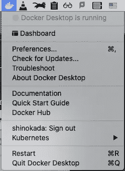

Mac 上的 Docker 菜单。作者图片

Docker **首选项**菜单允许您配置 Docker 设置，如安装、更新、版本频道、Docker Hub 登录等。打开“偏好设置”并转到“资源”来更改 CPU、内存和其他设置。默认情况下，Docker Desktop 被设置为使用主机上可用处理器数量的一半。

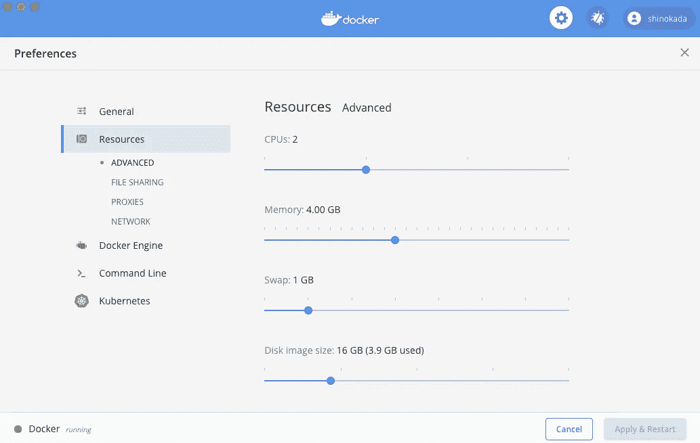

Docker 首选项。作者图片

你可以在这个页面上阅读更多关于 [Mac](https://docs.docker.com/docker-for-mac/#file-sharing) 和 [Windows](https://docs.docker.com/docker-for-windows/) 的细节。

# Docker 帮助

在您的终端中运行`docker`，您将看到所有命令:

```
$ docker
Usage: docker [OPTIONS] COMMAND
A self-sufficient runtime for containers
Options:
      --config string      Location of client config files (default "/Users/shinokada/.docker")
  -c, --context string     Name of the context to use to connect to the daemon (overrides
                           DOCKER_HOST env var and default context set with "docker context use")
  -D, --debug              Enable debug mode
... MORE LINES
```

Docker 将命令逻辑地分组为管理命令。以下是顶级命令。

```
Management Commands:
  builder     Manage builds
  config      Manage Docker configs
  container   Manage containers
  context     Manage contexts
  image       Manage images
  network     Manage networks
  node        Manage Swarm nodes
  plugin      Manage plugins
  secret      Manage Docker secrets
  service     Manage services
  stack       Manage Docker stacks
  swarm       Manage Swarm
  system      Manage Docker
  trust       Manage trust on Docker images
  volume      Manage volumesCommands:
  attach      Attach local standard input, output, and error streams to a running container
  ... MORE LINES
```

您可以使用`--help`获得更多关于管理命令的信息。

```
$ docker container --help
$ docker image --help
```

让我们开始创建 Docker 容器。

# 运行 Jupyter Docker 堆栈

[Jupyter Docker Stacks](https://github.com/jupyter/docker-stacks) 是一组准备运行的 Docker 映像，包含 Jupyter 应用程序和交互式计算工具。

官方 Jupyter 创建了[不同的 Docker 图像](https://jupyter-docker-stacks.readthedocs.io/en/latest/using/selecting.html)，我们将使用`[jupiter/minimal](https://hub.docker.com/r/jupyter/minimal-notebook/tags/)`来学习如何使用 Docker。这个映像基于`[jupyter/base-notebook](https://hub.docker.com/r/jupyter/base-notebook)`，它有命令行工具、TeX Live、git、emacs、vi、jed 等等。

```
$ docker run -p 8888:8888 jupyter/minimal-notebook 
```

在输出的末尾，您可以找到带有标记的 URL。你用`cmd` +click 在浏览器上打开网址。

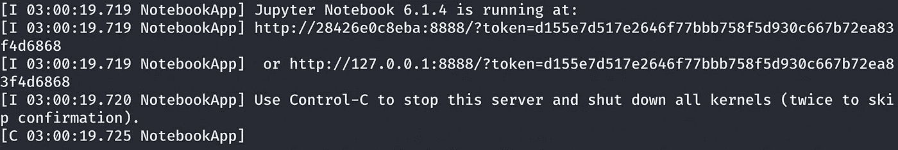

带有令牌的 URL 的 Docker 输出。作者图片

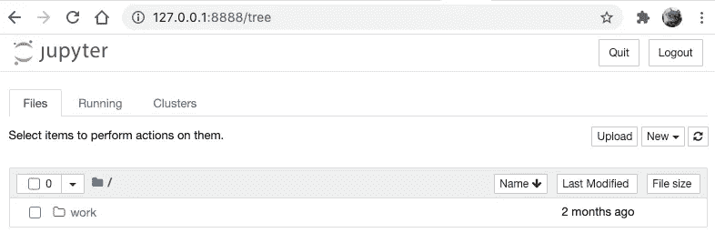

单击 URL 后，您会看到这一点。作者图片

打开另一个终端标签并检查容器 id 号。

```
$ docker container ls
# or 
$ docker ps
```

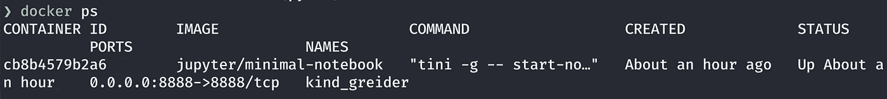

docker ps 的输出。作者图片

# 格式化 Docker ps

阅读上面的输出有点困难。让我们创建一个格式。
将以下内容添加到您的`~/.zshrc`或`~/.bash_profile`中。

```
FORMAT="\nID\t{{.ID}}\nIMAGE\t{{.Image}}\nCOMMAND\t{{.Command}}\nCREATED\t{{.RunningFor}}\nSTATUS\t{{.Status}}\nPORTS\t{{.Ports}}\nNAMES\t{{.Names}}\n"
```

您可以通过将它添加到 docker 的`--format`选项来使用它:

```
$ docker ps --format=$FORMAT
# or
$ docker container ls --format=$FORMAT
```

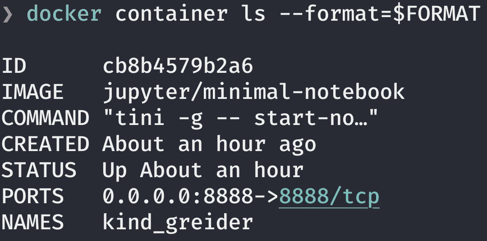

docker 容器 ls 的输出— format=$FORMAT。作者图片

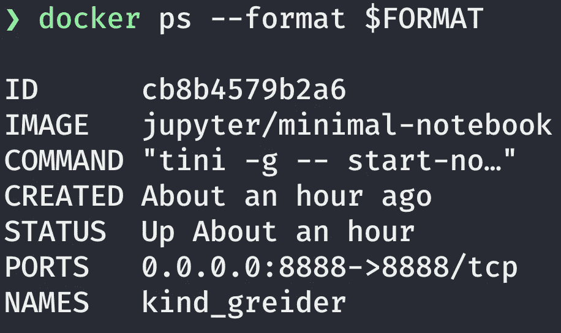

docker ps — format $FORMAT 的输出。作者图片

如上图所示，有无`=`标志都可以使用。

# 进入 Docker 容器并使用 bash

`docker exec`在运行容器中运行命令。`-i`选项允许我们交互地使用它，`-t`分配一个伪 TTY。我们使用`/bin/bash`来运行 bash shell。

```
$ docker exec -it cb8b /bin/bash
```

`cb8b`是我的容器的前 4 个字母。您有不同的容器 id。

使用`docker exec --help`可以找到更多信息。

```
$ docker exec --help
Usage: docker exec [OPTIONS] CONTAINER COMMAND [ARG...]
Run a command in a running container
Options:
  -d, --detach               Detached mode: run command in the background
      --detach-keys string   Override the key sequence for detaching a container
  -e, --env list             Set environment variables
... MORE LINES
```

一旦进入容器，就可以运行普通的 bash 命令。

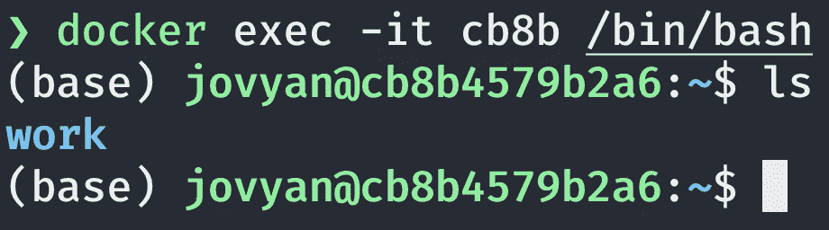

在容器中运行 ls 命令。作者图片

让我们检查一下容器 Python 和 pip 版本:

```
(base) jovyan@cb8b4579b2a6:~/work$ python -V
Python 3.8.5
(base) jovyan@cb8b4579b2a6:~/work$ pip -V
pip 20.2.3 from /opt/conda/lib/python3.8/site-packages/pip (python 3.8)
```

该图像也有`ipython`和`conda`。让我们检查一下:

```
(base) jovyan@cb8b4579b2a6:~$ ipython --version
7.18.1
(base) jovyan@cb8b4579b2a6:~$ conda info -aactive environment : base
    active env location : /opt/conda
            shell level : 1
       user config file : /home/jovyan/.condarc
 populated config files : /opt/conda/.condarc
          conda version : 4.8.5
    conda-build version : not installed
--- MORE LINES
```

您可以找到安装了哪些 Python 包:

```
(base) jovyan@cb8b4579b2a6:~$ pip list
```

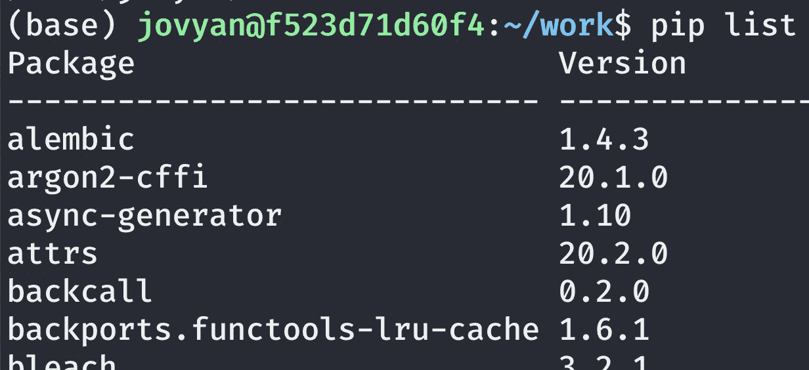

运行容器中的运行 pip 列表。作者图片

熊猫，numpy 等不装。您可以使用`pip install pandas numpy`安装它们:

```
(base) jovyan@cb8b4579b2a6:~/work$ pip install pandas numpy
```

您可以使用`exit`退出 bash。CTRL-C 退出一个正在运行的容器。

# 停止和移除容器和图像

让我们停止一个正在运行的容器:

```
$ docker container ls
CONTAINER ID        IMAGE                      COMMAND                  CREATED             STATUS              PORTS                    NAMES
cb8b4579b2a6        jupyter/minimal-notebook   "tini -g -- start-no…"   4 hours ago         Up 4 hours          0.0.0.0:8888->8888/tcp   suspicious_allen
```

您可以使用`docker container stop <container-id>`停止容器:

```
$ docker container stop cb8b
```

您可以找到包括非活动容器在内的所有容器:

```
$ docker container ls -a
# or
$ docker ps -a
```

您可以列出 docker 图像:

```
$ docker images
```

您可以使用`docker rmi <image-id>`删除图像。

```
$ docker rmi -f <image-id>
```

`-f`在不停止容器的情况下强制移走正在运行的容器。

如果您想要一次移除所有图像:

```
$ docker rmi $(docker images -a -q)
```

`-a`允许我们删除所有图像，删除后`-q`显示数字 id。

您可以用同样的方式使用“移除所有容器”:

```
$ docker rm $(docker ps -a -q)
```

**使用** `**--rm**` 可以用`[--rm](https://docs.docker.com/engine/reference/run/#clean-up---rm)`运行一个容器，当退出容器时自动清理容器。

```
$ docker run --rm jupyter/minimal-notebook
```

退出容器后，您不需要运行`docker ps -a`和`docker rm <image-id>`。

您可以将选项与`-it`结合使用。

```
$ docker run -it --rm jupyter/minimal-notebook bash
(base) jovyan@c803e897b718:~$
```

当您运行这个命令时，您可以在容器中使用 bash，当您退出时，它将清理容器。

# 将本地目录连接到 Docker 容器

Docker 卷是默认 Docker 文件系统之外的目录(或文件),作为普通目录和文件存在于主机文件系统中。卷不会增加使用它的容器的大小，并且卷的内容存在于给定容器的生命周期之外。

我们可以使用`-v`选项创建一个卷。

```
$ docker run -p 8888:8888 -v /Users/yourname/yourdirectory:/home/jovyan/work jupyter/minimal-notebook
```

如果要使用当前工作目录，使用`$(pwd)`。

```
$ docker run -p 8888:8888 -v $(pwd):/home/jovyan/work jupyter/minimal-notebook
```

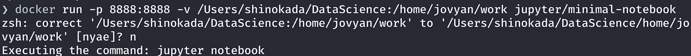

使用卷运行 docker run。作者图片

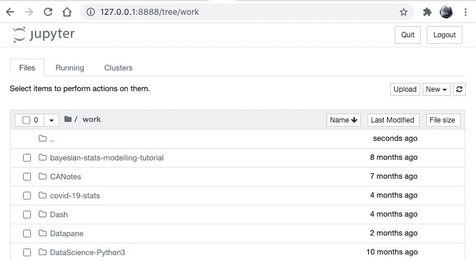

Jupyter 笔记本在浏览器上显示本地目录。

无论您在 Jupyter 笔记本中做了什么更改，它也会更改您的本地文件。

# 检查集装箱

您可以检查码头集装箱:

```
$ docker inspect <container-id or container-name>
```

它返回 docker 对象信息。

# Docker 文件入门

让我们在创建容器时安装所有 Python 包。

创建一个新目录和一个名为 Dockerfile 的文件，内容如下:

```
ARG BASE_CONTAINER=jupyter/minimal-notebook
FROM $BASE_CONTAINERLABEL author="Shinichi Okada"USER rootRUN pip install pandas numpy matplotlib plotly# Switch back to jovyan to avoid accidental container runs as root
USER $NB_UID
```

然后运行`docker build`:

```
$ docker build -t shinokada/jupyter-notebook .
$ docker run -p 8888:8888 -v /Users/shinokada/DataScience:/home/jovyan/work shinokada/jupyter-notebook
```

打开另一个终端标签:

```
$ docker ps
$ docker exec -it <container-id> /bin/bash
(base) jovyan@a56262d7eabc:~$ pip list
...
matplotlib
...
numpy
...
pandas
```

我们使用`docker exec`进入一个正在运行的容器，并列出 Python 包，看看我们的包是否已安装。

# 将图像发布到 Docker Hub

在 [hub.docker](https://hub.docker.com/) 注册，然后在您的终端:

```
$ docker login
Username: your username
Password: your password
...
$ docker push shinokada/jupyter-notebook
```

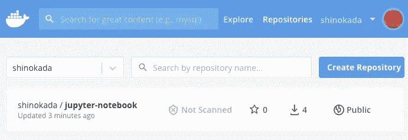

我在码头中心的回购。作者图片

**更多 docker 命令**

```
# Show the history of image
docker history <image-id>
# Display system-wide information
docker info | more
```

# 结论

`[jupyter/scipy-notebook](https://hub.docker.com/r/jupyter/scipy-notebook)`是一个 Jupyter 笔记本科学 Python 堆栈，它包含了科学 Python 生态系统中的流行包。如果你想尝试深度学习，那么`[jupyter/tensorfolow-notebook](https://hub.docker.com/r/jupyter/tensorflow-notebook)`适合你。它包括流行的 Python 深度学习库。你可以在[这些](https://jupyter-docker-stacks.readthedocs.io/en/latest/using/selecting.html) [链接](https://hub.docker.com/search?q=jupyter&type=image)找到更多图片。

你不仅可以把 docker 用于 Jupyter 笔记本，也可以用于你的一般开发。Docker Hub 上有许多存储库。尝试找到你可以信任的官方网站，或者创建你自己的网站，然后推送至 Docker Hub。您将不再需要在您的系统上更新 Python 包。

**通过** [**成为**](https://blog.codewithshin.com/membership) **会员，获得媒体上所有故事的访问权限。**


[请订阅。](https://blog.codewithshin.com/subscribe)