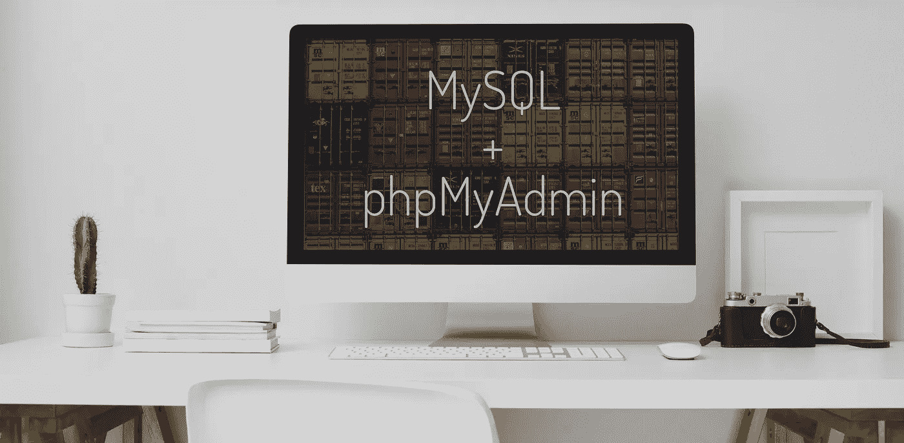
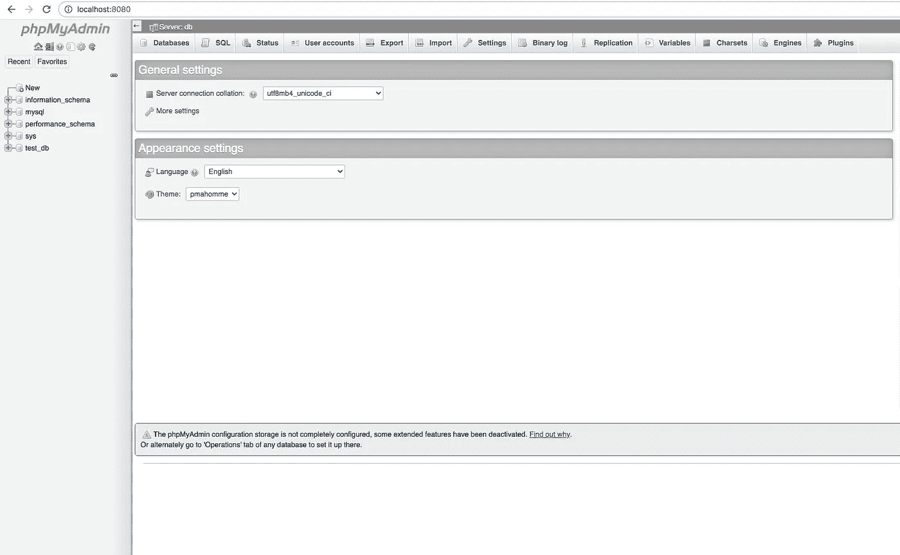
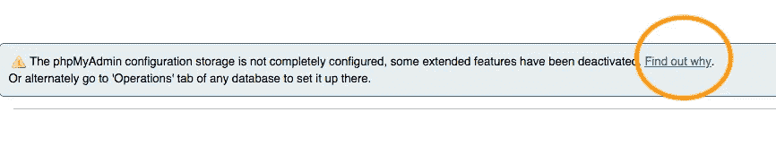
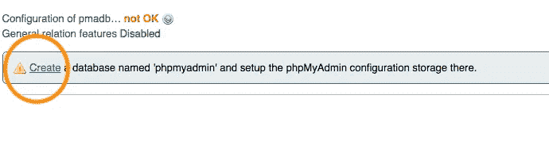

# 如何使用 Docker 运行 MySQL 和 phpMyAdmin

> 原文：<https://towardsdatascience.com/how-to-run-mysql-and-phpmyadmin-using-docker-17dfe107eab7?source=collection_archive---------5----------------------->

## Docker 简化了 MySQL 管理



照片由 [bongkarn thanyakij](https://www.pexels.com/@bongkarn-thanyakij-683719?utm_content=attributionCopyText&utm_medium=referral&utm_source=pexels) 从 [Pexels](https://www.pexels.com/photo/desktop-computer-beside-analog-camera-3759101/?utm_content=attributionCopyText&utm_medium=referral&utm_source=pexels) 和 [Guillaume Bolduc](https://unsplash.com/@guibolduc?utm_source=unsplash&utm_medium=referral&utm_content=creditCopyText) 在 [Unsplash](https://unsplash.com/s/photos/containers?utm_source=unsplash&utm_medium=referral&utm_content=creditCopyText)

对于许多人来说，使用命令行界面管理 MySQL 服务器可能很困难。当我们可以使用图形界面时，事情就变得简单多了。数据库管理工具 phpMyAdmin 解决了这个问题。我们可以在网络界面上使用这个工具。它支持 MySQL 和 MariaDB 的各种操作，比如导入数据、导出数据、执行 SQL 语句等等。

我们将使用 Docker 进行设置，因为在不同的机器上运行和管理 phpMyAdmin 对于环境管理来说是一件令人头疼的事情。Docker 通过使用其容器化技术解决了这个问题，该技术使用 Docker 图像。之前，我已经讨论过如何使用 Docker 运行 MySQL。你可以阅读下面的帖子，我在里面讲述了 MySQL 和 Docker 的一些基本概念和命令。

[](/how-to-run-mysql-using-docker-ed4cebcd90e4) [## 如何使用 Docker 运行 MySQL

### 轻松运行 MySQL

towardsdatascience.com](/how-to-run-mysql-using-docker-ed4cebcd90e4) 

从这篇文章中，你将学习如何使用 [Docker](https://www.docker.com/) 将 [phpMyAdmin](https://www.phpmyadmin.net/) 连接到 [MySQL](https://www.mysql.com/) 服务器。这种方法将节省您的时间和精力，因为您不必安装或配置 phpMyAdmin 和 MySQL。

# 设置

有两种方法我们可以使用 Docker 连接 phpMyAdmin 和 MySQL。在第一种方法中，我们将使用单个 Docker 合成文件。对于第二个，我将向您展示如何连接到一个已经运行的 MySQL Docker 容器。首先，你需要安装 [Docker](https://docs.docker.com/engine/install/) 。两种方法我都用 macOS。

## 方法 1

在这个方法中，我们将使用一个 [Docker 编写文件](https://raw.githubusercontent.com/lifeparticle/MySQL-Snippets/master/phpMyAdmin/docker-compose.yml)。我们需要将`docker-compose.yml`放入一个文件夹中。这个设置中使用的文件夹名是 **phpMyAdmin** 。让我们来分解一下`docker-compose.yml`文件的各个成分。

```
version: '3.1'
services:
  db:
    image: mysql
    restart: always
    environment:
      MYSQL_ROOT_PASSWORD: root
      MYSQL_DATABASE: test_db
    ports:
      - "3308:3306"
  phpmyadmin:
    image: phpmyadmin/phpmyadmin:latest
    restart: always
    environment:
      PMA_HOST: db
      PMA_USER: root
      PMA_PASSWORD: root
    ports:
      - "8080:80"
```

首先，我们使用版本标记来定义合成文件格式，即 3.1。还有其他文件格式— 1、2、2.x 和 3.x。从 Docker 的文档[中获取有关合成文件格式的更多信息，请点击](https://docs.docker.com/compose/compose-file/)。

我们通过服务散列来跟随我们的版本标签。在这里面，我们必须定义我们的应用程序想要使用的服务。对于我们的应用程序，我们有两个服务， **db、**和 **phpmyadmin** 。

为了使我们的设置过程快速简单，我们使用预先构建的官方图片 [MySQL](https://hub.docker.com/_/mysql) 和 [phpMyAdmin](https://hub.docker.com/r/phpmyadmin/phpmyadmin/) 作为图片标签。

当我们使用 **always** 作为重启标签时，容器总是重启。这样可以节省时间。例如，您不必在每次手动重启机器时都启动容器。当 Docker 守护进程重新启动或者容器本身被手动重新启动时，它会重新启动容器。

我们已经在环境标记下定义了环境变量，我们将使用这些变量进行数据库和 phpMyAdmin 认证。

最后，ports 标记用于定义主机和容器端口。对于 **db** 服务，它将主机上的端口 3308 映射到 MySQL 容器上的端口 3306。对于 phpmyadmin 服务，它将主机上的端口 8080 映射到 phpMyAdmin 容器上的端口 80。

现在从`docker-compose.yml`文件所在的目录运行下面的命令。命令`docker compose up`启动并运行你的整个应用。如果您遇到以下错误，这意味着您已经在端口 3308 上运行 Docker 容器。要解决这个问题，您必须更改到不同的端口，或者您可以停止另一个容器。

```
Bind for 0.0.0.0:3308 failed: port is already allocated
```

现在选择任意一个网络浏览器，进入以下地址。

```
http://localhost:8080
```

瞧啊。您应该会在浏览器上看到如下所示的网页。



管理面板

正如你所看到的，在底部有一个警告信息。让我们现在就解决这个问题。



首先，点击**找出原因**链接



现在点击**创建**链接

您已经准备好管理您的数据库了！

## 方法 2

在这个方法中，您将学习如何将 phpMyAdmin docker 容器连接到已经运行的 MySQL 容器。当 docker-compose 文件中没有 phpMyAdmin 服务时，这很有帮助。

首先，我们需要使用以下命令列出所有当前的 Docker 网络。

```
docker network ls
```

现在你应该可以从列表中看到`phpmyadmin_default`。我们的目标是找到我们在方法一中使用 docker-compose 文件创建的应用程序网络。由于我们没有在 docker-compose 文件中为我们的应用程序指定一个网络名称，docker 将根据目录名给出网络名称，并在末尾加上`_default`。在这种情况下，`phpmyadmin_default`。如果你对 Docker networks 感兴趣，点击查看[。](https://docs.docker.com/compose/networking/)

干得好，您已经成功识别了网络！最后，我们可以运行一个独立的 phpMyAdmin Docker 容器，它连接到我们想要的网络。

```
docker run --name stand-alone-phpmyadmin --network phpmyadmin_default -p 8081:80 phpmyadmin/phpmyadmin:latest
```

`docker run`命令用于从映像运行容器。这里我们使用的是`phpmyadmin/phpmyadmin:latest`图像。

`--name`标志(可选)用于给容器一个特定的名称。如果不想提供，Docker 会随机分配一个名字。

`—-network`标志用于连接到 Docker 网络。

`-p`标志已经在这篇文章中讨论过了。

现在选择任意一个网络浏览器，进入以下地址。使用`root`作为用户名和密码登录。

```
http://localhost:8081/index.php
```

当您想要连接多个 Docker 容器时，这种方法很有用。

# 包裹

当我们使用命令行界面时，数据库管理可能是一项艰巨的任务。基于网络的工具 phpMyAdmin 解决了这个问题，Docker 使整个过程更加顺畅。我使用这个设置来试验 MySQL 查询，这样可以节省很多时间。通过使用 Docker，我不必担心 MySQL 和 phpMyAdmin 的设置。我希望这能帮助你开始使用 MySQL、phpMyAdmin 和 Docker。

# 相关帖子

[](/how-to-mount-a-directory-inside-a-docker-container-4cee379c298b) [## 如何在 Docker 容器中挂载目录

### 专注于编写代码，无需担心环境管理

towardsdatascience.com](/how-to-mount-a-directory-inside-a-docker-container-4cee379c298b)