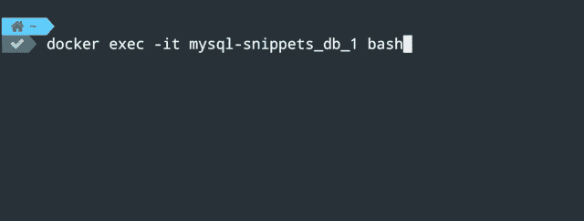

# 如何使用 Docker 运行 MySQL

> 原文：<https://towardsdatascience.com/how-to-run-mysql-using-docker-ed4cebcd90e4?source=collection_archive---------1----------------------->

## 轻松运行 MySQL


图片来自[推特:@jankolario](https://unsplash.com/@jankolar?utm_source=medium&utm_medium=referral) 在 [Unsplash](https://unsplash.com?utm_source=medium&utm_medium=referral)

如果你是数据库管理员、数据科学家或开发人员，你可能必须使用 MySQL 来存储和操作数据。由于 Docker 近年来已经成为一个流行的 DevOps 工具，你最终需要知道如何在 Docker 容器中运行 MySQL。

由于环境管理的原因，在不同的机器上运行您的应用程序可能会令人头疼。Docker 通过使用其容器化技术解决了这个问题，该技术使用 Docker 图像。如果你是 Docker 的新手，或者想提高你的技能，请阅读下面的帖子，我已经介绍了一些基础知识。

[](/how-to-mount-a-directory-inside-a-docker-container-4cee379c298b) [## 如何在 Docker 容器中挂载目录

### 专注于编写代码，无需担心环境管理

towardsdatascience.com](/how-to-mount-a-directory-inside-a-docker-container-4cee379c298b) 

一旦你完成了本教程，你就可以使用 Docker 测试任何 MySQL 查询了。这种方法将节省您的时间和精力，因为您不必安装或配置 MySQL。

# 设置

首先，你需要安装 [Docker](https://docs.docker.com/engine/install/) 。对于这个例子，我们将使用一个 [Docker 组合文件](https://github.com/lifeparticle/MySQL-Snippets/blob/master/docker-compose.yml)，[一个包含引导数据的 SQL 文件](https://github.com/lifeparticle/MySQL-Snippets/blob/master/school.sql)，也称为 mysql-dump 和 macOS。我们需要将`docker-compose.yml`和`school.sql`文件放在同一个文件夹中。这个设置中使用的文件夹名是 **MySQL-Snippets** 。

*   **Docker Compose:** 我们可以使用 Docker Compose 运行多个容器，并在一个 YAML 文件中定义它们的属性。这些容器被称为服务。当您的应用程序有多个堆栈时，比如一个 web 服务器和一个数据库服务器，这是很有帮助的。
*   MySQL-dump:MySQL-dump 包含纯文本格式的 MySQL 查询。MySQL 命令行客户端可以运行这些命令，并将它们发送到 MySQL 服务器。

让我们来分解一下`docker-compose.yml`文件的各个组成部分。

```
version: '3.1'
services:
  db:
    image: mysql
    restart: always
    environment:
      MYSQL_ROOT_PASSWORD: root
      MYSQL_DATABASE: test_db
    ports:
      - "3307:3306"
    volumes:
      - $HOME/Desktop/MySQL-Snippets/school.sql:/school.sql
```

首先，我们使用版本标记来定义合成文件格式，即 3.1。还有其他文件格式— 1、2、2.x 和 3.x。从 Docker 的文档中获取更多关于合成文件格式的信息[此处](https://docs.docker.com/compose/compose-file/)。

我们通过服务散列来跟随我们的版本标签。在这里面，我们必须定义我们的应用程序想要使用的服务。对于我们的应用程序，我们只有一个名为 **db** 的服务。

为了使我们的设置过程快速简单，我们使用预先构建的官方图片 [MySQL](https://hub.docker.com/_/mysql) 作为图片标签。

当我们使用 **always** 作为重启标签时，容器总是重启。这样可以节省时间。例如，您不必在每次手动重启机器时都启动容器。当 Docker 守护进程重新启动或者容器本身被手动重新启动时，它会重新启动容器。

在环境标签下，我们定义了环境变量，我们将使用这些变量进行数据库认证。

ports 标记用于定义主机端口和容器端口。它将主机上的端口 3307 映射到容器上的端口 3306。

最后，卷标签用于将文件夹从主机挂载到容器。它包含由冒号分隔的两个字段。第一部分是主机中的路径。第二部分是容器中的路径。如果您不想将 mysql-dump 挂载到容器中，请删除这一部分。

很好，你已经完成了这篇文章的设置。现在从`docker-compose.yml`文件所在的目录运行下面的命令。命令`docker compose up`启动并运行你的整个应用。

```
docker compose up
```


现在在主机上运行`docker ps`命令，查看正在运行的容器列表。正如我们所看到的，我们有一个名为`mysql-snippets_db_1`的运行容器。


docker ps

我们还可以看到一个图像是通过运行`docker images`命令创建的。


`docker images`

通过运行以下命令来访问正在运行的容器`mysql-snippets_db_1`。

```
docker exec -it mysql-snippets_db_1 bash
```

`docker exec`命令允许我们进入正在运行的容器。标志`-i -t`(通常写为`-it`)用于以交互模式访问容器。现在我们提供想要访问的容器的名称，在本例中是`mysql-snippets_db`。`bash`命令用于获取容器内部的 bash shell，因此我们可以访问 MySQL 命令行并执行 MySQL 查询。

您刚刚完成了容器的设置。现在，我们将演练如何连接到 MySQL 服务器。



## 连接到 MySQL 服务器

使用您的用户名和密码`root`连接到 MySQL 服务器。一旦连接到服务器，您就可以运行 MySQL 命令。

```
mysql -uroot -proot
```

这里有一个例子，你可以试试:


显示数据库；

我们可以看到名为 **test_db** 的数据库，它定义在我们的 Compose 文件中。要选择数据库，运行`USE test_db;`命令。使用`SHOW TABLES;`命令显示我们数据库 **test_db** 的所有表格。键入`ctrl + L`清除控制台。


因为我们没有任何表，所以命令`SHOW TABLES;`返回了一个空集。现在您已经确认您已经连接到 MYSQL 服务器，您可以进入下一步。

## 从文件中加载数据

现在我们可以将 MySQL 转储加载到我们的`test_db`数据库中。在这种情况下是`school.sql`。它在容器内部是可访问的，因为我们已经从主机装载了它。

```
mysql -uroot -p test_db < school.sql
```

使用用户名`root`连接到 MySQL 服务器。输入密码`root` 进行验证。现在我们将默认数据库设置为`test_db`。`<`和文件名一起用于向服务器发送命令。


将 mysql 转储导入到 sql server

如果我们运行 MySQL 命令`SHOW TABLES`，我们可以在数据库`test_db`中看到两个名为 **marks** 和 **students** 的表，它们是在`school.sql`中定义的。


# 包裹

像 MySQL 这样的关系数据库在行业中经常使用，所以这是一个您想要彻底了解的主题。现在您已经完成了这个基础教程，您可以使用 Docker 更深入地探索 MySQL。你可以在这里找到更多的 MySQL 命令。Docker 彻底改变了我们管理环境的方式，包括开发、测试和生产。这就是为什么你必须为个人和工业目的获得这种技能。希望这能帮助你入门 MySQL 和 Docker。