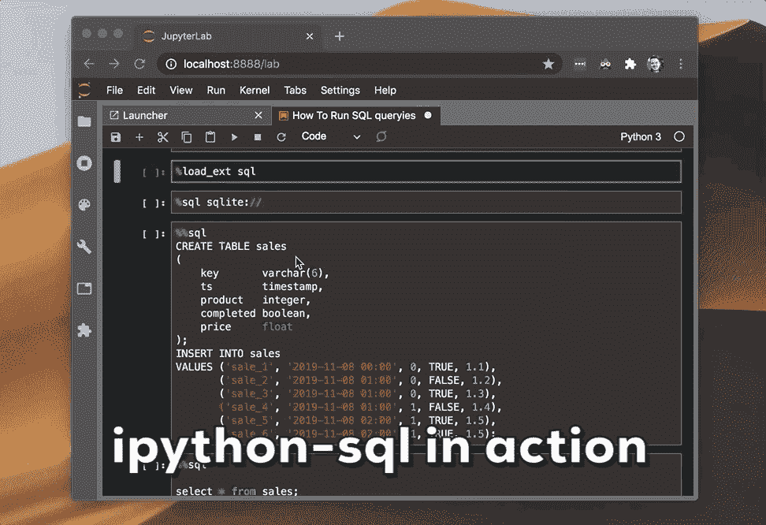

# 如何从 Jupyter 笔记本运行 SQL 查询

> 原文：<https://towardsdatascience.com/how-to-run-sql-queries-from-a-jupyter-notebook-aaa18e59e7bc?source=collection_archive---------5----------------------->

## SQL IDEs 不能可视化数据。您知道吗，您可以使用 Jupyter 笔记本运行并可视化查询结果？


本·怀特在 [Unsplash](https://unsplash.com?utm_source=medium&utm_medium=referral) 上的照片

如果你在数据科学领域工作，你很可能会使用 SQL 来提取和预处理数据。我使用 JetBrains [DataGrip](https://www.jetbrains.com/datagrip/?gclid=CjwKCAjwmMX4BRAAEiwA-zM4JlAlxuoNVssIK6WNW44-KErOe8DZZqBsRaJ7C79bRmhn-0IwpCi2ZhoC0ggQAvD_BwE) 作为我的主要 SQL 编辑器已经有一段时间了。虽然 DataGrip 做得不错，但它没有提供可视化数据的方法。有没有更好的办法？

## **这里有几个你可能会感兴趣的链接:**

```
- [Complete your Python analyses 10x faster with Mito](https://trymito.io/) [Product]- [Free skill tests for Data Scientists & ML Engineers](https://aigents.co/skills) [Test]- [All New Self-Driving Car Engineer Nanodegree](https://imp.i115008.net/c/2402645/1116216/11298)[Course]
```

*你愿意多看一些这样的文章吗？如果是这样，你可以点击上面的任何链接来支持我。其中一些是附属链接，但你不需要购买任何东西。*

# 用于 SQL 的 ide


Gif 来自 [Giphy](https://giphy.com/gifs/screen-monitor-closeup-26tn33aiTi1jkl6H6)

SQL 的集成开发环境通常不具备可视化查询结果的能力。在我看来，这是一件好事，因为每个 IDE 都有自己专有的方式来可视化数据，这是我们需要学习的。

> 我可视化数据的工作流程是:在 SQL IDE 中开发并执行查询，将数据导出到 CSV 并在 Jupyter 笔记本中可视化。

# 在 Jupyter 笔记本中运行查询


Gif 来自 [Giphy](https://giphy.com/gifs/life-ol365-ollife-d5pBBi43j9FNUEZRwr)

当查询结果太大而无法在单个查询中处理时，该怎么办？一种解决方案是以更短的时间间隔运行查询，而不是一整年，您可以按月运行查询。

按月运行一个查询需要一年运行 12 次，这对于手工来说是不可行的——因为循环在这里很有用。

> 拥有多种工具总是好的

当面临这样的问题时，我一直使用 [SQLAlchemy](http://docs.sqlalchemy.org/en/latest/core/engines.html#database-urls) 连接到数据库，并将数据提取到 pandas DataFrame，如下例所示:

```
import sqlalchemy
import pandasengine = sqlalchemy.create_engine(
    sqlalchemy.engine.url.URL(
        drivername="postgresql",
        username="username",
        password="password",
        host="host",
        port="port",
        database="database",
    ),
    echo_pool=True,
)
print("connecting with engine " + str(engine))
connection = engine.connect()query = "select * from table"df = pd.read_sql_query(query, connection)
```

正如您在上面看到的，SQL 查询是用字符串编写的。即使您将查询字符串放在 Jupyter 笔记本的一个单独的单元格中，并且安装了格式化的 SQL 代码，它也不会格式化查询，因为它仍然是一个 Python 字符串。

有没有更好的办法？

# 认识 ipython-sql

ipython-sql 使我们能够直接从 Jupyter 笔记本上运行 sql 查询。无需编写多行代码来连接数据库或将查询包装在字符串中。ipython-sql 使得从 Jupyter Notebook 查询数据库更加“干净”。



使用 ipython-sql 查询 SQLite 数据库

要安装 ipython-sql，只需在 Jupyter 笔记本中运行以下命令:

```
!pip install ipython-sql
```

然后加载 SQL 模块:

```
%load_ext sql
```

我们需要一个连接字符串来连接数据库。对于 SQLite，它非常简单:

```
%sql sqlite://
```

如果您以前使用过 [SQLAlchemy](http://docs.sqlalchemy.org/en/latest/core/engines.html#database-urls) 连接到数据库，您可以使用下面的代码来获得连接字符串:

```
print("connecting with engine " + str(engine))
```

> 注意，每个单元格都需要用%%sql 注释。这告诉 Jupyter 笔记本，单元格中的代码是 SQL。

让我们将示例数据添加到 SQLite 数据库中:

```
%%sql
CREATE TABLE sales
(
    key       varchar(6),
    ts        timestamp,
    product   integer,
    completed boolean,
    price     float
);
INSERT INTO sales
VALUES ('sale_1', '2019-11-08 00:00', 0, TRUE, 1.1),
       ('sale_2', '2019-11-08 01:00', 0, FALSE, 1.2),
       ('sale_3', '2019-11-08 01:00', 0, TRUE, 1.3),
       ('sale_4', '2019-11-08 01:00', 1, FALSE, 1.4),
       ('sale_5', '2019-11-08 02:00', 1, TRUE, 1.5),
       ('sale_6', '2019-11-08 02:00', 1, TRUE, 1.5);
```


现在，让我们查询数据库

```
%%sqlselect * from sales;
```


非常管用！

我们只运行了查询，但是结果没有分配给任何变量，这没有多大用处。幸运的是，Jupyter Notebook 使我们能够将一个单元格的先前输出设置为一个变量:

```
result = _
```

让我们检查结果变量的类型:

```
type(result)# sql.run.ResultSet
```

现在，让我们使用以下方法将结果集直接转换为 pandas 数据帧:

```
df = result.DataFrame()
```


这使我们能够交互式地探索数据。


# 在你走之前

在[推特](https://twitter.com/romanorac)上关注我，在那里我定期[发关于数据科学和机器学习的](https://twitter.com/romanorac/status/1328952374447267843)推特。


照片由[Courtney hedge](https://unsplash.com/@cmhedger?utm_source=medium&utm_medium=referral)在 [Unsplash](https://unsplash.com/?utm_source=medium&utm_medium=referral) 上拍摄