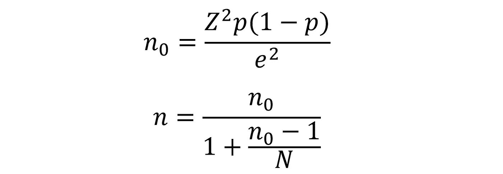
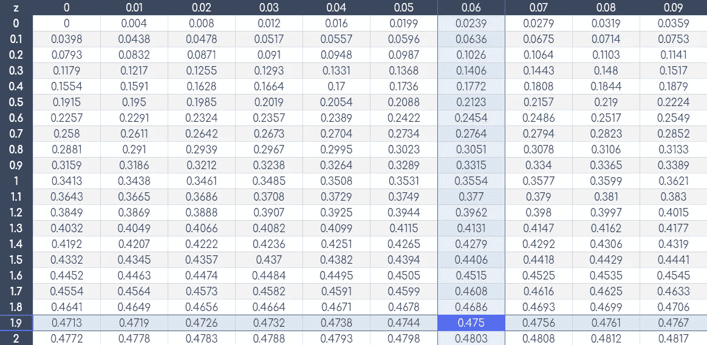
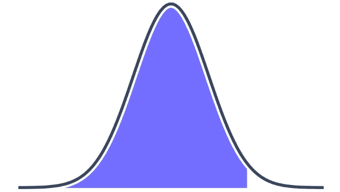
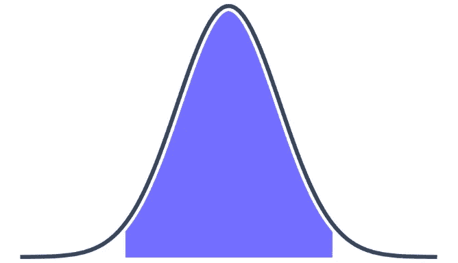
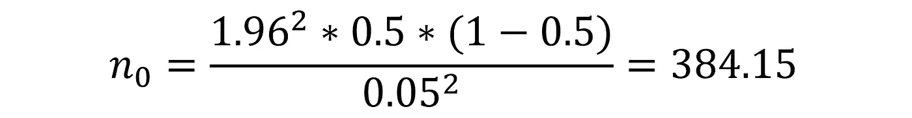
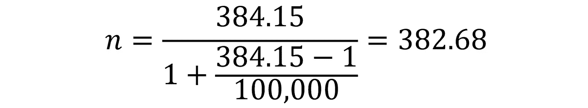

# 如何对数据进行采样(使用代码)

> 原文：<https://towardsdatascience.com/how-to-sample-data-with-code-327359dce10b?source=collection_archive---------23----------------------->

## 使用 Cochran 公式采样——在 Python、R 和 Excel 中


凯文·Ku 在 [Unsplash](https://unsplash.com?utm_source=medium&utm_medium=referral) 上的照片

对于任何处理数据的人来说，采样都是一项至关重要的技能。尽管如此，令人惊讶的是很少有人做对。通常，取样是根据判断而不是逻辑进行的。

对我们来说幸运的是——对数据集进行采样是一项极其简单的任务。

在本文中，我们将介绍计算样本大小的 Cochran 公式，它不会使我们的测试无效。

我们将包括简单的数学方法和符号，展示我们如何手动计算它们——然后继续用 Python、R 和 Excel 实现。

最后，我们将组装一个快速样本大小计算器来演示采样有多简单。

# 关键参数

```
- confidence level
- margin of error
- target proportion
```

所以，我们有一个数据集。我们需要对这个数据集的一部分进行采样，以便进行一些手动的定性分析。

从统计学上来说，我们需要足够大的样本量，才能确信我们所取的样本准确地代表了原始总体(数据集)。这个置信度被称为**置信度**。

95%的**置信度**是最常见的——这是我们将在本文通篇使用的。但是，如果需要更多/更少的置信度，我们只需调整我们的公式输入。

通常，我们的分析对样本和总体代表之间的微小差异不敏感。因此，我们接受一定程度的灵活性，我们称之为**误差幅度**。同样，典型值约为 5%。

将两者放在一起，我们可以 95%确信我们计算的样本平均值在 5%的范围内等于总体平均值。

最后一个参数**目标比例**是提供目标属性的样本的百分比。当这一点不清楚时(几乎总是如此)，简单地使用 50% —最坏的情况。

# 对我们的数据进行采样

我们现在需要为我们的测试或开发过程提取这些数据的样本。

我们如何知道我们的样本应该有多大才能准确地代表我们的总体？

这就是我们可以使用科克伦公式的地方:



使用该公式，我们可以计算满足我们要求的误差范围和置信水平所需的样本量。如果我们要查看数据集中的特定属性，我们还可以指定包含该属性的估计人口比例，尽管这不是必需的。

因此，我们有一个包含 100，000 条记录的数据集。我们的样本中应该包括多少这样的样本？

假设我们希望我们的样本有 95%的把握正确代表总体。我们也可以接受 5%的误差率。

```
population size: 100K - **N = 100000**
confidence level: 95% - **cl = 0.95**
margin of error: 5% - **e = 0.05** target proportion: 50% - **p = 0.5**
```


首先，我们有了计算 *n₀* 所需的所有参数，除了*z*(z 分数)。为了找到 z 分数，我们将从`0.95`到`0.475`的置信水平减半，然后在 z 分数表中查找这个值，这给出了`1.96`。



我们在表中发现我们的置信水平减半为 0.475。z 值由坐标轴上的值给出， **1.9 + 0.06** ，得出 **1.96** 。在这里找到表格[。](https://docs.google.com/spreadsheets/d/1vncWZTrkXjP2wMdLFf8l5Tjp6v0Ao6cnQ7WpHn5y3EA/edit?usp=sharing)

或者，我们可以使用 Python、R 或 Excel 来计算。

```
**Python**
-----
import scipy.stats as st
st.norm.ppf(1-(1-**0.95**)/2)
```

`**[Out]:** 1.959964`

```
**R**
-----
qnorm(1-(1-**0.95**)/2)
```

`**[1]:** 1.959964`

```
**Excel**
-----
=NORMSINV(1-(1-**0.95**)/2)
```

`1.959964`

注意，在每个代码中，我们执行相同的`1-(1-0.95)/2`计算。这是因为每个实现都会计算左尾单分布的 z 得分，如下所示:



相反，我们想要的是一个居中对齐的区域，看起来像这样:



现在我们有了所有需要的值，我们计算 n₀:



为了满足我们的抽样需求，我们应该将这个数据四舍五入为`385`个记录。我们取整，因为这是我们的阈值——任何低于`384.15`的都将具有低于 95%的置信水平，或者大于 5%的误差幅度。

要在代码中执行此计算，我们需要执行以下操作:

```
**Python**
-----
z**2 * p * (1 - p) / e**2
```

`**[Out]:** 384.15`

```
**R**
-----
z^2 * p * (1 - p) / e^2
```

`**[1]:** 384.15`

```
**Excel** *(replace each letter with the respective cell)*
-----
=z^2*p*(1-p)/e^2
```

`384.15`


第二个公式是我们用于小数据集的公式；它根据总体规模 *N* 调整我们所需的样本规模。

较小的数据集将减少所需样本的数量，而较大的数据集则不会。

使用我们的总体规模`**N = 100,000**`会导致我们所需的样本规模略有减少:



给我们一个最终所需的`**383**`记录的样本量。在代码中再次执行同样的计算，我们得到:

```
**Python**
-----
n_0 / (1 + (n_0 - 1) / N)
```

`**[Out]:** 382.68`

```
**R**
-----
n_0 / (1 + (n_0 - 1) / N)
```

`**[1]:** 382.68`

```
**Excel** *(replace each letter with the respective cell)*
-----
=n_0/(1+(n_0-1)/N)
```

`382.68`

这样，我们就有了一个简单的、可重复的方法来计算样本量。如果我们更进一步，我们可以用代码实现整个过程，使我们未来的采样更加容易。

在 Python 中，我们可以构建一个简单的样本大小计算器，如下所示:

使用前面示例中的相同参数，我们可以轻松计算样本大小:

```
sample(100000, 0.95, 0.05, 0.5)
```

`[Out]: 383`

我们还可以看到人口规模如何影响较小样本的计算:

```
sample(**500**, 0.95, 0.05, 0.5)
```

`**[Out]:** 218`

```
sample(**20**, 0.95, 0.05, 0.5)
```

`**[Out]:** 20`

```
sample(**1e8**, 0.95, 0.05, 0.5)
```

`**[Out]:** 385`

当然，我们在 R 和 Excel 中也是这样做的，将我们之前讨论过的代码串连在一起。

我们已经从理论和实现两方面介绍了样本量计算的基础知识。

对于不同数据专业中的大多数采样要求，您不需要比这更复杂的东西——Cochren 的公式广泛适用，并且非常容易实现。

如果您有任何问题或建议，请在下面的回复中告诉我！

感谢阅读！