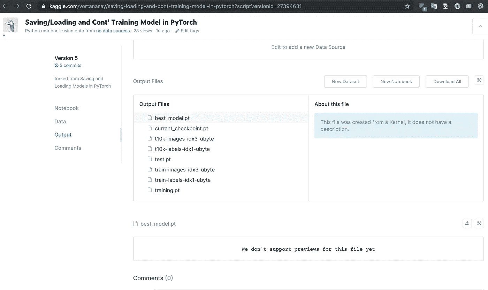

# 如何在 PyTorch 中保存和加载模型，并附有完整的示例

> 原文：<https://towardsdatascience.com/how-to-save-and-load-a-model-in-pytorch-with-a-complete-example-c2920e617dee?source=collection_archive---------0----------------------->

## 如何在 PyTorch 中保存和加载模型的实例。我们将看看如何继续训练和加载模型进行推理


詹姆斯·哈里逊在 [Unsplash](https://unsplash.com?utm_source=medium&utm_medium=referral) 上拍摄的照片

T 这篇文章的目的是告诉你如何保存一个模型，并在上一个时期后加载它继续训练，并做出预测。如果你正在阅读这篇文章，我假设你熟悉深度学习和 PyTorch 的基础。

你有没有经历过这样的情况，你花了几个小时或几天训练你的模型，然后它在中途停止？还是对自己的模特表现不满意，想重新训练模特？我们可能需要一种灵活的方式来保存和加载我们的模型，这有多种原因。

Kaggle、Google Colab 等大多数免费云服务都有空闲超时，会断开你的笔记本，加上笔记本一旦达到限制时间就会断开连接或中断。除非你用 GPU 训练少量的纪元，否则这个过程需要时间。能够保存模型会给你带来巨大的优势并扭转局面。为了灵活起见，我将保存最新的检查点和最佳的检查点。

时尚 _ MNIST _ 数据将被用作我们的数据集，我们将从导入数据编写一个完整的流程来进行预测。在这个练习中，我将使用一个 [Kaggle](https://www.kaggle.com/) 笔记本。

# 步骤 1:设置

*   在 Kaggle 中，你正在操作的笔记本默认叫做 **__notebook__。ipyn**
*   创建两个目录来存储检查点和最佳模型:

# 步骤 2:导入库和创建助手函数

## 导入库

## 保存功能

**创建 save_ckp** 是为了保存检查点，最新的和最好的检查点。这就产生了灵活性:要么您对最新检查点的状态感兴趣，要么对最佳检查点感兴趣。

在我们的例子中，我们希望保存一个检查点，使我们能够使用这些信息来继续我们的模型训练。以下是所需的信息:

*   **时期**:所有训练向量被使用一次来更新权重的次数的度量。
*   **valid_loss_min** :最小验证损失，这是需要的，以便当我们继续训练时，我们可以从这个而不是 np 开始。Inf 值。
*   **state_dict** :模型架构信息。它包括每一层的参数矩阵。
*   **优化器**:您需要保存优化器参数，尤其是当您使用 Adam 作为优化器时。Adam 是一种自适应学习率方法，这意味着，它计算不同参数的个人学习率，如果我们想从我们离开的地方继续我们的训练，我们将需要这些参数[2]。

## 加载功能

**load_chkp** 是为加载模型创建的。这需要:

*   保存的检查点的位置
*   要将状态加载到的模型实例
*   优化器

# 步骤 3:导入数据集时尚 _ MNIST _ 数据并创建数据加载器

# 步骤 4:定义和创建模型

我使用的是来自[1]的简单网络

## 输出:

```
FashionClassifier(
  (fc1): Linear(in_features=784, out_features=512, bias=True)
  (fc2): Linear(in_features=512, out_features=256, bias=True)
  (fc3): Linear(in_features=256, out_features=128, bias=True)
  (fc4): Linear(in_features=128, out_features=64, bias=True)
  (fc5): Linear(in_features=64, out_features=10, bias=True)
  (dropout): Dropout(p=0.2)
)
```

# 步骤 5:训练网络并保存模型

训练功能使我们能够设置时期数、学习率和其他参数。

## 定义损失函数和优化器

下面，我们使用 Adam 优化器和交叉熵损失，因为我们把字符类分数作为输出。我们计算损耗并进行反向传播。

## 定义培训方法

## 训练模型

## 输出:

```
Epoch: 1  Training Loss: 0.000010  Validation Loss: 0.000044
Validation loss decreased (inf --> 0.000044).  Saving model ...Epoch: 2  Training Loss: 0.000007  Validation Loss: 0.000040
Validation loss decreased (0.000044 --> 0.000040).  Saving model ...Epoch: 3  Training Loss: 0.000007  Validation Loss: 0.000040
Validation loss decreased (0.000040 --> 0.000040).  Saving model ...
```

让我们关注一下上面使用的几个参数:

*   start_epoch:训练的值 epoch 的开始
*   n_epochs:训练的值 epoch 的结束
*   有效 _ 损失 _ 最小 _ 输入= np。中程核力量
*   checkpoint_path:保存训练的最新检查点状态的完整路径
*   最佳模型路径:训练的最新检查点的最佳状态的完整路径

## 验证模型是否已保存

*   列出 best_model 目录中的所有文件

**输出:**

```
best_model.pt
```

*   列出检查点目录中的所有文件

**输出:**

```
current_checkpoint.pt
```

# 步骤 6:加载模型

## 重建模型

**输出:**

```
FashionClassifier(
  (fc1): Linear(in_features=784, out_features=512, bias=True)
  (fc2): Linear(in_features=512, out_features=256, bias=True)
  (fc3): Linear(in_features=256, out_features=128, bias=True)
  (fc4): Linear(in_features=128, out_features=64, bias=True)
  (fc5): Linear(in_features=64, out_features=10, bias=True)
  (dropout): Dropout(p=0.2)
)
```

## 定义优化器和检查点文件路径

## 使用 load_ckp 函数加载模型

我打印出了我们从 **load_ckp** 得到的值，只是为了确保一切都是正确的。

**输出:**

```
model =  FashionClassifier(
  (fc1): Linear(in_features=784, out_features=512, bias=True)
  (fc2): Linear(in_features=512, out_features=256, bias=True)
  (fc3): Linear(in_features=256, out_features=128, bias=True)
  (fc4): Linear(in_features=128, out_features=64, bias=True)
  (fc5): Linear(in_features=64, out_features=10, bias=True)
  (dropout): Dropout(p=0.2)
)
optimizer =  Adam (
Parameter Group 0
    amsgrad: False
    betas: (0.9, 0.999)
    eps: 1e-08
    lr: 0.001
    weight_decay: 0
)
start_epoch =  4
valid_loss_min =  3.952759288949892e-05
valid_loss_min = 0.000040
```

加载完所有需要的信息后，我们可以继续训练，start_epoch = 4。以前，我们从 1 到 3 训练模型

# 第七步:继续训练和/或推断

## 继续训练

我们可以继续使用 train 函数训练我们的模型，并提供我们从上面的 **load_ckp** 函数中获得的检查点的值。

**输出:**

```
Epoch: 4 	Training Loss: 0.000006 	Validation Loss: 0.000040
Epoch: 5 	Training Loss: 0.000006 	Validation Loss: 0.000037
Validation loss decreased (0.000040 --> 0.000037).  Saving model ...
Epoch: 6 	Training Loss: 0.000006 	Validation Loss: 0.000036
Validation loss decreased (0.000037 --> 0.000036).  Saving model ...
```

*   注意:纪元现在从 4 点到 6 点开始。(开始时间= 4)
*   验证丢失从最后一个训练检查点开始继续。
*   在时期 3，最小验证损失是 0.000040
*   这里，最小验证损失从 0.000040 开始，而不是 INF

## 推理

请记住，在运行推理之前，您必须调用 model.eval()将丢弃和批处理、规范化图层设置为评估模式。不这样做将产生不一致的推理结果[3]。

**输出:**

```
Accuracy of the network on 10000 test images: 86.58%
```

## 在 Kaggle 笔记本中哪里可以找到输出/保存的文件

在您的 Kaggle 笔记本中，您可以向下滚动到页面底部。在之前的操作中保存了一些文件。



这是我在 Kaggle 的笔记本:

[https://www . ka ggle . com/vortanasay/saving-loading-and-cont-training-model-in-py torch](https://www.kaggle.com/vortanasay/saving-loading-and-cont-training-model-in-pytorch?scriptVersionId=27394631)

## 参考:

*   [1] S. David，在 PyTorch 中保存和加载模型(2019)，[https://www . ka ggle . com/davidashraf/Saving-and-Loading-Models-in-py torch](https://www.kaggle.com/davidashraf/saving-and-loading-models-in-pytorch)
*   [2] J. Rachit，保存并加载您的模型以在 PyTorch 中恢复培训(2019)，[https://medium . com/analytics-vid hya/Saving-and-Loading-Your-Model-to-Resume-Training-in-py torch-CB 687352 fa 61](https://medium.com/analytics-vidhya/saving-and-loading-your-model-to-resume-training-in-pytorch-cb687352fa61)
*   [3]一、马修，保存和加载模型(2017)，[https://py torch . org/tutorials/初学者/saving_loading_models.html](https://pytorch.org/tutorials/beginner/saving_loading_models.html)