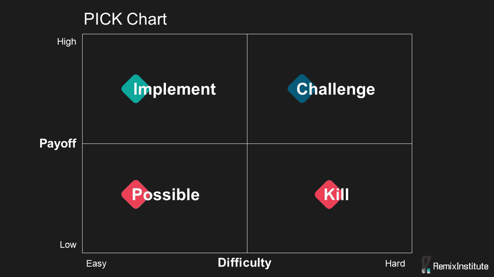
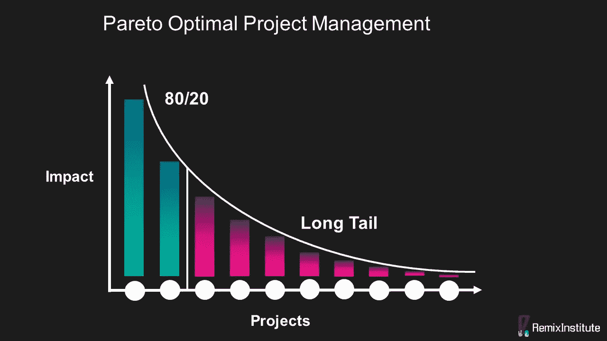

# 如何对无用的数据科学项目说不，并开始从事你想要的工作

> 原文：<https://towardsdatascience.com/how-to-say-no-to-projects-d6f88641ab3c?source=collection_archive---------34----------------------->

如何对无意义的忙碌说不并开始做你想做的事情的 5 个技巧:创新和增值的数据科学项目。

应利益相关者的要求，数据科学家和分析师开始用大部分无附加值的工作来溢出他们的杯子。许多人没有勇气或信心对此说“不”。这也适用于其他垂直行业和职业中的许多工作和商业专业人士。**简而言之，你需要建立自信，不再懦弱，开始对无意义的工作说“不”。**

# 数据科学家可以成为公司的新决策者，应该选择自己的增值项目

当公司雇佣数据科学团队时，该团队的客户通常是非技术利益相关者。他们对自己想从数据科学中获得什么有一个大致的想法，但他们不知道自己具体想要什么。大多数时候，业务部门认为“数据科学和分析”只是运行报告并在需要时获取数据的团队(像狗或猴子一样)。数据科学和分析团队的核心职责不是在 Tableau 和 PowerBI 中构建报告；这是商业智能团队的工作(奇怪的是，许多商业智能专业人士已经开始自称为分析师或数据科学家)。数据科学家的工作基本上是:

*   综合和挖掘数据，从中创建可行的业务建议
*   **使用统计、机器学习和人工智能模型自动化决策**
*   为最终用户创建数据科学产品和工具(我们在 Remix Institute 喜欢称之为 **Prefab AI** 或 AI Augs——类似于 [Deux Ex 视频游戏系列](https://deusex.fandom.com/wiki/Augmentation))。**像**[**RemixAutoML**](http://www.remixauto.ml)**这样的开源工具就是例子。**
*   通过寻找收入增长、成本节约、运营效率和业务流程优化的机会来提高利润

如果业务部门的利益相关方让您的数据科学团队从事列表上没有的任何工作，或者不提供价值或增长的任何工作，那么您**不应该**从事这些工作。数据科学团队应该根据利益相关者的反馈和痛点挑选自己的项目。数据科学不是 IT 或 BI，不应构建报告或处理票证请求。(下面有更多相关信息)

# 非增值工作不断堆积的原因

许多数据科学家和非技术利益相关者没有意识到规划谬误。计划谬误是一种心理现象，它表明我们对完成一项任务需要多少时间的预测过于乐观，而低估了实际需要的时间。由于我们很难估计事情需要多长时间，这意味着我们对项目说“是”的次数比我们应该说的要多，因为我们认为完成项目需要的时间更少。这导致我们变得捉襟见肘，精疲力竭，拼命寻找最稀缺和最有价值的资源之一:**时间**。对项目说“是”感觉很好，因为它可能会加强你和利益相关者之间的联系，但有时人们说“是”是因为害怕被认为是低效的、消极的、工作缓慢的和非团队成员。

# 拒绝和选择自己项目的 5 种方法

有很多实用的方法可以对非增值项目说不，同时仍然能够被理解为一个团队成员，并且能够选择你喜欢的项目。以下是 5 种实用的拒绝方式:

**1。将霍夫施塔特定律确立为您的数据科学团队的指导运营原则之一。霍夫施塔特定律是一个递归公理，它表明所花费的时间总是比你预期的要长，即使你把霍夫施塔特定律考虑在内。作为一个简单的启发，你应该把完成一个项目的时间增加两倍或三倍。这是针对[规划谬误](https://en.wikipedia.org/wiki/Planning_fallacy)的对策。**

**2。礼貌地对项目请求说“不”，但是立场要坚定，不要做受气包。**业务利益相关者将来自许多部门，具有相互竞争的优先级和激励机制。当他们带着对他们来说“高度优先”的项目来找你时，对公司的整体业务目标来说，这可能不是高度优先或高增长潜力的项目。一封类似这样的邮件或信息是一种礼貌的拒绝方式

“你好，我们理解对这个项目的独特渴望，它看起来像一个有趣的商业问题。在审查了需求之后，我们估计了项目完成的时间。不幸的是，这不是我们团队目前能做的事情，因为我们目前正专注于其他高优先级的增长计划，但我们可以在未来进行规划讨论。如果你有这个项目的投资回报率分析，这将有助于我们把它放在队列的顶部。”

立场坚定很重要，因为很多时候利益相关者不喜欢接受否定的答案，他们会试图甜言蜜语，说服你为什么你真的应该参与他们的项目。听他们说完，但仍然礼貌地说不。

**3。通过将所有项目放在一个选择图表上来区分它们的优先级。**一个[选择图表](https://en.wikipedia.org/wiki/Pick_chart)是一个精益六适马工具，由洛克希德·马丁公司开发，用于组织和优先化项目想法。PICK 代表**可能，实现，挑战，杀死**。以下是每一项的细目分类:

*   **(P)可能**。如果这个项目*容易做，但回报低*，可能会参与其中
*   **(一)实施**。如果这个项目*容易做并且回报高*，那就一定要去做，并优先考虑它
*   **(C)挑战**。如果这个项目*很难做但是回报很高*就挑战它
*   **(K)杀**。杀死所有难做且低回报的项目并扔进垃圾桶

选择图表

最好的方法是选择关注左上角象限的 1 到 2 个关键项目。这种项目优先级排序就是我们在 Remix Institute 所说的“**帕累托最优项目管理。**”

为此，你需要将项目优先级外包给你的经理，以获得政治掩护。当然，告诉他/她你认为应该优先考虑什么(左上象限),以便从事你想从事的项目。作为一名数据科学家，你应该建议优先考虑人工智能自动化或机器学习用例的项目，并降低分析和报告请求的优先级。

帕累托最优项目管理

**4。推迟任何武断的截止日期。**大部分期限都只是凭空扯出来的，只是提供了不必要的压力。在过去，我看到过来自高级管理层的项目请求，附带一个任意的截止日期，过了一段时间没有听到项目的状态，高级管理层忘记了他们在第一时间分配它。在这种情况下，这个项目肯定是没有意义的无用功，没有最终期限。

这是关于高层管理的一个不为人知的事实:很多时候，他们只是故意把无用功分配给你。

然而，即使这是真的，你也不能告诉你的利益相关者。相反，你需要用一种政治上更容易接受的方式来表达这一点。类似这样的电子邮件或信息更适合推迟任意的截止日期:

“你好，我知道在截止日期前完成任务很重要。您能否将这一时间延长 X 天/周，因为我们目前正在进行高管们非常感兴趣的 PICK CHART 左上角的项目]。”

或者

"如果你想让 X 由 Y 完成，我可以给出 X 的 A 和 B，但不能给出 X 的 C 和 D。"

开始做你想做的事情。创新和高投资回报率的项目。

**5。将奥卡姆剃刀确立为你的机器学习模型开发的指导性操作原则之一。这个主题本身需要另一篇博文，但是奥卡姆剃刀(或简约原则)认为模型应该是最低限度的，最简单的模型是可能的最好模型。请记住，机器学习应该简化业务流程和自动化决策，因此制作一个具有大型代码库的庞然大物模型只意味着它是一艘敏捷性低、维护成本高的军舰。这意味着你要花费大量的空闲时间来维护它，这减少了你做其他事情的时间。你还应该向你的利益相关者介绍奥卡姆剃刀，这样他们也不会使机器学习模型开发过于复杂。**

如上所述，简约原则是一个有趣的话题，它本身将是另一篇博文。最简单并不总是意味着最少的技术债务或最低的维护。有时候项目确实需要复杂性。这就是为什么确定规模合适的“最低要求”解决方案非常重要。如果在 Excel 中只需要一条趋势线，那么真的需要深度学习模型吗？

# 结论

只要首席管理人员开始看到他们对损益的影响，数据科学家就可以成为公司及其最有价值部门的新决策者。为了做到这一点，数据科学团队必须立场坚定，树立信心，并有效地优先处理高价值工作，同时降低优先级，甚至扼杀非增值工作。这包括学习有效项目管理的技巧，礼貌地对涉众说“不”。通过这样做，**数据科学团队可以专注于高投资回报率、增加收入的项目，如可以集成到业务流程中的机器学习和自动化产品。这引起了最高管理层的注意，并提升了数据科学的地位。**

## 本文原载于 RemixInstitute.com 的