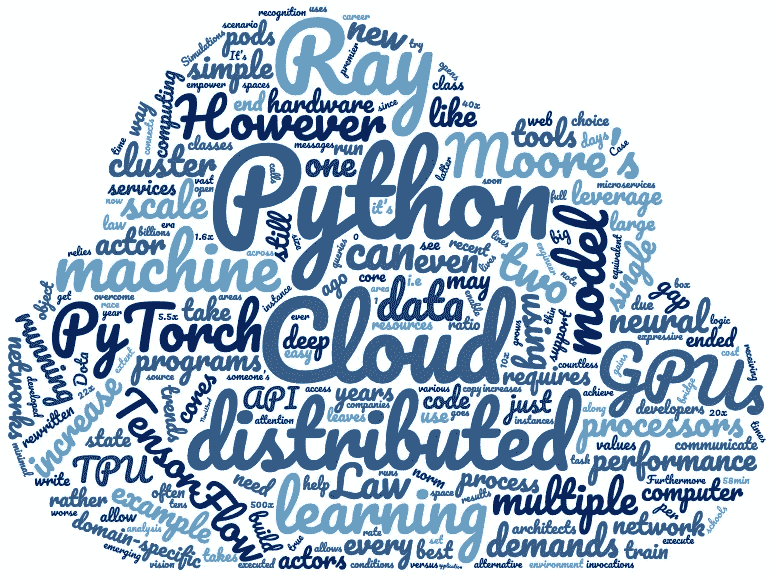
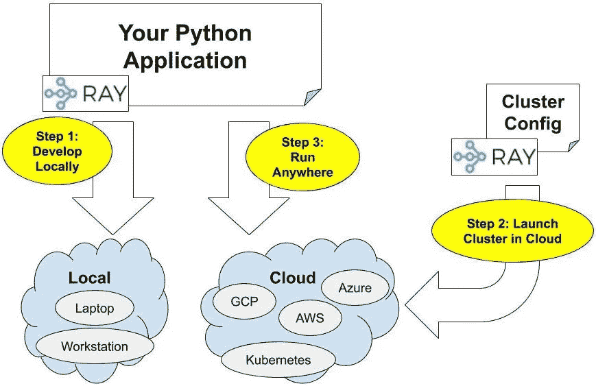

# 如何在每个主要的云提供商上扩展 Python

> 原文：<https://towardsdatascience.com/how-to-scale-python-on-every-major-cloud-provider-5e5df3e88274?source=collection_archive---------41----------------------->

## 使用 Python 进行云计算的最佳实践

用[皮雷恩](https://github.com/pywren/pywren)创造者[艾瑞克·乔纳斯、](http://ericjonas.com/) **的话说，“云太他妈硬了！”**



云中的 Python。

一旦你在笔记本电脑上开发了一个 Python 应用程序，并希望在云中扩展它(可能需要更多的数据或更多的 GPU)，接下来的步骤就不清楚了，除非你有一个已经为你设置好的基础设施团队，“只使用 kubernetes”并不那么简单。

因此，您将选择 AWS、GCP 和 Azure 中的一个，并导航到管理控制台来筛选实例类型、安全组、现货价格、可用性区域、实例限制等等。一旦你解决了所有这些问题，并设法租了一些虚拟机，你仍然需要弄清楚如何在这些虚拟机上运行你的应用程序。我的 Python 脚本如何在一个 10 台机器的集群中准确地分配工作？此时，您可以尝试使用 [PySpark](https://spark.apache.org/docs/latest/api/python/index.html) 或 [mpi4py](https://mpi4py.readthedocs.io/en/stable/) 或 [Celery](http://www.celeryproject.org/) 来重写您的应用程序。

如果失败了，你将建立一个全新的分布式系统，就像优步和 Lyft 最近用 [Fiber](https://uber.github.io/fiber/introduction/) 和 [Flyte](https://eng.lyft.com/introducing-flyte-cloud-native-machine-learning-and-data-processing-platform-fb2bb3046a59) 所做的那样。在这两种情况下，要么重写应用程序，要么构建新的分布式系统，或者两者兼而有之。这一切都是为了加速你在云中的 Python 脚本。

我们将介绍如何使用 [Ray](https://github.com/ray-project/ray) 在这些云提供商上启动集群和扩展 Python，只需几个命令。

这是图表。**第一步**是开发你的 Python 应用。这通常发生在您的笔记本电脑上，但是如果您愿意，也可以在云中进行。第二步是在你选择的云提供商上启动一个集群。第三步是在任何你想去的地方运行你的应用程序(你的笔记本电脑或者云端)。



通过三个步骤在任何云提供商上扩展您的 Python 应用程序。**第一步:**在本地开发你的应用程序(或者在云中，如果你愿意的话)。**步骤 2:** 在您选择的云提供商上启动集群。**步骤 3:** 在集群上运行您的应用程序！

# 设置

首先，安装一些 Python 依赖项。

```
**pip install -U ray \
               boto3 \
               azure-cli \
               azure-core \
               google-api-python-client**
```

接下来，为您选择的云提供商配置凭证。如果您已经设置为从命令行使用云提供商，则可以跳过这一步。

*   **AWS:** 按照[boto 文档](http://boto3.readthedocs.io/en/latest/guide/configuration.html)中的描述在`~/.aws/credentials`中配置您的凭证。
*   **Azure:** 用`az login`登录，然后用`az account set -s <subscription_id>`配置你的凭证。
*   **GCP:** 按照[文档](https://cloud.google.com/docs/authentication/getting-started)中的描述设置`GOOGLE_APPLICATION_CREDENTIALS`环境变量。

射线簇发射器使用了一个配置文件，看起来像这样

与[射线簇发射器](https://docs.ray.io/en/master/autoscaling.html)一起使用的最小簇配置文件。

在这里，您可以指定所有内容，包括要运行的设置命令、要使用的实例类型、要 rsync 的文件、自动缩放策略等等。

获取一个稍微完整一点的示例，带有如下的附加可配置字段。

```
**# AWS**
wget [https://gist.githubusercontent.com/robertnishihara/a9ce1d0d434cd52dd9b07eb57f4c3476/raw/dafd4c6bd26fe4599dc3c6b05e80789188b3e2e5/aws-config.yaml](https://gist.githubusercontent.com/robertnishihara/a9ce1d0d434cd52dd9b07eb57f4c3476/raw/dafd4c6bd26fe4599dc3c6b05e80789188b3e2e5/aws-config.yaml)
**# Azure**
wget [https://gist.githubusercontent.com/robertnishihara/a9ce1d0d434cd52dd9b07eb57f4c3476/raw/dafd4c6bd26fe4599dc3c6b05e80789188b3e2e5/azure-config.yaml](https://gist.githubusercontent.com/robertnishihara/a9ce1d0d434cd52dd9b07eb57f4c3476/raw/dafd4c6bd26fe4599dc3c6b05e80789188b3e2e5/azure-config.yaml)
**# GCP**
wget [https://gist.githubusercontent.com/robertnishihara/a9ce1d0d434cd52dd9b07eb57f4c3476/raw/1846cbf971d1cd708b3d29d9ae50ad882fbaac50/gcp-config.yaml](https://gist.githubusercontent.com/robertnishihara/a9ce1d0d434cd52dd9b07eb57f4c3476/raw/1846cbf971d1cd708b3d29d9ae50ad882fbaac50/gcp-config.yaml)
```

您需要对上面的配置文件做一些小的修改:

*   用合适的密钥文件替换`~/.ssh/id_rsa`和`~/.ssh/id_rsa.pub`。
*   **GCP:** 设置合适的`project_id`。

# 步骤 1:创建一个 Python 应用程序

定义一个我们想要扩展的简单 Python 脚本。

一个简单的 Python 应用程序，可以在你的笔记本电脑或云中运行，并跟踪执行任务的机器的 IP 地址。这个脚本使用[射线](https://github.com/ray-project/ray)来并行化计算。

您可以如下运行这个示例(实际上是一个稍微完整的示例)。

```
**# Fetch the example.**
wget [https://gist.githubusercontent.com/robertnishihara/a9ce1d0d434cd52dd9b07eb57f4c3476/raw/4313660c0bd40f8bd909f70c1e0abc4be8584198/script.py](https://gist.githubusercontent.com/robertnishihara/a9ce1d0d434cd52dd9b07eb57f4c3476/raw/4313660c0bd40f8bd909f70c1e0abc4be8584198/script.py)**# Run the script.**
python script.py
```

您将看到以下输出。

```
This cluster consists of
    1 nodes in total
    16.0 CPU resources in totalTasks executed
    10000 tasks on XXX.XXX.X.XXX
```

现在，在光线簇上运行相同的脚本。这些说明适用于 AWS。要使用 Azure 或 GCP，只需将两行中的`aws-config.yaml`替换为`azure-config.yaml`或`gcp-config.yaml`。

# 步骤 2:启动集群

```
**# AWS**
ray up -y aws-config.yaml
**# Azure**
ray up -y azure-config.yaml
**# GCP**
ray up -y gcp-config.yaml
```

# 步骤 3:在集群上运行脚本

```
**# AWS**
ray submit aws-config.yaml script.py
**# Azure**
ray submit azure-config.yaml script.py
**# GCP**
ray submit gcp-config.yaml script.py
```

您将看到以下输出。

```
This cluster consists of
    3 nodes in total
    6.0 CPU resources in totalTasks executed
    3561 tasks on XXX.XXX.X.XXX
    2685 tasks on XXX.XXX.X.XXX
    3754 tasks on XXX.XXX.X.XXX
```

如果它说只有一个节点，那么您可能需要多等一会儿，让其他节点启动。

在这种情况下，10，000 个任务在三台机器上运行。

您还可以连接到集群，使用以下命令之一进行探索。

```
**# Connect to the cluster (via ssh).# AWS**
ray attach aws-config.yaml
**# Azure**
ray attach azure-config.yaml
**# GCP**
ray attach gcp-config.yaml
```

# 关闭集群

完成后，不要忘记关闭集群！

```
**# AWS**
ray down -y aws-config.yaml
**# Azure**
ray down -y azure-config.yaml
**# GCP**
ray down -y gcp-config.yaml
```

# 进一步的细节

想要增加对新云提供商的支持吗？只需扩展 [NodeProvider 类](https://github.com/ray-project/ray/blob/master/python/ray/autoscaler/node_provider.py)，这通常需要 200-300 行代码。看看 AWS 的[实现。](https://github.com/ray-project/ray/blob/master/python/ray/autoscaler/aws/node_provider.py)

*   了解更多关于[射线集群发射器](https://docs.ray.io/en/master/autoscaling.html)的信息。
*   从[文档](https://docs.ray.io/en/master/)、 [GitHub](https://github.com/ray-project/ray) 和 [Twitter](https://twitter.com/raydistributed) 中了解更多关于 Ray 的信息。
*   了解如何缩放[机器学习训练](https://docs.ray.io/en/latest/raysgd/raysgd.html)、[超参数调优](https://docs.ray.io/en/master/tune.html)、[模型服务](https://docs.ray.io/en/master/rayserve/overview.html)、[强化学习](https://docs.ray.io/en/master/rllib.html)。

*原贴* [*此处*](https://medium.com/distributed-computing-with-ray/how-to-scale-python-on-every-major-cloud-provider-12b3bde01208) *。*