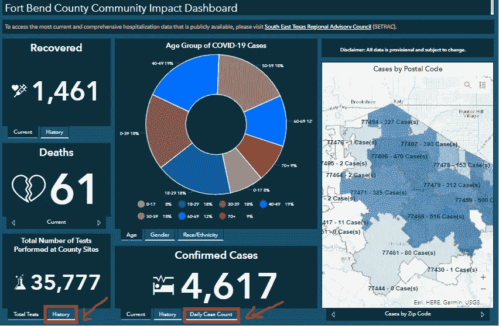
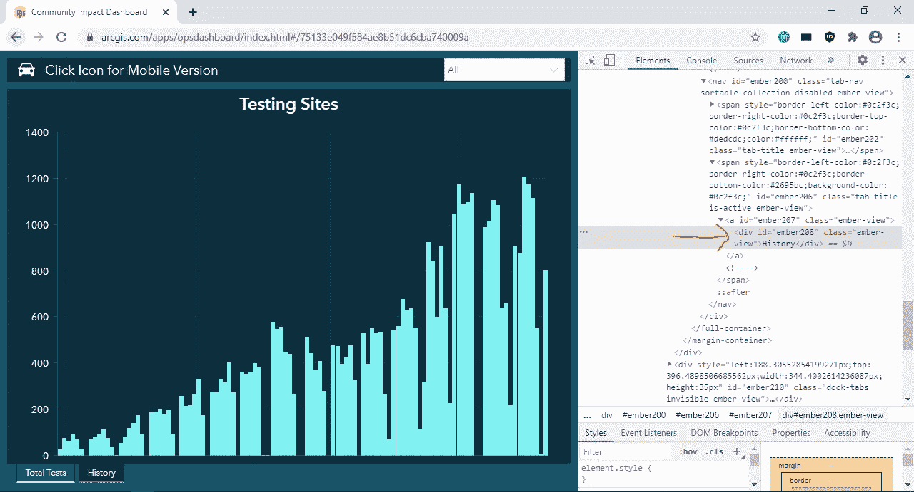
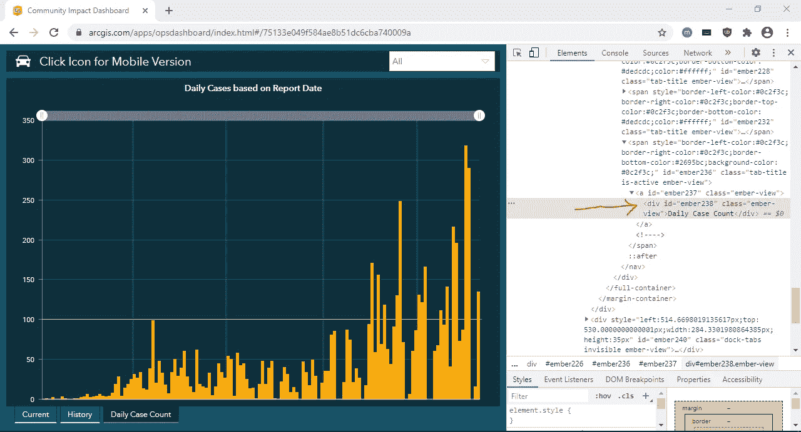
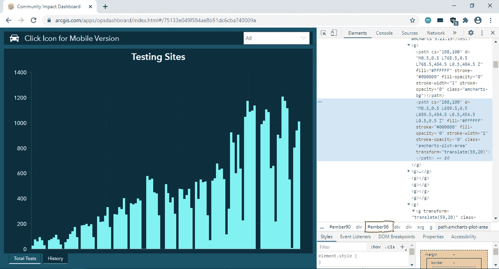
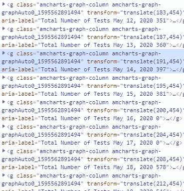
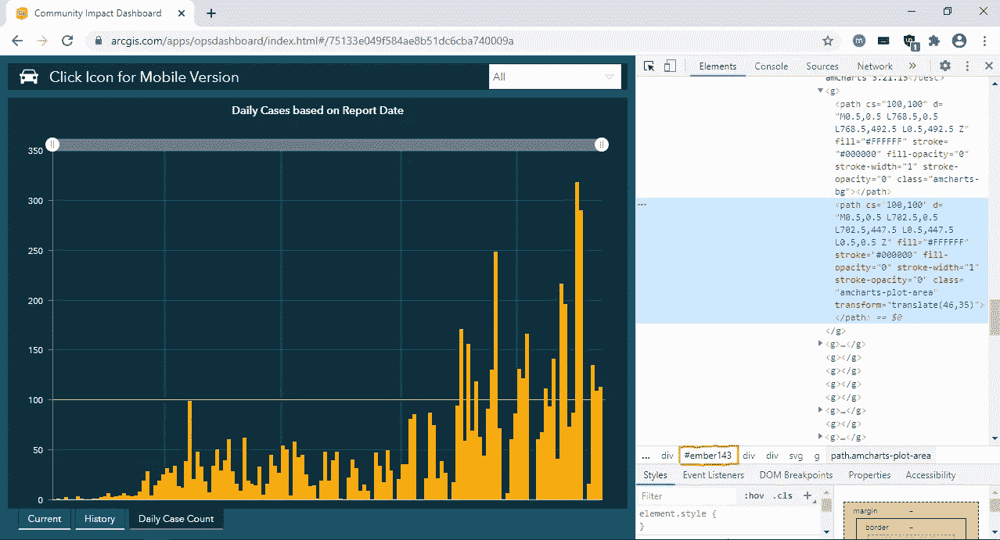
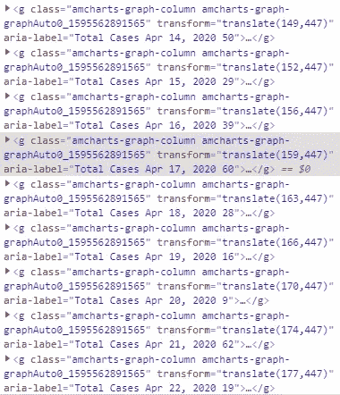
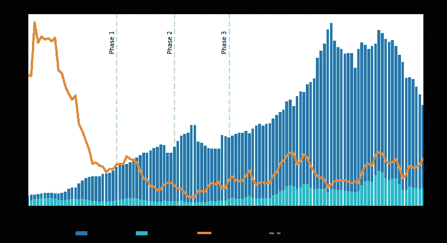

# 如何用 Python 刮仪表板

> 原文：<https://towardsdatascience.com/how-to-scrape-a-dashboard-with-python-8b088f6cecf3?source=collection_archive---------13----------------------->

## 我们将学习如何使用 Python 中的 Selenium 和 Beautiful Soup 包从仪表板中抓取数据。

当与您需要的数据交互的唯一方式是通过仪表板时，仪表板抓取是一项有用的技能。我们将学习如何使用 Python 中的 [Selenium](https://selenium-python.readthedocs.io/) 和 [Beautiful Soup](https://www.crummy.com/software/BeautifulSoup/bs4/doc/) 包从仪表板中抓取数据。Selenium 包允许您编写 Python 代码来实现 web 浏览器交互的自动化，而 Beautiful Soup 包允许您轻松地从生成您想要抓取的网页的 HTML 代码中提取数据。

我们的目标是刮出[本德堡县仪表板](https://experience.arcgis.com/experience/75d9ad4dfebc4e14ad14c96235084f84?fbclid=IwAR1N5WdLI8XtPwQo8p0SxU0w8hcuHnwO50vEGVUWLUEt8I8-UW1BBrybapo)，它可视化了得克萨斯州本德堡县的新冠肺炎情况。我们将提取已执行的全部检测的历史记录和每日报告的病例数，以便我们可以估计本德堡县阳性病例的百分比。

请注意，本教程中的所有代码都是用 Python 3 . 6 . 2 版编写的。

## 步骤 1:导入 Python 包、模块和方法

第一步是导入仪表板抓取所需的 Python 包、模块和方法。下面列出了本教程中使用的包的版本。

## 第二步:抓取 HTML 源代码

下一步是编写 Python 代码来自动化我们与仪表板的交互。在编写任何代码之前，我们必须查看仪表板并检查其源代码，以识别包含我们需要的数据的 HTML 元素。仪表板源代码是指告诉您的浏览器如何呈现仪表板网页的 HTML 代码。要查看仪表板源代码，导航到仪表板并使用键盘快捷键`Ctrl+Shift+I`。将出现一个包含仪表板源代码的交互式面板。

请注意，只有在分别单击“在县站点执行的测试总数”面板中的“历史”选项卡和“已确认病例”面板中的“每日病例计数”选项卡后，才能看到已执行的测试总数的历史记录和报告的每日病例数。这意味着我们需要编写 Python 代码来自动点击“History”和“Daily Case Count”选项卡，以便 Beautiful Soup 可以看到执行的所有测试的历史和报告的每日案例数。

[本德县新冠肺炎堡仪表盘](https://experience.arcgis.com/experience/75d9ad4dfebc4e14ad14c96235084f84)2020 年 7 月 10 日

要找到包含“历史”标签的 HTML 元素，使用快捷键`Ctrl+Shift+C`，然后点击“历史”标签。您将在源代码面板中看到,“History”选项卡位于 ID 为“ember208”的 div 元素中。

历史选项卡源代码

按照与“每日案例计数”选项卡相同的步骤，您将看到“每日案例计数”选项卡位于 ID 为“ember238”的 div 元素中。

每日病例计数页签源代码

现在我们已经确定了我们需要的元素，我们可以编写代码:

1.  在 Chrome 中启动仪表板
2.  “历史记录”标签加载完成后，单击“历史记录”标签
3.  “每日病例计数”选项卡完成加载后，单击“每日病例计数”选项卡
4.  提取仪表板 HTML 源代码
5.  退出铬合金

## 步骤 3:解析 HTML 中的数据

现在，我们需要解析 HTML 源代码，以提取执行的全部测试的历史记录和报告的每日案例数。我们将从查看仪表板源代码开始，以识别包含数据的 HTML 元素。

要找到包含所有已执行测试历史的 div 元素，使用`Ctrl+Shift+C`快捷方式，然后单击“Testing Sites”图的常规区域。您将在源代码中看到，整个情节位于 ID 为“ember96”的 div 元素中。

测试站点图的源代码

如果您将鼠标悬停在特定数据点上，将会出现一个标签，其中包含所执行测试的日期和次数。使用`Ctrl+Shift+C`快捷键并点击特定的数据点。您将看到标签文本被存储为一个`g`元素的`aria-label`属性。

测试站点数据标签的源代码

对报告的每日案例计数执行相同的步骤，您将看到每日案例计数图位于 ID 为“ember143”的 div 元素中。

基于报告日期图的每日案例源代码

如果您将鼠标悬停在特定数据点上，将会出现一个标签，其中包含日期和报告的阳性病例数。使用`Ctrl+Shift+C`快捷键，您会注意到数据也存储在`g`元素的`aria-label`属性中。

基于报告日期数据标签的每日案例源代码

一旦我们有了包含数据的元素，我们就可以编写代码:

1.  查找包含已执行的总测试图的 div 元素，并提取已执行的总测试数据
2.  查找包含每日案例计数图的 div 元素，并提取每日案例计数数据
3.  将数据合并到 pandas 数据框架中，并将其导出到 CSV

## 第四步:计算阳性率

现在，我们终于可以估算出本德堡县的新冠肺炎阳性率了。我们将划分测试报告的案例，并计算 7 天移动平均值。从仪表板中不清楚报告的阳性病例是否包括通过非本县进行的检测(如在医院或诊所进行的检测)确定的病例。也不清楚阳性病例的检测是何时进行的，因为仪表板只显示报告的病例日期。这就是为什么从这些数据中得出的阳性率仅被认为是对真实阳性率的粗略估计。

## 参考

1.  [https://www.fbchealth.org/ncov/](https://www.fbchealth.org/ncov/)
2.  [https://www . fortbendcountytx . gov/your-county/fort-bend-county-expanses-新冠肺炎-testing-site-to-all-residents](https://www.fortbendcountytx.gov/your-county/fort-bend-county-expands-covid-19-testing-site-to-all-residents)
3.  [https://gov . Texas . gov/news/post/governor-Abbott-announces-phase-one-to-open-Texas-establishment-state-wide-standard-health-protocols](https://gov.texas.gov/news/post/governor-abbott-announces-phase-one-to-open-texas-establishes-statewide-minimum-standard-health-protocols)
4.  [https://gov . Texas . gov/news/post/governor-Abbott-announces-phase-two-to-open-Texas](https://gov.texas.gov/news/post/governor-abbott-announces-phase-two-to-open-texas)
5.  [https://gov . Texas . gov/news/post/governor-Abbott-announces-phase-iii-to-open-Texas](https://gov.texas.gov/news/post/governor-abbott-announces-phase-iii-to-open-texas)