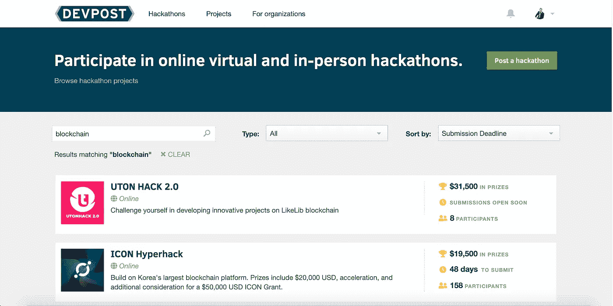
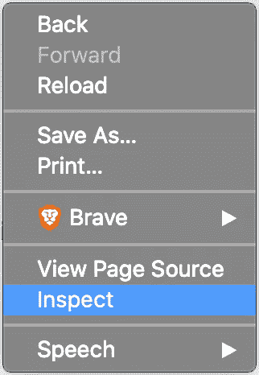
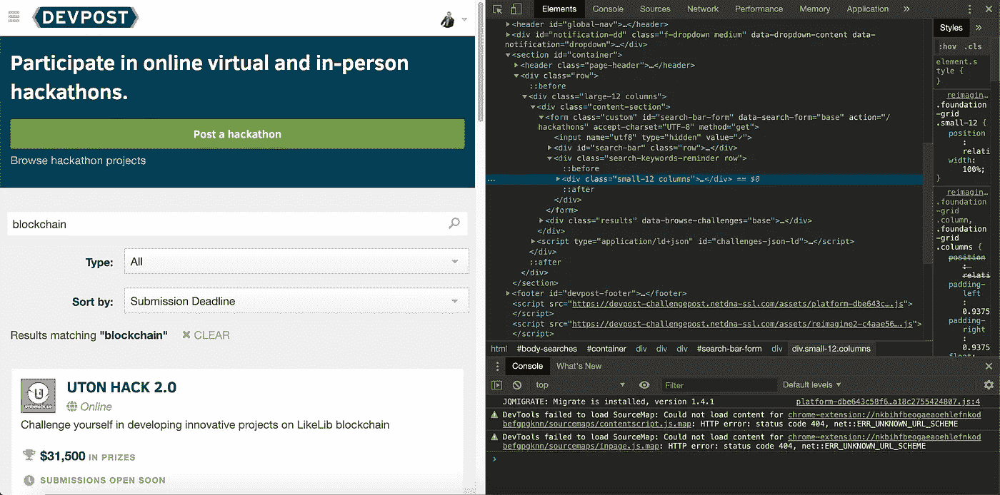

# 如何用 python 和美汤刮任何网站(静态网页)

> 原文：<https://towardsdatascience.com/how-to-scrape-any-website-with-python-and-beautiful-soup-bc84e95a3483?source=collection_archive---------4----------------------->

## [Python 美汤](https://www.crummy.com/software/BeautifulSoup/bs4/doc/)任意网页抓取教程，带 youtube 视频


图片来自作者

*注意:这是一个纯技术教程。在进行任何刮擦之前，请检查网站的政策。*

对于那些想亲眼目睹这一切的人，可以看看我在页面底部的 YouTube 视频。

抓取网页的原因有很多。

你想得到你的足球队的数据吗，这样你就可以用算法来管理你的梦幻球队了？嘣，做一个刮 ESPN 的刮网器。跟踪竞争对手在不同社交媒体上的活动？太好了，这也包括在内。

或者，也许你是一名[开发者拥护者](https://www.linkedin.com/pulse/developer-advocate-so-thats-engineer-right-patrick-collins/)，正在寻找衡量他参与黑客马拉松的 OKR 的好方法，但目前还没有好的工具，所以你想开发自己的工具。

最后一个非常特别，也是我们要寻找的！本教程展示了如何根据关键字`blockchain`从 devpost 获取所有将在未来 50 天内结束的黑客马拉松。

无论如何，让我们直接进入如何用 python 来抓取任何东西。我将假设您有空间可以编码，并且熟悉如何使用 python。

这方面的[文档](https://www.crummy.com/software/BeautifulSoup/bs4/doc/)非常强大，所以一定要在本教程结束后检查一下！

# **注* *

Beautiful soup 非常适合静态网页。如果你这样做并得到奇怪/糟糕的结果，你可能需要一个[网络驱动](https://www.selenium.dev/documentation/en/webdriver/)来清理这个网站。[我发表了这样做的高级版本](/how-to-scrape-any-website-with-python-and-beautiful-soup-part-2-of-2-77560fcd30fc)，但是对于 95%的情况，下面的方法将会奏效。

# 1.皮普安装请求和美丽的汤

`pip install requests`

`pip install beautifulsoup`

运行这两个程序，这样您就可以使用这些包了。

# 2.找到你想刮的地方的网址



图片来自[devpost.com](https://devpost.com/hackathons?utf8=%E2%9C%93&search=blockchain&challenge_type=all&sort_by=Submission+Deadline)

这一个不是一成不变的。如果你想浏览多个网站，你需要多个 URL。本教程的重点是只刮单个网站。一旦你理解了抓取单个页面的工作原理，你就可以移动到更多的页面。

在我们的教程中，我们将使用:

```
[https://devpost.com/hackathons?utf8=%E2%9C%93&search=blockchain&challenge_type=all&sort_by=Submission+Deadline](https://devpost.com/hackathons?utf8=%E2%9C%93&search=blockchain&challenge_type=all&sort_by=Submission+Deadline)
```

因为它给了我们所有的参数。区块链关键词和黑客马拉松结束的时间。

# 3.检查页面，并找到您正在寻找的标签



图片来自作者

每个页面都是由 HTML/CSS/javascript 组成的(嗯…大部分情况下)，显示在屏幕上的每一点数据都显示为文本。你可以随时查看这个页面！只需右键单击，并点击“检查”。

这将显示页面用来呈现的所有代码。这是网络抓取的关键。你看到“元素”标签了吗？那里有你需要的所有 HTML/CSS 代码。



“检查”按钮的外观。图片来自作者。

现在你不需要知道 HTML/CSS 是如何工作的(虽然，如果你知道的话，它真的会很有帮助)。唯一需要知道的是，你可以把每一个 [HTML 标签](https://www.w3schools.com/tags/tag_html.asp)看作一个对象。这些 HTML 标签有您可以查询的属性，并且每一个都是不同的。

图像中以`<footer>`、`<script>`或`<div>`开头的每一行代码都是标签的开始，它们分别以`</footer>`、`</script>`或`</div>`结尾。介于这些标签之间的所有内容也是可查询的，并作为该标签的一部分。一旦你有了一个标签，你就可以得到标签里面的任何东西。

# 4.开始做一些 python 吧！

因此，我们通过使用 requests 对象获取我们想要的网站来开始抓取:

```
import requests
from bs4 import BeautifulSoupresult = requests.get("https://devpost.com/hackathons?utf8=%E2%9C%93&search=blockchain&challenge_type=all&sort_by=Submission+Deadline")
src = result.content
soup = BeautifulSoup(src, 'lxml')
```

我们将结果存储在一个名为`soup`的`BeautifulSoup`对象中。

这只是锅炉板的任何汤刮，接下来是可定制的部分。

# 5.选择你想要的标签和属性

你现在可以开始找出你想要的标签，这是你需要一点创意的地方，因为你通常可以用许多不同的方法来处理这个问题。对于我们的例子，我们想要找到所有的 hackathon 列表，我们发现它们都被包装在一个`a`标签中，并且有一个`featured_challenge`属性。下面是他们的 HTML 代码:

```
<a class=”clearfix” data-role=”featured_challenge” href=”[https://utonhack.devpost.com/?ref_content=default&amp;ref_feature=challenge&amp;ref_medium=discover](https://utonhack.devpost.com/?ref_content=default&amp;ref_feature=challenge&amp;ref_medium=discover)">
.
.
.
</a>
```

3 个`.`代表该标签内的其他标签**。我们现在将忽略这些，因为我们要寻找的数据就在这个标记中。我们想要那个网址。如您所见，这是一个`a`标签，因为它以`<a`开头，并且它有一个属性`data-role="featured_challenge"`，这就是我们将要用来识别它的。**

我们可以用这个通过使用`find_all`函数找到一个**列表，每一个都是**中的一个。

```
featured_challenges = soup.find_all('a', attrs={'data-role': 'featured_challenge'})
```

现在的`featured_challenges`是一个`a`标签对象的列表，我们可以从中获取 URL。

如果我们遍历这个列表，我们可以这样做:

```
print(featured_challenge.attrs['href'])
```

`attrs`是每个标签的属性图。如果你回头看看我们提取的`a`标签，你会看到有一个`href`属性保存着我们正在寻找的黑客马拉松的 URL，万岁！

这些标签对象中的每一个都算作另一个 HTML 对象，所以你也可以对每个对象做`find_all`！如果只想得到第一个结果，可以使用`find`功能。

另外，如果您只想获得对象的文本，您可以只查找标记对象的`text`属性，就像这样:

`featured_challenge.text`

就是这样！

如果你想要在这个演示中使用的真正简单的刮刀的代码，[在这里查看](https://github.com/alphachainio/demo_code/blob/master/scrape.py)。

[带网络驱动的多黑客马拉松铲运机的完整代码](https://github.com/PatrickAlphaC/hackathon_scraper)