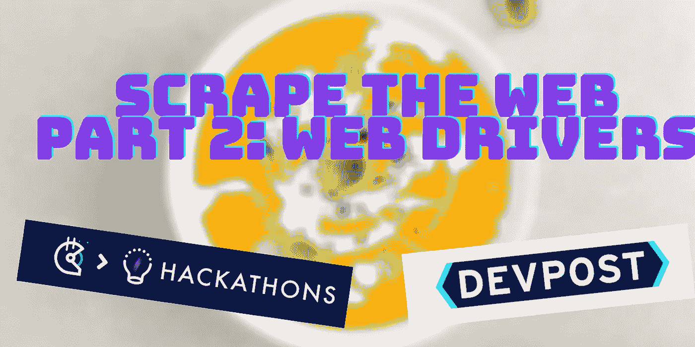

# 如何用 Python 和美汤刮任何网站(动态网)

> 原文：<https://towardsdatascience.com/how-to-scrape-any-website-with-python-and-beautiful-soup-part-2-of-2-77560fcd30fc?source=collection_archive---------40----------------------->

## [Python Beautiful soup](https://www.crummy.com/software/BeautifulSoup/bs4/doc/) 用于抓取任何网页的教程，带有 youtube 视频——并专注于网络驱动程序



图片来自作者

*注意:这是一个纯粹的技术教程。在进行任何刮擦之前，请检查网站的政策。在我用的例子中，刮地盘是不合法的:*[](https://gitcoin.co//legal/terms)**。请不要使用。**

*对于那些想亲眼目睹这一切的人，可以看看我在页面底部的 YouTube 视频。*

*现在如果你没看我的[第一部](/how-to-scrape-any-website-with-python-and-beautiful-soup-bc84e95a3483)，回去看！这是基于在那里学到的概念。记住，这方面的[文档](https://www.crummy.com/software/BeautifulSoup/bs4/doc/)非常强大，所以一定要在本教程结束后查看！*

*我们现在要学习如何处理 [**动态**](https://en.wikipedia.org/wiki/Dynamic_web_page) 网页或者有很多正在进行的网页，不仅仅是 HTML/CSS。用 beautifulsoup 来抓取这些页面更难，因为有时候，代码发生在服务器端，beautifulsoup 需要让浏览器来运行它。*

*如果有一种方法让我们编码并让我们的代码假装它是一个浏览器，那不是很好吗？…好吧，碰巧这正是这篇文章的内容！*

*现在，我第一次在[这篇文章](/data-science-skills-web-scraping-javascript-using-python-97a29738353f)中读到了这一点，我将这篇文章的重点放在了具体的实现上，所以要了解更多的细节，请务必查看！*

# *1.下载 Chrome 或 Firefox*

*这是目前我所知道的仅有的两个有这个功能的，所以一定要使用其中的一个。对于这篇文章，我们使用的是 [Firefox](https://www.mozilla.org/en-US/firefox/new/) 。*

# *2.下载网络驱动程序*

*我们将使用的网络驱动是 [geckodriver](https://github.com/mozilla/geckodriver/releases) ，你可以在那个链接的底部找到所有的下载。下载后，从下载文件中提取文件(只需双击 zip 文件)。*

*Web 驱动有点挑剔，和操作系统玩的不太好，所以我们需要:
把 geckodriver 移到一个路径可执行文件所在的地方。请查看[这篇文章](/data-science-skills-web-scraping-javascript-using-python-97a29738353f)了解如何在 windows 上做到这一点。*

*我们可以通过运行以下命令找到我们的可执行路径:*

```
*echo $PATH*
```

*然后我们可以:*

1.  *`cp`将 geckodriver 文件从 zip 压缩到你的`$PATH`变量告诉你的一个位置(在运行`echo $PATH`之后)*
2.  *向您的`$PATH`环境变量添加一个新的`$PATH`位置，并将可执行文件 geckodriver 放在那里。[你可以在这里看到如何操作。](https://opensource.com/article/17/6/set-path-linux)*

*然后重新启动您的终端以使更改生效。如果你使用 MacOS(我就是)，你可能还需要[公证](https://firefox-source-docs.mozilla.org/testing/geckodriver/Notarization.html)这个应用程序。您可以通过运行以下命令来实现:*

```
*xattr -r -d com.apple.quarantine geckodriver*
```

# *3.开始用 python 编码吧！*

*运行之后:`pip install selenium`，现在可以开始使用 web 驱动了！您将使用`driver.get`来获取动态网页 URL，而不是使用`requests.get`来获取，就像这样:*

```
*from selenium import webdriver
from selenium.webdriver.firefox.options import Options
from bs4 import BeautifulSoupoptions = Options()
# Make it go faster by running headless
# This will remove the web browser GUI from popping up
options.headless = True
driver = webdriver.Firefox(options=options)
# Enter whatever URL you like
driver.get("https://gitcoin.co/{}".format(link.attrs['href']))
# Let the code on their end run
time.sleep(20)
# Save it to a variable
html = driver.page_source
driver.quit()
# And then just paste it right back into beautifulsoup!
projects_soup = BeautifulSoup(html, 'lxml')*
```

*你可以在 [Alpha Chain demos repo](https://github.com/alphachainio/demo_code/blob/master/scrape_advanced.py) 上看到完整的代码示例，在我的 [hackathon-scraper 项目](https://github.com/PatrickAlphaC/hackathon_scraper)上看到一个完整的示例，在这里有一个视频向你展示如何做。*

*而且记住，你可以一直快进:)*