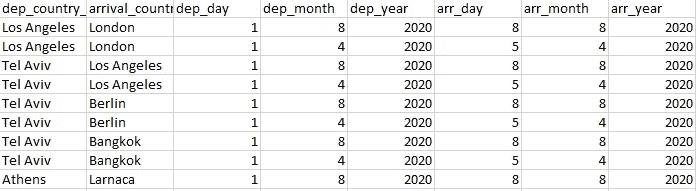
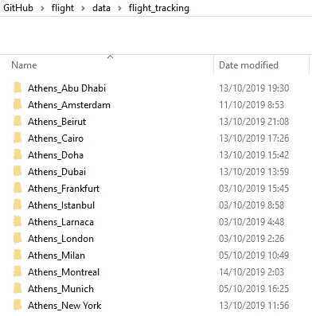
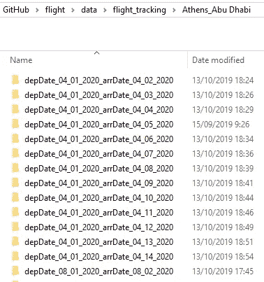
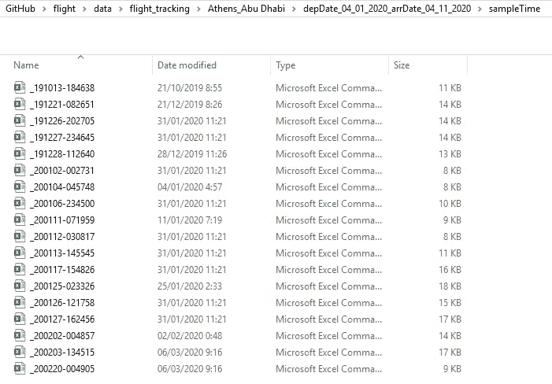

# 如何使用 Selenium 通过 Python 节省航班费用

> 原文：<https://towardsdatascience.com/how-to-scrape-flight-prices-with-python-using-selenium-a8382a70d5d6?source=collection_archive---------14----------------------->

## 在这篇文章中，你将学会用 Selenium 和 ChromeDriver 来降低 Expedia 航班的价格

作者照片(尼泊尔卢卡拉)

本文由 [**罗伊·弗氏**](https://www.linkedin.com/in/roee-freund-0a8883190) 和 [**奥菲尔·因巴尔**](https://www.linkedin.com/in/offirinbar/) 撰写

# 背景

***新冠肺炎疫情期间困在家里？你喜欢旅游和数据科学吗？***

你可以把两者结合起来买便宜的航班。本教程将教你如何创建一个 web scraper，它将为你找到你想要的任何目的地的航班价格。

在本教程中，你将了解到 Expedia 是世界上最大的在线旅行社之一。它由 Expedia 集团拥有和运营，在收入最高的旅游公司排行榜上排名第一。

如果你想知道**新冠肺炎疫情**如何影响航班价格，看看我们的媒体 [**邮报**](https://medium.com/@offirinbar/coronavirus-outbreak-devastates-the-aviation-industry-flight-ticket-prices-are-dropping-case-study-56330c84b250) **。**

需要注意的是，网络抓取违反了大多数网站的服务条款，所以你的 IP 地址可能会被禁止进入网站。

# 环境设置

对于这个刮刀，请确保您使用的是 Python 3.5 版本(或更新版本)。确认您的环境包含以下软件包和驱动程序:

*   Selenium 包:一个流行的网络浏览器自动化工具
*   [ChromeDriver:](https://chromedriver.chromium.org/) 允许你打开浏览器，像人类一样执行任务。
*   熊猫套餐
*   日期时间包

[这篇](https://medium.com/the-andela-way/introduction-to-web-scraping-using-selenium-7ec377a8cf72) TDS 帖子是对 Selenium 的一个很好的介绍。

# 刮擦策略

在进入代码之前，我们先简单描述一下抓取策略:

*   插入到一个 CSV 文件的确切路线和日期，你想刮。您可以插入任意多的路线，但是使用这些列名很重要。铲运机只在往返时工作。

CSV 路线文件。dep =出发，arr =到达。

*   运行完整的代码。
*   每个航班的**输出是一个 CSV 文件。它的文件名将是执行抓取的日期和时间。**
*   相同路线的所有航班将自动由刮刀定位在适当的文件夹(路线的名称)中。

**听起来很复杂……其实不然！让我们看一个例子。**

这些是 CSV 文件中定义的抓取路径(抓取器会自动创建这些文件夹):

废弃的路线

在这里，您可以看到雅典—阿布扎比航线上的多个刮掉的日期:

刮掉的日期:雅典—阿布扎比

下面的屏幕截图展示了雅典-阿布扎比航线的每个刮擦样本的单个 CSV 文件。它的名字代表了刮刀被执行的日期和时间。

特定日期的单个 CSV 输出文件

我们希望流程清晰！

# 输出特征

铲运机输出将包括以下特性:

*   出发时间
*   到达时间
*   航空公司
*   持续时间(飞行时间)
*   停靠站(停靠站数量)
*   中途停留
*   价格
*   飞机类型
*   离开蔻驰
*   抵达蔻驰
*   出发机场名称
*   到达机场名称
*   执行擦除的确切时间

如果**不是直飞**，scraper 会给你额外的数据(机场，航空公司名称等)。)用于**每个连接**。

# 密码

在这一节中，我们将检查代码的主要部分。**你可以在这里** 找到完整的代码

**首先，像往常一样，需要导入相关的库，定义 chrome 驱动程序并设置往返类型。**

**在下一步中，您将使用 Selenium 工具定义一些函数，以便在网页上找到各种功能。函数的名字暗示了它们的作用。**

**CSV routes 文件中的每一行(航班)都经过以下过程:**

**是时候从网上收集数据并把它插入熊猫的数据框架中了。**

**最后，将数据以 CSV 文件直接导出到所需的文件夹中。**

# **结论**

**总之，你学会了如何用 Selenium 包来节省 Expedia 航班的价格。理解基础知识后，你将能够为任何其他网站构建你的抓取工具。**

**就个人而言，作为爱好绘画的旅行者，我们喜欢使用数据科学来寻找全球各地令人惊叹的目的地的优惠。**

**如果您有任何问题、评论或担忧，请不要忘记联系 Linkedin 上的 [Roee](https://www.linkedin.com/in/roee-freund-0a8883190/) 和 [Offir](https://www.linkedin.com/in/offirinbar/) 。**

**祝你好运！**

# **参考**

** [## 使用 Selenium 的网页抓取简介

### 在本教程中，你将学习如何用 Selenium 和 ChromeDriver 抓取网站。

medium.com](https://medium.com/the-andela-way/introduction-to-web-scraping-using-selenium-7ec377a8cf72) 

[https://en.wikipedia.org/wiki/Expedia](https://en.wikipedia.org/wiki/Expedia)

 [## 使用 Python 的 Selenium Webdriver:带示例的教程

### Selenium 支持 Python，因此可以与 Selenium 一起用于测试。与其他相比，Python 很容易…

www.guru99.com](https://www.guru99.com/selenium-python.html) 

[https://www . scrape hero . com/scrape-flight-schedules-and-prices-from-Expedia/](https://www.scrapehero.com/scrape-flight-schedules-and-prices-from-expedia/)**